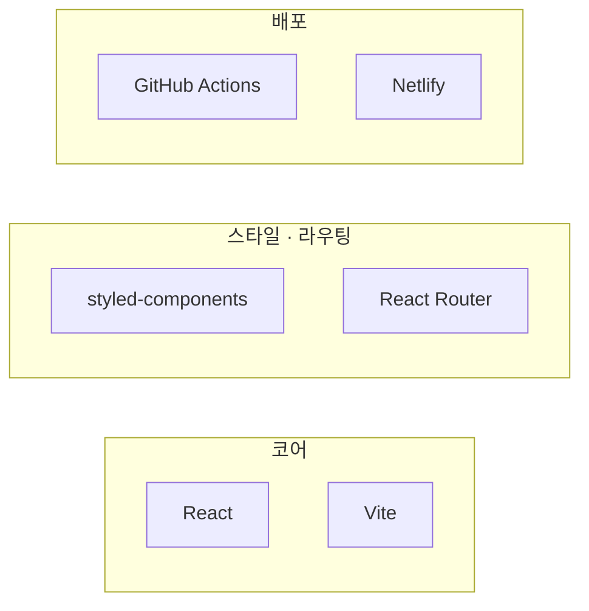
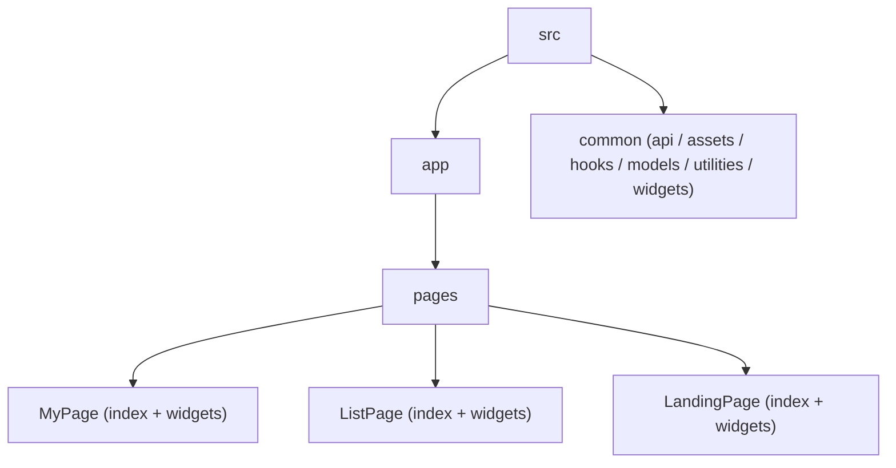
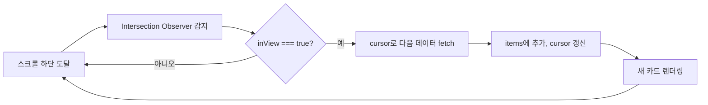
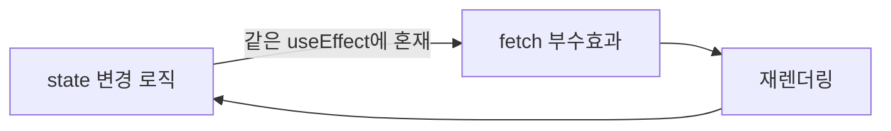
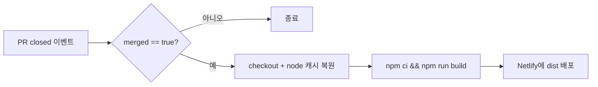

## 배경

Fandom-k는 아이돌 차트에 투표하는 팀 프로젝트입니다. 코드잇 부트캠프 과정에서 팀원들과 함께 진행했습니다.

제가 맡은 역할은 크게 세 가지였습니다.

- 공통 컴포넌트 제작 (무한 스크롤, Button 같은 간단한 UI)
- 목록 페이지 위젯 제작
- CI/CD 구축 (Netlify와 GitHub Actions를 통해 PR 이벤트에 반응하는 자동 배포)

세 역할 모두 "많은 데이터를 다루는 목록 페이지를 어떻게 부드럽게 보여줄 것인가"라는 하나의 문제로 이어져 있었습니다. 아이돌 차트라는 서비스 특성상 목록에 항목이 많고, 사용자는 스크롤을 내리면서 계속 데이터를 받아야 했습니다.

## 설계

### 코어 기술 스택

### 폴더 구조

기존에 익숙했던 FSD(Feature-Sliced Design) 구조를 그대로 가져가려고 했지만, 팀원 전원이 FSD를 완벽히 알아야만 효과적으로 굴러가는 구조라는 게 문제였습니다. 팀 회의 끝에 FSD를 변형해서 다음과 같은 구조로 정리했습니다.

페이지 단위로 폴더를 나누고, 그 안에 위젯을 두는 방식입니다. 팀원 전체가 "이 페이지에 필요한 건 이 폴더 안에 있다"는 감각만 가지면 되도록 진입장벽을 낮추는 데 초점을 맞췄습니다.

### 목록 페이지의 과제

데이터를 한 번에 다 받아오면 초기 렌더링이 느려지므로, 무한 스크롤로 필요한 만큼만 받아오는 것이 목록 페이지의 핵심 과제였습니다. `react-intersection-observer`의 `useInView` 훅으로 시작했습니다.

## 마주친 문제들

### inView가 의도치 않게 두 번 처리되던 문제

`useInView`가 반환하는 `inView` 값을 그대로 `useEffect`의 deps에 넣었더니, 콜백이 두 번 실행되는 문제가 있었습니다. 원인은 단순했습니다. `inView`는 `false → true`(요소가 보임)일 때도, `true → false`(다음 데이터 로딩으로 사라짐)일 때도 바뀌기 때문에, deps에만 의존하면 두 전이 모두에서 effect가 돌아갑니다.

### fetch에 담기는 state가 최신값이 아니던 문제

투표 POST 요청을 보낼 때, 클릭 핸들러 안에서 참조하는 state가 실제로 갱신되기 전의 값을 담고 있는 경우가 있었습니다. React의 `setState`는 배치 처리되기 때문에, 상태가 실제로 갱신되었는지 확인하지 않고 바로 fetch에 넘기면 이전 값이 전달될 수 있습니다.

### useEffect 안에서 state를 갱신하는 함수가 무한 루프를 만들던 문제

로딩 상태(`isLoading`, `errorMessage`)를 관리하는 wrapper 함수 안에서 setter를 호출하는 구조였는데, 이 setter가 다시 렌더링을 유발하고 그 렌더링이 다시 fetch를 유발하는 흐름이 만들어질 수 있었습니다. deps 없이 상태 변경 로직과 fetch 로직이 같은 스코프에 있으면 발생하기 쉬운 문제였습니다.

### useEffect 중복 실행으로 fetch가 8번 나가던 문제

React의 `useEffect`는 렌더링마다 `cleanup → setup` 순서로 실행되고, 개발 환경에서는 이 과정이 한 번 더 반복됩니다. `inView`를 deps로 가진 `useEffect`에 fetch 로직을 넣고, 다른 곳에도 비슷한 fetch 로직을 중복해서 넣었더니 기본 4번에 초기 화면의 Intersection Observer 동작까지 겹쳐 총 8번의 fetch가 나가는 상황이 발생했습니다.

### 라이브러리 의존성 자체를 줄이기로 한 결정

`useInView` 라이브러리를 계속 쓸지, 순수 Intersection Observer API로 직접 구현할지 고민했습니다. 라이브러리 하나가 프로젝트 번들 크기와 학습 비용에 영향을 준다는 점에서, 필요한 기능만 남기고 직접 구현하는 쪽을 택했습니다.

## 해결

### 무한 스크롤: Intersection Observer + cursor 기반 fetch

먼저 `useInView`로 무한 스크롤의 기본 형태를 잡았습니다. 관찰 대상이 화면에 들어오면(`inView === true`) 렌더링할 아이템 수를 늘리는 단순한 구조였습니다.

이후 이 로직을 `useInfiniteScroll`이라는 커스텀 훅으로 감싸서 일반화했습니다. 인터페이스는 `useInfiniteScroll(fetchFunction, options)`처럼 fetch 함수와 옵션을 받아 `{ items, ref, status, rootRef }`를 돌려주는 형태로, cursor 상태와 다음 페이지 요청 로직을 훅 내부에 감췄습니다. 핵심은 `if (inView)` 조건을 effect 안에 두어서 `inView`가 `true`가 될 때만 데이터를 가져오도록 한 것입니다. 이 한 줄로 이중 실행 문제가 해결됐습니다. 사용하는 쪽에서는 `ref`와 `rootRef`만 컴포넌트에 연결하면 되므로, Intersection Observer의 내부 동작을 몰라도 무한 스크롤을 붙일 수 있는 인터페이스가 됐습니다.

라이브러리 제거 결정은 순수 Intersection Observer API로 직접 구현하는 것으로 이어졌습니다. `useCustomInView(option)`이라는 이름으로 새 훅을 만들되, `useInView`와 동일하게 `{ ref, inView }`를 반환하도록 시그니처를 맞췄습니다. 내부적으로는 `IntersectionObserver`를 직접 생성해 `ref`에 연결하고, 콜백에서 받는 `isIntersecting` 값을 그대로 `inView` state에 반영하는 정도로 단순했습니다. 반환 형태를 그대로 유지한 덕분에, 기존 코드에서는 훅 이름만 바꾸면 그대로 마이그레이션되도록 했습니다.

### state 관련 문제들: useEffect로 흐름을 명확히 분리

fetch에 최신 state가 담기지 않는 문제는, state가 바뀔 때마다 `useEffect`로 별도 변수(`let idolId = false`처럼 컴포넌트 스코프의 일반 변수)를 갱신하고, 핸들러에서는 state가 아니라 그 변수를 참조하는 방식으로 해결했습니다. `setState`가 배치 처리되는 타이밍 문제를 우회한 것입니다.

무한 루프 문제와 fetch 중복 문제는 같은 원인에서 나왔습니다. state 변경 로직과 부수효과(fetch)를 같은 스코프에 섞어두면 렌더링 사이클이 꼬입니다.

deps가 다른 로직이라도 같은 목적(예: gender 변경 시 데이터 재요청)이라면 하나의 `useEffect`로 합쳐서 실행 횟수를 통제하도록 정리했습니다.

### CI/CD: GitHub Actions로 PR 머지 시 Netlify 자동 배포

GitHub Actions는 원래 일정에 없던 작업이었지만, 팀원들과 논의 후 효율을 위해 도입하기로 했습니다. 요구사항은 두 가지로 좁혔습니다.

1. main 브랜치로 PR이 merge될 때만 실행
2. Netlify와 연결해서 앱을 배포

`pull_request.types: closed` 이벤트에 `merged == true` 조건을 걸어서 "merge된 PR"만 걸러내고, node_modules 캐시를 적용해 재실행 시간을 줄였습니다.

## 최종 회고

이 프로젝트에서 가장 크게 배운 건 "UX를 위한 기능은 결국 렌더링 사이클을 얼마나 정확히 이해하고 있느냐의 문제"라는 점이었습니다. 무한 스크롤도, 그 뒤에서 계속 부딪힌 문제들도 전부 `useEffect`의 실행 시점과 state 갱신 타이밍을 오해한 데서 시작됐습니다.

지금 돌아보면 몇 가지는 다르게 했을 것 같습니다.

- **fetch 로직을 처음부터 하나의 훅으로 모았을 것 같습니다.** 당시엔 문제가 생길 때마다 그때그때 `useEffect`를 추가하는 식으로 대응했는데, 되돌아보면 데이터 요청 책임을 하나의 훅에 모아뒀다면 8번 fetch 같은 중복 문제는 애초에 생기지 않았을 것입니다.
- **라이브러리 도입과 제거를 더 신중하게 판단했을 것 같습니다.** `useInView`를 걷어내고 순수 API로 바꾼 결정 자체는 맞았지만, 처음에 라이브러리를 고를 때 "정말 필요한 기능이 무엇인가"를 먼저 따졌다면 중간에 마이그레이션할 일도 줄었을 것입니다.
- **CI/CD는 더 일찍 붙였을 것 같습니다.** 일정에 없던 작업이라 프로젝트 후반에 넣었는데, 배포 자동화가 있었다면 팀원들이 매번 로컬에서 build 결과를 확인하는 시간을 아낄 수 있었을 것입니다.

당시엔 각 트러블 슈팅을 "일단 되게 만드는 것"에 집중해서 풀었다면, 지금은 왜 그 문제가 생겼는지(렌더링 사이클, 이벤트 버블링, 배치 처리 같은 근본 원리)를 먼저 짚고 나서 고치는 편이 결과적으로 더 빠르다는 걸 알게 됐습니다.
