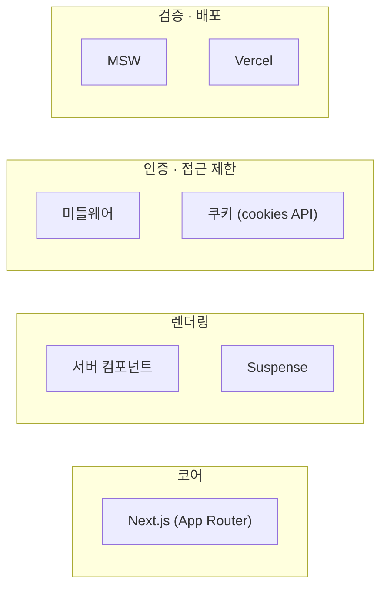
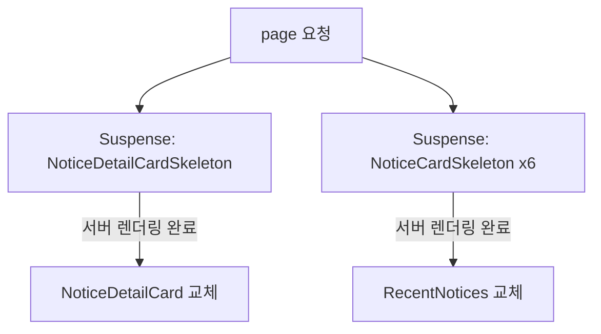
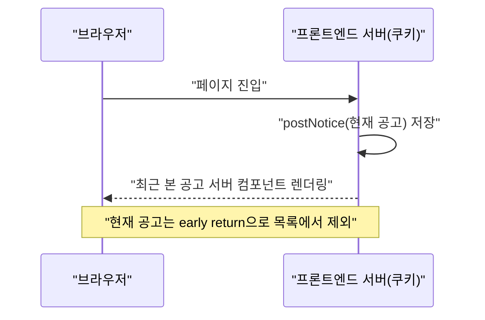
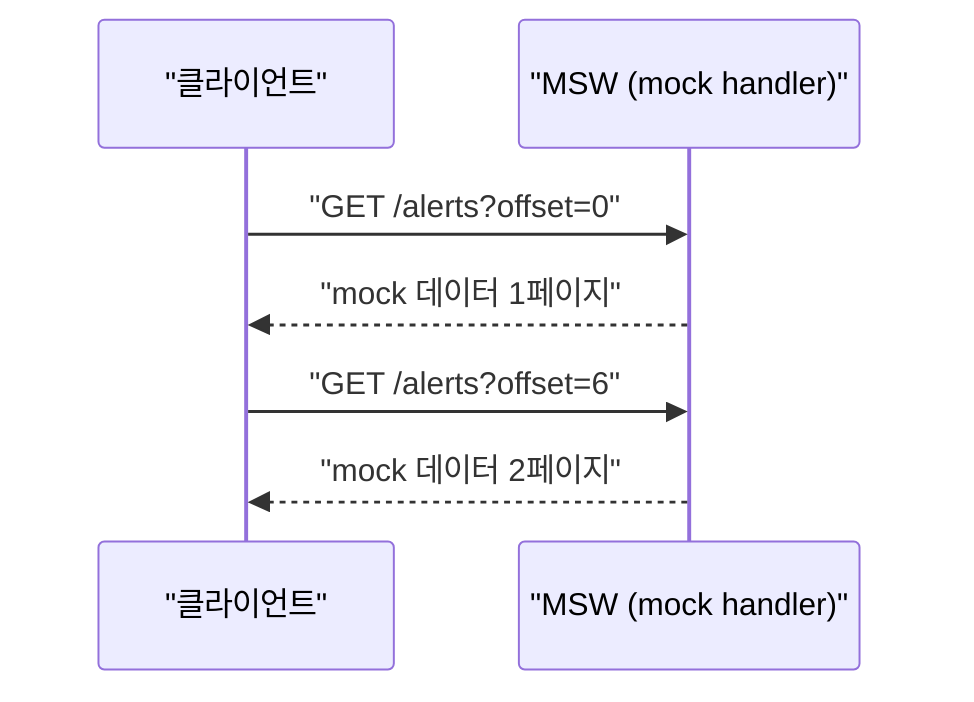
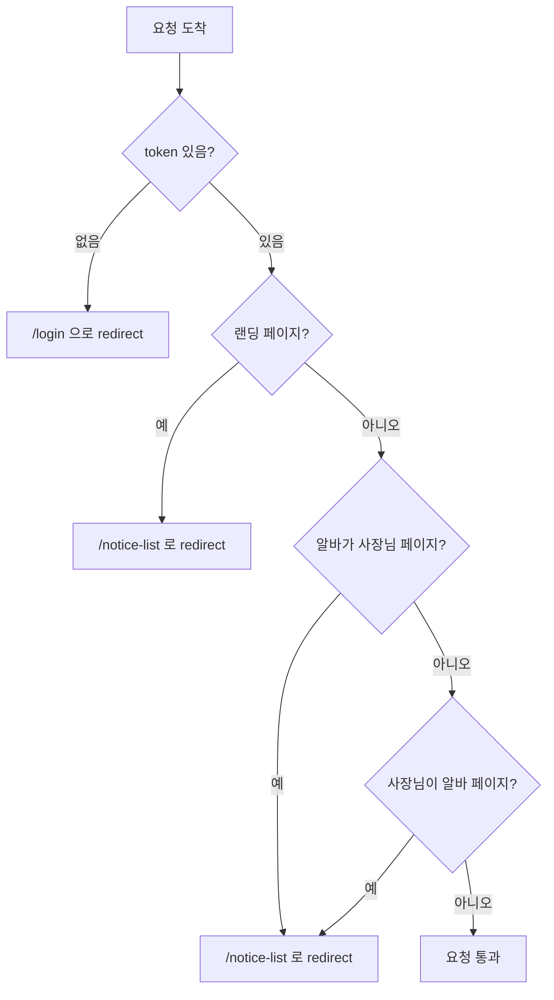
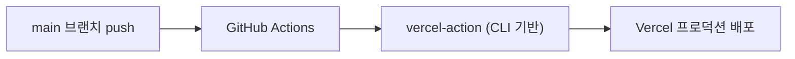

## 배경

급페이는 급하게 일손이 필요한 자리에 더 많은 시급을 제시해서 아르바이트생을 구할 수 있는 서비스입니다. 사장님 계정과 알바님 계정, 두 종류의 사용자가 존재하고, 각자 다른 화면과 권한으로 서비스를 사용합니다.

이 프로젝트에서는 팀장 역할을 맡았습니다. 제 담당 기능 이외에도 팀원들이 개발에만 집중할 수 있도록 공용 인프라를 다지는 데 책임감을 느꼈습니다. S3에 이미지를 올리는 함수, 이미지 블러 처리 컴포넌트 같은 공통 유틸리티부터, 개발/배포 환경 자체를 정비하는 일까지 맡았습니다.

기술 스택은 Next.js(App Router)였고, 팀이 실제로 부딪힌 문제는 크게 네 갈래였습니다.

1. 공고 상세 페이지의 카드 렌더링을 어떻게 최적화할 것인가
2. 알림창의 무한 스크롤을 백엔드 개발이 끝나지 않은 상태에서 어떻게 검증할 것인가
3. 사장님/알바님 계정의 접근 제한을 어떻게 구현할 것인가
4. Vercel organization의 유료 정책 안에서 어떻게 무료로 자동 배포·프리뷰를 구성할 것인가

## 설계

### 코어 기술 스택

### 서버 컴포넌트 중심의 페이지 구조

공고 상세 페이지 시안을 분석하면서, Next.js의 서버 컴포넌트를 최대한 활용하는 방향으로 화면을 나눴습니다.

- **메인 카드**: 초기 렌더링 시 서버에서 데이터를 받아오고, Suspense로 로딩을 기다리는 서버 컴포넌트. 다만 "신청하기" 버튼은 로그인 상태에 따라 분기가 필요해서 이벤트 핸들러가 들어가는 클라이언트 컴포넌트로 분리했습니다.
- **최근에 본 공고**: 앞에서 데이터가 들어오면 오래된 데이터는 밀려나야 하므로 큐(queue) 자료구조로 설계한 서버 컴포넌트.

Next.js는 서버 컴포넌트 단위로 스트리밍 렌더링을 지원합니다. 컴포넌트를 `Suspense`로 감싸면, 해당 서버 컴포넌트의 렌더링이 끝나기 전까지는 `fallback`에 지정한 스켈레톤이 대신 보이고, 렌더링이 끝나면 실제 컴포넌트로 교체됩니다. 이 방식으로 TTFB·FCP·TTI를 각 컴포넌트 단위로 앞당길 수 있습니다.

### 전역 상태 대신 쿠키를 선택한 이유

로그인 여부나 최근 본 공고 데이터를 처음에는 zustand 같은 전역 상태 관리로 처리하려고 했습니다. 하지만 전역 상태는 클라이언트에서만 의미가 있어서(서버에는 "상태"라는 개념 자체가 없습니다), 서버 컴포넌트 안에서는 쓸 수 없었습니다. `persist` 미들웨어로 로컬 스토리지에 저장하고 클라이언트 단에서 rehydrate하는 방식도 시도했지만, 결국 브라우저 관련 API인 로컬 스토리지에 묶여 있다는 한계는 그대로였습니다.

여기서 관점을 바꿨습니다. "지금 저장하려는 게 한 라우트 안에서 리렌더링을 일으켜야 하는 상태인가, 아니면 그냥 한 번 가져오고 갱신만 하면 되는 데이터인가"를 따져보니, 로그인 여부나 최근 본 공고는 "상태"라기보다 "단순 데이터"에 가까웠습니다. 그래서 zustand를 걷어내고, 서버 컴포넌트에서도 다룰 수 있는 Next.js의 쿠키 API(`cookies()`)로 옮겼습니다. 쿠키는 브라우저와 백엔드 서버 사이의 통신에 실려 움직이기 때문에, 프론트엔드 서버(Node.js 환경)에서 CRUD가 가능하고, 그래서 서버 컴포넌트 안에서도 Suspense와 함께 쓸 수 있었습니다.

## 마주친 문제들

### 핸들러에 넣은 비동기 함수가 페이지를 멈추게 한 문제

공고 카드를 빠르게 연타하면 페이지가 멈추는 오류가 있었습니다. 처음에는 분기 로직(`content` 유무) 자체가 문제인 줄 알았지만, 실제 원인은 쿠키를 저장하는 비동기 함수가 클릭 이벤트 핸들러 안에 있었다는 점이었습니다. 연타할 때마다 비동기 함수가 계속 쌓여 실행되면서 서버에 과부하가 걸렸고, 그 사이 특정 시점에 `content`가 사라지면서 미들웨어가 엉뚱한 페이지(사장님 페이지)로 강제 이동시키는 연쇄 문제로 이어졌습니다.

### 쿠키 용량 한계에 부딪힌 문제

최근 본 공고를 처음에는 공고 데이터 객체 자체를 쿠키에 저장하는 방식으로 구현했습니다. 그런데 객체가 3개 이상 쌓이면 더 저장되지 않는 문제가 발생했습니다. 확인해보니 쿠키는 4096바이트가 한계였고, 객체 3개만 담겨도 이미 3327바이트 정도를 차지하고 있었습니다.

### 최근 본 공고 렌더링이 한 번 더 일어나는 문제

최근 본 공고를 서버 컴포넌트로 렌더링한 뒤, 현재 보고 있는 공고를 쿠키에 추가하는 로직을 `useEffect`로 실행했습니다. 문제는 이 쿠키 변경이 다시 리렌더링을 유발한다는 점이었습니다. 즉 "서버 컴포넌트 렌더링 → 쿠키 갱신 → 리렌더링"이라는 한 번 더 깜빡이는 흐름이 사용자에게 보일 수 있었습니다.

### 무한 스크롤을 검증할 데이터가 없는 문제

헤더의 알림창은 무한 스크롤로 구현해야 했습니다. 그런데 알림이 만들어지려면 알바 계정의 지원, 사장님 계정의 승인/취소까지 두 개의 액세스 토큰과 백엔드 API가 모두 준비돼 있어야 검증할 수 있었습니다. 백엔드 개발이 끝나지 않은 시점에 프론트엔드만으로 무한 스크롤 동작을 확인할 방법이 필요했습니다.

### 접근 제한을 어디서 처리할지 애매했던 문제

사장님 계정과 알바님 계정을 쿠키로 구분하는 것까지는 됐지만, "알바님이 사장님 페이지에 들어가면 어떻게 막을 것인가" 같은 접근 제한 로직을 컴포넌트 단에서 처리하려니 페이지마다 중복되고 흩어지기 쉬웠습니다.

### Vercel organization의 유료 정책 문제

Netlify 대신 Next.js에 맞는 Vercel로 배포하기로 했는데, Vercel organization(팀) 단위의 GUI 배포와 PR 프리뷰는 유료 플랜에서만 제공된다는 걸 뒤늦게 알았습니다.

## 해결

### 쿠키 큐(queue)를 함수 뒤로 숨기기

쿠키 조작의 세부 구현을 숨기고, 사용하는 쪽은 `getNotices(): Promise<NoticeIds[]>` / `postNotice(notice): Promise<void>` 두 함수만 알면 되도록 정리했습니다. `postNotice` 내부에서는 이미 본 공고면 앞으로 순서만 옮기고, 7개가 넘으면 가장 오래된 것부터 밀어내는 큐 로직을 처리해서, 호출하는 쪽은 큐의 세부 규칙을 몰라도 됐습니다.

쿠키 용량 문제는 공고 데이터 전체가 아니라 `id`만 저장하는 방식으로 바꿔서 해결했습니다. 화면에 그릴 때는 저장된 id로 최신 데이터를 다시 fetch해오는 식으로 바꾸니, 쿠키에 실리는 데이터양이 크게 줄었습니다.

리렌더링이 한 번 더 발생하는 문제는, 현재 보고 있는 공고를 목록에서 제외하는 early return(`if (notice.id === noticeId) return null`)으로 자연스럽게 가렸습니다.

핸들러의 비동기 연타 문제는 쿠키 저장 시점을 클릭 핸들러가 아니라 페이지 진입 시점으로 옮기는 것으로 해결했습니다. 짧은 수정이었지만, 원인을 찾아내는 과정 자체가 "이벤트 핸들러 안에 비동기 부수효과를 넣을 때는 반복 호출 가능성을 항상 의심해야 한다"는 교훈으로 남았습니다.

### MSW로 무한 스크롤을 프론트엔드만으로 검증하기

백엔드 API를 기다리지 않고도 무한 스크롤을 확인할 수 있도록 MSW(Mock Service Worker)를 도입했습니다. 요청 자체를 가로채서 지정한 응답을 돌려주는 방식이라, 실제 서버가 없어도 클라이언트 로직을 검증할 수 있었습니다. 알림 API를 `offset` 쿼리 파라미터별로 분기해서 목(mock) 데이터를 돌려주도록 만들어, "첫 페이지가 잘 오는지", "다음 offset으로 잘 넘어가는지"를 순서대로 확인할 수 있었습니다.

mock 데이터의 `id`는 매번 다른 값으로 생성했는데, React가 배열 렌더링에서 각 항목을 구분하는 기준이 `key`이기 때문입니다. 같은 데이터가 중복으로 오면 콘솔 경고가 뜨므로, 이 방식으로 "서로 다른 데이터가 정말 오고 있는지"를 빠르게 검증할 수 있었습니다.

### 미들웨어로 접근 제한을 한곳에 모으기

접근 제한 로직을 컴포넌트마다 흩어놓는 대신, 브라우저와 프론트엔드 서버 사이에 위치하는 Next.js 미들웨어 한곳으로 모았습니다. 쿠키에 저장된 `accessToken`, `type`(사장님/알바님)을 기준으로 요청 단계에서 리다이렉트를 결정하기 때문에, 페이지 컴포넌트들은 접근 제한을 신경 쓰지 않아도 됐습니다. 정적 파일과 로그인/목록 페이지 등은 `matcher` 설정으로 미들웨어 대상에서 제외했습니다.

### Vercel CLI로 organization을 무료로 자동 배포하기

Vercel organization은 GUI 기반 배포는 유료지만, CLI로 접근하는 경로는 무료라는 사실을 GitHub 이슈에서 찾았습니다. `vercel` CLI로 프로젝트를 연결하면 생기는 `orgId`, `projectId`와 계정 토큰을 GitHub Secret에 등록하고, `amondnet/vercel-action`을 이용해 main 브랜치 push 시 프로덕션 배포가 실행되는 워크플로를 구성했습니다.

PR 프리뷰용 워크플로도 같은 방식으로 만들어서 커밋마다 프리뷰 URL이 코멘트로 달리도록 구성했습니다. 다만 팀에서 기존에 쓰던 Vercel 자동 배포(대시보드 연동 방식)가 이미 자리 잡고 있었고 팀원들이 그 프리뷰 흐름에 익숙해져 있던 시점이라, 실제 교체까지는 진행하지 않고 방법을 검증하는 선에서 마무리했습니다.

## 최종 회고

이 프로젝트를 관통하는 하나의 주제는 "서버와 클라이언트의 경계를 어디에 둘 것인가"였습니다. 전역 상태 대신 쿠키를 택한 것, 접근 제한을 컴포넌트가 아니라 미들웨어에 둔 것, MSW로 백엔드 없이도 클라이언트를 검증한 것 모두 결국 같은 질문에 대한 답이었습니다.

지금 돌아보면 다르게 했을 부분도 있습니다.

- **zustand를 걷어내기까지 시행착오가 컸습니다.** rehydrate 방식까지 시도했던 걸 보면, "이 데이터가 상태인가 아닌가"라는 질문을 더 일찍 던졌다면 zustand 도입 자체를 재고했을 것 같습니다. 기술은 도구일 뿐이고, 도구를 고르기 전에 문제의 성격을 먼저 정의해야 한다는 걸 이번에 체감했습니다.
- **쿠키에 무엇을 담을지 처음부터 더 신중하게 정했을 것 같습니다.** 데이터 자체를 쿠키에 넣었다가 용량 한계에 부딪힌 건, "쿠키는 만능이다"라는 전제 자체가 틀렸다는 걸 뒤늦게 확인한 경우였습니다. id만 저장하고 나머지는 다시 fetch하는 결론은 맞았지만, 쿠키의 4KB 제약을 미리 알았다면 처음부터 그렇게 설계했을 것입니다.
- **Vercel CLI 배포는 검증에서 그쳤지만, 더 일찍 시작했다면 실제로 교체까지 갔을 수도 있습니다.** 프로젝트 후반에 발견한 방법이라 팀원들의 기존 워크플로를 바꾸는 리스크가 부담스러웠는데, 프로젝트 초반에 알았다면 유료 정책에 막히지 않고도 자동 배포·프리뷰를 정식으로 도입했을 것 같습니다.

당시엔 눈앞의 트러블을 해결하는 데 집중했다면, 지금은 "이 문제가 서버/클라이언트 경계, 데이터 성격, 렌더링 타이밍 중 어디에서 오는가"를 먼저 분류하고 접근하는 습관이 생겼습니다.
