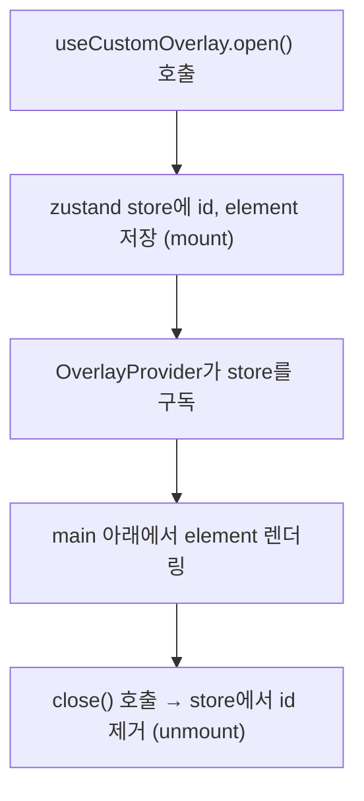
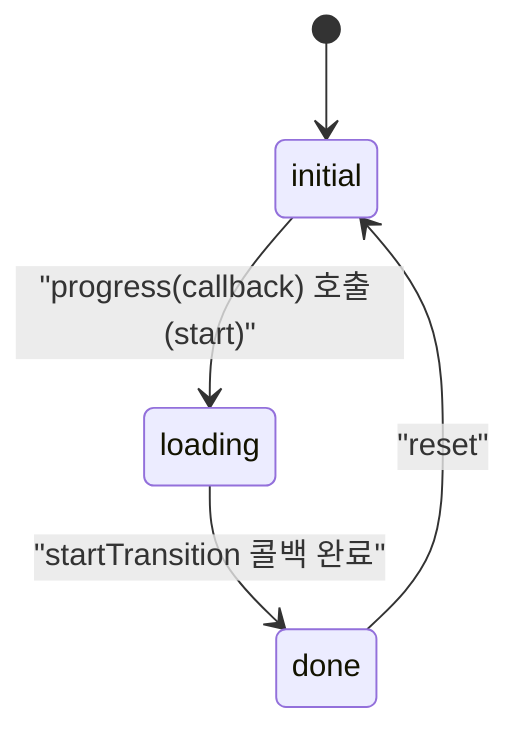
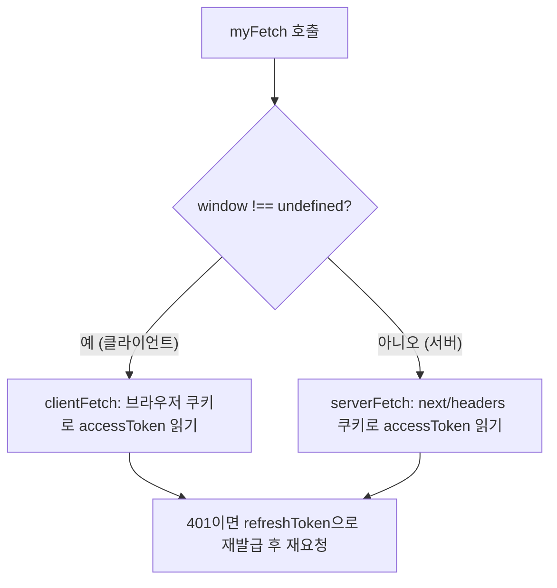
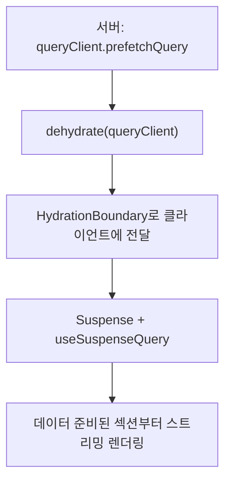

## 배경

디자인 시안이 완성되기 전부터 개발을 시작해야 했던 상황이 이 프로젝트 전체를 관통하는 조건이었습니다. 버튼도, 모달도, 페이지 전환도 "디자인이 계속 바뀔 수 있다"는 전제 위에서 구조를 잡아야 했습니다. 이 글은 그 과정에서 마주친 다섯 가지 문제 — 공통 버튼 컴포넌트, 오버레이 관리, progress bar, 서버/클라이언트 호환 fetch, streaming tanstack query — 를 하나로 묶어 정리한 기록입니다.

꼼꼼은 자유게시판, 좋아요, 댓글, 인증 등 실제 서비스에 필요한 기능들을 담은 웹 애플리케이션입니다.

| | |
| --- | --- |
| 팀 | 코드잇 부트캠프 최종 프로젝트 |
| 역할 | 공통 컴포넌트 설계 · 오버레이 훅 · 서버·클라이언트 호환 fetch |
| 링크 | [GitHub](https://github.com/codefug/kkom-kkom) |

## 설계

### 코어 기술 스택

| 구분 | 스택 |
| --- | --- |
| 코어 |  |
| 스타일 · 컴포넌트 |   |
| 상태 · 데이터 |    |
| 문서화 |  |

### 왜 "변경에 강한 구조"가 최우선이었나

프로젝트 초반 디자인 시안을 받았을 때, 버튼 하나만 봐도 style·size·state 세 축의 조합으로 종류가 갈렸습니다. 그런데 디자인은 아직 확정되지 않은 상태였습니다. 여기서 두 가지를 동시에 풀어야 한다고 판단했습니다.

1. Tailwind 클래스는 결국 문자열이기 때문에, 조건부 스타일링을 그대로 하면 코드가 금방 지저분해집니다.
2. 디자인이 바뀔 때 코드 변경 범위를 최소화하고, 바뀐 결과를 눈으로 바로 확인할 수 있어야 합니다.

이 두 문제의식은 이후 모든 선택의 기준이 되었습니다. 버튼은 `cva` + `clsx` + `tailwind-merge`로, 시각적 확인은 Storybook으로, 렌더링 방식이 자주 바뀌는 오버레이(모달·사이드바·토스트)는 커스텀 훅으로 묶어서 조립 가능하게 만들자는 방향을 세웠습니다.

### 상태 관리와 라우팅 UX도 같은 원칙으로

전역 상태 관리 라이브러리로 zustand를 세팅한 이유도 같은 맥락입니다. Context API는 "전역 상태 주입"에 가까워서, 상태가 바뀔 때 그 사이의 모든 컴포넌트가 리렌더링되는 문제가 있었습니다. 반면 zustand는 구독한 컴포넌트만 리렌더링되므로, 오버레이처럼 여러 곳에서 열고 닫는 기능에는 zustand 쪽이 구조적으로 더 맞다고 봤습니다.

Next.js를 쓰면서 라우트 전환 시 로딩 표시가 없다는 점도 UX 문제로 짚었습니다. Next는 router event를 외부에 노출하지 않기 때문에 페이지 전환 로딩바를 만드는 일 자체가 난이도가 있었고, 여기서도 "실제 구현 원리를 먼저 이해하고, 우리 프로젝트에 맞게 다시 짠다"는 같은 접근을 택했습니다.

## 마주친 문제들

### 1. 버튼 스타일이 문자열 조합으로는 감당이 안 됨

`STYLE[btnColor]` 같은 객체 매핑 방식은 동작은 하지만 VSCode의 intellisense 지원을 받을 수 없었습니다. 클래스를 다른 곳에 적어두고 다시 옮기는 번거로운 과정이 반복됐습니다.

### 2. 모달 종류가 계속 늘어나는데 공통 구조가 없음

프로젝트에는 정말 많은 종류의 모달이 있었고, 디자인 시안이 미완성이라 더 늘어날 가능성도 있었습니다. padding, border-radius, backdrop, background-color, 폰트 등 공통 요소는 있는데 이를 매번 새로 짜는 구조였습니다.

### 3. 기존 모달 구현이 열 때마다 불필요한 리렌더링을 유발

Context API로 만든 모달은 모달을 여는 순간 그 버튼을 감싸고 있던 컴포넌트까지 리렌더링됐습니다. React DevTools Profiler로 확인해보니 실제로 그랬습니다. Context는 상태를 아래로 주입하는 방식이라 상태가 바뀌면 그 사이 트리 전체가 영향을 받는다는 걸 직접 확인한 셈입니다.

### 4. 페이지 전환 시 로딩 표시가 없어 UX가 끊김

searchParams가 바뀌며 렌더링되는 경우가 많은 프로젝트 특성상, 전환 사이의 공백이 눈에 띄었습니다. 그런데 Next.js는 이 전환 시점을 잡을 표준 API를 제공하지 않았습니다.

### 5. Access token / Refresh token 처리가 서버·클라이언트에서 갈라짐

서버 컴포넌트는 `next/headers`의 쿠키로, 클라이언트 컴포넌트는 브라우저 쿠키로 접근해야 했습니다. 기존에는 미들웨어에서 `waitUntil`로 토큰을 갱신하는 방식이었는데, 서버 액션을 거치지 않는 요청은 애초에 미들웨어를 타지 않아 refresh token이 있어도 로그인 페이지로 튕기는 예외가 발생했습니다.

### 6. Tanstack Query를 클라이언트에서만 쓰면 Streaming을 못 씀

자유게시판 페이지에서 CSR 방식의 페이지네이션은 Next.js의 Streaming, SSR의 TTFB 이점, Suspense fallback을 활용한 스켈레톤을 전혀 살릴 수 없었습니다. 댓글처럼 무한스크롤과 낙관적 업데이트가 함께 필요한 영역은 더 복잡했습니다.

## 해결

### 공통 버튼: cva + clsx + tailwind-merge

`class-variance-authority`(cva)로 variants를 정의하고, `clsx`와 `tailwind-merge`를 묶은 `cn(...inputs)` 유틸을 만들어 조건부 스타일과 클래스 충돌을 함께 해결했습니다. `Button` 컴포넌트는 `btnSize`, `btnStyle` 같은 props를 받아 `cn(buttonVariants({ ... }))`로 최종 클래스를 계산하는 형태로 정리했습니다.

실제로 중간에 `none_background`라는 스타일이 새로 추가됐을 때, 타입에 한 줄, variants에 한 줄만 추가해서 대응할 수 있었습니다. 처음 설계할 때 세운 "변경에 강한 구조"라는 기준이 실제 상황에서 값을 한 순간이었습니다.

여기에 더해 Storybook을 연동해 버튼 종류를 시각적으로 바로 확인할 수 있게 했습니다. 연동 중 스타일이 하나도 안 먹는 문제가 있었는데, 원인은 Storybook의 preview 설정 파일에 `globals.css`를 import하지 않아 Tailwind 클래스 자체가 적용되지 않았던 것이었습니다.

### 오버레이: Context API 대신 zustand로 관리

toss의 오픈소스 `useOverlay` 훅을 분석하면서 아이디어를 얻었습니다. 이 훅은 컴포넌트를 마운트하지 않고 상태(Map)에 저장해뒀다가, 별도의 `OverlayProvider`가 트리 최상단이 아닌 곳에서 이 상태를 구독해 렌더링하는 구조였습니다. main 아래에 두면 z-index 쌓임 맥락에 영향받지 않고, 모달뿐 아니라 사이드바·토스트에도 같은 방식을 쓸 수 있다는 점이 핵심이었습니다.

여기서 원본을 그대로 쓰지 않고 프로젝트에 맞게 세 가지를 바꿨습니다.

1. Context API(전역 상태 주입) 대신 zustand(전역 상태 관리)로 교체해 리렌더링 범위를 좁혔습니다.
2. 전역 변수로 id를 세던 부분을 React의 `useId`로 교체했습니다.
3. 마운트/언마운트 애니메이션 처리를 훅에서 분리해, 필요한 컴포넌트가 직접 상태를 하나 만들어 처리하도록 가독성을 높였습니다.

zustand store로 옮기는 과정에서 트러블 슈팅도 있었습니다. zustand는 shallow equal로 상태 변화를 감지하는데, `Map.delete()`만 호출하면 참조가 그대로라 리렌더링이 일어나지 않았습니다. 상태 변경 시 새로운 `Map`을 만들어 반환해야 정상적으로 리렌더링됐습니다.

이 구조 덕분에 이후 모달을 조립하는 쪽에서는 Compound Pattern으로 만든 `Modal`, `Modal.HeaderWithClose`, `Modal.Title` 등을 조합하기만 하면 됐고, 오버레이를 여는 쪽은 컴포넌트를 만들어 `useCustomOverlay`에 넘기고 `.open()`만 호출하면 되는 세 단계로 단순화됐습니다.

### Progress bar: startTransition으로 라우팅과 로딩 상태를 함께 처리

먼저 실제 구현 원리를 확인하기 위해 공개된 레퍼런스 코드를 분석했습니다. 핵심 아이디어는 progress bar가 실제 로딩 퍼센트와 무관하게 동작한다는 점이었습니다. 클릭하면 즉시 15%로 점프하고, 이후 랜덤한 값만큼 99%까지 채워지다가, `router.push`가 끝나는 시점에 `startTransition`으로 라우팅과 progress bar 종료를 함께 처리하는 방식이었습니다.

이 분석 결과를 우리 프로젝트의 `LinkButton` 구조에 맞게 리팩토링했습니다. 상태 전이를 `useReducer` 기반 flux 패턴으로 감춘 `useProgress()` 훅을 만들어, `{ state, value, reset, progress }`를 반환하도록 인터페이스를 정리했습니다. 사용하는 쪽은 `progress(callback)`처럼 실행할 함수만 넘기면, 훅 내부에서 `start` 디스패치 후 `startTransition`으로 콜백을 실행하고 끝나면 `done`을 디스패치하는 흐름을 대신 처리했습니다.

그런데 여기서 또 다른 문제가 나왔습니다. progress 상태가 Context로 최상위에 있다 보니, progress가 빈번하게 바뀔 때마다 그 함수를 구독하는 하위 컴포넌트들까지 리렌더링됐습니다. zustand로 옮겨서 풀어보려 했지만, zustand는 `useSyncExternalStore` 기반이라 `startTransition`과 기본적으로 호환되지 않는다는 걸 확인했습니다. 구조적으로 더 파고들기보다, 이미 검증된 `next-nprogress-bar` 라이브러리로 전환하는 쪽이 실용적이라고 판단했습니다.

라이브러리를 붙인 뒤에도 searchParams만 바뀌는 정렬 변경 같은 상황에서는 progress bar가 동작하지 않았는데, `useSearchParams`를 감지해 수동으로 `startProgress()`를 호출하는 `useEffect`를 추가해 해결했습니다.

### 서버/클라 호환 fetch: 서버 액션 import를 분기의 열쇠로 사용

기존 미들웨어 기반 토큰 갱신은 서버 액션을 거치지 않는 요청에서 예외가 났습니다. 이를 axios의 interceptor처럼, fetch 함수 자체에 토큰 처리를 내장하는 방식으로 바꿨습니다.

핵심은 `next/headers`가 클라이언트에서 실행되면 에러가 나지만, import만 되어 있고 실제로 호출되지 않으면 문제가 없다는 점이었습니다. 이 성질을 이용해 `myFetch<T>(input, init): Promise<T>` 하나가 서버/클라이언트 양쪽에서 쓰일 수 있도록, 실행 시점에 `typeof window !== "undefined"`로 환경을 분기해 내부적으로 `clientFetch` 또는 `serverFetch`를 호출하도록 만들었습니다.

`clientFetch`와 `serverFetch` 각각 401 응답을 받으면 refresh token으로 재발급받아 재요청하는 로직을 갖고 있어, 어느 환경에서 호출되든 같은 인터페이스로 토큰 갱신이 처리됐습니다. 여기에 커링 함수로 base URL을 미리 적용한 `instance`를 만들어, 실제 API 호출부는 `myFetch`를 `instance`로 바꾸는 것 외에 다른 코드 변경 없이 마이그레이션할 수 있었습니다.

### Streaming + Tanstack Query: prefetchQuery와 Suspense의 결합

Tanstack Query 공식 문서에서 `prefetchQuery`로 채운 `queryClient`를 `dehydrate`해 내려주고, 각 데이터가 필요한 컴포넌트를 `useSuspenseQuery`와 `Suspense`로 감싸는 패턴을 확인했습니다. 이렇게 하면 서버에서 미리 fetch를 시작해두고, 각 섹션은 자신의 데이터가 준비되는 대로 스트리밍되어 렌더링됩니다.

페이지네이션에서는 searchParams가 바뀌어도 Suspense가 이를 감지하지 못하는 버그가 있었는데, `Suspense`에 `key={JSON.stringify(searchParams)}`를 넘겨 searchParams별로 별개의 Suspense 경계로 인식하도록 해서 해결했습니다.

댓글 영역에는 Streaming, `useSuspenseInfiniteQuery`를 이용한 무한스크롤, 낙관적 업데이트 세 가지를 모두 결합했습니다. 댓글 추가·수정·삭제 각각에서 `onMutate`로 쿼리를 미리 바꾸고 `onError`에서 되돌리는 패턴을 적용했는데, `InfiniteData` 구조상 실제 변경은 `pages[0]`에만 반영하면 되는 규칙을 파악한 뒤에는 세 가지 mutation 모두 같은 형태로 구현할 수 있었습니다.

이 과정에서 두 가지 트러블 슈팅도 있었습니다. 댓글을 연속으로 입력하면 두 개씩 생기는 문제는, 댓글 쿼리의 `isFetching`과 mutation의 `isPending`을 함께 확인해 연속 입력을 막는 방식으로 해결했습니다. 댓글 수정 시 발생한 하이드레이션 에러는 `new Date()`로 만든 시간 값이 서버와 클라이언트에서 달라 생긴 문제였고, 해당 `<time>` 요소에 `suppressHydrationWarning`을 적용해 해결했습니다.

## 최종 회고

다섯 가지 문제를 관통하는 하나의 패턴이 있었습니다. 라이브러리나 오픈소스를 그대로 가져다 쓰기보다, 먼저 원리를 분석하고 우리 프로젝트의 조건(디자인 유동성, zustand 도입, Next.js Streaming)에 맞게 다시 짜는 방식을 반복했다는 점입니다. toss의 `useOverlay`도, buildui의 progress bar 구현도 그대로 쓰지 않고 리팩토링을 거쳤습니다.

동시에 매번 한 번에 끝나지 않았습니다. 오버레이는 zustand로 바꾼 뒤에도 Map 리렌더링 버그가 남아있었고, progress bar는 zustand로 풀리지 않아 결국 라이브러리로 전환했습니다. 처음 세운 계획이 끝까지 그대로 가지 않는다는 것, 그리고 막힌 지점에서 구조를 더 파느냐 실용적인 대안으로 바꾸느냐를 판단하는 것도 설계의 일부라는 걸 이 프로젝트에서 배웠습니다.

지나고 나서 아쉬운 점도 있습니다. `useCustomOverlay`는 toss의 `useOverlay`가 갖고 있던 `Promise` 기반 핸들링 — 모달을 여는 함수가 아니라 "구매"처럼 하나의 동작을 선언적으로 관리하는 방식 — 을 덜어내고 단순화한 버전이었습니다. 당시에는 필요 이상이라고 판단했지만, 프로덕트가 커질수록 그 선언적 방식이 더 빛을 낸다는 걸 나중에야 이해했습니다. 또한 클라이언트에서 쿠키를 직접 읽는 방식은 이후 httpOnly를 적용할 수 없다는 보안 문제로 이어져, 서버 쿠키로 전면 교체하게 됐습니다. 토큰을 어디에 저장하고 어떻게 접근하느냐는 프론트엔드 개발자로서 계속 고민해야 하는 주제라는 걸 이 프로젝트를 통해 체감했습니다.
