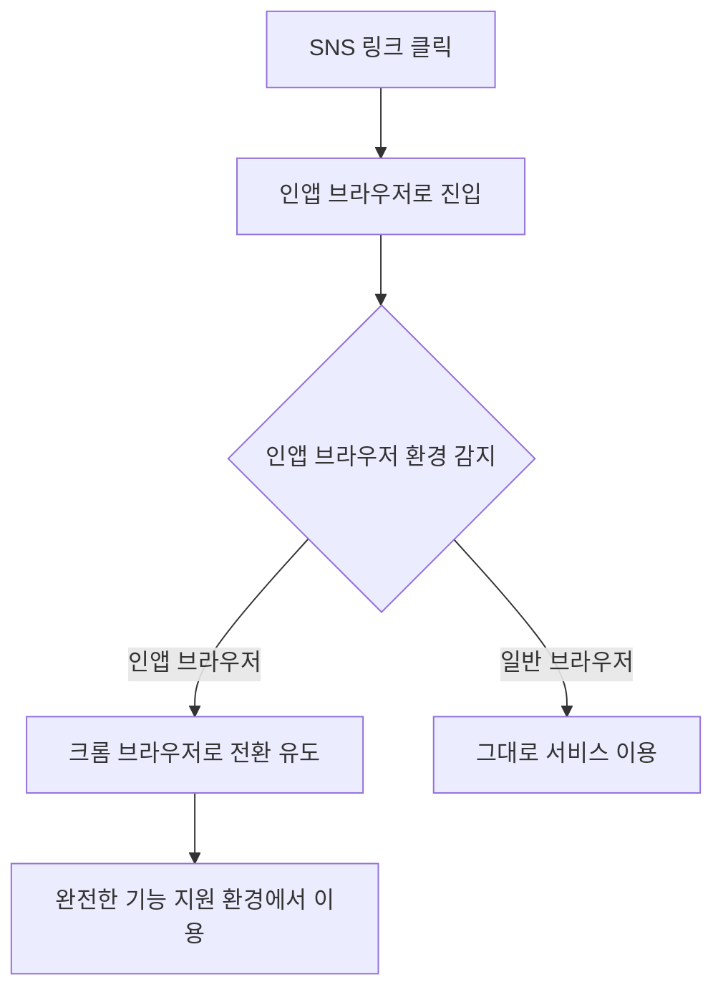
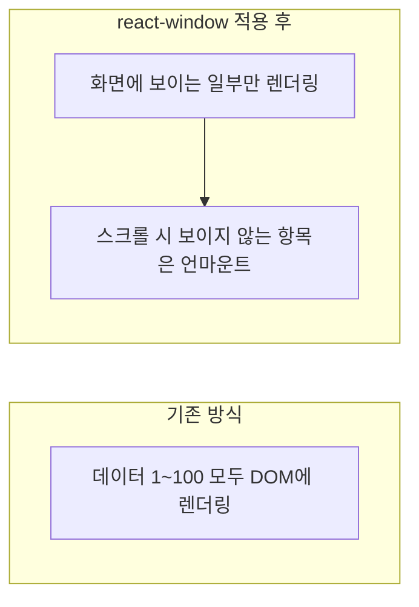

## 배경

순록의 편지는 연말에 자신과 타인에게 음성 또는 글 형태로 예약 편지를 작성하고 전달하는 서비스입니다. ([reindeer-letter.site](https://www.reindeer-letter.site/))

기능은 크게 네 가지로 구성했습니다.

1. **순록 커스터마이징** — 회원가입 후 자신만의 편지함을 생성합니다.
2. **편지 작성** — 글 편지는 사진과 BGM을 첨부할 수 있고, 음성 편지는 직접 녹음해서 남길 수 있습니다.

3. **예약 전달** — 특정 날짜를 지정하면 그 날짜에 자동으로 전달되고 알림이 갑니다.

4. **저장소 공유** — 친구나 가족이 내 저장소에 편지를 남길 수 있습니다.

작성한 편지는 글은 사진과 함께, 음성은 재생 플레이어와 함께 열람할 수 있습니다.

| | |
| --- | --- |
| 기간 및 팀 | 6인 (개발 5, 디자인 1) |
| 역할 | 프론트엔드 |
| 링크 | [서비스](https://www.reindeer-letter.site/) / [GitHub](https://github.com/reindeer-letter/client) |

만든 이유는 단순했습니다. 연말이 되면 누구나 한 번쯤 편지를 쓰고 싶어지지만, 막상 쓴 편지를 "그 날"에 전달할 방법은 마땅치 않습니다. 미래의 나 혹은 소중한 사람에게 정확한 타이밍에 마음을 전달하는 경험을 만들어보고 싶었습니다.

## 설계

| 구분 | 스택 |
| --- | --- |
| 코어 |    |
| 상태 및 통신 |    |
| 렌더링 최적화 |  |
| 개발 및 운영 |    |

백엔드는 Nest.js와 Prisma, PostgreSQL(Supabase)로 구성되어 Vercel과 AWS Lambda에 배포되는 구조였습니다.

SNS를 통한 유입을 주요 채널로 설계했습니다. 카카오톡이나 인스타그램 공유 링크를 타고 들어오는 사용자가 많을 것이라는 전제였고, 실제로 서비스 운영 과정에서 이 전제가 새로운 문제로 이어졌습니다(마주친 문제 1번).

상태 관리는 Zustand로 가볍게 구성했습니다. 편지함, 예약 목록, 사용자 정보처럼 여러 화면에서 공유되는 상태를 전역으로 두되, 컴포넌트 트리 깊숙이 prop을 내려보내는 구조는 피하고자 했습니다.

API 통신은 Axios로 처리하면서, 개발 초반부터 MSW로 백엔드 API를 모킹해 프론트엔드와 백엔드 개발을 병렬로 진행할 수 있도록 했습니다. 백엔드 스펙이 확정되기 전에도 화면 작업을 먼저 진행할 수 있었던 부분입니다.

배포 파이프라인은 GitHub Actions로 구성해 PR마다 자동으로 검증이 돌아가도록 했고, GTM과 GA를 붙여 실제 사용자가 어떤 흐름으로 서비스를 쓰는지 파악할 수 있는 기반을 마련했습니다.

## 마주친 문제들

### 1. 인앱 브라우저에서 기능이 정상 작동하지 않음

서비스가 SNS 공유를 중심으로 확산되는 구조였기 때문에, 카카오톡이나 인스타그램의 인앱 브라우저를 통해 들어오는 유입이 상당했습니다. 그런데 운영 과정에서 이 인앱 브라우저 환경에서 서비스의 일부 기능이 정상적으로 작동하지 않는 문제가 발견됐습니다. 인앱 브라우저는 자체 렌더링 엔진 제약이나 쿠키와 스토리지 접근 제한 등으로 일반 브라우저와 동작이 다른 경우가 많고, 음성 녹음이나 파일 첨부처럼 브라우저 API에 의존하는 기능일수록 이런 제약에 더 취약했습니다. 사용자 입장에서는 "링크를 눌렀는데 편지를 쓸 수 없다"는 경험으로 이어지는 문제였습니다.

### 2. 무한 스크롤 목록에서 데이터가 늘어날수록 렌더링이 느려짐

편지함이나 저장소에 쌓이는 편지 목록은 무한 스크롤 방식으로 구현되어 있었습니다. 그런데 기존 방식은 스크롤을 내릴 때마다 새로 불러온 데이터만이 아니라 이미 렌더링된 기존 데이터까지 전부 다시 렌더링 대상에 포함시키고 있었습니다. 목록에 쌓인 편지가 많아질수록 DOM에 실제로 존재하는 노드 수가 계속 늘어났고, 이는 목록이 길어질수록 불필요한 성능 부담이 누적되는 구조적 문제였습니다. 컴포넌트 하나가 복잡해질수록(이미지, 재생 버튼, 날짜 표시 등 자식 요소가 많을수록) 이 부담은 더 커지는 성격의 문제였습니다.

## 해결

### 크롬 브라우저로 전환하는 기능 구현

인앱 브라우저의 제약을 프론트엔드 코드에서 하나하나 우회하는 대신, 사용자를 아예 완전한 기능을 지원하는 크롬 브라우저로 유도하는 방향으로 접근했습니다. 인앱 브라우저 환경을 감지해 크롬 브라우저로 전환하는 기능을 구현했고, 이를 통해 사용자가 안정적이고 완전한 환경에서 서비스를 이용할 수 있도록 개선했습니다.

인앱 브라우저마다 지원하는 제약과 우회 방법이 제각각이라 특정 기능 하나씩 패치하는 방식은 지속 가능하지 않다고 판단했고, 진입 지점에서 환경을 정리하는 쪽이 더 근본적인 해결책이라고 봤습니다. 이 개선 이후 인앱 브라우저 유입 사용자도 녹음, 파일 첨부 등 모든 기능을 정상적으로 이용할 수 있게 됐습니다.

### List Virtualization으로 목록 렌더링 최적화

무한 스크롤 목록의 성능 문제는 react-window를 도입해 해결했습니다. 기존에는 스크롤이 진행될수록 이전 데이터까지 모두 DOM에 남아있는 구조였는데, react-window를 적용해 실제 화면에 보이는 데이터만 렌더링하도록 바꿨습니다.

이 변경으로 DOM의 크기가 실제 데이터 양과 무관하게 일정하게 유지되면서 메모리 사용을 최적화할 수 있었습니다. 측정 결과 데이터 100개 기준 렌더링 시간이 약 1.3ms에서 0.7ms로, 약 47% 감소했습니다. 이 효과는 컴포넌트 하나가 복잡해질수록(자식 요소가 많아질수록) 더 커지는 성격이었기 때문에, 실제 서비스에서 편지 카드처럼 이미지, 텍스트, 버튼이 함께 있는 컴포넌트에서 체감 효과가 더 컸습니다.

## 최종 회고

순록의 편지는 기능 하나하나보다, 실제 사용자가 서비스에 들어오는 "진입 경로"와 "사용하는 동안의 체감 속도"가 완성도를 좌우한다는 걸 배운 프로젝트였습니다. 인앱 브라우저 문제는 코드 로직의 결함이 아니라 사용자가 서비스에 도달하는 환경 자체의 문제였고, 이런 문제는 기능을 아무리 잘 만들어도 발견하기 전까지는 드러나지 않습니다. 운영을 하면서 실제 유입 경로를 추적하지 않았다면 오래 방치됐을 문제라고 생각합니다.

List Virtualization 작업은 수치로 개선 효과를 확인할 수 있었던 경험이었습니다. "느린 것 같다"는 감각을 실제 렌더링 시간 측정으로 확인하고, 그 개선폭이 컴포넌트가 복잡해질수록 커진다는 것까지 파악한 과정은 이후 다른 프로젝트에서 성능 문제를 마주할 때도 참고할 수 있는 기준이 됐습니다.

여섯 명이 함께 만든 프로젝트였던 만큼, 프론트엔드에서 발견한 문제가 곧바로 사용자 경험 전체에 영향을 미친다는 감각도 얻었습니다. 백엔드가 아무리 안정적이어도 인앱 브라우저에서 기능이 막히면 사용자는 서비스 전체를 쓸 수 없는 것으로 받아들입니다. 프론트엔드가 마지막 접점이라는 책임감을 실감한 프로젝트였습니다.
