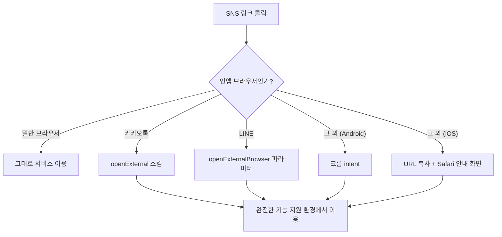
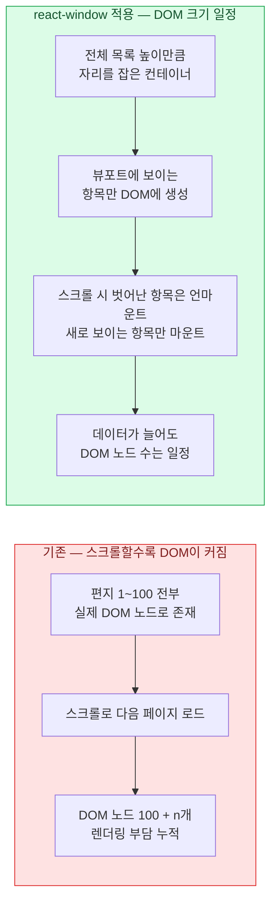

## 배경

순록의 편지는 "오늘의 기억을 선물하는 편지"라는 컨셉의 예약 편지 서비스입니다. 미래의 나, 가족, 친구에게 글 또는 음성으로 편지를 남겨두면, 배달부 순록이 지정한 날짜에 맞춰 전달해 줍니다. 회원가입하면 자신만의 순록을 꾸며 편지함을 만들고, 그 편지함을 공유해 다른 사람의 편지를 받을 수도 있습니다.

**테오의 스프린트**라는 대외활동에서 모인 팀으로 시작해, 연말 시즌에 맞춰 출시하고 실사용자 대상으로 운영했습니다. 시즌이 끝난 뒤 서비스는 종료했습니다.

기능은 크게 네 가지로 구성했습니다.

1. **순록 커스터마이징** — 회원가입 후 자신만의 순록을 꾸며 편지함을 생성합니다.
2. **편지 작성** — 글 편지는 사진과 BGM을 첨부할 수 있고, 음성 편지는 직접 녹음해서 남길 수 있습니다.
3. **예약 전달** — 특정 날짜를 지정하면 그 날짜에 자동으로 전달되고 알림이 갑니다.
4. **저장소 공유** — 친구나 가족이 내 저장소에 편지를 남길 수 있습니다.

핵심 흐름은 두 장면입니다. 날짜를 지정해 편지를 예약해 두면,

그 날 도착한 편지를 글이라면 사진과 함께, 음성이라면 재생 플레이어와 함께 열람합니다.

| | |
| --- | --- |
| 진행 | 테오의 스프린트 (대외활동) |
| 기간 | 2024.12 – 2025.01 |
| 팀 | 6인 — 프론트엔드 4, 백엔드 1, 디자인 1 |
| 역할 | 프론트엔드 |
| 링크 | [GitHub](https://github.com/reindeer-letter/client) |

만든 이유는 단순했습니다. 연말이 되면 누구나 한 번쯤 편지를 쓰고 싶어지지만, 막상 쓴 편지를 "그 날"에 전달할 방법은 마땅치 않습니다. 미래의 나 혹은 소중한 사람에게 정확한 타이밍에 마음을 전달하는 경험을 만들어보고 싶었습니다. 이 작은 기획을 제가 제안하면서 팀이 꾸려졌고, 아이디어 확장과 디자인 협업부터 개발, 배포, 연말 시즌 운영까지 전 과정을 여섯 명이 함께 통과했습니다.

## 설계

| 구분 | 스택 |
| --- | --- |
| 코어 |    |
| 상태 및 통신 |    |
| 렌더링 최적화 |  |
| 개발 및 운영 |    |

프론트엔드는 Vercel에, 백엔드는 Nest.js와 Prisma, PostgreSQL(Supabase) 구성으로 AWS Lambda에 배포되는 구조였습니다.

SNS를 통한 유입을 주요 채널로 설계했습니다. 카카오톡이나 인스타그램 공유 링크를 타고 들어오는 사용자가 많을 것이라는 전제였는데, 운영을 시작하자 바로 이 전제가 첫 번째 문제로 이어졌습니다.

## 마주친 문제들

### 1. 인앱 브라우저에서 기능이 정상 작동하지 않음

서비스가 SNS 공유를 중심으로 확산되는 구조였기 때문에, 카카오톡이나 인스타그램의 인앱 브라우저를 통해 들어오는 유입이 상당했습니다. 그런데 트래픽이 가장 몰리던 크리스마스 시즌 한복판에, 인앱 브라우저 환경에서 서비스의 일부 기능이 정상적으로 작동하지 않는 문제가 발견됐습니다. 인앱 브라우저는 자체 렌더링 엔진 제약이나 쿠키와 스토리지 접근 제한 등으로 일반 브라우저와 동작이 다른 경우가 많고, 음성 녹음이나 파일 첨부처럼 브라우저 API에 의존하는 기능일수록 이런 제약에 더 취약했습니다. 사용자 입장에서는 "링크를 눌렀는데 편지를 쓸 수 없다"는 경험으로 이어지는 문제였습니다.

#### 인앱 브라우저를 감지해 외부 브라우저로 전환

인앱 브라우저의 제약을 기능마다 하나씩 우회하는 대신, 진입 시점에 환경을 감지해 완전한 기능을 지원하는 외부 브라우저로 내보내는 전략을 적용했습니다. 인앱 브라우저마다 탈출 경로가 달라서 user agent 기준으로 분기했습니다.

- **카카오톡** — `kakaotalk://web/openExternal` 스킴으로 기본 외부 브라우저 열기
- **LINE** — URL에 `openExternalBrowser=1` 파라미터를 붙여 재진입
- **그 외 인앱(인스타그램 등)** — Android는 크롬 intent로 이동하고, iOS는 스킴 강제 이동이 막혀 있어 URL을 복사해 두고 Safari로 여는 방법을 안내하는 화면을 띄움

인앱 브라우저마다 제약과 우회 방법이 제각각이라 특정 기능 하나씩 패치하는 방식은 지속 가능하지 않다고 판단했고, 진입 지점에서 환경을 정리하는 쪽이 더 근본적인 해결책이라고 봤습니다. 이 개선 이후 인앱 브라우저 유입 사용자도 녹음, 파일 첨부 등 모든 기능을 정상적으로 이용할 수 있게 됐습니다.

### 2. 무한 스크롤 목록에서 데이터가 늘어날수록 렌더링이 느려짐

편지함이나 저장소에 쌓이는 편지 목록은 무한 스크롤 방식이었습니다. 스크롤을 내려 데이터가 추가될 때마다 목록 전체가 다시 렌더링 대상이 됐고, 이미 지나간 항목들도 DOM에 그대로 남아 노드 수가 계속 늘어났습니다. 편지가 쌓일수록 성능 부담이 누적되는 구조적 문제였고, 편지 카드처럼 이미지, 재생 버튼, 날짜 표시가 함께 있는 복잡한 컴포넌트일수록 부담이 더 커졌습니다.

#### List Virtualization으로 목록 렌더링 최적화

무한 스크롤 목록의 성능 문제는 react-window를 도입해 해결했습니다. 기존에는 스크롤이 진행될수록 이전 데이터까지 모두 DOM에 남아있는 구조였는데, react-window를 적용해 실제 화면에 보이는 데이터만 렌더링하도록 바꿨습니다.

이 변경으로 DOM의 크기가 실제 데이터 양과 무관하게 일정하게 유지되면서 메모리 사용도 함께 안정됐습니다. 측정 결과 데이터 100개 기준 렌더링 시간이 약 1.3ms에서 0.7ms로, 약 47% 감소했습니다. 항목 컴포넌트가 복잡할수록 절감 폭이 커지는 개선이라, 자식 요소가 많은 편지 카드 목록에서 체감 효과가 특히 컸습니다.

## 최종 회고

순록의 편지는 만든 기능보다 운영하면서 겪은 문제들이 저를 성장시킨 프로젝트였습니다. 연말 이벤트 느낌으로 가볍게 시작했는데, 생각보다 많은 분들이 찾아와 주셔서 놀랐고, 그만큼 다양한 환경에서 생기는 문제를 실제로 대응해 보게 됐습니다.

SNS 유입이라 고민해야 했던 인앱 브라우저 문제도, 편지가 쌓이는 UI 구조에서 비롯된 렌더링 이슈도, 기능만 보면 단순한 서비스에서 나온 것들입니다. 겉보기에 단순한 서비스라도 사용자가 실제로 도달하고 머무는 환경까지 넓혀 보면 고민할 지점이 많다는 걸 배웠습니다.

