# Why Use useCallback and useMemo

The reason for using useCallback and useMemo in React is not simply "performance optimization." Understanding JavaScript's reference type characteristics and React's dependency array behavior reveals why these hooks are essential in certain situations.

After reading this document, you will understand:
- Memory behavior differences between primitive and reference types
- Why reference types are dangerous in useEffect dependency arrays
- Hidden pitfalls in custom hooks that ESLint cannot warn about
- Memoization design principles for reference type data

---

# Memory Structure of Primitive and Reference Types

JavaScript data types are divided into Primitive and Reference types.

## Primitive Data

Primitives store the value itself in the variable. The JavaScript engine stores primitive values directly in stack memory.

```javascript
let a = 1;
let b = 1;

console.log(a === b); // true
```

**Memory Structure:**

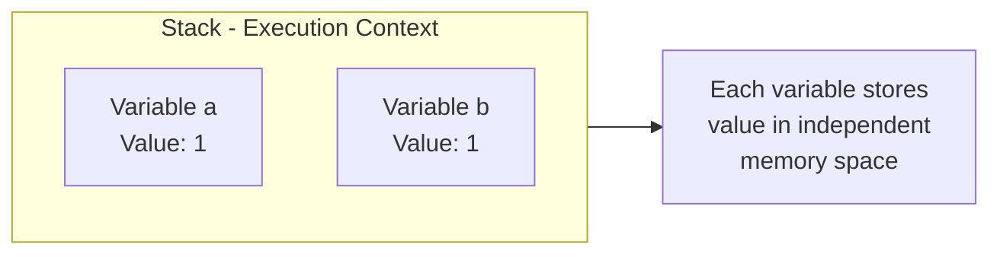
```mermaid
flowchart LR
    subgraph Stack["Stack - Execution Context"]
        direction TB
        A["Variable a<br/>Value: 1"]
        B["Variable b<br/>Value: 1"]
    end
    
    Note1["Each variable stores<br/>value in independent<br/>memory space"]
    
    Stack --> Note1
```

`a` and `b` each store `1` directly in independent stack memory spaces. The comparison operator (`===`) compares the stored values themselves, so it returns `true`.

**Characteristics:**
- Values are copied when passed (Pass by Value)
- Assigning a value to a variable creates a copy in a new memory space
- Changing one variable does not affect others

## Reference Data

Reference types store the actual data in heap memory, and only store the memory address (reference) in the stack.

```javascript
const obj1 = { value: 1 };
const obj2 = { value: 1 };

console.log(obj1 === obj2); // false
```

**Memory Structure:**

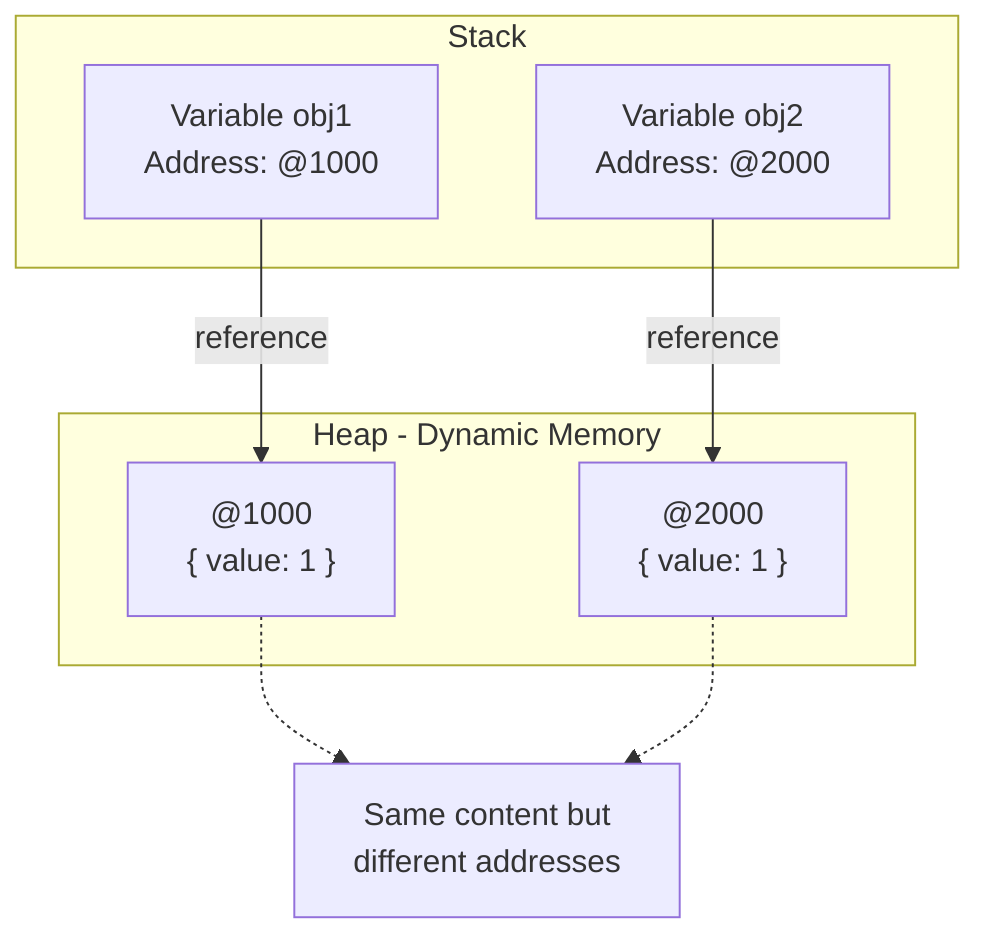
```mermaid
flowchart TB
    subgraph Stack["Stack"]
        direction TB
        V1["Variable obj1<br/>Address: @1000"]
        V2["Variable obj2<br/>Address: @2000"]
    end
    
    subgraph Heap["Heap - Dynamic Memory"]
        direction TB
        O1["@1000<br/>{ value: 1 }"]
        O2["@2000<br/>{ value: 1 }"]
    end
    
    V1 -->|"reference"| O1
    V2 -->|"reference"| O2
    
    Note1["Same content but<br/>different addresses"]
    
    O1 -.-> Note1
    O2 -.-> Note1
```

`obj1` and `obj2` have the same content but point to different heap memory addresses (@1000, @2000). The comparison operator (`===`) compares the addresses stored in the stack, so it returns `false`.

**Characteristics:**
- Addresses are copied when passed (Pass by Reference)
- Assigning an object to a variable only copies the address
- Variables pointing to the same address share the same object

### Memory Structure in Detail

Let's examine step by step how reference type data is stored in memory.

#### Roles of Stack and Heap

- **Stack**: Fixed-size memory area that stores execution context, variable names, primitive values, and addresses of reference types
- **Heap**: Memory area that stores dynamically sized objects and arrays

**Step 1: Object Creation**

```javascript
const user = { name: 'Kim', age: 25 };
```

**Step 2: Memory Allocation Process**

1. The JavaScript engine allocates an object in heap memory and receives an address (@1000)
2. The stack stores the variable name `user` and the heap address (@1000)

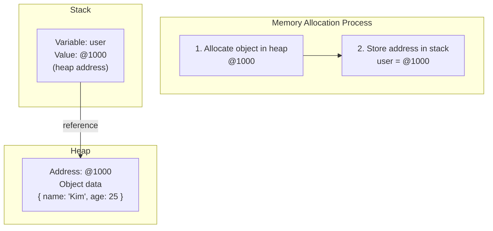
```mermaid
flowchart TB
    subgraph Process["Memory Allocation Process"]
        direction LR
        Step1["1. Allocate object in heap<br/>@1000"]
        Step2["2. Store address in stack<br/>user = @1000"]
    end
    
    Step1 --> Step2
    
    subgraph Stack["Stack"]
        direction TB
        V1["Variable: user<br/>Value: @1000<br/>(heap address)"]
    end

    subgraph Heap["Heap"]
        direction TB
        O1["Address: @1000<br/>Object data<br/>{ name: 'Kim', age: 25 }"]
    end

    V1 -->|"reference"| O1
```

**Step 3: Internal Object Structure**

Primitive values inside objects (`name`, `age`) are stored directly within the object's memory space in the heap. Objects consist of property name-value pairs.

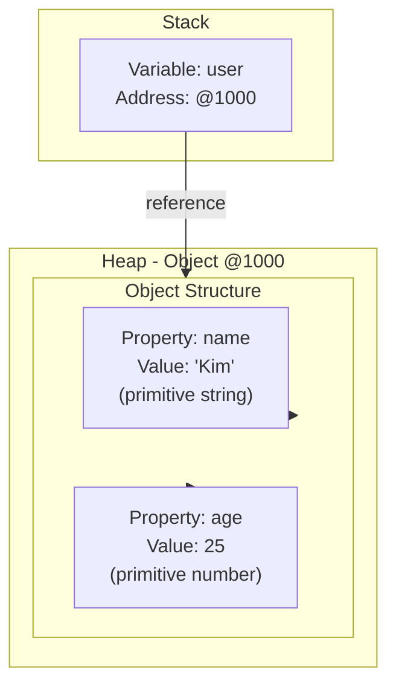
```mermaid
flowchart TB
    subgraph Stack["Stack"]
        direction TB
        V1["Variable: user<br/>Address: @1000"]
    end

    subgraph Heap["Heap - Object @1000"]
        direction TB
        subgraph Object["Object Structure"]
            direction LR
            P1["Property: name<br/>Value: 'Kim'<br/>(primitive string)"]
            P2["Property: age<br/>Value: 25<br/>(primitive number)"]
        end
    end

    V1 -->|"reference"| Object
    Object --> P1
    Object --> P2
```

**Step 4: Nested Objects**

When an object contains another object, the inner object also receives its own separate heap memory address. The outer object only stores the inner object's address.

```javascript
const user = {
  name: 'Kim',
  address: { city: 'Seoul', zip: '12345' }
};
```

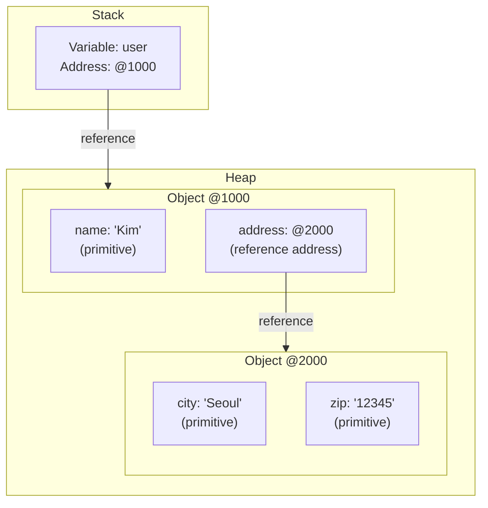
```mermaid
flowchart TB
    subgraph Stack["Stack"]
        direction TB
        V1["Variable: user<br/>Address: @1000"]
    end

    subgraph Heap["Heap"]
        direction TB
        subgraph Object1["Object @1000"]
            direction TB
            P1["name: 'Kim'<br/>(primitive)"]
            P2["address: @2000<br/>(reference address)"]
        end

        subgraph Object2["Object @2000"]
            direction TB
            P3["city: 'Seoul'<br/>(primitive)"]
            P4["zip: '12345'<br/>(primitive)"]
        end
    end

    V1 -->|"reference"| Object1
    P2 -->|"reference"| Object2
```

**Step 5: Reference Copying**

When an object is assigned to another variable, only the address is copied. Both variables point to the same object.

```javascript
const user1 = { name: 'Kim', age: 25 };
const user2 = user1; // Only address is copied

user2.age = 30;
console.log(user1.age); // 30 (pointing to the same object)
```

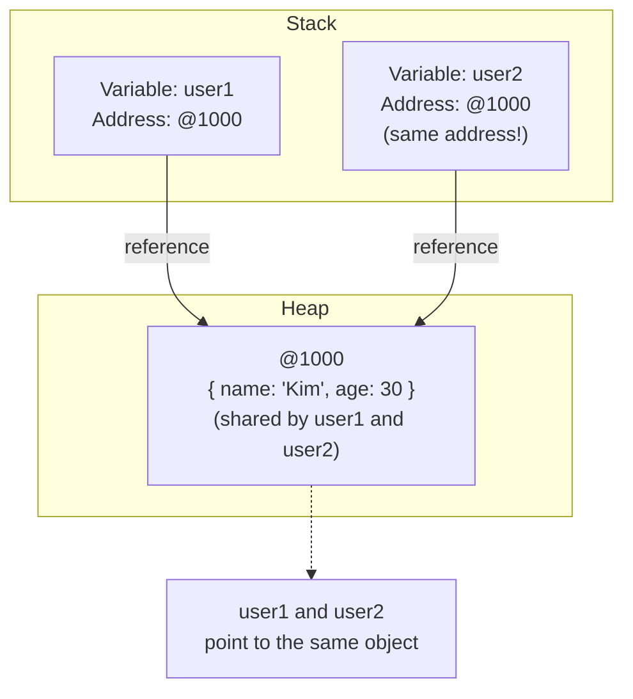
```mermaid
flowchart TB
    subgraph Stack["Stack"]
        direction TB
        V1["Variable: user1<br/>Address: @1000"]
        V2["Variable: user2<br/>Address: @1000<br/>(same address!)"]
    end

    subgraph Heap["Heap"]
        direction TB
        O1["@1000<br/>{ name: 'Kim', age: 30 }<br/>(shared by user1 and user2)"]
    end

    V1 -->|"reference"| O1
    V2 -->|"reference"| O1
    
    Note1["user1 and user2<br/>point to the same object"]
    
    O1 -.-> Note1
```

### Primitive vs Reference Comparison

Now let's compare the memory behavior differences between primitives and references at a glance.

```javascript
// Primitive example
let a = 1;
let b = 1;
console.log(a === b); // true

// Reference example
const obj1 = { value: 1 };
const obj2 = { value: 1 };
console.log(obj1 === obj2); // false
```

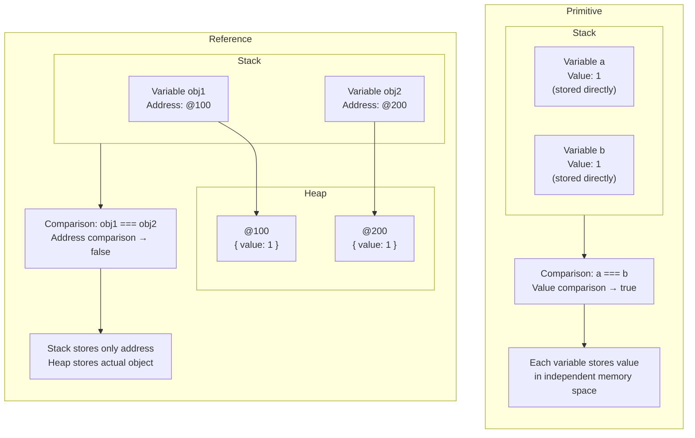
```mermaid
flowchart TB
    subgraph Primitive["Primitive"]
        direction TB
        subgraph Stack1["Stack"]
            A["Variable a<br/>Value: 1<br/>(stored directly)"]
            B["Variable b<br/>Value: 1<br/>(stored directly)"]
        end
        Compare1["Comparison: a === b<br/>Value comparison → true"]
        Note1["Each variable stores value<br/>in independent memory space"]
    end

    subgraph Reference["Reference"]
        direction TB
        subgraph Stack2["Stack"]
            C["Variable obj1<br/>Address: @100"]
            D["Variable obj2<br/>Address: @200"]
        end
        subgraph Heap2["Heap"]
            O1["@100<br/>{ value: 1 }"]
            O2["@200<br/>{ value: 1 }"]
        end
        Compare2["Comparison: obj1 === obj2<br/>Address comparison → false"]
        Note2["Stack stores only address<br/>Heap stores actual object"]
    end

    Stack1 --> Compare1
    Compare1 --> Note1
    
    Stack2 --> Compare2
    C --> O1
    D --> O2
    Compare2 --> Note2
```

**Key Differences Summary:**

| Aspect | Primitive | Reference |
|--------|-----------|-----------|
| **Storage Location** | Value stored directly in stack | Object stored in heap, only address in stack |
| **Assignment Method** | Value copy (Pass by Value) | Address copy (Pass by Reference) |
| **Comparison** | Compares values themselves | Compares addresses |
| **Independence** | Each variable has independent value | Variables pointing to same address share object |
| **Memory** | Fixed size, fast access | Dynamic size, slower access |

**Practical Example:**

```javascript
// Primitive: Value copy
let x = 10;
let y = x;  // y gets a copy of 10
y = 20;     // Only y changes
console.log(x); // 10 (x is unaffected)

// Reference: Address copy
let objA = { count: 10 };
let objB = objA;  // objB copies objA's address
objB.count = 20;  // Modifies the same object
console.log(objA.count); // 20 (objA is affected)
```

## Functions Are Also Reference Types

Functions are first-class objects in JavaScript and are reference type data.

```javascript
const fn1 = () => console.log('hello');
const fn2 = () => console.log('hello');

console.log(fn1 === fn2); // false
```

Even functions with identical code are assigned new memory addresses each time they are declared.

## JavaScript Type Classification

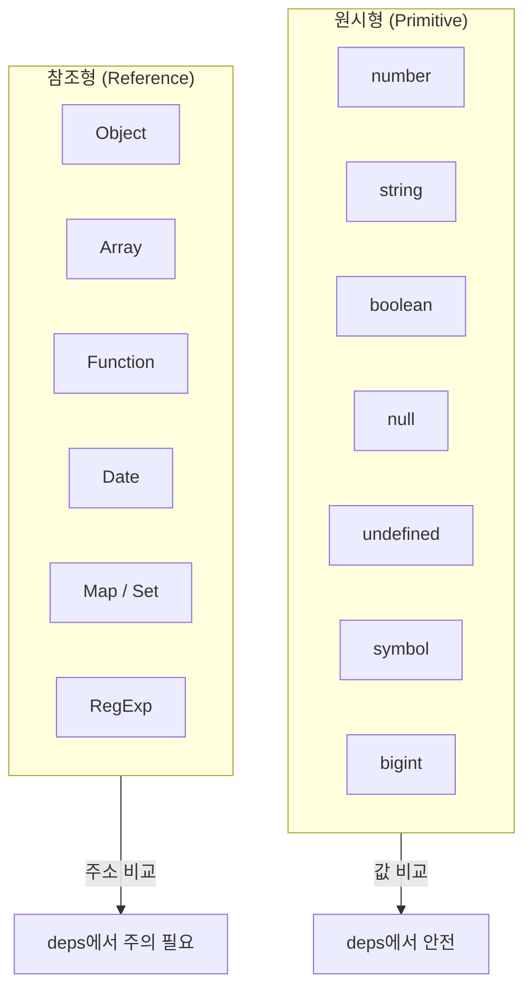
```mermaid
flowchart TB
    subgraph 원시형["원시형 (Primitive)"]
        P1[number]
        P2[string]
        P3[boolean]
        P4[null]
        P5[undefined]
        P6[symbol]
        P7[bigint]
    end

    subgraph 참조형["참조형 (Reference)"]
        R1[Object]
        R2[Array]
        R3[Function]
        R4[Date]
        R5[Map / Set]
        R6[RegExp]
    end

    원시형 -->|"값 비교"| SAFE["deps에서 안전"]
    참조형 -->|"주소 비교"| DANGER["deps에서 주의 필요"]
```

---

# useEffect Dependency Array and Reference Type Pitfalls

React's useEffect executes the callback when values in the dependency array change. The problem is that this comparison is performed using `Object.is`.

## Primitives Are Safe

```jsx
function Counter() {
  const [count, setCount] = useState(0);

  useEffect(() => {
    console.log('count 변경:', count);
  }, [count]);

  return <button onClick={() => setCount(count + 1)}>증가</button>;
}
```

Since `count` is a primitive (number), the effect only runs when the value actually changes.

## Reference Types Are Dangerous

```jsx
function UserProfile() {
  const [user, setUser] = useState({ name: 'Kim' });

  // New object created on every render
  const config = { theme: 'dark' };

  useEffect(() => {
    console.log('config 변경됨');
  }, [config]); // Runs on every render

  return <div>{user.name}</div>;
}
```

`config` is created as an object with a new memory address on every render. Even if the content is identical, React considers it "changed."

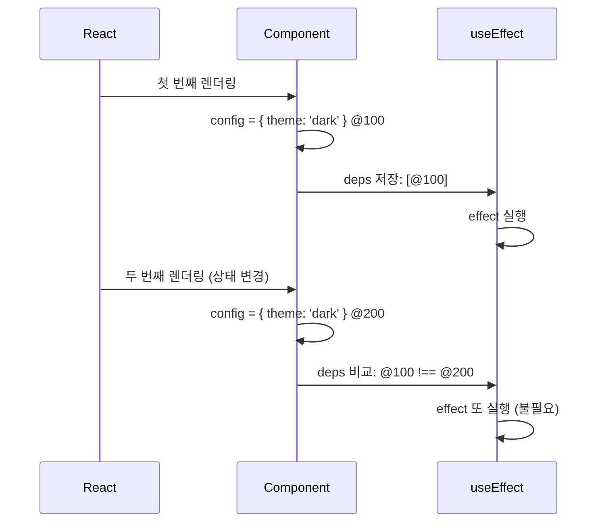
```mermaid
sequenceDiagram
    participant R as React
    participant C as Component
    participant E as useEffect

    R->>C: 첫 번째 렌더링
    C->>C: config = { theme: 'dark' } @100
    C->>E: deps 저장: [@100]
    E->>E: effect 실행

    R->>C: 두 번째 렌더링 (상태 변경)
    C->>C: config = { theme: 'dark' } @200
    C->>E: deps 비교: @100 !== @200
    E->>E: effect 또 실행 (불필요)
```

## Infinite Re-rendering Case

If you put a function in the dependency array and change state inside that function, an infinite loop occurs.

```jsx
function AutoSaveEditor() {
  const [content, setContent] = useState('');

  // New function created on every render
  const saveDraft = () => {
    console.log('저장:', content);
    // If we change state here...
    setContent(content + ' (저장됨)');
  };

  useEffect(() => {
    saveDraft();
  }, [saveDraft]); // Infinite loop!

  return <textarea value={content} onChange={(e) => setContent(e.target.value)} />;
}
```

Execution flow:
1. Component renders → `saveDraft` function created (@100)
2. useEffect executes → calls `saveDraft()` → executes `setContent`
3. State change causes re-render → `saveDraft` function recreated (@200)
4. useEffect detects `@100 !== @200` → executes again
5. Steps 2-4 repeat (infinite loop)

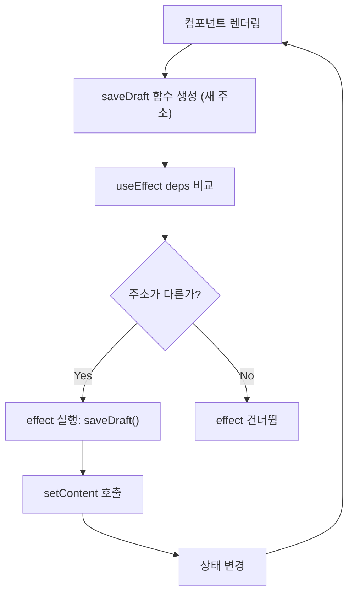
```mermaid
flowchart TD
    A[컴포넌트 렌더링] --> B["saveDraft 함수 생성 (새 주소)"]
    B --> C["useEffect deps 비교"]
    C --> D{"주소가 다른가?"}
    D -->|Yes| E["effect 실행: saveDraft()"]
    E --> F["setContent 호출"]
    F --> G["상태 변경"]
    G --> A
    D -->|No| H["effect 건너뜀"]
```

### Memory Address Changes Confirmed in Chrome DevTools

You can verify that functions have new memory addresses on every render in Chrome DevTools' Memory tab.

The screenshot below shows a comparison of Heap Snapshots. You can see that the `inlineSaveDraft` function has different memory addresses in each snapshot.

**Function address in Snapshot 1:**


**Newly created functions in Snapshot 2:**


**Functions with another address in Snapshot 3:**


In each snapshot, the `inlineSaveDraft` function has different memory addresses like `@200175`, `@473745`, `@483163`. This is why React considers the function "changed" on every render.

## Solving with useCallback

Using useCallback allows you to maintain a stable function reference.

```jsx
function AutoSaveEditor() {
  const [content, setContent] = useState('');

  // Stabilize function reference with useCallback
  const saveDraft = useCallback(() => {
    console.log('저장:', content);
    // Use functional update if state change is needed
  }, [content]); // Function recreated only when content changes

  useEffect(() => {
    saveDraft();
  }, [saveDraft]); // Effect runs only when content changes

  return <textarea value={content} onChange={(e) => setContent(e.target.value)} />;
}
```

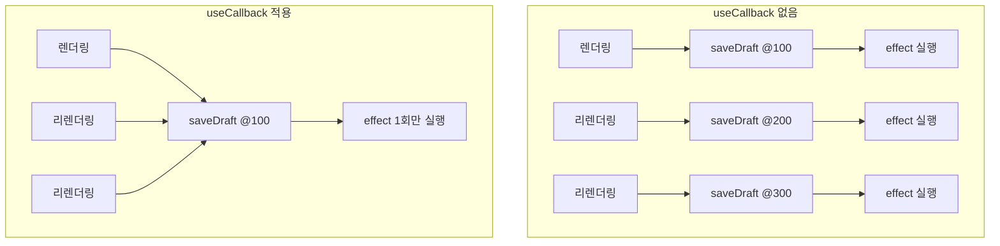
```mermaid
flowchart TD
    subgraph "useCallback 없음"
        A1[렌더링] --> B1["saveDraft @100"]
        A2[리렌더링] --> B2["saveDraft @200"]
        A3[리렌더링] --> B3["saveDraft @300"]
        B1 --> E1["effect 실행"]
        B2 --> E2["effect 실행"]
        B3 --> E3["effect 실행"]
    end

    subgraph "useCallback 적용"
        C1[렌더링] --> D1["saveDraft @100"]
        C2[리렌더링] --> D1
        C3[리렌더링] --> D1
        D1 --> F1["effect 1회만 실행"]
    end
```

## Stabilizing Objects with useMemo

When objects or arrays need to be in deps, use useMemo.

```jsx
function UserDashboard() {
  const [user, setUser] = useState({ name: 'Kim' });

  // Stabilize object reference with useMemo
  const config = useMemo(() => ({ theme: 'dark', locale: 'ko' }), []);

  useEffect(() => {
    applyConfig(config);
  }, [config]); // Executes only once initially

  return <div>{user.name}</div>;
}
```

---

# React.memo and Memoization

Another important case where useCallback and useMemo are needed is when passing props to child components wrapped with `React.memo`.

## How React.memo Works

`React.memo` skips re-rendering when props haven't changed. However, props comparison is also performed using `Object.is`.

```jsx
const ExpensiveChild = React.memo(({ onClick, data }) => {
  console.log('ExpensiveChild 렌더링');
  return <button onClick={onClick}>{data.label}</button>;
});

function Parent() {
  const [count, setCount] = useState(0);

  // New function/object created on every render
  const handleClick = () => console.log('clicked');
  const data = { label: 'Click me' };

  return (
    <>
      <button onClick={() => setCount(count + 1)}>Count: {count}</button>
      {/* ExpensiveChild also re-renders whenever count changes */}
      <ExpensiveChild onClick={handleClick} data={data} />
    </>
  );
}
```

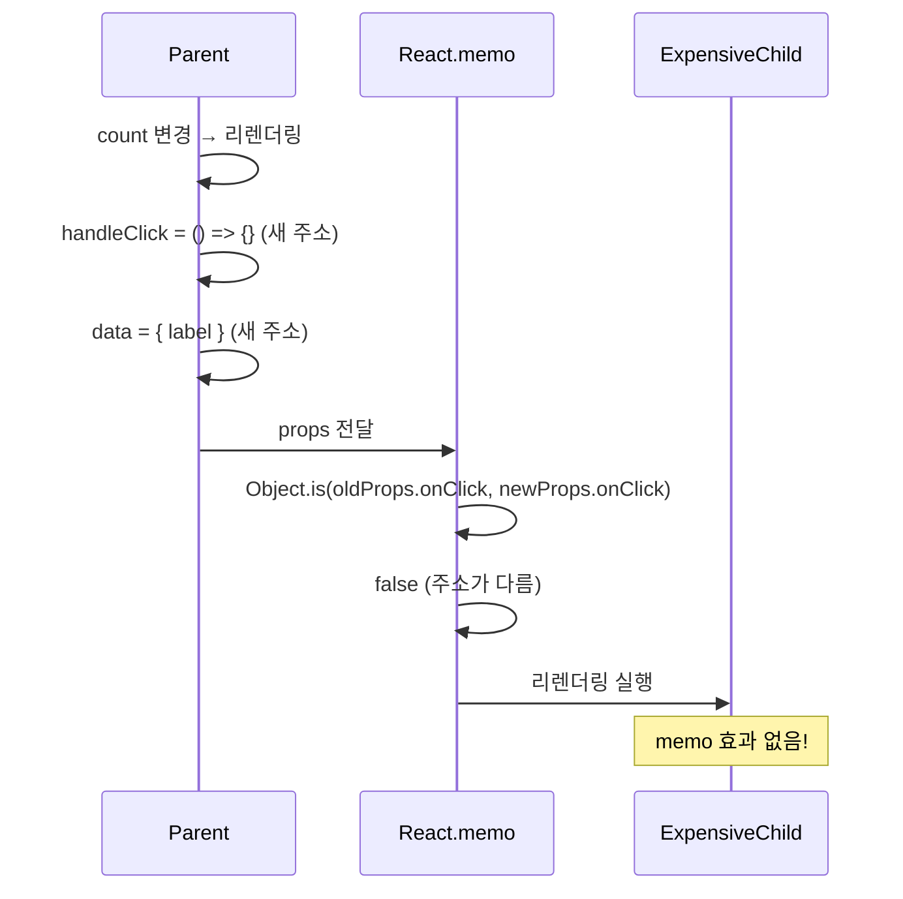
```mermaid
sequenceDiagram
    participant P as Parent
    participant M as React.memo
    participant C as ExpensiveChild

    P->>P: count 변경 → 리렌더링
    P->>P: handleClick = () => {} (새 주소)
    P->>P: data = { label } (새 주소)
    P->>M: props 전달
    M->>M: Object.is(oldProps.onClick, newProps.onClick)
    M->>M: false (주소가 다름)
    M->>C: 리렌더링 실행
    Note over C: memo 효과 없음!
```

## Solving with Memoization

```jsx
function Parent() {
  const [count, setCount] = useState(0);

  // Stabilize references
  const handleClick = useCallback(() => console.log('clicked'), []);
  const data = useMemo(() => ({ label: 'Click me' }), []);

  return (
    <>
      <button onClick={() => setCount(count + 1)}>Count: {count}</button>
      {/* ExpensiveChild does not re-render even when count changes */}
      <ExpensiveChild onClick={handleClick} data={data} />
    </>
  );
}
```

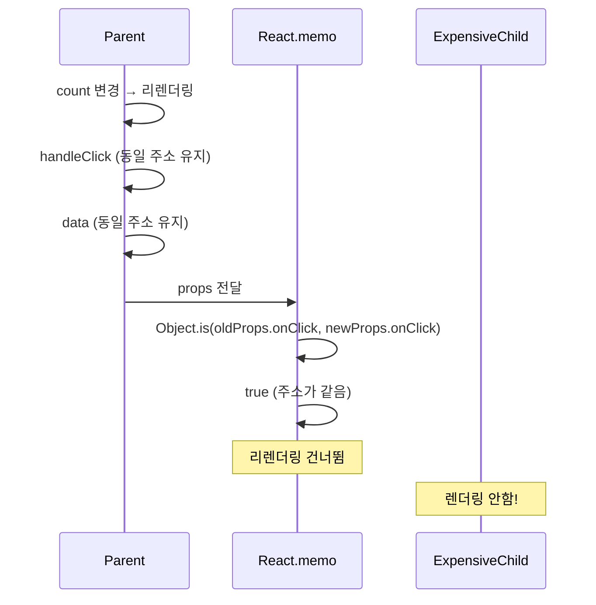
```mermaid
sequenceDiagram
    participant P as Parent
    participant M as React.memo
    participant C as ExpensiveChild

    P->>P: count 변경 → 리렌더링
    P->>P: handleClick (동일 주소 유지)
    P->>P: data (동일 주소 유지)
    P->>M: props 전달
    M->>M: Object.is(oldProps.onClick, newProps.onClick)
    M->>M: true (주소가 같음)
    Note over M: 리렌더링 건너뜀
    Note over C: 렌더링 안함!
```

---

# ESLint Warning Limitations and Custom Hook Pitfalls

## Role of eslint-plugin-react-hooks

`eslint-plugin-react-hooks` warns when non-memoized functions are placed in dependency arrays.

```jsx
function Example() {
  const [count, setCount] = useState(0);

  // Non-memoized function
  const handleClick = () => {
    console.log(count);
  };

  useEffect(() => {
    handleClick();
  }, [handleClick]); // ESLint warning: The 'handleClick' function makes the dependencies of useEffect Hook change on every render

  return <button onClick={handleClick}>{count}</button>;
}
```

This warning tells you that "the function is recreated on every render, which may cause unnecessary effect execution." ESLint suggests wrapping it with `useCallback` or moving the function inside the effect.

## Functions Returned from Custom Hooks Are Not Warned

The problem is that ESLint does not warn when non-memoized functions returned from custom hooks are placed in deps.

```jsx
// useAutoSave.ts - Returns function without memoization
function useAutoSave() {
  const [lastSaved, setLastSaved] = useState<Date | null>(null);

  // Returns non-memoized function
  const save = (content: string) => {
    api.save(content);
    setLastSaved(new Date());
  };

  return { save, lastSaved };
}

// Component.tsx
function Editor() {
  const [content, setContent] = useState('');
  const { save } = useAutoSave(); // New save function on every render

  useEffect(() => {
    const timer = setInterval(() => save(content), 5000);
    return () => clearInterval(timer);
  }, [save, content]); // No ESLint warning!

  return <textarea value={content} onChange={(e) => setContent(e.target.value)} />;
}
```

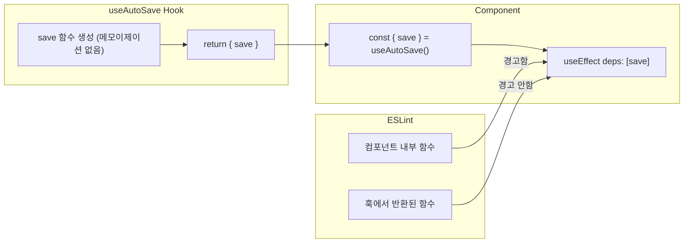
```mermaid
flowchart LR
    subgraph "useAutoSave Hook"
        A["save 함수 생성 (메모이제이션 없음)"]
        B["return { save }"]
    end

    subgraph Component
        C["const { save } = useAutoSave()"]
        D["useEffect deps: [save]"]
    end

    subgraph ESLint
        E["컴포넌트 내부 함수"]
        F["훅에서 반환된 함수"]
    end

    A --> B
    B --> C
    C --> D
    E -->|"경고함"| D
    F -->|"경고 안함"| D
```

ESLint warns when functions declared inside components are in deps, but assumes functions returned from hooks are "already stable references." However, if hooks don't memoize internally, new functions are created on every render.

## Result: Hidden Performance Issues

```jsx
function Editor() {
  const [content, setContent] = useState('');
  const [cursor, setCursor] = useState(0);
  const { save } = useAutoSave(); // Non-memoized function

  useEffect(() => {
    const timer = setInterval(() => save(content), 5000);
    return () => clearInterval(timer);
  }, [save, content]); // No ESLint warning, but problem occurs

  // useAutoSave returns new save function whenever cursor changes
  return (
    <textarea
      value={content}
      onChange={(e) => setContent(e.target.value)}
      onSelect={(e) => setCursor(e.target.selectionStart)}
    />
  );
}
```

Whenever the cursor position changes:
1. Component re-renders
2. `useAutoSave` returns new `save` function (new memory address)
3. useEffect detects `save` change → effect re-executes
4. Clears existing timer and creates new timer

ESLint does not warn about this issue. It assumes functions returned from hooks are stable references. This is why memoization of return values is important when designing custom hooks.

---

# Memoization Design Principles

When designing custom hooks, you must ensure reference stability of return values.

## Principle 1: Always Memoize Reference Type Return Values

Functions or objects returned from hooks can be placed in dependency arrays. References must be kept stable.

```jsx
// Bad: New function created on every render
function useCounter() {
  const [count, setCount] = useState(0);

  const increment = () => setCount((c) => c + 1);
  const decrement = () => setCount((c) => c - 1);

  return { count, increment, decrement };
}

// Good: Stabilize function references with useCallback
function useCounter() {
  const [count, setCount] = useState(0);

  const increment = useCallback(() => setCount((c) => c + 1), []);
  const decrement = useCallback(() => setCount((c) => c - 1), []);

  return { count, increment, decrement };
}
```

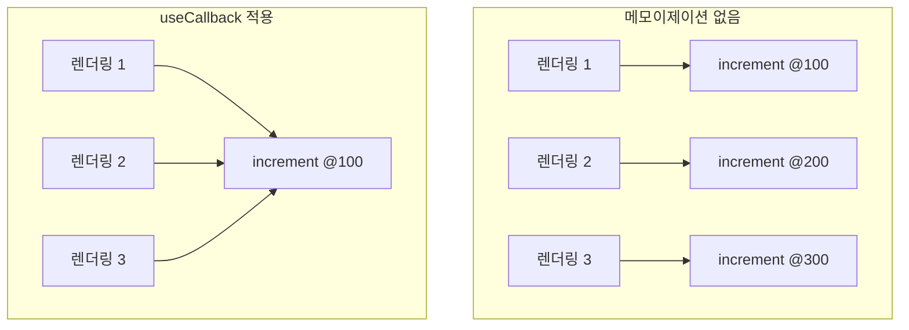
```mermaid
flowchart TB
    subgraph "메모이제이션 없음"
        A1[렌더링 1] --> B1["increment @100"]
        A2[렌더링 2] --> B2["increment @200"]
        A3[렌더링 3] --> B3["increment @300"]
    end

    subgraph "useCallback 적용"
        C1[렌더링 1] --> D1["increment @100"]
        C2[렌더링 2] --> D1
        C3[렌더링 3] --> D1
    end
```

## Principle 2: Consider Calculation Cost for Primitive Return Values

Since primitives use value comparison, memoization is not mandatory. Use useMemo only when calculation cost is high.

```jsx
// Memoization unnecessary: Simple calculation
function useItemCount(items) {
  const count = items.length; // O(1)
  return count;
}

// Memoization needed: Complex calculation
function useFilteredItems(items, filter) {
  const filtered = useMemo(
    () => items.filter((item) => item.category === filter), // O(n)
    [items, filter]
  );
  return filtered;
}
```

## Principle 3: Wrap Object Returns with useMemo

When returning multiple values as an object, stabilize the object reference with useMemo.

```jsx
// Bad: New object created on every render
function useWindowSize() {
  const [size, setSize] = useState({ width: 0, height: 0 });

  useEffect(() => {
    const handler = () => setSize({ width: window.innerWidth, height: window.innerHeight });
    window.addEventListener('resize', handler);
    return () => window.removeEventListener('resize', handler);
  }, []);

  // Creates new object every time
  return { width: size.width, height: size.height, isLarge: size.width > 1024 };
}

// Good: Stabilize object with useMemo
function useWindowSize() {
  const [size, setSize] = useState({ width: 0, height: 0 });

  useEffect(() => {
    const handler = () => setSize({ width: window.innerWidth, height: window.innerHeight });
    window.addEventListener('resize', handler);
    return () => window.removeEventListener('resize', handler);
  }, []);

  return useMemo(
    () => ({ width: size.width, height: size.height, isLarge: size.width > 1024 }),
    [size.width, size.height]
  );
}
```

## Summary: Memoization Guide by Type

| Return Value Type | Memoization     | Reason                                           |
| ----------------- | --------------- | ------------------------------------------------ |
| Function          | useCallback required | Reference type, can be used in dependency arrays |
| Object/Array      | useMemo required | Reference type, can be used in dependency arrays |
| Number/String/Boolean | Consider calculation cost | Primitives use value comparison, useMemo only when cost is high |

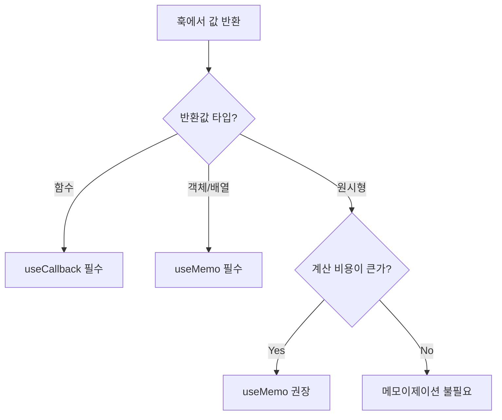
```mermaid
flowchart TD
    A["훅에서 값 반환"] --> B{"반환값 타입?"}
    B -->|"함수"| C["useCallback 필수"]
    B -->|"객체/배열"| D["useMemo 필수"]
    B -->|"원시형"| E{"계산 비용이 큰가?"}
    E -->|"Yes"| F["useMemo 권장"]
    E -->|"No"| G["메모이제이션 불필요"]
```

---

# Common Mistake Patterns

## Mistake 1: Using Object/Array Literals in deps Array

```jsx
// Bad: New array created on every render
useEffect(() => {
  fetchUsers(userIds);
}, [[1, 2, 3]]); // Always a new array!

// Good: Use useMemo or define as constant outside
const userIds = useMemo(() => [1, 2, 3], []);
useEffect(() => {
  fetchUsers(userIds);
}, [userIds]);
```

## Mistake 2: Referencing Latest State Inside useCallback

```jsx
// Bad: References stale value even when count changes
const handleClick = useCallback(() => {
  setCount(count + 1); // count is fixed in closure
}, []); // deps is empty

// Good: Use functional update
const handleClick = useCallback(() => {
  setCount((prev) => prev + 1); // Always uses latest value
}, []);
```

## Mistake 3: Unnecessary Memoization

```jsx
// Bad: Memoization unnecessary for primitives
const doubled = useMemo(() => count * 2, [count]);

// Good: Just calculate
const doubled = count * 2;

// Good: Memoize only complex calculations
const sortedItems = useMemo(
  () => items.sort((a, b) => a.price - b.price),
  [items]
);
```

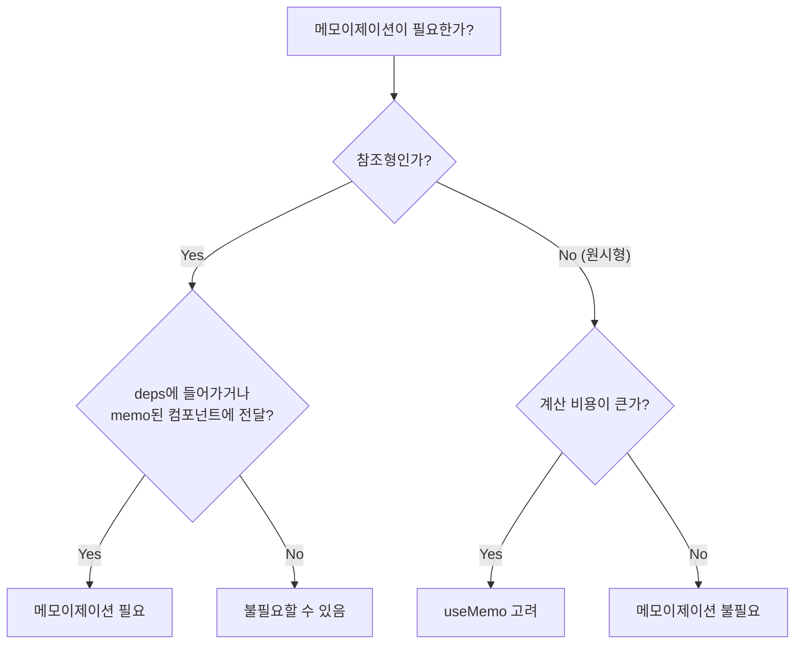
```mermaid
flowchart TD
    A["메모이제이션이 필요한가?"] --> B{"참조형인가?"}
    B -->|"Yes"| C{"deps에 들어가거나<br/>memo된 컴포넌트에 전달?"}
    C -->|"Yes"| D["메모이제이션 필요"]
    C -->|"No"| E["불필요할 수 있음"]
    B -->|"No (원시형)"| F{"계산 비용이 큰가?"}
    F -->|"Yes"| G["useMemo 고려"]
    F -->|"No"| H["메모이제이션 불필요"]
```

---

# Conclusion

useCallback and useMemo are not simple performance optimization tools.

1. They are necessary due to **reference type characteristics**. Even with identical content, new memory addresses are assigned on every render.
2. Using reference types directly in **useEffect dependency arrays** causes unintended effect re-execution or infinite loops.
3. Passing reference type props to **components wrapped with React.memo** nullifies the memoization effect.
4. **ESLint cannot warn beyond custom hook boundaries.** You must directly ensure reference stability of return values when designing hooks.
5. **Always memoize reference type return values in custom hooks.** For primitives, decide based on calculation cost.
