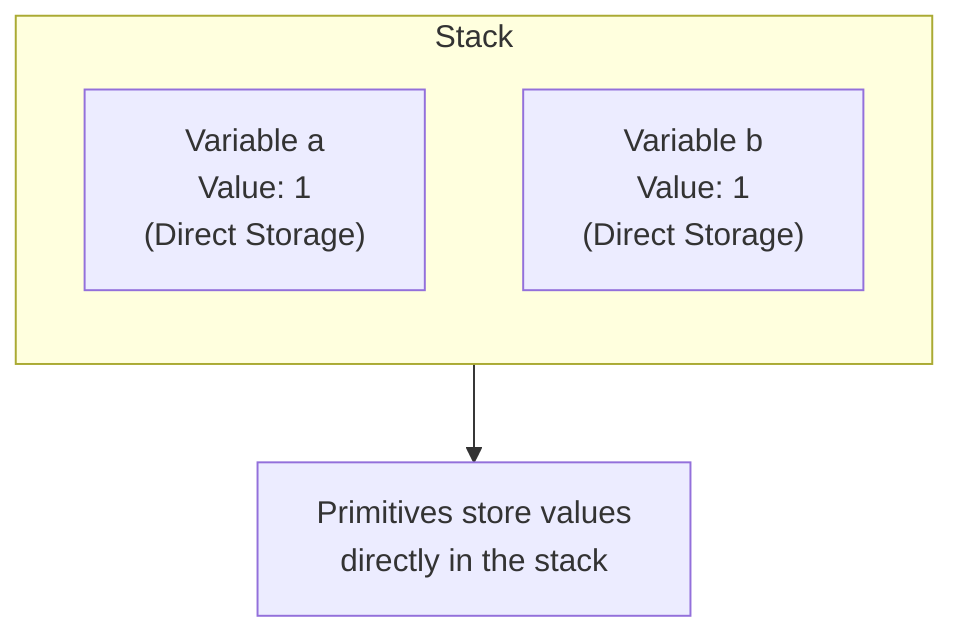
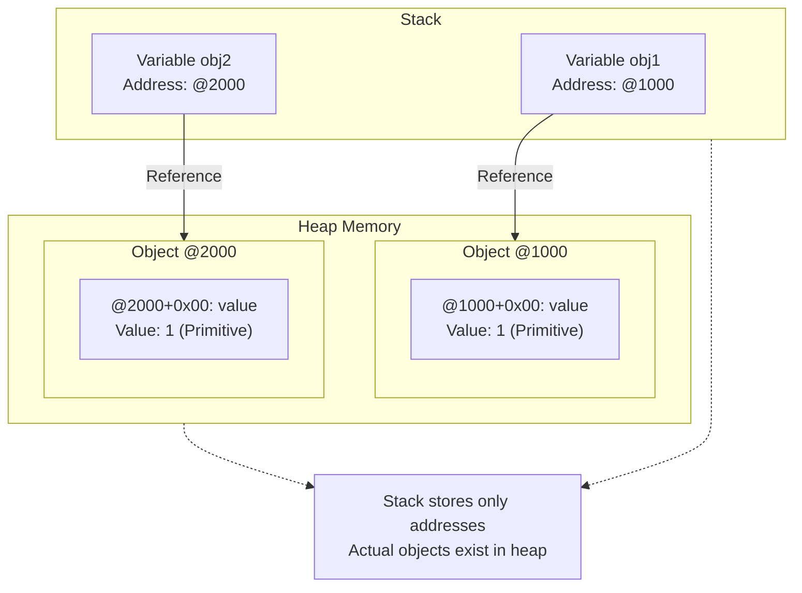
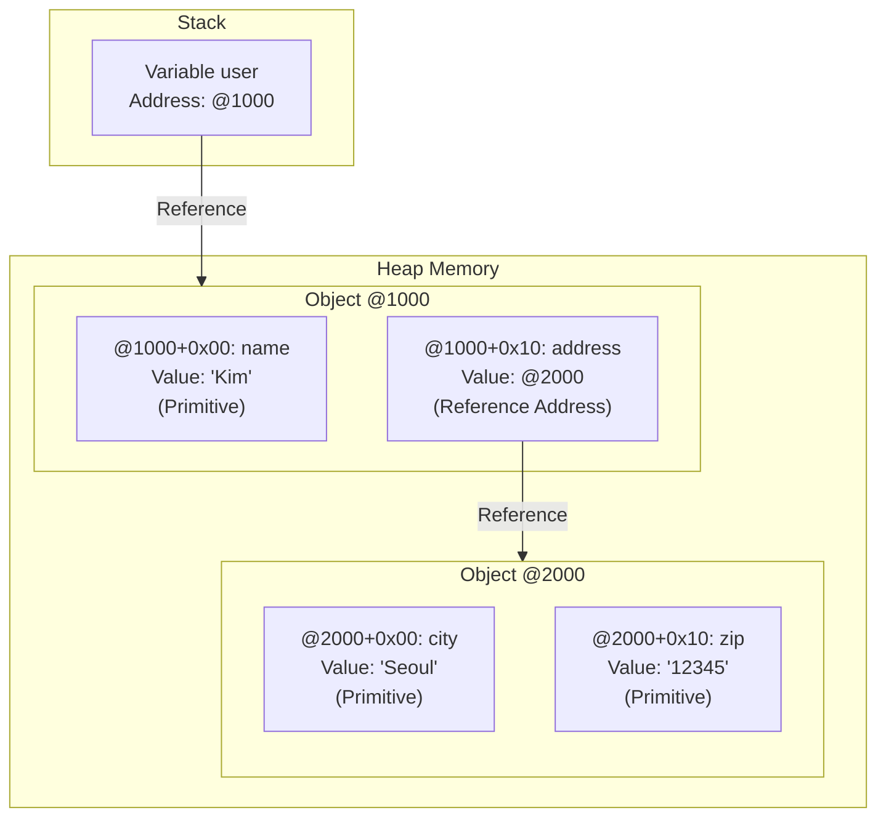
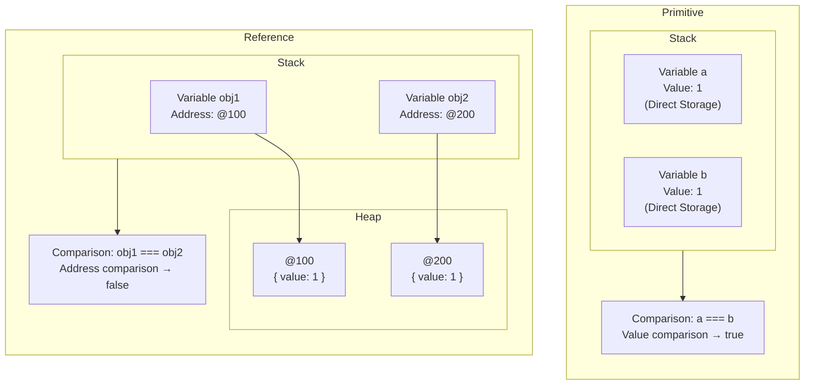
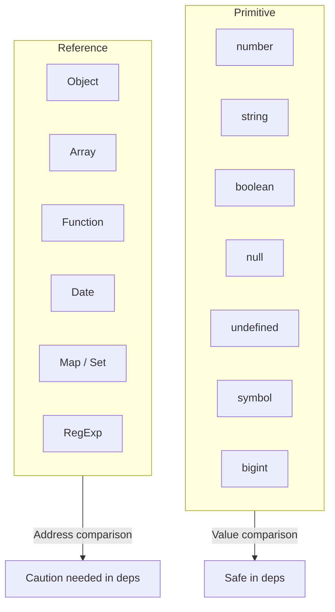
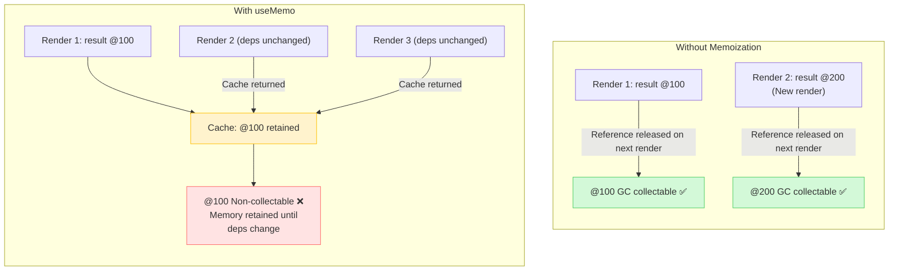
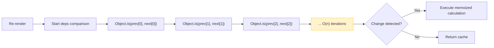
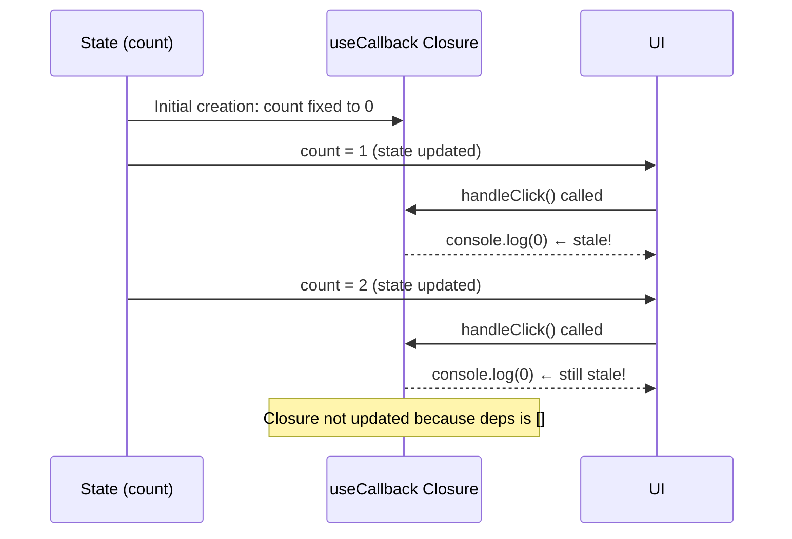

# Why useCallback and useMemo Matter in React

Using useCallback and useMemo in React isn't just about simple performance optimization. When you understand JavaScript's reference type characteristics and how React's dependency array works, you'll see why these hooks are essential in certain situations.

After reading this document, you'll understand:
- The memory behavior differences between primitive and reference types
- Why reference types are dangerous in useEffect dependency arrays
- The relationship between React.memo and props reference stability
- ESLint limitations for detecting issues inside custom hooks
- Design principles for memoizing reference type data
- Common memoization mistakes
- The cost of indiscriminate memoization
- Principles and structural optimization for memoization

---

# Memory Structure of Primitives and References

JavaScript data types are divided into primitives and references.

## Primitive Data

Primitive values are stored directly at a memory address. Variables point to that memory address, and the value is stored at that address.

```javascript
let a = 1;
let b = 1;

console.log(a === b); // true
```

**Memory Structure:**


```mermaid
flowchart TB
    subgraph Stack["Stack"]
        direction TB
        A["Variable a<br/>Value: 1<br/>(Direct Storage)"]
        B["Variable b<br/>Value: 1<br/>(Direct Storage)"]
    end

    Note1["Primitives store values<br/>directly in the stack"]

    Stack --> Note1
```

`a` stores the value `1` directly in the stack. `b` also stores the value `1` directly in the stack. The comparison operator (`===`) compares the actual values stored in the variables, so it returns `true`.

**Key Point:**
- Primitive data values are stored directly in the stack
- Variables themselves hold the values, so comparison compares the values themselves

## Reference Data

Reference types have a memory address for the object, and at that address are the primitive data inside the object, each with their own memory location.

```javascript
const obj1 = { value: 1 };
const obj2 = { value: 1 };

console.log(obj1 === obj2); // false
```

**Memory Structure:**


```mermaid
flowchart TB
    subgraph Stack["Stack"]
        direction TB
        V1["Variable obj1<br/>Address: @1000"]
        V2["Variable obj2<br/>Address: @2000"]
    end

    subgraph Heap["Heap Memory"]
        direction TB
        subgraph O1["Object @1000"]
            direction TB
            P1["@1000+0x00: value<br/>Value: 1 (Primitive)"]
        end

        subgraph O2["Object @2000"]
            direction TB
            P2["@2000+0x00: value<br/>Value: 1 (Primitive)"]
        end
    end

    V1 -->|"Reference"| O1
    V2 -->|"Reference"| O2

    Note1["Stack stores only addresses<br/>Actual objects exist in heap"]

    Stack -.-> Note1
    Heap -.-> Note1
```

`obj1` points to object address @1000, where the `value` property is stored at memory location @1000+0x00. `obj2` points to object address @2000, where `value` is stored at @2000+0x00. The comparison operator (`===`) compares object addresses, so it returns `false`.

**Key Point:**
- Reference data has a memory address for the object
- At that address are the primitive data inside the object, each with their own memory location

### Nested Object Example

Let's look at the memory structure of nested objects. Nested objects occur when a reference type contains another reference type. With nested objects, the address of the reference type is stored in the stack, and the nested reference type addresses are stored as-is in the heap.

```javascript
const user = {
  name: 'Kim',
  address: { city: 'Seoul', zip: '12345' }
};
```


```mermaid
flowchart TB
    subgraph Variables["Stack"]
        V1["Variable user<br/>Address: @1000"]
    end

    subgraph Heap["Heap Memory"]
        direction TB
        subgraph O1["Object @1000"]
            direction TB
            P1["@1000+0x00: name<br/>Value: 'Kim'<br/>(Primitive)"]
            P2["@1000+0x10: address<br/>Value: @2000<br/>(Reference Address)"]
        end

        subgraph O2["Object @2000"]
            direction TB
            P3["@2000+0x00: city<br/>Value: 'Seoul'<br/>(Primitive)"]
            P4["@2000+0x10: zip<br/>Value: '12345'<br/>(Primitive)"]
        end
    end

    V1 -->|"Reference"| O1
    P2 -->|"Reference"| O2
```

## Primitive vs Reference Comparison

Now let's compare the memory behavior differences between primitives and references at a glance.

```javascript
// Primitive example
let a = 1;
let b = 1;
console.log(a === b); // true

// Reference example
const obj1 = { value: 1 };
const obj2 = { value: 1 };
console.log(obj1 === obj2); // false
```


```mermaid
flowchart TB
    subgraph Primitive["Primitive"]
        direction TB
        subgraph Stack1["Stack"]
            A["Variable a<br/>Value: 1<br/>(Direct Storage)"]
            B["Variable b<br/>Value: 1<br/>(Direct Storage)"]
        end
        Compare1["Comparison: a === b<br/>Value comparison → true"]
    end

    subgraph Reference["Reference"]
        direction TB
        subgraph Stack2["Stack"]
            C["Variable obj1<br/>Address: @100"]
            D["Variable obj2<br/>Address: @200"]
        end
        subgraph Heap2["Heap"]
            O1["@100<br/>{ value: 1 }"]
            O2["@200<br/>{ value: 1 }"]
        end
        Compare2["Comparison: obj1 === obj2<br/>Address comparison → false"]
    end

    Stack1 --> Compare1

    Stack2 --> Compare2
    C --> O1
    D --> O2
```

**Key Difference Summary:**

| Aspect | Primitive | Reference |
|--------|-----------|-----------|
| **Storage Location** | Values stored directly in stack | Objects stored in heap, only addresses in stack |
| **Assignment Method** | Value copy (Pass by Value) | Address copy (Pass by Reference) |
| **Comparison Operation** | Compares values themselves | Compares addresses |

**Actual Behavior Example:**

```javascript
// Primitive: value copy
let x = 10;
let y = x;  // y is a copy of 10
y = 20;     // only y changes
console.log(x); // 10 (x is unaffected)

// Reference: address copy
let objA = { count: 10 };
let objB = objA;  // objB copies objA's address
objB.count = 20;  // modifies the same object
console.log(objA.count); // 20 (objA is affected too)
```

## Functions are Reference Types

Functions are first-class objects in JavaScript and are reference types.

```javascript
const fn1 = () => console.log('hello');
const fn2 = () => console.log('hello');

console.log(fn1 === fn2); // false
```

Even functions with identical code are assigned a new memory address each time they're declared. Besides functions, there are various other reference types.

**JavaScript Type Classification**

```mermaid
flowchart TB
    subgraph Primitive["Primitive"]
        P1[number]
        P2[string]
        P3[boolean]
        P4[null]
        P5[undefined]
        P6[symbol]
        P7[bigint]
    end

    subgraph Reference["Reference"]
        R1[Object]
        R2[Array]
        R3[Function]
        R4[Date]
        R5[Map / Set]
        R6[RegExp]
    end

    Primitive -->|"Value comparison"| SAFE["Safe in deps"]
    Reference -->|"Address comparison"| DANGER["Caution needed in deps"]
```

---

# ESLint Warning Limitations and Custom Hook Pitfalls

## The Role of eslint-plugin-react-hooks

`eslint-plugin-react-hooks` warns when a non-memoized function is placed in a dependency array.

```jsx
function Example() {
  const [count, setCount] = useState(0);

  // Non-memoized function
  const handleClick = () => {
    console.log(count);
  };

  useEffect(() => {
    handleClick();
  }, [handleClick]); // ESLint warning: The 'handleClick' function makes the dependencies of useEffect Hook change on every render

  return <button onClick={handleClick}>{count}</button>;
}
```

This warning tells us "the function is recreated on every render, which can cause the effect to run unnecessarily." ESLint suggests wrapping it with `useCallback` or moving the function inside the effect.

## Functions Returned from Custom Hooks Don't Trigger Warnings

The problem is that when a non-memoized function returned from a custom hook is added to dependencies, ESLint doesn't warn about it.

```jsx
// useAutoSave.ts - returning function without memoization
function useAutoSave() {
  const [lastSaved, setLastSaved] = useState<Date | null>(null);

  // Returning non-memoized function
  const save = (content: string) => {
    api.save(content);
    setLastSaved(new Date());
  };

  return { save, lastSaved };
}

// Component.tsx
function Editor() {
  const [content, setContent] = useState('');
  const { save } = useAutoSave(); // A new save function on every render

  useEffect(() => {
    const timer = setInterval(() => save(content), 5000);
    return () => clearInterval(timer);
  }, [save, content]); // No ESLint warning!

  return <textarea value={content} onChange={(e) => setContent(e.target.value)} />;
}
```

ESLint warns when a function declared inside a component is added to dependencies, but it assumes functions returned from hooks are "already stable references." However, in reality, if the hook doesn't memoize the function internally, a new function is created on every render.

## Result: Hard-to-track Issues

```jsx
function Editor() {
  const [content, setContent] = useState('');
  const [cursor, setCursor] = useState(0);
  const { save } = useAutoSave(); // Non-memoized function

  useEffect(() => {
    const timer = setInterval(() => save(content), 5000);
    return () => clearInterval(timer);
  }, [save, content]); // No ESLint warning, but issues occur

  // Every time cursor changes, useAutoSave returns a new save function
  return (
    <textarea
      value={content}
      onChange={(e) => setContent(e.target.value)}
      onSelect={(e) => setCursor(e.target.selectionStart)}
    />
  );
}
```

Every time the cursor position changes:
1. Component re-renders
2. `useAutoSave` returns a new `save` function (different memory address)
3. useEffect detects `save` change → effect re-runs
4. Old timer is cleaned up, new timer is created

ESLint doesn't warn about this issue because it assumes functions returned from hooks are stable references. This is why memoizing return values is crucial when designing custom hooks.

---

# Why Can't We Just Memoize Everything?

Could we prevent these issues by applying useCallback and useMemo everywhere? Theoretically, it might be safe. But indiscriminate memoization creates other problems.

## 1. Memory Overhead & Garbage Collection Burden

Garbage Collection automatically removes data that's no longer used in the browser. While memoization persists, Garbage Collection can't collect that data.

```jsx
const filtered = useMemo(
  () => items.filter((item) => item.category === filter),
  [items, filter]
);
```


```mermaid
flowchart TB
    subgraph Without["Without Memoization"]
        direction TB
        A1["Render 1: result @100"]
        A2["Render 2: result @200
        (New render)"]
        A1 -->|"Reference released on next render"| GC1["@100 GC collectable ✅"]
        A2 -->|"Reference released on next render"| GC2["@200 GC collectable ✅"]
    end

    subgraph With["With useMemo"]
        direction TB
        C1["Render 1: result @100"]
        C2["Render 2 (deps unchanged)"]
        C3["Render 3 (deps unchanged)"]
        CACHE["Cache: @100 retained"]
        C1 --> CACHE
        C2 -->|"Cache returned"| CACHE
        C3 -->|"Cache returned"| CACHE
        CACHE --> BLOCK["@100 Non-collectable ❌
        Memory retained until
        deps change"]
    end

    style BLOCK fill:#ffe3e3,stroke:#ff6b6b
    style GC1 fill:#d3f9d8,stroke:#51cf66
    style GC2 fill:#d3f9d8,stroke:#51cf66
    style CACHE fill:#fff3cd,stroke:#ffc107
```

useMemo keeps only one cached value at a time. As long as dependencies don't change, the currently cached result (@100) remains in memory and GC can't collect it. It will continue occupying memory for as long as the component is mounted.

## 2. Dependency Array Comparison

On every re-render, the values in the dependency array are compared with their previous values. This comparison has O(n) time complexity based on the array length. We've done the memoization work for performance, but it actually makes things worse.

```jsx
// As the dependency array grows, comparison cost increases
const result = useMemo(
  () => a + b + c + d + e, // Actually a simple calculation
  [a, b, c, d, e] // 5 Object.is comparisons on every render
);

// For simple calculations, just computing is faster
const result = a + b + c + d + e;
```


```mermaid
flowchart LR
    A["Re-render"] --> B["Start deps comparison"]
    B --> C["Object.is(prev[0], next[0])"]
    C --> D["Object.is(prev[1], next[1])"]
    D --> E["Object.is(prev[2], next[2])"]
    E --> F["... O(n) iterations"]
    F --> G{"Change detected?"}
    G -->|Yes| H["Execute memoized calculation"]
    G -->|No| I["Return cache"]

    style F fill:#fff3cd,stroke:#ffc107
```

For simple calculations, the comparison cost itself can exceed the actual computation cost.

## 3. Meaningless Optimization of Primitive Types

Primitive types don't need memoization. In fact, memoizing them hurts readability.

```jsx
// Bad: Unnecessary memoization on primitives
const doubled = useMemo(() => count * 2, [count]);
const isEven = useMemo(() => count % 2 === 0, [count]);
const label = useMemo(() => `Count: ${count}`, [count]);

// Good: Just compute
const doubled = count * 2;
const isEven = count % 2 === 0;
const label = `Count: ${count}`;
```

Primitives are compared by value, so the same value on each render returns `true` in an `Object.is` comparison. However, without useMemo, calculations like `count * 2` still execute on every render. What React prevents isn't the computation itself, but unnecessary re-renders of child components receiving these values as props.

## 4. Invites Mistakes

When all data is memoized, future developers can't tell which calculations are expensive. Also, if a dependency is omitted from the dependency array, it creates a stale closure bug.

```jsx
const [count, setCount] = useState(0);

// Omitting count from deps causes a stale closure
const handleClick = useCallback(() => {
  console.log(count); // Always logs 0 (stuck at initial value)
}, []); // ⚠️ count is missing

// No matter how much count changes, handleClick references a closure with count=0
```

> [!NOTE] Stale Closure
>
> A situation where memoization preserves and maintains old data, preventing it from being updated to the latest values.


```mermaid
sequenceDiagram
    participant S as State (count)
    participant C as useCallback Closure
    participant U as UI

    S->>C: Initial creation: count fixed to 0
    S->>U: count = 1 (state updated)
    U->>C: handleClick() called
    C-->>U: console.log(0) ← stale!
    S->>U: count = 2 (state updated)
    U->>C: handleClick() called
    C-->>U: console.log(0) ← still stale!
    Note over C: Closure not updated because deps is []
```

---
