# Why Use useCallback and useMemo

The reason for using useCallback and useMemo in React is not simply "performance optimization." Understanding JavaScript's reference type characteristics and React's dependency array behavior reveals why these hooks are essential in certain situations.

After reading this document, you will understand:
- Memory behavior differences between primitive and reference types
- Why reference types are dangerous in useEffect dependency arrays
- The relationship between React.memo and props reference stability
- ESLint's limitations in detecting pitfalls inside custom hooks
- Memoization design principles for reference type data
- Common memoization mistakes
- The cost of indiscriminate memoization
- When to apply memoization and structural optimizations

---

# Memory Structure of Primitive and Reference Types

JavaScript data types are divided into Primitive and Reference types.

## Primitive Data

Primitive data stores values directly in memory. Variables point to memory addresses where values are stored.

```javascript
let a = 1;
let b = 1;

console.log(a === b); // true
```

**Memory Structure:**

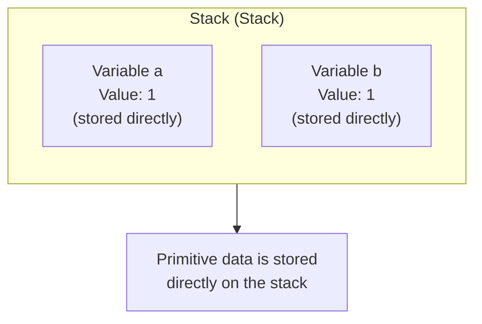
```mermaid
flowchart TB
    subgraph Stack["Stack (Stack)"]
        direction TB
        A["Variable a<br/>Value: 1<br/>(stored directly)"]
        B["Variable b<br/>Value: 1<br/>(stored directly)"]
    end

    Note1["Primitive data is stored<br/>directly on the stack"]

    Stack --> Note1
```

`a` stores the value `1` directly on the stack. `b` also stores the value `1` directly on the stack. The comparison operator (`===`) compares the values themselves, so it returns `true`.

**Key Point:**
- Primitive data values are stored directly on the stack
- Variables themselves hold the values, so comparison compares the values themselves

## Reference Data

Reference data has a memory address for the object. When you go to that address, the primitive data inside the object each has its own memory location.

```javascript
const obj1 = { value: 1 };
const obj2 = { value: 1 };

console.log(obj1 === obj2); // false
```

**Memory Structure:**

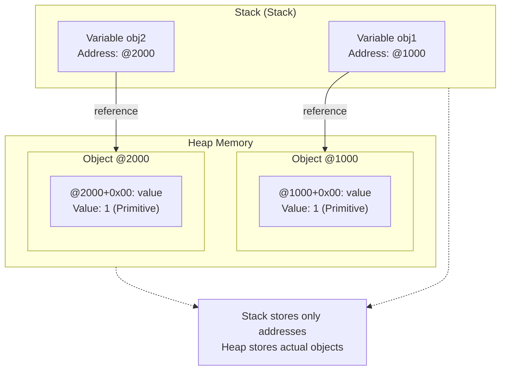
```mermaid
flowchart TB
    subgraph Stack["Stack (Stack)"]
        direction TB
        V1["Variable obj1<br/>Address: @1000"]
        V2["Variable obj2<br/>Address: @2000"]
    end

    subgraph Heap["Heap Memory"]
        direction TB
        subgraph O1["Object @1000"]
            direction TB
            P1["@1000+0x00: value<br/>Value: 1 (Primitive)"]
        end

        subgraph O2["Object @2000"]
            direction TB
            P2["@2000+0x00: value<br/>Value: 1 (Primitive)"]
        end
    end

    V1 -->|"reference"| O1
    V2 -->|"reference"| O2

    Note1["Stack stores only addresses<br/>Heap stores actual objects"]

    Stack -.-> Note1
    Heap -.-> Note1
```

`obj1` points to object address @1000, and at that address, the `value` property is stored at memory location @1000+0x00. `obj2` points to object address @2000, and the `value` is stored at @2000+0x00. The comparison operator (`===`) compares object addresses, so it returns `false`.

**Key Point:**
- Reference data has a memory address for the object
- At that address, primitive data inside the object each has its own memory location

### Nested Object Example

Let's look at the memory structure of nested objects. Nested objects are cases where reference type data exists inside reference type data. For nested objects, the address of the outer reference type data is stored in the stack, and the address of the nested reference type data is stored directly in the heap.

```javascript
const user = {
  name: 'Kim',
  address: { city: 'Seoul', zip: '12345' }
};
```

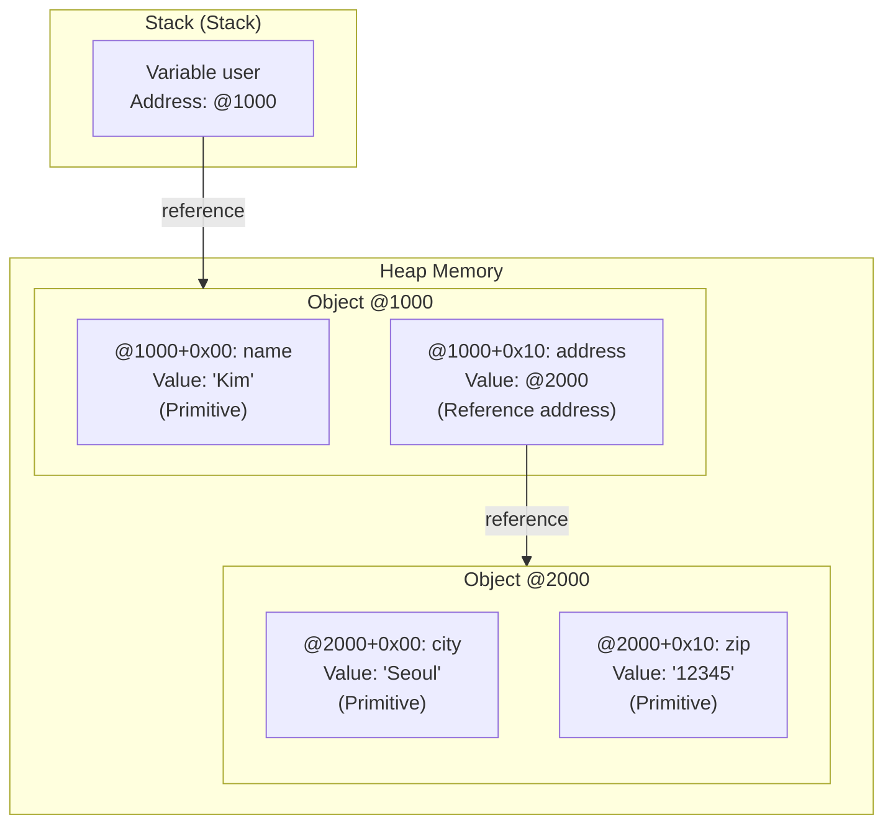
```mermaid
flowchart TB
    subgraph Variables["Stack (Stack)"]
        V1["Variable user<br/>Address: @1000"]
    end

    subgraph Heap["Heap Memory"]
        direction TB
        subgraph O1["Object @1000"]
            direction TB
            P1["@1000+0x00: name<br/>Value: 'Kim'<br/>(Primitive)"]
            P2["@1000+0x10: address<br/>Value: @2000<br/>(Reference address)"]
        end

        subgraph O2["Object @2000"]
            direction TB
            P3["@2000+0x00: city<br/>Value: 'Seoul'<br/>(Primitive)"]
            P4["@2000+0x10: zip<br/>Value: '12345'<br/>(Primitive)"]
        end
    end

    V1 -->|"reference"| O1
    P2 -->|"reference"| O2
```

## Primitive vs Reference Comparison

Let's compare the memory behavior differences between primitive and reference types at a glance.

```javascript
// Primitive example
let a = 1;
let b = 1;
console.log(a === b); // true

// Reference example
const obj1 = { value: 1 };
const obj2 = { value: 1 };
console.log(obj1 === obj2); // false
```

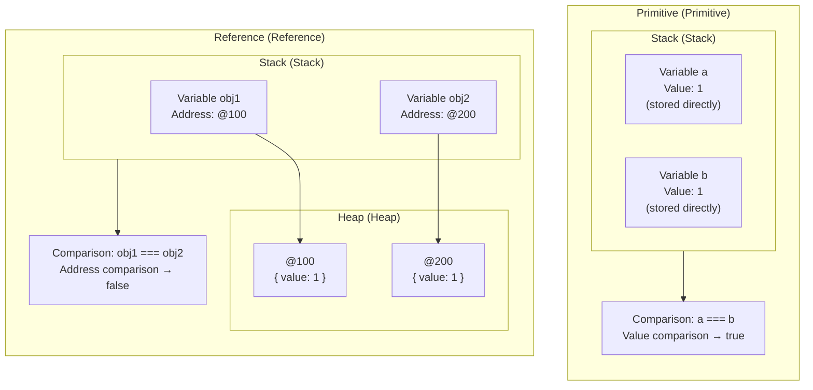
```mermaid
flowchart TB
    subgraph Primitive["Primitive (Primitive)"]
        direction TB
        subgraph Stack1["Stack (Stack)"]
            A["Variable a<br/>Value: 1<br/>(stored directly)"]
            B["Variable b<br/>Value: 1<br/>(stored directly)"]
        end
        Compare1["Comparison: a === b<br/>Value comparison → true"]
    end

    subgraph Reference["Reference (Reference)"]
        direction TB
        subgraph Stack2["Stack (Stack)"]
            C["Variable obj1<br/>Address: @100"]
            D["Variable obj2<br/>Address: @200"]
        end
        subgraph Heap2["Heap (Heap)"]
            O1["@100<br/>{ value: 1 }"]
            O2["@200<br/>{ value: 1 }"]
        end
        Compare2["Comparison: obj1 === obj2<br/>Address comparison → false"]
    end

    Stack1 --> Compare1

    Stack2 --> Compare2
    C --> O1
    D --> O2
```

**Summary of Key Differences:**

| Category | Primitive | Reference |
|------|--------|--------|
| **Storage Location** | Stack stores values directly | Heap stores objects, stack stores only addresses |
| **Assignment Method** | Value copy (Pass by Value) | Address copy (Pass by Reference) |
| **Comparison** | Values themselves are compared | Addresses are compared |

**Practical Execution Example:**

```javascript
// Primitive: Value copy
let x = 10;
let y = x;  // y is a copy of 10
y = 20;     // Only y changes
console.log(x); // 10 (x is unaffected)

// Reference: Address copy
let objA = { count: 10 };
let objB = objA;  // objB copies objA's address
objB.count = 20;  // Modifies the same object
console.log(objA.count); // 20 (objA is also affected)
```

## Functions Are Also Reference Types

Functions are first-class objects in JavaScript and are reference type data.

```javascript
const fn1 = () => console.log('hello');
const fn2 = () => console.log('hello');

console.log(fn1 === fn2); // false
```

Even if functions have identical code, each declaration assigns a new memory address.

**JavaScript Type Classification**
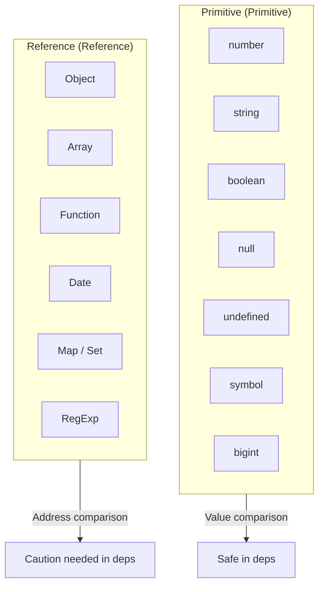
```mermaid
flowchart TB
    subgraph Primitive["Primitive (Primitive)"]
        P1[number]
        P2[string]
        P3[boolean]
        P4[null]
        P5[undefined]
        P6[symbol]
        P7[bigint]
    end

    subgraph Reference["Reference (Reference)"]
        R1[Object]
        R2[Array]
        R3[Function]
        R4[Date]
        R5[Map / Set]
        R6[RegExp]
    end

    Primitive -->|"Value comparison"| SAFE["Safe in deps"]
    Reference -->|"Address comparison"| DANGER["Caution needed in deps"]
```

---

# useEffect Dependency Array and Reference Type Pitfalls

React's useEffect executes the callback when values in the dependency array change. The problem is that this comparison is performed using `Object.is`.

## Primitives Are Safe

```jsx
function Counter() {
  const [count, setCount] = useState(0);

  useEffect(() => {
    console.log('count changed:', count);
  }, [count]);

  return <button onClick={() => setCount(count + 1)}>Increment</button>;
}
```

Since `count` is a primitive (number), the effect only runs when the value actually changes.

## Reference Types Are Dangerous

```jsx
function UserProfile() {
  const [user, setUser] = useState({ name: 'Kim' });

  // New object created on every render
  const config = { theme: 'dark' };

  useEffect(() => {
    console.log('config changed');
  }, [config]); // Runs on every render

  return <div>{user.name}</div>;
}
```

`config` is created as an object with a new memory address on every render. Even if the content is identical, React considers it "changed."

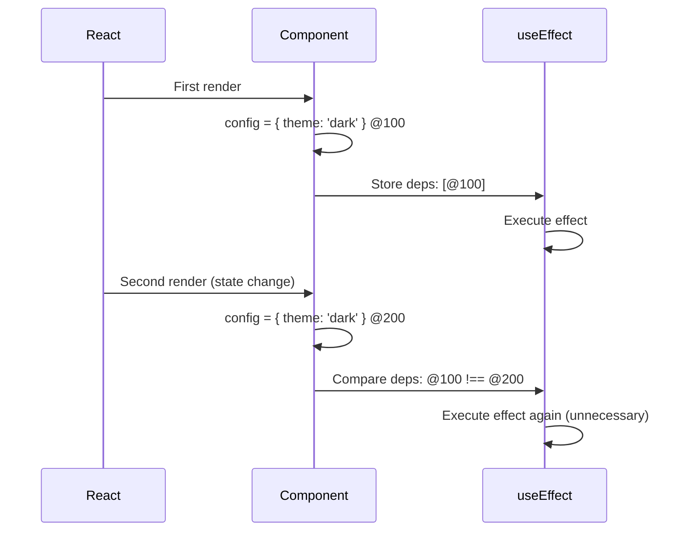
```mermaid
sequenceDiagram
    participant R as React
    participant C as Component
    participant E as useEffect

    R->>C: First render
    C->>C: config = { theme: 'dark' } @100
    C->>E: Store deps: [@100]
    E->>E: Execute effect

    R->>C: Second render (state change)
    C->>C: config = { theme: 'dark' } @200
    C->>E: Compare deps: @100 !== @200
    E->>E: Execute effect again (unnecessary)
```

## Infinite Re-rendering Case

This is a common pattern in real projects. When you put a function in the dependency array and change state inside the effect, an infinite loop occurs.

```jsx
function SearchPage() {
  const [keyword, setKeyword] = useState('');
  const [searchCount, setSearchCount] = useState(0);

  // New function created on every render
  const inlineSaveDraft = () => {
    console.log('Executing search:', keyword);
  };

  useEffect(() => {
    if (keyword) {
      inlineSaveDraft();
      setSearchCount((prev) => prev + 1); // Track search count → triggers re-render
    }
  }, [inlineSaveDraft, keyword]); // Infinite loop!

  return (
    <>
      <input value={keyword} onChange={(e) => setKeyword(e.target.value)} placeholder="Enter search term" />
      <div>Search count: {searchCount}</div>
    </>
  );
}
```

Execution flow:
1. User types in input → `keyword` state changes
2. Component re-renders → `inlineSaveDraft` function recreated (@200, new address)
3. useEffect deps comparison: `inlineSaveDraft @100 !== @200` → effect executes
4. Effect executes → `inlineSaveDraft()` called → `setSearchCount` executes
5. `searchCount` changes → re-render → `inlineSaveDraft` function recreated again (@300)
6. useEffect deps comparison: `inlineSaveDraft @200 !== @300` → effect executes again
7. Steps 4-6 repeat (infinite loop)

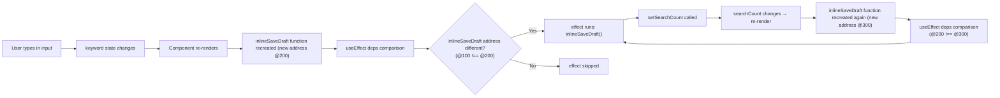
```mermaid
flowchart LR
    A["User types in input"] --> B["keyword state changes"]
    B --> C["Component re-renders"]
    C --> D["inlineSaveDraft function recreated (new address @200)"]
    D --> E["useEffect deps comparison"]
    E --> F{"inlineSaveDraft address different?<br/>(@100 !== @200)"}
    F -->|Yes| G["effect runs: inlineSaveDraft()"]
    G --> H["setSearchCount called"]
    H --> I["searchCount changes → re-render"]
    I --> J["inlineSaveDraft function recreated again (new address @300)"]
    J --> K["useEffect deps comparison<br/>(@200 !== @300)"]
    K --> G
    F -->|No| L["effect skipped"]
```

### Memory Address Changes Confirmed in Chrome DevTools

You can verify that functions have new memory addresses on every render in Chrome DevTools' Memory tab.

The screenshot below shows a comparison of Heap Snapshots. You can see that the `inlineSaveDraft` function has different memory addresses in each snapshot.

**Function address in Snapshot 1:**


**Newly created functions in Snapshot 2:**


**Functions with another address in Snapshot 3:**


In each snapshot, the `inlineSaveDraft` function has different memory addresses like `@200175`, `@473745`, `@483163`. This is why React considers the function "changed" on every render.

## Solving with useCallback

Using useCallback allows you to maintain a stable function reference.

```jsx
function SearchPage() {
  const [keyword, setKeyword] = useState('');
  const [searchCount, setSearchCount] = useState(0);

  // Stabilize function reference with useCallback
  // Function only recreated when keyword changes (unrelated to searchCount changes)
  const saveDraft = useCallback(() => {
    console.log('Executing search:', keyword);
  }, [keyword]); // Function recreated only when keyword changes

  useEffect(() => {
    if (keyword) {
      saveDraft();
      // Even if searchCount changes, saveDraft address remains the same so effect doesn't re-run
      setSearchCount((prev) => prev + 1);
    }
  }, [saveDraft, keyword]); // Effect runs only when keyword changes

  return (
    <>
      <input value={keyword} onChange={(e) => setKeyword(e.target.value)} placeholder="Enter search term" />
      <div>Search count: {searchCount}</div>
    </>
  );
}
```

#### ❌ Problem: Without useCallback

**Problematic code:**

```jsx
function SearchPage() {
  const [keyword, setKeyword] = useState('');
  const [searchCount, setSearchCount] = useState(0);

  // New function created on every render (no memoization)
  const inlineSaveDraft = () => {
    console.log('Executing search:', keyword);
  };

  useEffect(() => {
    if (keyword) {
      inlineSaveDraft();
      setSearchCount((prev) => prev + 1); // Track search count
    }
  }, [inlineSaveDraft, keyword]); // Infinite loop occurs!
}
```

**Execution flow:**

```jsx
// Step 1: User types "a" in input
<input value={keyword} onChange={(e) => setKeyword(e.target.value)} />
// → setKeyword('a') called
// → keyword: '' → 'a'

// Step 2: Component re-renders
function SearchPage() {
  // Step 3: New function created on every render
  const inlineSaveDraft = () => {
    console.log('Executing search:', keyword);
  }; // @100 (new memory address)

  // Step 4: useEffect deps comparison
  useEffect(() => {
    if (keyword) {
      inlineSaveDraft(); // Execute
      setSearchCount((prev) => prev + 1); // searchCount: 0 → 1
    }
  }, [inlineSaveDraft, keyword]);
  // Previous deps: [undefined, ''] (first render)
  // Current deps: [@100, 'a']
  // @100 !== undefined + 'a' !== '' → effect runs ✅
}

// Step 5: searchCount changes, re-render occurs
// searchCount: 0 → 1

// Step 6: Re-render, inlineSaveDraft function created again
function SearchPage() {
  const inlineSaveDraft = () => {
    console.log('Executing search:', keyword);
  }; // @200 (new memory address, @100 and different!)

  // Step 7: useEffect deps comparison
  useEffect(() => {
    if (keyword) {
      inlineSaveDraft(); // Execute again
      setSearchCount((prev) => prev + 1); // searchCount: 1 → 2
    }
  }, [inlineSaveDraft, keyword]);
  // Previous deps: [@100, 'a']
  // Current deps: [@200, 'a']
  // @100 !== @200 → effect runs again! ⚠️
}

// Step 8: Re-render occurs due to searchCount change
// searchCount: 1 → 2

// Step 9: Re-render, inlineSaveDraft function created again
// @300 created → effect runs again → searchCount: 2 → 3
// @400 created → effect runs again → searchCount: 3 → 4
// ... infinite loop 🔄
```

**Core problem:**
- `keyword` hasn't changed (still `'a'`)
- Only `inlineSaveDraft` function keeps being recreated (only memory address changes: @100 → @200 → @300)
- React compares memory addresses in deps comparison (`@100 !== @200`)
- React considers it "changed" every time and runs the effect
- Effect runs → `setSearchCount` → re-render → function recreated → effect runs (infinite loop)


```mermaid
flowchart LR
    A1["User types in input"] --> B1["keyword changes"]
    B1 --> C1["Re-render"]
    C1 --> D1["inlineSaveDraft @100 created"]
    D1 --> E1["effect runs (address change detected)"]
    E1 --> F1["setSearchCount → searchCount=1"]
    F1 --> G1["Re-render (searchCount changed)"]
    G1 --> H1["inlineSaveDraft @200 created (new address)"]
    H1 --> I1["effect runs again (address change detected)"]
    I1 --> J1["setSearchCount → searchCount=2"]
    J1 --> K1["Infinite loop!"]

    style K1 fill:#ff6b6b,stroke:#c92a2a,color:#fff
    style D1 fill:#ffe3e3,stroke:#ff6b6b
    style H1 fill:#ffe3e3,stroke:#ff6b6b
```

#### ✅ Solution: With useCallback

**Fixed code:**

```jsx
function SearchPage() {
  const [keyword, setKeyword] = useState('');
  const [searchCount, setSearchCount] = useState(0);

  // ✅ Stabilize function reference with useCallback
  // Function only recreated when keyword changes (unrelated to searchCount changes)
  const saveDraft = useCallback(() => {
    console.log('Executing search:', keyword);
  }, [keyword]); // Function recreated only when keyword changes

  useEffect(() => {
    if (keyword) {
      saveDraft();
      // Even if searchCount changes, saveDraft address remains the same so effect doesn't re-run
      setSearchCount((prev) => prev + 1);
    }
  }, [saveDraft, keyword]);
}
```

**Execution flow:**

```jsx
// Step 1: User types "a" in input
<input value={keyword} onChange={(e) => setKeyword(e.target.value)} />
// → setKeyword('a') called
// → keyword: '' → 'a'

// Step 2: Component re-renders
function SearchPage() {
  // Step 3: Stabilize function reference with useCallback
  const saveDraft = useCallback(() => {
    console.log('Executing search:', keyword);
  }, [keyword]); // keyword changed from '' → 'a', so new function created
  // @100 created (depends on keyword='a')

  // Step 4: useEffect deps comparison
  useEffect(() => {
    if (keyword) {
      saveDraft(); // Execute
      setSearchCount((prev) => prev + 1); // searchCount: 0 → 1
    }
  }, [saveDraft, keyword]);
  // Previous deps: [undefined, '']
  // Current deps: [@100, 'a']
  // @100 !== undefined → effect runs ✅
}

// Step 5: searchCount change causes re-render
// searchCount: 0 → 1

// Step 6: Re-render but keyword is same, so saveDraft address maintained
function SearchPage() {
  const saveDraft = useCallback(() => {
    console.log('Executing search:', keyword);
  }, [keyword]); // keyword='a' (no change)
  // @100 maintained! (keyword is same, so useCallback returns same reference)

  // Step 7: useEffect deps comparison
  useEffect(() => {
    if (keyword) {
      saveDraft();
      setSearchCount((prev) => prev + 1);
    }
  }, [saveDraft, keyword]);
  // Previous deps: [@100, 'a']
  // Current deps: [@100, 'a']
  // @100 === @100 && 'a' === 'a' → effect skipped! ✅
}
```

**Core solution:**
- `useCallback` only recreates the function when `keyword` changes
- Even when `searchCount` changes, `keyword` remains the same, so `saveDraft` address is maintained (@100)
- React compares deps and sees `@100 === @100`, so it considers it "unchanged"
- Effect only runs when `keyword` actually changes
- Infinite loop solved! ✅

**Comparison summary:**

| Situation | inlineSaveDraft (no memoization) | saveDraft (useCallback) |
|-----------|--------------------------------|-------------------------|
| keyword changes | @100 → @200 (new function) | @100 → @200 (new function) |
| searchCount changes | @200 → @300 (new function) ⚠️ | @100 → @100 (same reference) ✅ |
| effect runs | Every time (infinite loop) | Only when keyword changes |


```mermaid
flowchart LR
    A2["User types in input"] --> B2["keyword changes"]
    B2 --> C2["Re-render"]
    C2 --> D2["saveDraft @100 created<br/>(keyword dependent)"]
    D2 --> E2["effect runs (address change detected)"]
    E2 --> F2["setSearchCount → searchCount=1"]
    F2 --> G2["Re-render (searchCount changed)"]
    G2 --> H2["saveDraft @100 maintained<br/>(keyword same)"]
    H2 --> I2["effect skipped (address same)"]
    I2 --> J2["Only when keyword changes"]
    J2 --> K2["saveDraft @200 created<br/>(new keyword dependent)"]
    K2 --> L2["effect runs"]

    style H2 fill:#d3f9d8,stroke:#51cf66,color:#000
    style I2 fill:#d3f9d8,stroke:#51cf66,color:#000
    style D2 fill:#e7f5ff,stroke:#339af0
    style K2 fill:#e7f5ff,stroke:#339af0
```

## React Query Makes It Even More Complex

In real projects, you often use React Query (TanStack Query) together. This makes debugging much harder.

```jsx
function SearchPage() {
  const [keyword, setKeyword] = useState('');

  // Using React Query
  const { data, refetch, isFetching } = useQuery({
    queryKey: ['search', keyword],
    queryFn: () => fetchSearchResults(keyword),
    enabled: !!keyword,
  });

  // New function created on every render
  const inlineSaveDraft = () => {
    console.log('Executing search:', keyword);
    refetch(); // Refetch data
  };

  useEffect(() => {
    if (keyword) {
      inlineSaveDraft();
    }
  }, [inlineSaveDraft, keyword]); // Problem occurs!

  return (
    <>
      <input value={keyword} onChange={(e) => setKeyword(e.target.value)} />
      {isFetching && <div>Loading...</div>}
      <ul>{data?.map((r, i) => <li key={i}>{r}</li>)}</ul>
    </>
  );
}
```

**Problem points:**
- When the user types in the input, `keyword` state changes
- When `keyword` changes and re-render occurs, `inlineSaveDraft` function is recreated (new address)
- If `inlineSaveDraft` is in useEffect deps, the address change is detected and the effect executes
- When effect calls `refetch()`, React Query state changes, causing a re-render
- Re-render recreates `inlineSaveDraft` with a new address, triggering the effect again
- This creates an infinite loop

**Execution flow:**

```jsx
// 1. User types 'a' → keyword state changes → re-render
const inlineSaveDraft = () => { ... }; // @200 (new memory address)
useEffect(..., [inlineSaveDraft, keyword]); // [@100, ''] → [@200, 'a']
// @100 !== @200 + 'a' !== '' → effect runs

// 2. Effect runs → inlineSaveDraft() called → refetch()
// refetch() changes React Query state(isFetching, data) → re-render

// 3. Re-render, inlineSaveDraft created again
const inlineSaveDraft = () => { ... }; // @300
useEffect(..., [inlineSaveDraft, keyword]); // [@200, 'a'] → [@300, 'a']
// keyword unchanged but @200 !== @300 → effect runs again

// 4. Effect runs → refetch() → re-render → inlineSaveDraft @400 → ... infinite loop 🔄
```

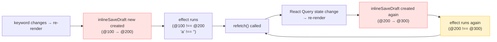
```mermaid
flowchart LR
    A["keyword changes → re-render"] --> B["inlineSaveDraft new created<br/>(@100 → @200)"]
    B --> C["effect runs<br/>(@100 !== @200<br/>'a' !== '')"]
    C --> D["refetch() called"]
    D --> E["React Query state change<br/>→ re-render"]
    E --> F["inlineSaveDraft created again<br/>(@200 → @300)"]
    F --> G["effect runs again<br/>(@200 !== @300)"]
    G --> D

    style B fill:#ffe3e3,stroke:#ff6b6b
    style F fill:#ffe3e3,stroke:#ff6b6b
    style G fill:#fff3cd,stroke:#ffc107
```

## Stabilizing Objects with useMemo

When objects or arrays need to be in deps, use useMemo.

```jsx
function UserDashboard() {
  const [user, setUser] = useState({ name: 'Kim' });

  // Stabilize object reference with useMemo
  const config = useMemo(() => ({ theme: 'dark', locale: 'ko' }), []);

  useEffect(() => {
    applyConfig(config);
  }, [config]); // Executes only once initially

  return <div>{user.name}</div>;
}
```

---

# React.memo and Memoization

Another important case where useCallback and useMemo are needed is when passing props to child components wrapped with `React.memo`.

## How React.memo Works

`React.memo` skips re-rendering when props haven't changed. However, props comparison is also performed using `Object.is`.

```jsx
const ExpensiveChild = React.memo(({ onClick, data }) => {
  console.log('ExpensiveChild rendering');
  return <button onClick={onClick}>{data.label}</button>;
});

function Parent() {
  const [count, setCount] = useState(0);

  // New function/object created on every render
  const handleClick = () => console.log('clicked');
  const data = { label: 'Click me' };

  return (
    <>
      <button onClick={() => setCount(count + 1)}>Count: {count}</button>
      {/* ExpensiveChild also re-renders whenever count changes */}
      <ExpensiveChild onClick={handleClick} data={data} />
    </>
  );
}
```

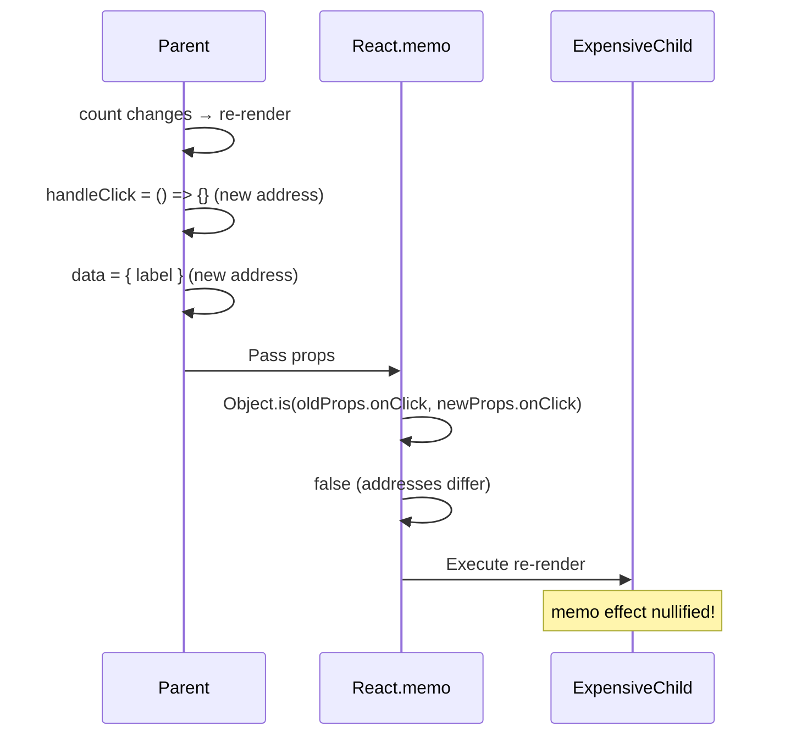
```mermaid
sequenceDiagram
    participant P as Parent
    participant M as React.memo
    participant C as ExpensiveChild

    P->>P: count changes → re-render
    P->>P: handleClick = () => {} (new address)
    P->>P: data = { label } (new address)
    P->>M: Pass props
    M->>M: Object.is(oldProps.onClick, newProps.onClick)
    M->>M: false (addresses differ)
    M->>C: Execute re-render
    Note over C: memo effect nullified!
```

## Solving with Memoization

```jsx
function Parent() {
  const [count, setCount] = useState(0);

  // Stabilize references
  const handleClick = useCallback(() => console.log('clicked'), []);
  const data = useMemo(() => ({ label: 'Click me' }), []);

  return (
    <>
      <button onClick={() => setCount(count + 1)}>Count: {count}</button>
      {/* ExpensiveChild does not re-render even when count changes */}
      <ExpensiveChild onClick={handleClick} data={data} />
    </>
  );
}
```

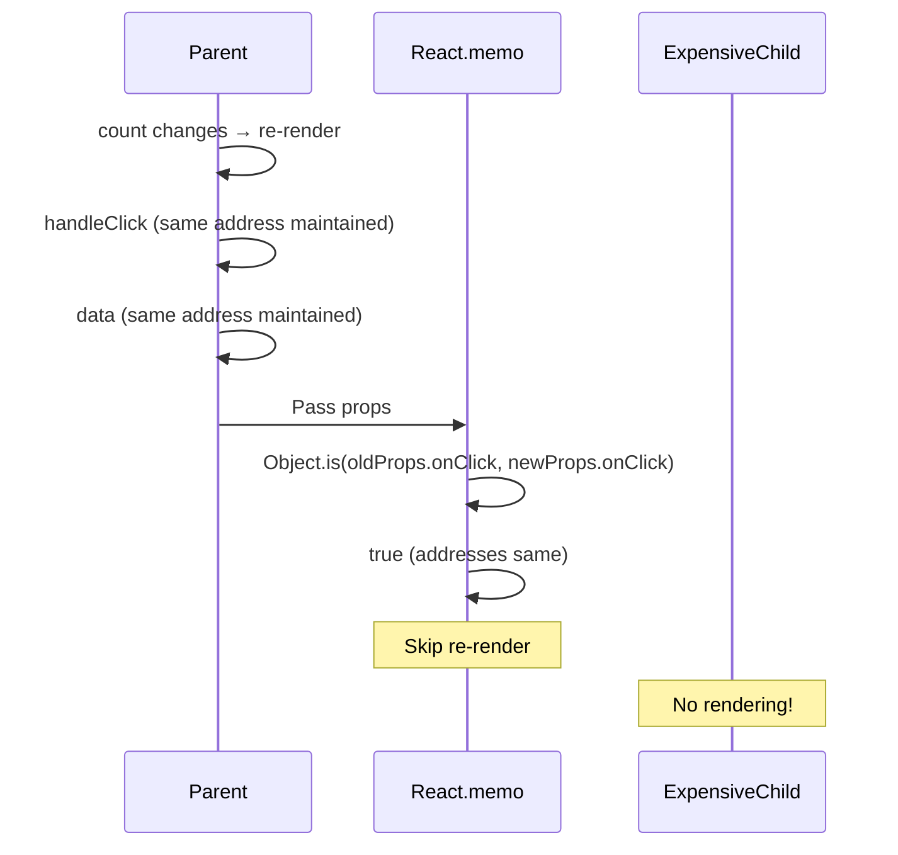
```mermaid
sequenceDiagram
    participant P as Parent
    participant M as React.memo
    participant C as ExpensiveChild

    P->>P: count changes → re-render
    P->>P: handleClick (same address maintained)
    P->>P: data (same address maintained)
    P->>M: Pass props
    M->>M: Object.is(oldProps.onClick, newProps.onClick)
    M->>M: true (addresses same)
    Note over M: Skip re-render
    Note over C: No rendering!
```

---

# ESLint Warning Limitations and Custom Hook Pitfalls

## Role of eslint-plugin-react-hooks

`eslint-plugin-react-hooks` warns when non-memoized functions are placed in dependency arrays.

```jsx
function Example() {
  const [count, setCount] = useState(0);

  // Non-memoized function
  const handleClick = () => {
    console.log(count);
  };

  useEffect(() => {
    handleClick();
  }, [handleClick]); // ESLint warning: The 'handleClick' function makes the dependencies of useEffect Hook change on every render

  return <button onClick={handleClick}>{count}</button>;
}
```

This warning tells you that "the function is recreated on every render, which may cause unnecessary effect execution." ESLint suggests wrapping it with `useCallback` or moving the function inside the effect.

## Functions Returned from Custom Hooks Are Not Warned

The problem is that ESLint does not warn when non-memoized functions returned from custom hooks are placed in deps.

```jsx
// useAutoSave.ts - Returns function without memoization
function useAutoSave() {
  const [lastSaved, setLastSaved] = useState<Date | null>(null);

  // Returns non-memoized function
  const save = (content: string) => {
    api.save(content);
    setLastSaved(new Date());
  };

  return { save, lastSaved };
}

// Component.tsx
function Editor() {
  const [content, setContent] = useState('');
  const { save } = useAutoSave(); // New save function on every render

  useEffect(() => {
    const timer = setInterval(() => save(content), 5000);
    return () => clearInterval(timer);
  }, [save, content]); // No ESLint warning!

  return <textarea value={content} onChange={(e) => setContent(e.target.value)} />;
}
```

ESLint warns when functions declared inside components are in deps, but assumes functions returned from hooks are "already stable references." However, if hooks don't memoize internally, new functions are created on every render.

## Result: Hidden Performance Issues

```jsx
function Editor() {
  const [content, setContent] = useState('');
  const [cursor, setCursor] = useState(0);
  const { save } = useAutoSave(); // Non-memoized function

  useEffect(() => {
    const timer = setInterval(() => save(content), 5000);
    return () => clearInterval(timer);
  }, [save, content]); // No ESLint warning, but problem occurs

  // useAutoSave returns new save function whenever cursor changes
  return (
    <textarea
      value={content}
      onChange={(e) => setContent(e.target.value)}
      onSelect={(e) => setCursor(e.target.selectionStart)}
    />
  );
}
```

Whenever the cursor position changes:
1. Component re-renders
2. `useAutoSave` returns new `save` function (new memory address)
3. useEffect detects `save` change → effect re-executes
4. Clears existing timer and creates new timer

ESLint does not warn about this issue. It assumes functions returned from hooks are stable references. This is why memoization of return values is important when designing custom hooks.

---

# Memoization Design Principles

When designing custom hooks, you must ensure reference stability of return values.

## Principle 1: Always Memoize Reference Type Return Values

Functions or objects returned from hooks can be placed in dependency arrays. References must be kept stable.

```jsx
// Bad: New function created on every render
function useCounter() {
  const [count, setCount] = useState(0);

  const increment = () => setCount((c) => c + 1);
  const decrement = () => setCount((c) => c - 1);

  return { count, increment, decrement };
}

// Good: Stabilize function references with useCallback
function useCounter() {
  const [count, setCount] = useState(0);

  const increment = useCallback(() => setCount((c) => c + 1), []);
  const decrement = useCallback(() => setCount((c) => c - 1), []);

  return { count, increment, decrement };
}
```

## Principle 2: Consider Calculation Cost for Primitive Return Values

Since primitives use value comparison, memoization is not mandatory. Use useMemo only when calculation cost is high.

```jsx
// Memoization unnecessary: Simple calculation
function useItemCount(items) {
  const count = items.length; // O(1)
  return count;
}

// Memoization needed: Complex calculation
function useFilteredItems(items, filter) {
  const filtered = useMemo(
    () => items.filter((item) => item.category === filter), // O(n)
    [items, filter]
  );
  return filtered;
}
```

## Principle 3: Wrap Object Returns with useMemo

When returning multiple values as an object, stabilize the object reference with useMemo.

```jsx
// Bad: New object created on every render
function useWindowSize() {
  const [size, setSize] = useState({ width: 0, height: 0 });

  useEffect(() => {
    const handler = () => setSize({ width: window.innerWidth, height: window.innerHeight });
    window.addEventListener('resize', handler);
    return () => window.removeEventListener('resize', handler);
  }, []);

  // Creates new object every time
  return { width: size.width, height: size.height, isLarge: size.width > 1024 };
}

// Good: Stabilize object with useMemo
function useWindowSize() {
  const [size, setSize] = useState({ width: 0, height: 0 });

  useEffect(() => {
    const handler = () => setSize({ width: window.innerWidth, height: window.innerHeight });
    window.addEventListener('resize', handler);
    return () => window.removeEventListener('resize', handler);
  }, []);

  return useMemo(
    () => ({ width: size.width, height: size.height, isLarge: size.width > 1024 }),
    [size.width, size.height]
  );
}
```

## Summary: Memoization Guide by Type

| Return Value Type | Memoization | Reason |
| --- | --- | --- |
| Function | useCallback required | Reference type, can be used in dependency arrays |
| Object/Array | useMemo required | Reference type, can be used in dependency arrays |
| Number/String/Boolean | Consider calculation cost | Primitives use value comparison, useMemo only when cost is high |

---

# Common Mistake Patterns

## Mistake 1: Using Object/Array Literals in deps Array

```jsx
// Bad: New array created on every render
useEffect(() => {
  fetchUsers(userIds);
}, [[1, 2, 3]]); // Always a new array!

// Good: Use useMemo or define as constant outside
const userIds = useMemo(() => [1, 2, 3], []);
useEffect(() => {
  fetchUsers(userIds);
}, [userIds]);
```

## Mistake 2: Referencing Latest State Inside useCallback

```jsx
// Bad: References stale value even when count changes
const handleClick = useCallback(() => {
  setCount(count + 1); // count is fixed in closure
}, []); // deps is empty

// Good: Use functional update
const handleClick = useCallback(() => {
  setCount((prev) => prev + 1); // Always uses latest value
}, []);
```

## Mistake 3: Unnecessary Memoization

```jsx
// Bad: Memoization unnecessary for primitives
const doubled = useMemo(() => count * 2, [count]);

// Good: Just calculate
const doubled = count * 2;

// Good: Memoize only complex calculations
const sortedItems = useMemo(
  () => items.sort((a, b) => a.price - b.price),
  [items]
);
```

---

# When to Apply Memoization: The Principle

Indiscriminate memoization causes other problems beyond what it solves.

## 1. Memory Occupancy & Garbage Collection Burden

Garbage collection in browsers automatically removes unused data. While memoization is maintained, garbage collection cannot collect that data.

```jsx
const filtered = useMemo(
  () => items.filter((item) => item.category === filter),
  [items, filter]
);
```

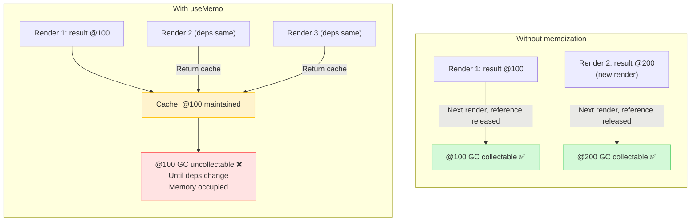
```mermaid
flowchart TB
    subgraph Without["Without memoization"]
        direction TB
        A1["Render 1: result @100"]
        A2["Render 2: result @200<br/>(new render)"]
        A1 -->|"Next render, reference released"| GC1["@100 GC collectable ✅"]
        A2 -->|"Next render, reference released"| GC2["@200 GC collectable ✅"]
    end

    subgraph With["With useMemo"]
        direction TB
        C1["Render 1: result @100"]
        C2["Render 2 (deps same)"]
        C3["Render 3 (deps same)"]
        CACHE["Cache: @100 maintained"]
        C1 --> CACHE
        C2 -->|"Return cache"| CACHE
        C3 -->|"Return cache"| CACHE
        CACHE --> BLOCK["@100 GC uncollectable ❌<br/>Until deps change<br/>Memory occupied"]
    end

    style BLOCK fill:#ffe3e3,stroke:#ff6b6b
    style GC1 fill:#d3f9d8,stroke:#51cf66
    style GC2 fill:#d3f9d8,stroke:#51cf66
    style CACHE fill:#fff3cd,stroke:#ffc107
```

useMemo maintains one cached value at a time. As long as deps don't change, the currently cached result (@100) stays in memory and GC cannot collect it. This occupies memory while the component is mounted.

## 2. Dependency Array Comparison Cost

On every re-render, the values in the dependency array are compared with previous values. This comparison cost is O(n) where n is the array length.

```jsx
// Dependency array gets longer, comparison cost increases
const result = useMemo(
  () => a + b + c + d + e, // Just simple calculation
  [a, b, c, d, e] // But 5 Object.is comparisons every render
);

// For simple calculations, just calculating is faster
const result = a + b + c + d + e;
```

For simple calculations, the comparison cost itself can exceed the actual calculation cost.

## 3. Unnecessary Memoization of Primitives

Primitive types don't need memoization. Moreover, it hurts readability.

```jsx
// Bad: Unnecessary memoization of primitives
const doubled = useMemo(() => count * 2, [count]);
const isEven = useMemo(() => count % 2 === 0, [count]);
const label = useMemo(() => `Count: ${count}`, [count]);

// Good: Just calculate
const doubled = count * 2;
const isEven = count % 2 === 0;
const label = `Count: ${count}`;
```

Primitives compare by value, so if the value is the same on every render, the `Object.is` comparison returns `true`. What React prevents is not the calculation itself, but unnecessary re-renders of child components that receive these values as props.

## 4. Promotes Mistakes

When all data is memoized, later developers cannot tell which data has expensive calculations. Also, if dependency array data is missing, stale closure bugs occur.

```jsx
const [count, setCount] = useState(0);

// Missing count in deps causes stale closure
const handleClick = useCallback(() => {
  console.log(count); // Always prints 0 (fixed to initial value)
}, []); // ⚠️ count is missing

// No matter how count changes, handleClick references count=0 closure
```

> [!NOTE] stale closure
>
> A phenomenon where memoization keeps previous data and maintains only that. The situation where values are not updated to the latest.

---

# Memoization Application Principles

Now that you understand the cost of indiscriminate memoization, let's learn the principles for applying it correctly.

## Principle 1: Early Optimization Is a Trap

Write code first, measure actual bottlenecks with Profiler, then optimize.

```jsx
// ❌ Optimize before confirming it's slow
function ItemList({ items, onSelect }) {
  const filtered = useMemo(() => items.filter(isActive), [items]);
  const handleClick = useCallback((id) => onSelect(id), [onSelect]);

  return filtered.map((item) => (
    <Item key={item.id} data={item} onClick={handleClick} />
  ));
}

// ✅ Write first, check Profiler for bottleneck, then optimize
function ItemList({ items, onSelect }) {
  const filtered = items.filter(isActive);

  return filtered.map((item) => (
    <Item key={item.id} data={item} onClick={(id) => onSelect(id)} />
  ));
}
```

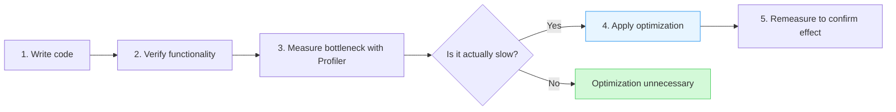
```mermaid
flowchart LR
    A["1. Write code"] --> B["2. Verify functionality"]
    B --> C["3. Measure bottleneck with Profiler"]
    C --> D{"Is it actually slow?"}
    D -->|Yes| E["4. Apply optimization"]
    D -->|No| F["Optimization unnecessary"]
    E --> G["5. Remeasure to confirm effect"]

    style F fill:#d3f9d8,stroke:#51cf66
    style E fill:#e7f5ff,stroke:#339af0
```

## Principle 2: Calculate Optimization Cost

Every optimization has trade-offs. Optimization without context adds only cost.

```jsx
// ✅ React.memo is effective: List items rendered repeatedly
// Cost savings multiply by item count × render count
const ListItem = React.memo(({ item, onDelete }) => {
  return <div onClick={() => onDelete(item.id)}>{item.name}</div>;
});

// ❌ useCallback is unnecessary: Function not used in props or deps
function Component() {
  // Only adds comparison cost, no practical benefit
  const getLabel = useCallback(() => 'hello', []);
  return <div>{getLabel()}</div>;
}

// ✅ Don't memoize if not passed as props or deps
function Component() {
  const getLabel = () => 'hello';
  return <div>{getLabel()}</div>;
}
```

| Case | Optimize? | Reason |
|------|-----------|--------|
| List item component | Consider React.memo | Savings multiply by item count |
| Function passed to props/deps | useCallback needed | Reference stability required |
| Function used only internally | Unnecessary | Only adds comparison cost |
| Complex calculation (sort, filter) | useMemo needed | Prevents repeated expensive calculation |
| Simple arithmetic (count * 2) | Unnecessary | Calculation cost < memoization cost |

Apply memoization only where necessary. Always prove with data before applying.

---

# Before Memoization: Structural Optimization

Before optimizing with memoization, we need "structural optimization." When you identify a problem that seems to require memoization, follow this thought process first.

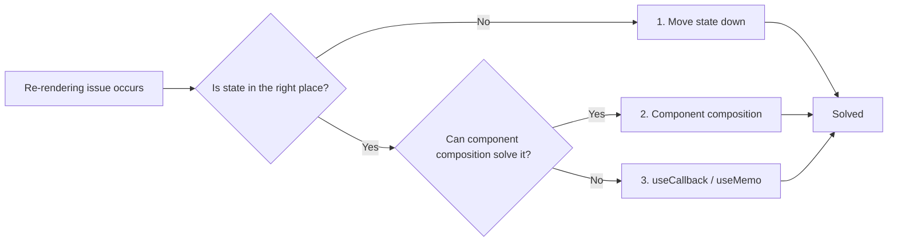
```mermaid
flowchart LR
    A["Re-rendering issue occurs"] --> B{"Is state in the right place?"}
    B -->|No| C["1. Move state down"]
    B -->|Yes| D{"Can component composition solve it?"}
    D -->|Yes| E["2. Component composition"]
    D -->|No| F["3. useCallback / useMemo"]
    C --> G["Solved"]
    E --> G
    F --> G
```

## 1. Move State Down

Check if some state is set at the wrong scope. State should be isolated to only the components that use it.

```jsx
// Bad: count state in App, so HeavyComponent also re-renders
function App() {
  const [count, setCount] = useState(0);

  return (
    <div>
      <button onClick={() => setCount(count + 1)}>Count: {count}</button>
      <HeavyComponent /> {/* Unnecessarily re-renders on count change */}
    </div>
  );
}

// Good: Move count state to component that uses it
function Counter() {
  const [count, setCount] = useState(0);
  return <button onClick={() => setCount(count + 1)}>Count: {count}</button>;
}

function App() {
  return (
    <div>
      <Counter />
      <HeavyComponent /> {/* Completely unrelated to Counter re-renders */}
    </div>
  );
}
```

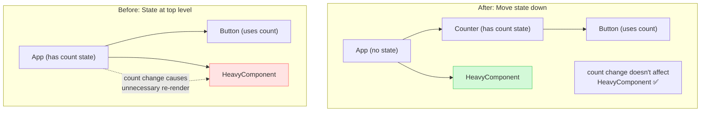
```mermaid
flowchart TB
    subgraph After["After: Move state down"]
        A2["App (no state)"]
        A2 --> B2["Counter (has count state)"]
        B2 --> D2["Button (uses count)"]
        A2 --> C2["HeavyComponent"]
        note["count change doesn't affect<br/>HeavyComponent ✅"]
        style C2 fill:#d3f9d8,stroke:#51cf66
    end

    subgraph Before["Before: State at top level"]
        A1["App (has count state)"]
        A1 --> B1["Button (uses count)"]
        A1 --> C1["HeavyComponent"]
        A1 -. "count change causes<br/>unnecessary re-render" .-> C1
        style C1 fill:#ffe3e3,stroke:#ff6b6b
    end
```

Narrowing state scope also narrows the re-render scope. You can prevent unnecessary re-renders without memoization.

## 2. Component Composition

When a wrapper component receives children as a prop, wrapper re-renders don't affect children's reference address, so children automatically bail out.

> [!NOTE] bailout
>
> React skips re-rendering. When children are passed as props, their JSX reference address doesn't change even if the parent component re-renders, so bailout occurs.

```jsx
// Bad: ThemeProvider re-renders, HeavyContent also re-renders
function ThemeProvider() {
  const [theme, setTheme] = useState('light');

  return (
    <div className={theme}>
      <button onClick={() => setTheme(theme === 'light' ? 'dark' : 'light')}>
        Change theme
      </button>
      <HeavyContent /> {/* Re-renders unnecessarily when theme changes */}
    </div>
  );
}

// Good: Accept children as prop for composition
function ThemeProvider({ children }) {
  const [theme, setTheme] = useState('light');

  return (
    <div className={theme}>
      <button onClick={() => setTheme(theme === 'light' ? 'dark' : 'light')}>
        Change theme
      </button>
      {children} {/* Reference address stays same, automatic bailout */}
    </div>
  );
}

function App() {
  return (
    <ThemeProvider>
      <HeavyContent /> {/* ThemeProvider re-renders independently */}
    </ThemeProvider>
  );
}
```

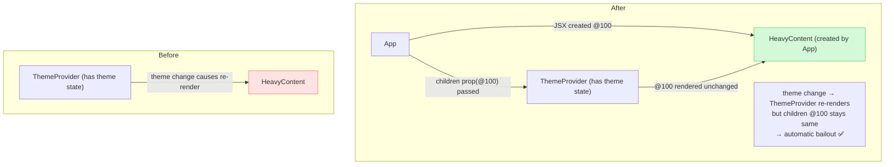
```mermaid
flowchart TB
    subgraph After["After"]
        A2["App"]
        A2 -->|"JSX created @100"| H2["HeavyContent (created by App)"]
        A2 -->|"children prop(@100) passed"| W2["ThemeProvider (has theme state)"]
        W2 -->|"@100 rendered unchanged"| H2
        note["theme change → ThemeProvider re-renders<br/>but children @100 stays same<br/>→ automatic bailout ✅"]
        style H2 fill:#d3f9d8,stroke:#51cf66
    end

    subgraph Before["Before"]
        W1["ThemeProvider (has theme state)"]
        W1 -->|"theme change causes re-render"| H1["HeavyContent"]
        style H1 fill:#ffe3e3,stroke:#ff6b6b
    end
```

Since children JSX is created in App, its reference address stays the same even when ThemeProvider re-renders. React detects this and bails out HeavyContent's re-render.

## 3. Memoization Hooks (useCallback, useMemo)

Use useCallback and useMemo only when above methods don't solve the problem. This applies when you need dependency array stability, using with React.memo, and reference stability in custom hook return values.

---

# Reference Materials

- [The React Deep Dive](https://product.kyobobook.co.kr/detail/S000210725203) (원서)
- [React Master Class: Part 2 - Mission Complete High Performance Hooks and Practical Architecture](https://www.inflearn.com/course/react-%EB%A7%88%EC%8A%A4%ED%84%B0-%ED%81%B4%EB%9E%98%EC%8A%A4-part-2) (인프런)
