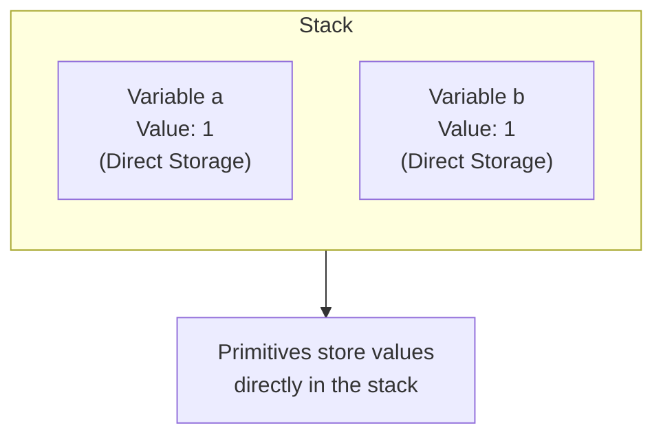
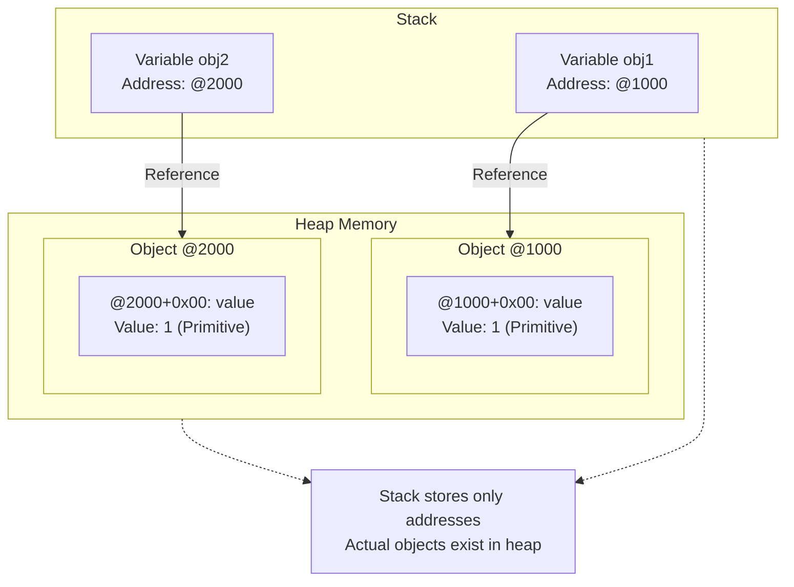
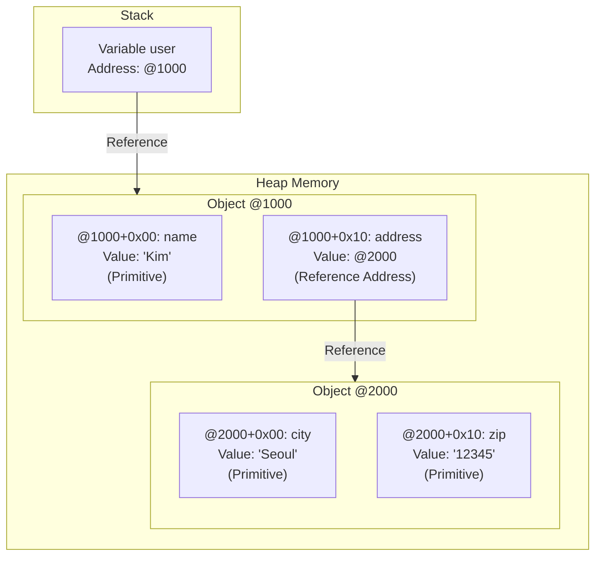
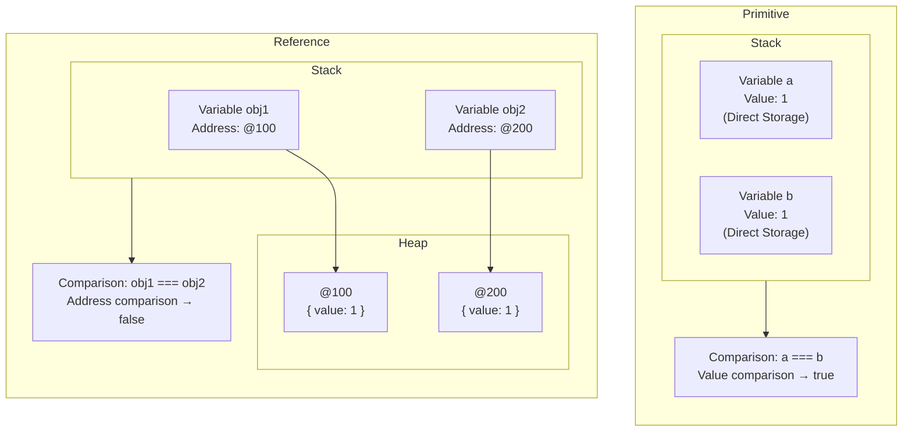
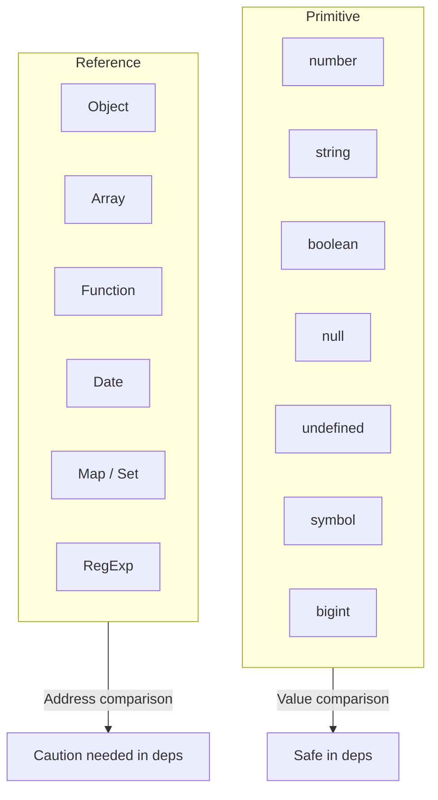

# Why useCallback and useMemo Matter in React

Using useCallback and useMemo in React isn't just about simple performance optimization. When you understand JavaScript's reference type characteristics and how React's dependency array works, you'll see why these hooks are essential in certain situations.

After reading this document, you'll understand:
- The memory behavior differences between primitive and reference types
- Why reference types are dangerous in useEffect dependency arrays
- The relationship between React.memo and props reference stability
- ESLint limitations for detecting issues inside custom hooks
- Design principles for memoizing reference type data
- Common memoization mistakes
- The cost of indiscriminate memoization
- Principles and structural optimization for memoization

---

# Memory Structure of Primitives and References

JavaScript data types are divided into primitives and references.

## Primitive Data

Primitive values are stored directly at a memory address. Variables point to that memory address, and the value is stored at that address.

```javascript
let a = 1;
let b = 1;

console.log(a === b); // true
```

**Memory Structure:**


```mermaid
flowchart TB
    subgraph Stack["Stack"]
        direction TB
        A["Variable a<br/>Value: 1<br/>(Direct Storage)"]
        B["Variable b<br/>Value: 1<br/>(Direct Storage)"]
    end

    Note1["Primitives store values<br/>directly in the stack"]

    Stack --> Note1
```

`a` stores the value `1` directly in the stack. `b` also stores the value `1` directly in the stack. The comparison operator (`===`) compares the actual values stored in the variables, so it returns `true`.

**Key Point:**
- Primitive data values are stored directly in the stack
- Variables themselves hold the values, so comparison compares the values themselves

## Reference Data

Reference types have a memory address for the object, and at that address are the primitive data inside the object, each with their own memory location.

```javascript
const obj1 = { value: 1 };
const obj2 = { value: 1 };

console.log(obj1 === obj2); // false
```

**Memory Structure:**


```mermaid
flowchart TB
    subgraph Stack["Stack"]
        direction TB
        V1["Variable obj1<br/>Address: @1000"]
        V2["Variable obj2<br/>Address: @2000"]
    end

    subgraph Heap["Heap Memory"]
        direction TB
        subgraph O1["Object @1000"]
            direction TB
            P1["@1000+0x00: value<br/>Value: 1 (Primitive)"]
        end

        subgraph O2["Object @2000"]
            direction TB
            P2["@2000+0x00: value<br/>Value: 1 (Primitive)"]
        end
    end

    V1 -->|"Reference"| O1
    V2 -->|"Reference"| O2

    Note1["Stack stores only addresses<br/>Actual objects exist in heap"]

    Stack -.-> Note1
    Heap -.-> Note1
```

`obj1` points to object address @1000, where the `value` property is stored at memory location @1000+0x00. `obj2` points to object address @2000, where `value` is stored at @2000+0x00. The comparison operator (`===`) compares object addresses, so it returns `false`.

**Key Point:**
- Reference data has a memory address for the object
- At that address are the primitive data inside the object, each with their own memory location

### Nested Object Example

Let's look at the memory structure of nested objects. Nested objects occur when a reference type contains another reference type. With nested objects, the address of the reference type is stored in the stack, and the nested reference type addresses are stored as-is in the heap.

```javascript
const user = {
  name: 'Kim',
  address: { city: 'Seoul', zip: '12345' }
};
```


```mermaid
flowchart TB
    subgraph Variables["Stack"]
        V1["Variable user<br/>Address: @1000"]
    end

    subgraph Heap["Heap Memory"]
        direction TB
        subgraph O1["Object @1000"]
            direction TB
            P1["@1000+0x00: name<br/>Value: 'Kim'<br/>(Primitive)"]
            P2["@1000+0x10: address<br/>Value: @2000<br/>(Reference Address)"]
        end

        subgraph O2["Object @2000"]
            direction TB
            P3["@2000+0x00: city<br/>Value: 'Seoul'<br/>(Primitive)"]
            P4["@2000+0x10: zip<br/>Value: '12345'<br/>(Primitive)"]
        end
    end

    V1 -->|"Reference"| O1
    P2 -->|"Reference"| O2
```

## Primitive vs Reference Comparison

Now let's compare the memory behavior differences between primitives and references at a glance.

```javascript
// Primitive example
let a = 1;
let b = 1;
console.log(a === b); // true

// Reference example
const obj1 = { value: 1 };
const obj2 = { value: 1 };
console.log(obj1 === obj2); // false
```


```mermaid
flowchart TB
    subgraph Primitive["Primitive"]
        direction TB
        subgraph Stack1["Stack"]
            A["Variable a<br/>Value: 1<br/>(Direct Storage)"]
            B["Variable b<br/>Value: 1<br/>(Direct Storage)"]
        end
        Compare1["Comparison: a === b<br/>Value comparison → true"]
    end

    subgraph Reference["Reference"]
        direction TB
        subgraph Stack2["Stack"]
            C["Variable obj1<br/>Address: @100"]
            D["Variable obj2<br/>Address: @200"]
        end
        subgraph Heap2["Heap"]
            O1["@100<br/>{ value: 1 }"]
            O2["@200<br/>{ value: 1 }"]
        end
        Compare2["Comparison: obj1 === obj2<br/>Address comparison → false"]
    end

    Stack1 --> Compare1

    Stack2 --> Compare2
    C --> O1
    D --> O2
```

**Key Difference Summary:**

| Aspect | Primitive | Reference |
|--------|-----------|-----------|
| **Storage Location** | Values stored directly in stack | Objects stored in heap, only addresses in stack |
| **Assignment Method** | Value copy (Pass by Value) | Address copy (Pass by Reference) |
| **Comparison Operation** | Compares values themselves | Compares addresses |

**Actual Behavior Example:**

```javascript
// Primitive: value copy
let x = 10;
let y = x;  // y is a copy of 10
y = 20;     // only y changes
console.log(x); // 10 (x is unaffected)

// Reference: address copy
let objA = { count: 10 };
let objB = objA;  // objB copies objA's address
objB.count = 20;  // modifies the same object
console.log(objA.count); // 20 (objA is affected too)
```

## Functions are Reference Types

Functions are first-class objects in JavaScript and are reference types.

```javascript
const fn1 = () => console.log('hello');
const fn2 = () => console.log('hello');

console.log(fn1 === fn2); // false
```

Even functions with identical code are assigned a new memory address each time they're declared. Besides functions, there are various other reference types.

**JavaScript Type Classification**

```mermaid
flowchart TB
    subgraph Primitive["Primitive"]
        P1[number]
        P2[string]
        P3[boolean]
        P4[null]
        P5[undefined]
        P6[symbol]
        P7[bigint]
    end

    subgraph Reference["Reference"]
        R1[Object]
        R2[Array]
        R3[Function]
        R4[Date]
        R5[Map / Set]
        R6[RegExp]
    end

    Primitive -->|"Value comparison"| SAFE["Safe in deps"]
    Reference -->|"Address comparison"| DANGER["Caution needed in deps"]
```

---
