# Why useCallback and useMemo Matter in React

Using useCallback and useMemo in React isn't just about simple performance optimization. When you understand JavaScript's reference type characteristics and how React's dependency array works, you'll see why these hooks are essential in certain situations.

After reading this document, you'll understand:
- The memory behavior differences between primitive and reference types
- Why reference types are dangerous in useEffect dependency arrays
- The relationship between React.memo and props reference stability
- ESLint limitations for detecting issues inside custom hooks
- Design principles for memoizing reference type data
- Common memoization mistakes
- The cost of indiscriminate memoization
- Principles and structural optimization for memoization

---

# Memory Structure of Primitives and References

JavaScript data types are divided into primitives and references.

## Primitive Data

Primitive values are stored directly at a memory address. Variables point to that memory address, and the value is stored at that address.

```javascript
let a = 1;
let b = 1;

console.log(a === b); // true
```

**Memory Structure:**

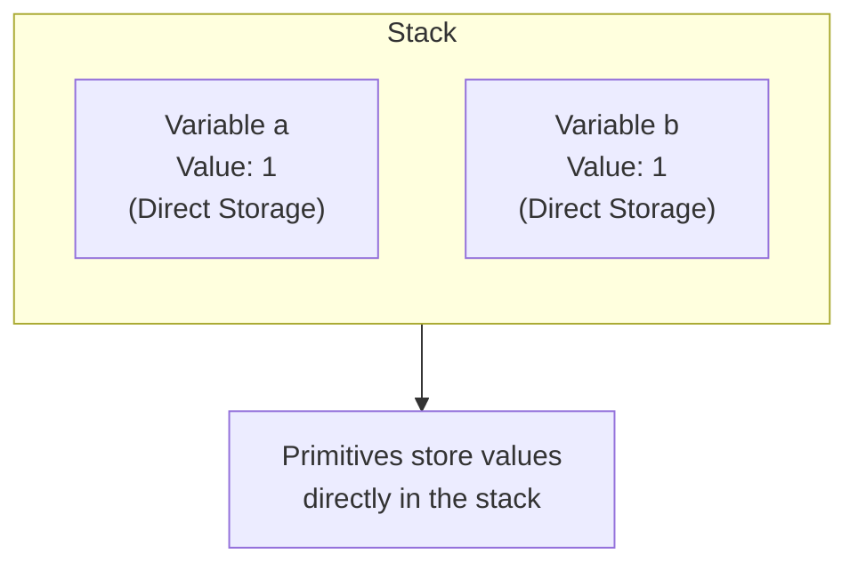
```mermaid
flowchart TB
    subgraph Stack["Stack"]
        direction TB
        A["Variable a<br/>Value: 1<br/>(Direct Storage)"]
        B["Variable b<br/>Value: 1<br/>(Direct Storage)"]
    end

    Note1["Primitives store values<br/>directly in the stack"]

    Stack --> Note1
```

`a` stores the value `1` directly in the stack. `b` also stores the value `1` directly in the stack. The comparison operator (`===`) compares the actual values stored in the variables, so it returns `true`.

**Key Point:**
- Primitive data values are stored directly in the stack
- Variables themselves hold the values, so comparison compares the values themselves

## Reference Data

Reference types have a memory address for the object, and at that address are the primitive data inside the object, each with their own memory location.

```javascript
const obj1 = { value: 1 };
const obj2 = { value: 1 };

console.log(obj1 === obj2); // false
```

**Memory Structure:**

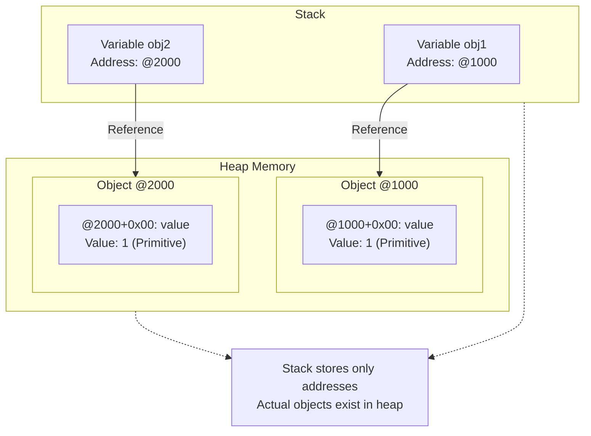
```mermaid
flowchart TB
    subgraph Stack["Stack"]
        direction TB
        V1["Variable obj1<br/>Address: @1000"]
        V2["Variable obj2<br/>Address: @2000"]
    end

    subgraph Heap["Heap Memory"]
        direction TB
        subgraph O1["Object @1000"]
            direction TB
            P1["@1000+0x00: value<br/>Value: 1 (Primitive)"]
        end

        subgraph O2["Object @2000"]
            direction TB
            P2["@2000+0x00: value<br/>Value: 1 (Primitive)"]
        end
    end

    V1 -->|"Reference"| O1
    V2 -->|"Reference"| O2

    Note1["Stack stores only addresses<br/>Actual objects exist in heap"]

    Stack -.-> Note1
    Heap -.-> Note1
```

`obj1` points to object address @1000, where the `value` property is stored at memory location @1000+0x00. `obj2` points to object address @2000, where `value` is stored at @2000+0x00. The comparison operator (`===`) compares object addresses, so it returns `false`.

**Key Point:**
- Reference data has a memory address for the object
- At that address are the primitive data inside the object, each with their own memory location

### Nested Object Example

Let's look at the memory structure of nested objects. Nested objects occur when a reference type contains another reference type. With nested objects, the address of the reference type is stored in the stack, and the nested reference type addresses are stored as-is in the heap.

```javascript
const user = {
  name: 'Kim',
  address: { city: 'Seoul', zip: '12345' }
};
```

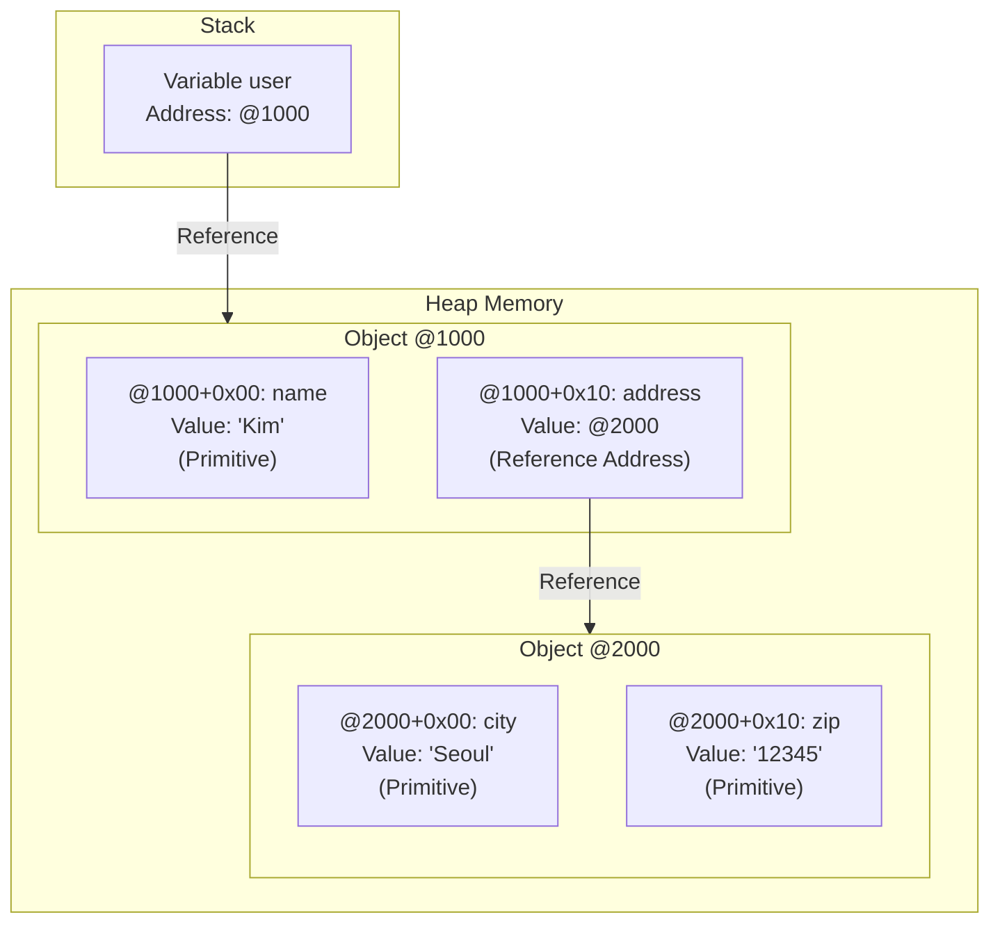
```mermaid
flowchart TB
    subgraph Variables["Stack"]
        V1["Variable user<br/>Address: @1000"]
    end

    subgraph Heap["Heap Memory"]
        direction TB
        subgraph O1["Object @1000"]
            direction TB
            P1["@1000+0x00: name<br/>Value: 'Kim'<br/>(Primitive)"]
            P2["@1000+0x10: address<br/>Value: @2000<br/>(Reference Address)"]
        end

        subgraph O2["Object @2000"]
            direction TB
            P3["@2000+0x00: city<br/>Value: 'Seoul'<br/>(Primitive)"]
            P4["@2000+0x10: zip<br/>Value: '12345'<br/>(Primitive)"]
        end
    end

    V1 -->|"Reference"| O1
    P2 -->|"Reference"| O2
```

## Primitive vs Reference Comparison

Now let's compare the memory behavior differences between primitives and references at a glance.

```javascript
// Primitive example
let a = 1;
let b = 1;
console.log(a === b); // true

// Reference example
const obj1 = { value: 1 };
const obj2 = { value: 1 };
console.log(obj1 === obj2); // false
```

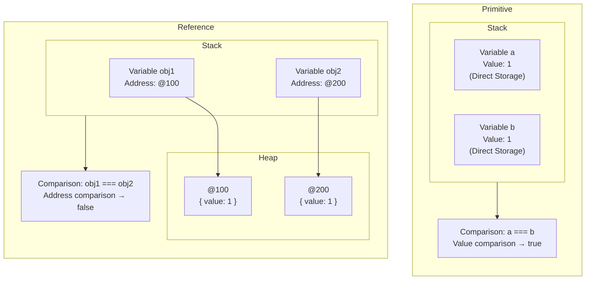
```mermaid
flowchart TB
    subgraph Primitive["Primitive"]
        direction TB
        subgraph Stack1["Stack"]
            A["Variable a<br/>Value: 1<br/>(Direct Storage)"]
            B["Variable b<br/>Value: 1<br/>(Direct Storage)"]
        end
        Compare1["Comparison: a === b<br/>Value comparison → true"]
    end

    subgraph Reference["Reference"]
        direction TB
        subgraph Stack2["Stack"]
            C["Variable obj1<br/>Address: @100"]
            D["Variable obj2<br/>Address: @200"]
        end
        subgraph Heap2["Heap"]
            O1["@100<br/>{ value: 1 }"]
            O2["@200<br/>{ value: 1 }"]
        end
        Compare2["Comparison: obj1 === obj2<br/>Address comparison → false"]
    end

    Stack1 --> Compare1

    Stack2 --> Compare2
    C --> O1
    D --> O2
```

**Key Difference Summary:**

| Aspect | Primitive | Reference |
|--------|-----------|-----------|
| **Storage Location** | Values stored directly in stack | Objects stored in heap, only addresses in stack |
| **Assignment Method** | Value copy (Pass by Value) | Address copy (Pass by Reference) |
| **Comparison Operation** | Compares values themselves | Compares addresses |

**Actual Behavior Example:**

```javascript
// Primitive: value copy
let x = 10;
let y = x;  // y is a copy of 10
y = 20;     // only y changes
console.log(x); // 10 (x is unaffected)

// Reference: address copy
let objA = { count: 10 };
let objB = objA;  // objB copies objA's address
objB.count = 20;  // modifies the same object
console.log(objA.count); // 20 (objA is affected too)
```

## Functions are Reference Types

Functions are first-class objects in JavaScript and are reference types.

```javascript
const fn1 = () => console.log('hello');
const fn2 = () => console.log('hello');

console.log(fn1 === fn2); // false
```

Even functions with identical code are assigned a new memory address each time they're declared. Besides functions, there are various other reference types.

**JavaScript Type Classification**
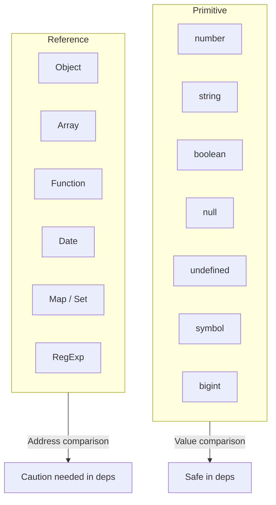
```mermaid
flowchart TB
    subgraph Primitive["Primitive"]
        P1[number]
        P2[string]
        P3[boolean]
        P4[null]
        P5[undefined]
        P6[symbol]
        P7[bigint]
    end

    subgraph Reference["Reference"]
        R1[Object]
        R2[Array]
        R3[Function]
        R4[Date]
        R5[Map / Set]
        R6[RegExp]
    end

    Primitive -->|"Value comparison"| SAFE["Safe in deps"]
    Reference -->|"Address comparison"| DANGER["Caution needed in deps"]
```

---

# useEffect Dependency Array and the Pitfall of Reference Types

React's useEffect executes the callback when the value in the dependency array changes. The problem is that this comparison is performed with `Object.is`.

## Primitive Types Are Safe

```jsx
function Counter() {
  const [count, setCount] = useState(0);

  useEffect(() => {
    console.log('count changed:', count);
  }, [count]);

  return <button onClick={() => setCount(count + 1)}>Increment</button>;
}
```

Since `count` is a primitive type (number), the effect is only executed when the value actually changes.

## Reference Types Are Dangerous

```jsx
function UserProfile() {
  const [user, setUser] = useState({ name: 'Kim' });

  // New object created on every render
  const config = { theme: 'dark' };

  useEffect(() => {
    console.log('config changed');
  }, [config]); // Executes on every render

  return <div>{user.name}</div>;
}
```

`config` is created with a new memory address on each render. Even if the contents are identical, React judges it as "changed".

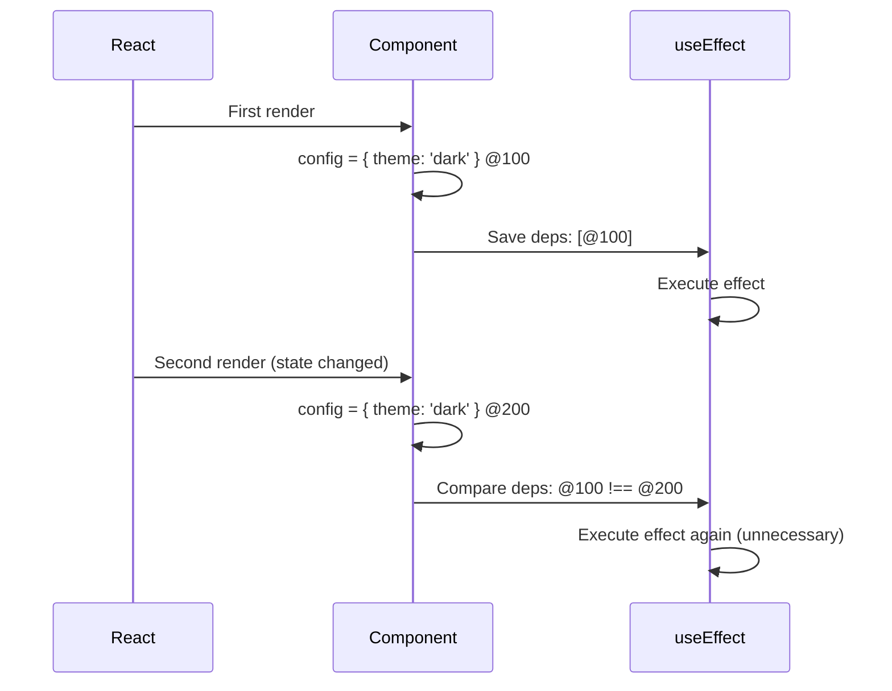
```mermaid
sequenceDiagram
    participant R as React
    participant C as Component
    participant E as useEffect

    R->>C: First render
    C->>C: config = { theme: 'dark' } @100
    C->>E: Save deps: [@100]
    E->>E: Execute effect

    R->>C: Second render (state changed)
    C->>C: config = { theme: 'dark' } @200
    C->>E: Compare deps: @100 !== @200
    E->>E: Execute effect again (unnecessary)
```

## Infinite Re-rendering Case

This is a common pattern in real projects. If you put a function in the dependency array and change state inside the effect, an infinite loop occurs.

```jsx
function SearchPage() {
  const [keyword, setKeyword] = useState('');
  const [searchCount, setSearchCount] = useState(0);

  // New function created on every render
  const inlineSaveDraft = () => {
    console.log('Search executed:', keyword);
  };

  useEffect(() => {
    if (keyword) {
      inlineSaveDraft();
      setSearchCount((prev) => prev + 1); // Search count tracking → triggers re-render
    }
  }, [inlineSaveDraft, keyword]); // Infinite loop!

  return (
    <>
      <input value={keyword} onChange={(e) => setKeyword(e.target.value)} placeholder="Enter search term" />
      <div>Search count: {searchCount}</div>
    </>
  );
}
```

Execution flow:
1. User types in input → `keyword` state changes
2. Component re-renders → `inlineSaveDraft` function recreated (@200, new address)
3. useEffect deps comparison: `inlineSaveDraft @100 !== @200` → execute effect
4. Execute effect → call `inlineSaveDraft()` → execute `setSearchCount`
5. `searchCount` change → re-render → `inlineSaveDraft` function recreated again (@300)
6. useEffect deps comparison: `inlineSaveDraft @200 !== @300` → execute effect again
7. Repeat 4~6 (infinite loop)

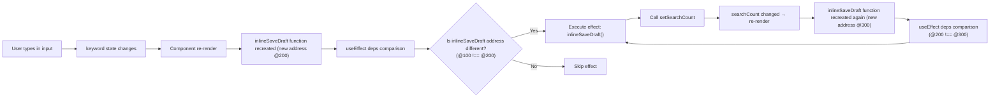
```mermaid
flowchart LR
    A["User types in input"] --> B["keyword state changes"]
    B --> C["Component re-render"]
    C --> D["inlineSaveDraft function recreated (new address @200)"]
    D --> E["useEffect deps comparison"]
    E --> F{"Is inlineSaveDraft address different?<br/>(@100 !== @200)"}
    F -->|Yes| G["Execute effect: inlineSaveDraft()"]
    G --> H["Call setSearchCount"]
    H --> I["searchCount changed → re-render"]
    I --> J["inlineSaveDraft function recreated again (new address @300)"]
    J --> K["useEffect deps comparison<br/>(@200 !== @300)"]
    K --> G
    F -->|No| L["Skip effect"]
```

### Memory Address Changes Confirmed with Chrome DevTools

You can verify in Chrome DevTools' Memory tab whether the function actually gets a new memory address on each render.

The screenshot below is the result of comparing Heap Snapshots. You can see that the `inlineSaveDraft` function has different memory addresses in each snapshot.

**Function address in Snapshot 1:**


**Newly created functions in Snapshot 2:**


**Function at different address in Snapshot 3:**


In each snapshot, the `inlineSaveDraft` function has different memory addresses like `@200175`, `@473745`, `@483163`, etc. This is why React judges the function as "changed" on every render.

## Solving with useCallback

Using useCallback allows you to maintain a stable function reference.

```jsx
function SearchPage() {
  const [keyword, setKeyword] = useState('');
  const [searchCount, setSearchCount] = useState(0);

  // Stabilize function reference with useCallback
  // Function is recreated only when keyword changes (independent of searchCount changes)
  const saveDraft = useCallback(() => {
    console.log('Search executed:', keyword);
  }, [keyword]); // Function recreated only when keyword changes

  useEffect(() => {
    if (keyword) {
      saveDraft();
      // Even if searchCount changes, saveDraft address is maintained so effect won't re-execute
      setSearchCount((prev) => prev + 1);
    }
  }, [saveDraft, keyword]); // saveDraft depends on keyword, so effect only executes when keyword changes

  return (
    <>
      <input value={keyword} onChange={(e) => setKeyword(e.target.value)} placeholder="Enter search term" />
      <div>Search count: {searchCount}</div>
    </>
  );
}
```

#### ❌ Problem Situation: Without useCallback

**Code with problem:**

```jsx
function SearchPage() {
  const [keyword, setKeyword] = useState('');
  const [searchCount, setSearchCount] = useState(0);

  // New function created on every render
  const saveDraft = () => {
    console.log('Search executed:', keyword);
  }

  useEffect(() => {
    if (keyword) {
      saveDraft();
      setSearchCount((prev) => prev + 1);
    }
  }, [saveDraft, keyword]);
  //...
```

**Execution flow:**

```jsx
// Step 1: User types "a" in input
<input value={keyword} onChange={(e) => setKeyword(e.target.value)} />
// → setKeyword('a') called
// → keyword: '' → 'a'

// Step 2: Component re-render
function SearchPage() {
  // Step 3: New function created on every render
  const saveDraft = () => {
    console.log('Search executed:', keyword);
  }; // @100 (new memory address)

  // Step 4: useEffect deps comparison
  useEffect(() => {
    if (keyword) {
      saveDraft(); // Execute
      setSearchCount((prev) => prev + 1); // searchCount: 0 → 1
    }
  }, [saveDraft, keyword]);
  // Previous deps: [undefined, ''] (first render)
  // Current deps: [@100, 'a']
  // @100 !== undefined + 'a' !== '' → execute effect ✅
}

// Step 5: searchCount changed → re-render occurs
// searchCount: 0 → 1

// Step 6: Re-render → saveDraft function recreated again
function SearchPage() {
  const saveDraft = () => {
    console.log('Search executed:', keyword);
  }; // @200 (new memory address, different from @100!)

  // Step 7: useEffect deps comparison
  useEffect(() => {
    if (keyword) {
      saveDraft(); // Execute again
      setSearchCount((prev) => prev + 1); // searchCount: 1 → 2
    }
  }, [saveDraft, keyword]);
  // Previous deps: [@100, 'a']
  // Current deps: [@200, 'a']
  // @100 !== @200 → execute effect again! ⚠️
}

// Step 8: searchCount changed → re-render again
// searchCount: 1 → 2

// Step 9: Re-render → saveDraft function recreated again
// @300 created → execute effect again → searchCount: 2 → 3
// @400 created → execute effect again → searchCount: 3 → 4
// ... infinite repetition 🔄
```

**Core issue:**
- `keyword` didn't change (`'a'` remains the same)
- `saveDraft` function keeps getting recreated (only memory address changes: @100 → @200 → @300)
- React compares memory addresses when comparing deps (`@100 !== @200`)
- Judges as "changed" every time and executes effect
- Execute effect → `setSearchCount` → re-render → function recreation → execute effect (infinite loop)


```mermaid
flowchart LR
    A1["User types in input"] --> B1["keyword changes"]
    B1 --> C1["Re-render"]
    C1 --> D1["saveDraft @100 created"]
    D1 --> E1["Execute effect (address change detected)"]
    E1 --> F1["setSearchCount → searchCount=1"]
    F1 --> G1["Re-render (searchCount changed)"]
    G1 --> H1["saveDraft @200 created (new address)"]
    H1 --> I1["Execute effect again (address change detected)"]
    I1 --> J1["setSearchCount → searchCount=2"]
    J1 --> K1["Infinite loop!"]

    style K1 fill:#ff6b6b,stroke:#c92a2a,color:#fff
    style D1 fill:#ffe3e3,stroke:#ff6b6b
    style H1 fill:#ffe3e3,stroke:#ff6b6b
```

#### ✅ Solution: Apply useCallback

**Solved code:**

```jsx
function SearchPage() {
  const [keyword, setKeyword] = useState('');
  const [searchCount, setSearchCount] = useState(0);

  // ✅ Stabilize function reference with useCallback
  // Function recreated only when keyword changes (independent of searchCount changes)
  const saveDraft = useCallback(() => {
    console.log('Search executed:', keyword);
  }, [keyword]); // Function recreated only when keyword changes

  useEffect(() => {
    if (keyword) {
      saveDraft();
      // Even if searchCount changes, saveDraft address is maintained so effect won't re-execute
      setSearchCount((prev) => prev + 1);
    }
  }, [saveDraft, keyword]);
}
```

**Execution flow:**

```jsx
// Step 1: User types "a" in input
<input value={keyword} onChange={(e) => setKeyword(e.target.value)} />
// → setKeyword('a') called
// → keyword: '' → 'a'

// Step 2: Component re-render
function SearchPage() {
  // Step 3: Stabilize function reference with useCallback
  const saveDraft = useCallback(() => {
    console.log('Search executed:', keyword);
  }, [keyword]); // Since keyword changed from '' → 'a', create new function
  // @100 created (depends on keyword='a')

  // Step 4: useEffect deps comparison
  useEffect(() => {
    if (keyword) {
      saveDraft(); // Execute
      setSearchCount((prev) => prev + 1); // searchCount: 0 → 1
    }
  }, [saveDraft, keyword]);
  // Previous deps: [undefined, '']
  // Current deps: [@100, 'a']
  // @100 !== undefined + 'a' !== '' → execute effect ✅
}

// Step 5: searchCount changed → re-render occurs
// searchCount: 0 → 1

// Step 6: Re-render but keyword is same, so saveDraft address maintained
function SearchPage() {
  const saveDraft = useCallback(() => {
    console.log('Search executed:', keyword);
  }, [keyword]); // keyword='a' (no change)
  // @100 maintained! (since keyword is same, useCallback returns same reference)

  // Step 7: useEffect deps comparison
  useEffect(() => {
    if (keyword) {
      saveDraft();
      setSearchCount((prev) => prev + 1);
    }
  }, [saveDraft, keyword]);
  // Previous deps: [@100, 'a']
  // Current deps: [@100, 'a']
  // @100 === @100 && 'a' === 'a' → skip effect! ✅
}
```

**Core solution:**
- `useCallback` recreates the function only when `keyword` changes
- Even if `searchCount` changes, since `keyword` remains the same, `saveDraft` address is maintained (@100)
- React judges as "no change" when comparing deps `@100 === @100`
- Effect executes only when `keyword` actually changes
- Infinite loop solved! ✅

**Comparison summary:**

| Situation | inlineSaveDraft (no memoization) | saveDraft (useCallback) |
|-----------|----------------------------------|------------------------|
| keyword changes | @100 → @200 (new function) | @100 → @200 (new function) |
| searchCount changes | @200 → @300 (new function) ⚠️ | @100 → @100 (same reference) ✅ |
| effect execution | Executes every time (infinite loop) | Executes only when keyword changes |


```mermaid
flowchart LR
    A2["User types in input"] --> B2["keyword changes"]
    B2 --> C2["Re-render"]
    C2 --> D2["saveDraft @100 created<br/>(depends on keyword)"]
    D2 --> E2["Execute effect (address change detected)"]
    E2 --> F2["setSearchCount → searchCount=1"]
    F2 --> G2["Re-render (searchCount changed)"]
    G2 --> H2["saveDraft @100 maintained<br/>(keyword same)"]
    H2 --> I2["Skip effect (address same)"]

    style H2 fill:#d3f9d8,stroke:#51cf66,color:#000
    style I2 fill:#d3f9d8,stroke:#51cf66,color:#000
    style D2 fill:#e7f5ff,stroke:#339af0
```

## It Gets More Complex with React Query

In real projects, it's often used together with React Query (TanStack Query). In this case, tracking problems becomes much harder.

```jsx
function SearchPage() {
  const [keyword, setKeyword] = useState('');

  // Using React Query
  const { data, refetch, isFetching } = useQuery({
    queryKey: ['search', keyword],
    queryFn: () => fetchSearchResults(keyword),
    enabled: !!keyword,
  });

  // New function created on every render
  const saveDraft = () => {
    console.log('Search executed:', keyword);
    refetch(); // Fetch data again
  };

  useEffect(() => {
    if (keyword) {
      saveDraft();
    }
  }, [saveDraft, keyword]); // Problem occurs!

  return (
    <>
      <input value={keyword} onChange={(e) => setKeyword(e.target.value)} />
      {isFetching && <div>Loading...</div>}
      <ul>{data?.map((r, i) => <li key={i}>{r}</li>)}</ul>
    </>
  );
}
```

**Problems:**
- When the user types in the input, the `keyword` state changes
- When `keyword` changes and re-renders, the `saveDraft` function is recreated (new address)
- If `saveDraft` is in useEffect deps, the address change is detected and effect executes
- Calling `refetch()` inside the effect changes React Query state and triggers re-render
- Re-rendering recreates `saveDraft` again, causing an infinite loop

**Execution flow:**

```jsx
// 1. User types 'a' → keyword changes → re-render
const saveDraft = () => { ... }; // @200 (new memory address)
useEffect(..., [saveDraft, keyword]); // [@100, ''] → [@200, 'a']
// @100 !== @200 + 'a' !== '' → execute effect

// 2. Execute effect → call saveDraft() → refetch()
// refetch() changes React Query state (isFetching, data) → re-render

// 3. Re-render → saveDraft recreated again
const saveDraft = () => { ... }; // @300
useEffect(..., [saveDraft, keyword]); // [@200, 'a'] → [@300, 'a']
// keyword is same but @200 !== @300 → execute effect again

// 4. Execute effect → refetch() → re-render → saveDraft @400 → ... infinite loop 🔄
```

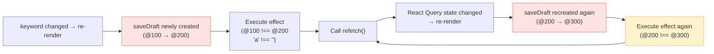
```mermaid
flowchart LR
    A["keyword changed → re-render"] --> B["saveDraft newly created<br/>(@100 → @200)"]
    B --> C["Execute effect<br/>(@100 !== @200<br/>'a' !== '')"]
    C --> D["Call refetch()"]
    D --> E["React Query state changed<br/>→ re-render"]
    E --> F["saveDraft recreated again<br/>(@200 → @300)"]
    F --> G["Execute effect again<br/>(@200 !== @300)"]
    G --> D

    style B fill:#ffe3e3,stroke:#ff6b6b
    style F fill:#ffe3e3,stroke:#ff6b6b
    style G fill:#fff3cd,stroke:#ffc107
```

## Stabilizing Objects with useMemo

If objects or arrays need to go into deps, use useMemo.

```jsx
function UserDashboard() {
  const [user, setUser] = useState({ name: 'Kim' });

  // Stabilize object reference with useMemo
  const config = useMemo(() => ({ theme: 'dark', locale: 'ko' }), []);

  useEffect(() => {
    applyConfig(config);
  }, [config]); // Executes only first time

  return <div>{user.name}</div>;
}
```

---

# React.memo and Memoization

useCallback and useMemo are needed in another important case: when passing props to child components wrapped with `React.memo`.

## How React.memo Works

`React.memo` skips re-rendering if props haven't changed. However, props comparison is also performed with `Object.is`.

```jsx
const ExpensiveChild = React.memo(({ onClick, data }) => {
  console.log('ExpensiveChild rendered');
  return <button onClick={onClick}>{data.label}</button>;
});

function Parent() {
  const [count, setCount] = useState(0);

  // New function/object created on every render
  const handleClick = () => console.log('clicked');
  const data = { label: 'Click me' };

  return (
    <>
      <button onClick={() => setCount(count + 1)}>Count: {count}</button>
      {/* ExpensiveChild also re-renders whenever count changes */}
      <ExpensiveChild onClick={handleClick} data={data} />
    </>
  );
}
```

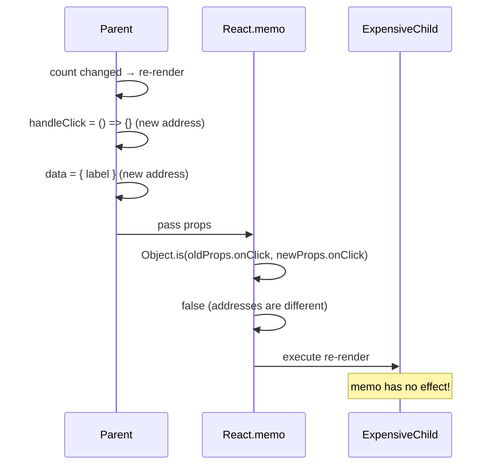
```mermaid
sequenceDiagram
    participant P as Parent
    participant M as React.memo
    participant C as ExpensiveChild

    P->>P: count changed → re-render
    P->>P: handleClick = () => {} (new address)
    P->>P: data = { label } (new address)
    P->>M: pass props
    M->>M: Object.is(oldProps.onClick, newProps.onClick)
    M->>M: false (addresses are different)
    M->>C: execute re-render
    Note over C: memo has no effect!
```

## Solving with Memoization

```jsx
function Parent() {
  const [count, setCount] = useState(0);

  // Stabilize references
  const handleClick = useCallback(() => console.log('clicked'), []);
  const data = useMemo(() => ({ label: 'Click me' }), []);

  return (
    <>
      <button onClick={() => setCount(count + 1)}>Count: {count}</button>
      {/* ExpensiveChild won't re-render even when count changes */}
      <ExpensiveChild onClick={handleClick} data={data} />
    </>
  );
}
```

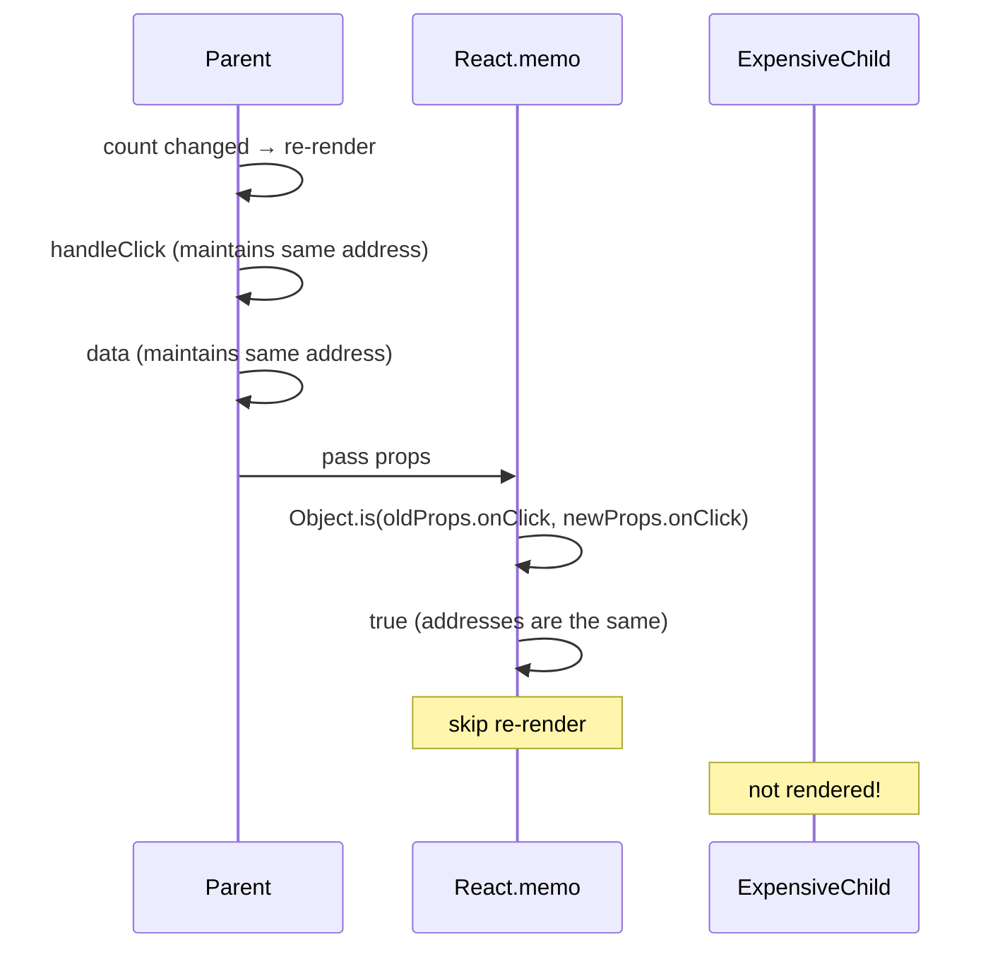
```mermaid
sequenceDiagram
    participant P as Parent
    participant M as React.memo
    participant C as ExpensiveChild

    P->>P: count changed → re-render
    P->>P: handleClick (maintains same address)
    P->>P: data (maintains same address)
    P->>M: pass props
    M->>M: Object.is(oldProps.onClick, newProps.onClick)
    M->>M: true (addresses are the same)
    Note over M: skip re-render
    Note over C: not rendered!
```

---

# ESLint Warning Limitations and Custom Hook Pitfalls

## The Role of eslint-plugin-react-hooks

`eslint-plugin-react-hooks` warns when a non-memoized function is placed in a dependency array.

```jsx
function Example() {
  const [count, setCount] = useState(0);

  // Non-memoized function
  const handleClick = () => {
    console.log(count);
  };

  useEffect(() => {
    handleClick();
  }, [handleClick]); // ESLint warning: The 'handleClick' function makes the dependencies of useEffect Hook change on every render

  return <button onClick={handleClick}>{count}</button>;
}
```

This warning tells us "the function is recreated on every render, which can cause the effect to run unnecessarily." ESLint suggests wrapping it with `useCallback` or moving the function inside the effect.

## Functions Returned from Custom Hooks Don't Trigger Warnings

The problem is that when a non-memoized function returned from a custom hook is added to dependencies, ESLint doesn't warn about it.

```jsx
// useAutoSave.ts - returning function without memoization
function useAutoSave() {
  const [lastSaved, setLastSaved] = useState<Date | null>(null);

  // Returning non-memoized function
  const save = (content: string) => {
    api.save(content);
    setLastSaved(new Date());
  };

  return { save, lastSaved };
}

// Component.tsx
function Editor() {
  const [content, setContent] = useState('');
  const { save } = useAutoSave(); // A new save function on every render

  useEffect(() => {
    const timer = setInterval(() => save(content), 5000);
    return () => clearInterval(timer);
  }, [save, content]); // No ESLint warning!

  return <textarea value={content} onChange={(e) => setContent(e.target.value)} />;
}
```

ESLint warns when a function declared inside a component is added to dependencies, but it assumes functions returned from hooks are "already stable references." However, in reality, if the hook doesn't memoize the function internally, a new function is created on every render.

## Result: Hard-to-track Issues

```jsx
function Editor() {
  const [content, setContent] = useState('');
  const [cursor, setCursor] = useState(0);
  const { save } = useAutoSave(); // Non-memoized function

  useEffect(() => {
    const timer = setInterval(() => save(content), 5000);
    return () => clearInterval(timer);
  }, [save, content]); // No ESLint warning, but issues occur

  // Every time cursor changes, useAutoSave returns a new save function
  return (
    <textarea
      value={content}
      onChange={(e) => setContent(e.target.value)}
      onSelect={(e) => setCursor(e.target.selectionStart)}
    />
  );
}
```

Every time the cursor position changes:
1. Component re-renders
2. `useAutoSave` returns a new `save` function (different memory address)
3. useEffect detects `save` change → effect re-runs
4. Old timer is cleaned up, new timer is created

ESLint doesn't warn about this issue because it assumes functions returned from hooks are stable references. This is why memoizing return values is crucial when designing custom hooks.

---

# Why Can't We Just Memoize Everything?

Could we prevent these issues by applying useCallback and useMemo everywhere? Theoretically, it might be safe. But indiscriminate memoization creates other problems.

## 1. Memory Overhead & Garbage Collection Burden

Garbage Collection automatically removes data that's no longer used in the browser. While memoization persists, Garbage Collection can't collect that data.

```jsx
const filtered = useMemo(
  () => items.filter((item) => item.category === filter),
  [items, filter]
);
```

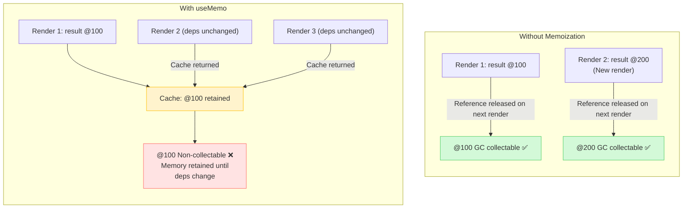
```mermaid
flowchart TB
    subgraph Without["Without Memoization"]
        direction TB
        A1["Render 1: result @100"]
        A2["Render 2: result @200
        (New render)"]
        A1 -->|"Reference released on next render"| GC1["@100 GC collectable ✅"]
        A2 -->|"Reference released on next render"| GC2["@200 GC collectable ✅"]
    end

    subgraph With["With useMemo"]
        direction TB
        C1["Render 1: result @100"]
        C2["Render 2 (deps unchanged)"]
        C3["Render 3 (deps unchanged)"]
        CACHE["Cache: @100 retained"]
        C1 --> CACHE
        C2 -->|"Cache returned"| CACHE
        C3 -->|"Cache returned"| CACHE
        CACHE --> BLOCK["@100 Non-collectable ❌
        Memory retained until
        deps change"]
    end

    style BLOCK fill:#ffe3e3,stroke:#ff6b6b
    style GC1 fill:#d3f9d8,stroke:#51cf66
    style GC2 fill:#d3f9d8,stroke:#51cf66
    style CACHE fill:#fff3cd,stroke:#ffc107
```

useMemo keeps only one cached value at a time. As long as dependencies don't change, the currently cached result (@100) remains in memory and GC can't collect it. It will continue occupying memory for as long as the component is mounted.

## 2. Dependency Array Comparison

On every re-render, the values in the dependency array are compared with their previous values. This comparison has O(n) time complexity based on the array length. We've done the memoization work for performance, but it actually makes things worse.

```jsx
// As the dependency array grows, comparison cost increases
const result = useMemo(
  () => a + b + c + d + e, // Actually a simple calculation
  [a, b, c, d, e] // 5 Object.is comparisons on every render
);

// For simple calculations, just computing is faster
const result = a + b + c + d + e;
```

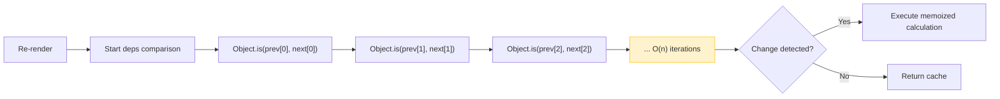
```mermaid
flowchart LR
    A["Re-render"] --> B["Start deps comparison"]
    B --> C["Object.is(prev[0], next[0])"]
    C --> D["Object.is(prev[1], next[1])"]
    D --> E["Object.is(prev[2], next[2])"]
    E --> F["... O(n) iterations"]
    F --> G{"Change detected?"}
    G -->|Yes| H["Execute memoized calculation"]
    G -->|No| I["Return cache"]

    style F fill:#fff3cd,stroke:#ffc107
```

For simple calculations, the comparison cost itself can exceed the actual computation cost.

## 3. Meaningless Optimization of Primitive Types

Primitive types don't need memoization. In fact, memoizing them hurts readability.

```jsx
// Bad: Unnecessary memoization on primitives
const doubled = useMemo(() => count * 2, [count]);
const isEven = useMemo(() => count % 2 === 0, [count]);
const label = useMemo(() => `Count: ${count}`, [count]);

// Good: Just compute
const doubled = count * 2;
const isEven = count % 2 === 0;
const label = `Count: ${count}`;
```

Primitives are compared by value, so the same value on each render returns `true` in an `Object.is` comparison. However, without useMemo, calculations like `count * 2` still execute on every render. What React prevents isn't the computation itself, but unnecessary re-renders of child components receiving these values as props.

## 4. Invites Mistakes

When all data is memoized, future developers can't tell which calculations are expensive. Also, if a dependency is omitted from the dependency array, it creates a stale closure bug.

```jsx
const [count, setCount] = useState(0);

// Omitting count from deps causes a stale closure
const handleClick = useCallback(() => {
  console.log(count); // Always logs 0 (stuck at initial value)
}, []); // ⚠️ count is missing

// No matter how much count changes, handleClick references a closure with count=0
```

> [!NOTE] Stale Closure
>
> A situation where memoization preserves and maintains old data, preventing it from being updated to the latest values.

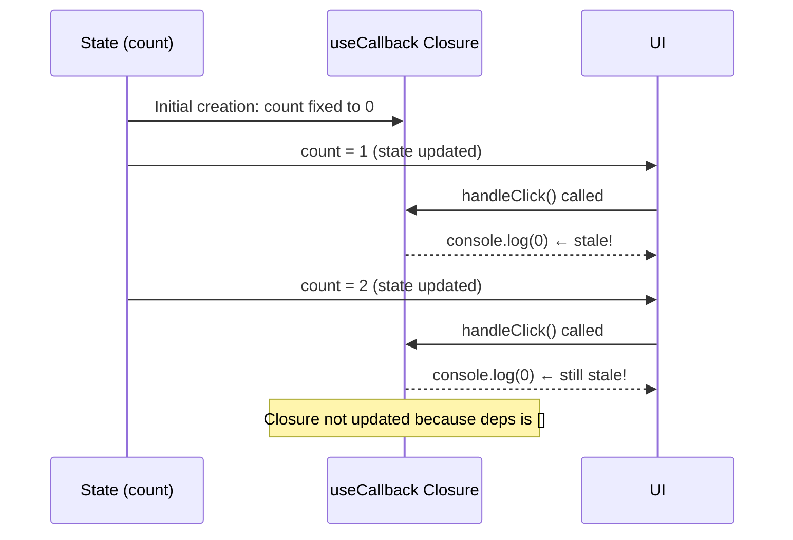
```mermaid
sequenceDiagram
    participant S as State (count)
    participant C as useCallback Closure
    participant U as UI

    S->>C: Initial creation: count fixed to 0
    S->>U: count = 1 (state updated)
    U->>C: handleClick() called
    C-->>U: console.log(0) ← stale!
    S->>U: count = 2 (state updated)
    U->>C: handleClick() called
    C-->>U: console.log(0) ← still stale!
    Note over C: Closure not updated because deps is []
```

---

# Principles of Memoization Application

Once you understand the costs of indiscriminate memoization, let's learn the principles for applying it correctly.

## Premature Optimization is a Trap

Write code first, measure actual bottlenecks with Profiler, then optimize.

```jsx
// ❌ Optimize prematurely before confirming slowness
function ItemList({ items, onSelect }) {
  const filtered = useMemo(() => items.filter(isActive), [items]);
  const handleClick = useCallback((id) => onSelect(id), [onSelect]);

  return filtered.map((item) => (
    <Item key={item.id} data={item} onClick={handleClick} />
  ));
}

// ✅ Write first, identify bottlenecks with Profiler, then optimize
function ItemList({ items, onSelect }) {
  const filtered = items.filter(isActive);

  return filtered.map((item) => (
    <Item key={item.id} data={item} onClick={(id) => onSelect(id)} />
  ));
}
```

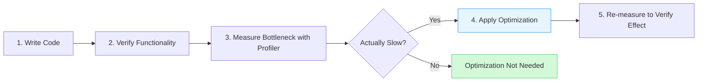
```mermaid
flowchart LR
    A["1. Write Code"] --> B["2. Verify Functionality"]
    B --> C["3. Measure Bottleneck with Profiler"]
    C --> D{"Actually Slow?"}
    D -->|Yes| E["4. Apply Optimization"]
    D -->|No| F["Optimization Not Needed"]
    E --> G["5. Re-measure to Verify Effect"]

    style F fill:#d3f9d8,stroke:#51cf66
    style E fill:#e7f5ff,stroke:#339af0
```

## Calculate the Cost of Optimization

Every optimization has trade-offs. Optimization without context only adds costs.

```jsx
// ✅ React.memo is effective: list items rendered repeatedly
// Saves costs equal to the number of items × rendering count
const ListItem = React.memo(({ item, onDelete }) => {
  return <div onClick={() => onDelete(item.id)}>{item.name}</div>;
});

// ❌ useCallback is unnecessary: functions not used in props or dependencies
function Component() {
  // Only adds comparison cost, no practical benefit
  const getLabel = useCallback(() => 'Hello', []);
  return <div>{getLabel()}</div>;
}

// ✅ If not passed to props or dependencies, just declare it
function Component() {
  const getLabel = () => 'Hello';
  return <div>{getLabel()}</div>;
}
```

| Case | Apply Optimization? | Reason |
|------|---------------------|--------|
| List item component | Consider React.memo | Savings accumulate by the number of items |
| Function passed to deps/props | useCallback needed | Reference stability required in some cases |
| Simple function used only internally | Not needed | Only adds comparison cost |
| Complex calculations (sorting, filtering) | useMemo needed | Prevent repeated calculations on each render |
| Simple arithmetic (count * 2) | Not needed | Calculation cost < memoization cost |

Use memoization only where absolutely necessary. Always prove it with data and then apply it.

---

# Before Memoization: Structural Optimization

Before applying memoization optimization, we need "structural optimization". When you decide that memoization optimization is necessary, please go through the following thought process first to make a judgment.

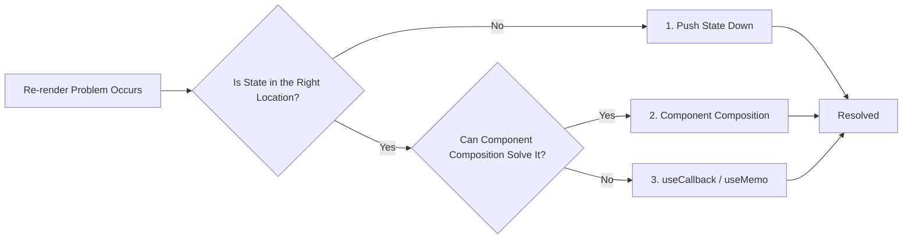
```mermaid
flowchart LR
    A["Re-render Problem Occurs"] --> B{"Is State in the Right Location?"}
    B -->|No| C["1. Push State Down"]
    B -->|Yes| D{"Can Component Composition Solve It?"}
    D -->|Yes| E["2. Component Composition"]
    D -->|No| F["3. useCallback / useMemo"]
    C --> G["Resolved"]
    E --> G
    F --> G
```

## 1. Push State Down

Check if some state is incorrectly scoped. State should be isolated to only the component that uses it.

```jsx
// Bad: count state is in App, causing HeavyComponent to re-render unnecessarily
function App() {
  const [count, setCount] = useState(0);

  return (
    <div>
      <button onClick={() => setCount(count + 1)}>Count: {count}</button>
      <HeavyComponent /> {/* Re-renders unnecessarily when count changes */}
    </div>
  );
}

// Good: Push state down to the component that uses count
function Counter() {
  const [count, setCount] = useState(0);
  return <button onClick={() => setCount(count + 1)}>Count: {count}</button>;
}

function App() {
  return (
    <div>
      <Counter />
      <HeavyComponent /> {/* Completely unrelated to Counter's re-renders */}
    </div>
  );
}
```

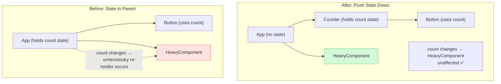
```mermaid
flowchart TB
    subgraph After["After: Push State Down"]
        A2["App (no state)"]
        A2 --> B2["Counter (holds count state)"]
        B2 --> D2["Button (uses count)"]
        A2 --> C2["HeavyComponent"]
        note["count changes → HeavyComponent
        unaffected ✅"]
        style C2 fill:#d3f9d8,stroke:#51cf66
    end

    subgraph Before["Before: State in Parent"]
        A1["App (holds count state)"]
        A1 --> B1["Button (uses count)"]
        A1 --> C1["HeavyComponent"]
        A1 -. "count changes →
        unnecessary re-render occurs" .-> C1
        style C1 fill:#ffe3e3,stroke:#ff6b6b
    end
```

When you narrow the scope of state, the scope of re-rendering narrows as well. You can prevent unnecessary re-renders without memoization.

## 2. Component Composition

When you create a wrapper component that receives children as a prop, even when the wrapper component re-renders, the reference of the children remains the same, causing automatic bailout for child components.

> [!NOTE] bailout
>
> When React skips re-rendering. JSX elements passed via the children prop maintain the same reference address even when the parent component re-renders, so bailout occurs.

```jsx
// Bad: HeavyContent also re-renders when ThemeProvider re-renders
function ThemeProvider() {
  const [theme, setTheme] = useState('light');

  return (
    <div className={theme}>
      <button onClick={() => setTheme(theme === 'light' ? 'dark' : 'light')}>
        Change Theme
      </button>
      <HeavyContent /> {/* Re-renders unnecessarily when theme changes */}
    </div>
  );
}

// Good: Accept children as a prop for composition
function ThemeProvider({ children }) {
  const [theme, setTheme] = useState('light');

  return (
    <div className={theme}>
      <button onClick={() => setTheme(theme === 'light' ? 'dark' : 'light')}>
        Change Theme
      </button>
      {children} {/* Even if parent re-renders, reference address is same → automatic bailout */}
    </div>
  );
}

function App() {
  return (
    <ThemeProvider>
      <HeavyContent /> {/* Unrelated to ThemeProvider re-renders */}
    </ThemeProvider>
  );
}
```

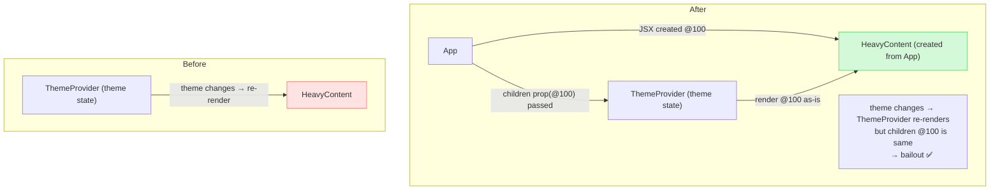
```mermaid
flowchart TB
    subgraph After["After"]
        A2["App"]
        A2 -->|"JSX created @100"| H2["HeavyContent (created from App)"]
        A2 -->|"children prop(@100) passed"| W2["ThemeProvider (theme state)"]
        W2 -->|"render @100 as-is"| H2
        note["theme changes → ThemeProvider re-renders
        but children @100 is same
        → bailout ✅"]
        style H2 fill:#d3f9d8,stroke:#51cf66
    end

    subgraph Before["Before"]
        W1["ThemeProvider (theme state)"]
        W1 -->|"theme changes → re-render"| H1["HeavyContent"]
        style H1 fill:#ffe3e3,stroke:#ff6b6b
    end
```

Since HeavyContent is created from App, the reference address of the children JSX doesn't change even if ThemeProvider re-renders. React detects this and bails out HeavyContent's re-render.

## 3. Optimization Hooks (useCallback, useMemo)

If the above methods don't solve the problem, now use useCallback and useMemo. Like the cases covered in this document, dependency array stabilization, using together with React.memo, and maintaining reference stability of custom hook return values fall into this category.
