```mermaid
sequenceDiagram
    participant P as Parent
    participant M as React.memo
    participant C as ExpensiveChild

    P->>P: count changes → re-render
    P->>P: handleClick (same address maintained)
    P->>P: data (same address maintained)
    P->>M: Pass props
    M->>M: Object.is(oldProps.onClick, newProps.onClick)
    M->>M: true (addresses same)
    Note over M: Skip re-render
    Note over C: No rendering!
```

# Why Use useCallback and useMemo

The reason for using useCallback and useMemo in React is not simply "performance optimization." Understanding JavaScript's reference type characteristics and React's dependency array behavior reveals why these hooks are essential in certain situations.

After reading this document, you will understand:
- Memory behavior differences between primitive and reference types
- Why reference types are dangerous in useEffect dependency arrays
- Hidden pitfalls in custom hooks that ESLint cannot warn about
- Memoization design principles for reference type data

---

# Memory Structure of Primitive and Reference Types

JavaScript data types are divided into Primitive and Reference types.

## Primitive Data

Primitive data stores the value directly in the memory address. Variables point to that memory address, and the value is stored at that address.

```javascript
let a = 1;
let b = 1;

console.log(a === b); // true
```

**Memory Structure:**



```mermaid
flowchart TB
    subgraph Memory["Memory"]
        direction TB
        A1["Memory Address @100<br/>Value: 1"]
        B1["Memory Address @200<br/>Value: 1"]
    end
    
    subgraph Variables["Variables"]
        direction TB
        A2["Variable a → @100"]
        B2["Variable b → @200"]
    end
    
    A2 --> A1
    B2 --> B1
    
    Note1["Primitive data stores<br/>value directly in<br/>memory address"]
    
    Memory --> Note1
```

`a` points to memory address @100, where value `1` is directly stored. `b` points to memory address @200, where value `1` is directly stored. The comparison operator (`===`) compares the stored values themselves, so it returns `true`.

**Key Point:**
- Primitive data uses the memory address that directly contains the data
- The value is stored directly at the memory address

## Reference Data

Reference data has a memory address for the object, and when you go to that address, the primitive data inside the object each have their own memory locations.

```javascript
const obj1 = { value: 1 };
const obj2 = { value: 1 };

console.log(obj1 === obj2); // false
```

**Memory Structure:**



```mermaid
flowchart TB
    subgraph Variables["Variables"]
        direction TB
        V1["Variable obj1 → @1000"]
        V2["Variable obj2 → @2000"]
    end
    
    subgraph Heap["Heap Memory"]
        direction TB
        subgraph O1["Object @1000"]
            direction TB
            P1["@1000+0x00: value<br/>Value: 1<br/>(Primitive number)"]
        end
        
        subgraph O2["Object @2000"]
            direction TB
            P2["@2000+0x00: value<br/>Value: 1<br/>(Primitive number)"]
        end
    end
    
    V1 -->|"reference"| O1
    V2 -->|"reference"| O2
    
    Note1["When you go to object address (@1000),<br/>primitive values inside<br/>each have their own memory locations"]
    
    O1 -.-> Note1
    O2 -.-> Note1
```

`obj1` points to object address @1000, and when you go to that address, the `value` property inside is stored at memory location @1000+0x00. `obj2` points to object address @2000, and the `value` inside is stored at @2000+0x00. The comparison operator (`===`) compares object addresses, so it returns `false`.

**Key Point:**
- Reference data has a memory address for the object
- When you go to that address, the primitive data inside the object each have their own memory locations

### Memory Structure in Detail Example

Let's examine the memory structure with a more complex example.

```javascript
const user = { name: 'Kim', age: 25 };
```

**Memory Structure:**



```mermaid
flowchart TB
    subgraph Variables["Variables"]
        V1["Variable user → @1000"]
    end
    
    subgraph Heap["Heap Memory"]
        direction TB
        subgraph Object["Object @1000"]
            direction TB
            P1["@1000+0x00: name<br/>Value: 'Kim'<br/>(Primitive string)"]
            P2["@1000+0x10: age<br/>Value: 25<br/>(Primitive number)"]
        end
    end
    
    V1 -->|"reference"| Object
    Object --> P1
    Object --> P2
    
    Note1["When you go to object address (@1000),<br/>primitive values inside<br/>each have their own memory addresses"]
    
    Object -.-> Note1
```

**Nested Object Example:**

```javascript
const user = {
  name: 'Kim',
  address: { city: 'Seoul', zip: '12345' }
};
```



```mermaid
flowchart TB
    subgraph Variables["Variables"]
        V1["Variable user → @1000"]
    end
    
    subgraph Heap["Heap Memory"]
        direction TB
        subgraph O1["Object @1000"]
            direction TB
            P1["@1000+0x00: name<br/>Value: 'Kim'<br/>(Primitive)"]
            P2["@1000+0x10: address<br/>Value: @2000<br/>(Reference address)"]
        end
        
        subgraph O2["Object @2000"]
            direction TB
            P3["@2000+0x00: city<br/>Value: 'Seoul'<br/>(Primitive)"]
            P4["@2000+0x10: zip<br/>Value: '12345'<br/>(Primitive)"]
        end
    end
    
    V1 -->|"reference"| O1
    P2 -->|"reference"| O2
    
    Note1["Primitive values inside each object<br/>each have their own memory addresses"]
    
    O1 -.-> Note1
    O2 -.-> Note1
```

### Primitive vs Reference Comparison

Now let's compare the memory behavior differences between primitives and references at a glance.

```javascript
// Primitive example
let a = 1;
let b = 1;
console.log(a === b); // true

// Reference example
const obj1 = { value: 1 };
const obj2 = { value: 1 };
console.log(obj1 === obj2); // false
```


**Key Differences Summary:**

| Aspect | Primitive | Reference |
|--------|-----------|-----------|
| **Storage Location** | Value stored directly in stack | Object stored in heap, only address in stack |
| **Assignment Method** | Value copy (Pass by Value) | Address copy (Pass by Reference) |
| **Comparison** | Compares values themselves | Compares addresses |
| **Independence** | Each variable has independent value | Variables pointing to same address share object |
| **Memory** | Fixed size, fast access | Dynamic size, slower access |

**Practical Example:**

```javascript
// Primitive: Value copy
let x = 10;
let y = x;  // y gets a copy of 10
y = 20;     // Only y changes
console.log(x); // 10 (x is unaffected)

// Reference: Address copy
let objA = { count: 10 };
let objB = objA;  // objB copies objA's address
objB.count = 20;  // Modifies the same object
console.log(objA.count); // 20 (objA is affected)
```

## Functions Are Also Reference Types

Functions are first-class objects in JavaScript and are reference type data.

```javascript
const fn1 = () => console.log('hello');
const fn2 = () => console.log('hello');

console.log(fn1 === fn2); // false
```

Even functions with identical code are assigned new memory addresses each time they are declared.

## JavaScript Type Classification


---

# useEffect Dependency Array and Reference Type Pitfalls

React's useEffect executes the callback when values in the dependency array change. The problem is that this comparison is performed using `Object.is`.

## Primitives Are Safe

```jsx
function Counter() {
  const [count, setCount] = useState(0);

  useEffect(() => {
    console.log('count changed:', count);
  }, [count]);

  return <button onClick={() => setCount(count + 1)}>Increment</button>;
}
```

Since `count` is a primitive (number), the effect only runs when the value actually changes.

## Reference Types Are Dangerous

```jsx
function UserProfile() {
  const [user, setUser] = useState({ name: 'Kim' });

  // New object created on every render
  const config = { theme: 'dark' };

  useEffect(() => {
    console.log('config changed');
  }, [config]); // Runs on every render

  return <div>{user.name}</div>;
}
```

`config` is created as an object with a new memory address on every render. Even if the content is identical, React considers it "changed."


## Infinite Re-rendering Case

This is a common pattern in real projects. When you put a function in the dependency array and change state inside the effect, an infinite loop occurs.

```jsx
function SearchPage() {
  const [keyword, setKeyword] = useState('');
  const [searchCount, setSearchCount] = useState(0);

  // New function created on every render
  const inlineSaveDraft = () => {
    console.log('Executing search:', keyword);
  };

  useEffect(() => {
    if (keyword) {
      inlineSaveDraft();
      setSearchCount((prev) => prev + 1); // Track search count → triggers re-render
    }
  }, [inlineSaveDraft, keyword]); // Infinite loop!

  return (
    <>
      <input value={keyword} onChange={(e) => setKeyword(e.target.value)} placeholder="Enter search term" />
      <div>Search count: {searchCount}</div>
    </>
  );
}
```

Execution flow:
1. Component renders → `inlineSaveDraft` function created (@100)
2. useEffect executes → calls `inlineSaveDraft()` → executes `setSearchCount`
3. State change causes re-render → `inlineSaveDraft` function recreated (@200)
4. useEffect detects `@100 !== @200` → executes again
5. Steps 2-4 repeat (infinite loop)

```mermaid
flowchart LR
    A["User types in input"] --> B["keyword state changes"]
    B --> C["Component re-renders"]
    C --> D["inlineSaveDraft function recreated<br/>(@100 → @200)"]
    D --> E["useEffect deps comparison"]
    E --> F{"inlineSaveDraft address different?<br/>(@100 !== @200)"}
    F -->|Yes| G["effect runs: inlineSaveDraft()"]
    G --> H["setSearchCount called"]
    H --> I["searchCount changes → re-render"]
    I --> J["inlineSaveDraft function recreated again<br/>(@200 → @300)"]
    J --> K["useEffect deps comparison<br/>(@200 !== @300)"]
    K --> G
    F -->|No| L["effect skipped"]
```



### Memory Address Changes Confirmed in Chrome DevTools

You can verify that functions have new memory addresses on every render in Chrome DevTools' Memory tab.

The screenshot below shows a comparison of Heap Snapshots. You can see that the `inlineSaveDraft` function has different memory addresses in each snapshot.

**Function address in Snapshot 1:**


**Newly created functions in Snapshot 2:**


**Functions with another address in Snapshot 3:**


In each snapshot, the `inlineSaveDraft` function has different memory addresses like `@200175`, `@473745`, `@483163`. This is why React considers the function "changed" on every render.

## Solving with useCallback

Using useCallback allows you to maintain a stable function reference.

```jsx
function SearchPage() {
  const [keyword, setKeyword] = useState('');
  const [searchCount, setSearchCount] = useState(0);

  // Stabilize function reference with useCallback
  // Function only recreated when keyword changes (unrelated to searchCount changes)
  const saveDraft = useCallback(() => {
    console.log('Executing search:', keyword);
  }, [keyword]); // Function recreated only when keyword changes

  useEffect(() => {
    if (keyword) {
      saveDraft();
      // Even if searchCount changes, saveDraft address remains the same so effect doesn't re-run
      setSearchCount((prev) => prev + 1);
    }
  }, [saveDraft, keyword]); // Effect runs only when keyword changes

  return (
    <>
      <input value={keyword} onChange={(e) => setKeyword(e.target.value)} placeholder="Enter search term" />
      <div>Search count: {searchCount}</div>
    </>
  );
}
```

#### ❌ Problem: Without useCallback

**Problematic code:**

```jsx
function SearchPage() {
  const [keyword, setKeyword] = useState('');
  const [searchCount, setSearchCount] = useState(0);

  // ⚠️ New function created on every render (no memoization)
  const inlineSaveDraft = () => {
    console.log('Executing search:', keyword);
  };

  useEffect(() => {
    if (keyword) {
      inlineSaveDraft();
      setSearchCount((prev) => prev + 1); // Track search count
    }
  }, [inlineSaveDraft, keyword]); // Infinite loop occurs!
}
```

**Execution flow:**

```jsx
// Step 1: User types "react" in input
<input value={keyword} onChange={(e) => setKeyword(e.target.value)} />
// → setKeyword('react') called
// → keyword: '' → 'react'

// Step 2: Component re-renders
function SearchPage() {
  // Step 3: New function created on every render
  const inlineSaveDraft = () => {
    console.log('Executing search:', keyword);
  }; // @100 (new memory address)

  // Step 4: useEffect deps comparison
  useEffect(() => {
    if (keyword) {
      inlineSaveDraft(); // Execute
      setSearchCount((prev) => prev + 1); // searchCount: 0 → 1
    }
  }, [inlineSaveDraft, keyword]);
  // Previous deps: [undefined, ''] (first render)
  // Current deps: [@100, 'react']
  // @100 !== undefined → effect runs ✅
}

// Step 5: Re-render occurs due to searchCount change
// searchCount: 0 → 1

// Step 6: Re-render causes inlineSaveDraft function to be created again
function SearchPage() {
  const inlineSaveDraft = () => {
    console.log('Executing search:', keyword);
  }; // @200 (new memory address, different from @100!)

  // Step 7: useEffect deps comparison
  useEffect(() => {
    if (keyword) {
      inlineSaveDraft(); // Execute again
      setSearchCount((prev) => prev + 1); // searchCount: 1 → 2
    }
  }, [inlineSaveDraft, keyword]);
  // Previous deps: [@100, 'react']
  // Current deps: [@200, 'react']
  // @100 !== @200 → effect runs again! ⚠️
}

// Step 8: Another re-render due to searchCount change
// searchCount: 1 → 2

// Step 9: Re-render causes inlineSaveDraft function to be created again
// @300 created → effect runs again → searchCount: 2 → 3
// @400 created → effect runs again → searchCount: 3 → 4
// ... infinite loop 🔄
```

**Core problem:**
- `keyword` hasn't changed (still `'react'`)
- Only `inlineSaveDraft` function keeps being recreated (only memory address changes: @100 → @200 → @300)
- React compares memory addresses in deps comparison (`@100 !== @200`)
- React considers it "changed" every time and runs the effect
- Effect runs → `setSearchCount` → re-render → function recreated → effect runs (infinite loop)


#### ✅ Solution: With useCallback

**Fixed code:**

```jsx
function SearchPage() {
  const [keyword, setKeyword] = useState('');
  const [searchCount, setSearchCount] = useState(0);

  // ✅ Stabilize function reference with useCallback
  // Function only recreated when keyword changes (unrelated to searchCount changes)
  const saveDraft = useCallback(() => {
    console.log('Executing search:', keyword);
  }, [keyword]); // Function recreated only when keyword changes

  useEffect(() => {
    if (keyword) {
      saveDraft();
      // Even if searchCount changes, saveDraft address remains the same so effect doesn't re-run
      setSearchCount((prev) => prev + 1);
    }
  }, [saveDraft, keyword]);
}
```

**Execution flow:**

```jsx
// Step 1: User types "react" in input
<input value={keyword} onChange={(e) => setKeyword(e.target.value)} />
// → setKeyword('react') called
// → keyword: '' → 'react'

// Step 2: Component re-renders
function SearchPage() {
  // Step 3: Stabilize function reference with useCallback
  const saveDraft = useCallback(() => {
    console.log('Executing search:', keyword);
  }, [keyword]); // keyword changed from '' → 'react', so new function created
  // @100 created (depends on keyword='react')

  // Step 4: useEffect deps comparison
  useEffect(() => {
    if (keyword) {
      saveDraft(); // Execute
      setSearchCount((prev) => prev + 1); // searchCount: 0 → 1
    }
  }, [saveDraft, keyword]);
  // Previous deps: [undefined, '']
  // Current deps: [@100, 'react']
  // @100 !== undefined → effect runs ✅
}

// Step 5: Re-render occurs due to searchCount change
// searchCount: 0 → 1

// Step 6: Re-render but keyword is same, so saveDraft address maintained
function SearchPage() {
  const saveDraft = useCallback(() => {
    console.log('Executing search:', keyword);
  }, [keyword]); // keyword='react' (no change)
  // @100 maintained! (keyword is same, so useCallback returns same reference)

  // Step 7: useEffect deps comparison
  useEffect(() => {
    if (keyword) {
      saveDraft();
      setSearchCount((prev) => prev + 1);
    }
  }, [saveDraft, keyword]);
  // Previous deps: [@100, 'react']
  // Current deps: [@100, 'react']
  // @100 === @100 && 'react' === 'react' → effect skipped! ✅
}

// Step 8: User types "vue" in input
// keyword: 'react' → 'vue'

// Step 9: Re-render due to keyword change
function SearchPage() {
  const saveDraft = useCallback(() => {
    console.log('Executing search:', keyword);
  }, [keyword]); // keyword changed to 'vue', so new function created
  // @200 created (depends on keyword='vue')

  // Step 10: useEffect deps comparison
  useEffect(() => {
    if (keyword) {
      saveDraft(); // Execute
      setSearchCount((prev) => prev + 1);
    }
  }, [saveDraft, keyword]);
  // Previous deps: [@100, 'react']
  // Current deps: [@200, 'vue']
  // @100 !== @200 → effect runs ✅ (as intended!)
}
```

**Core solution:**
- `useCallback` only recreates the function when `keyword` changes
- Even when `searchCount` changes, `keyword` remains the same, so `saveDraft` address is maintained (@100)
- React compares deps and sees `@100 === @100`, so it considers it "unchanged"
- Effect only runs when `keyword` actually changes
- Infinite loop solved! ✅

**Comparison summary:**

| Situation | inlineSaveDraft (no memoization) | saveDraft (useCallback) |
|-----------|--------------------------------|-------------------------|
| keyword changes | @100 → @200 (new function) | @100 → @200 (new function) |
| searchCount changes | @200 → @300 (new function) ⚠️ | @100 → @100 (same reference) ✅ |
| effect runs | Every time (infinite loop) | Only when keyword changes |


### React Query Makes It Even More Complex

In real projects, you often use React Query (TanStack Query) together. This makes debugging much harder.

```jsx
function SearchPage() {
  const [keyword, setKeyword] = useState('');

  // Using React Query
  const { data, refetch, isFetching } = useQuery({
    queryKey: ['search', keyword],
    queryFn: () => fetchSearchResults(keyword),
    enabled: !!keyword,
  });

  // New function created on every render
  const inlineSaveDraft = () => {
    console.log('Executing search:', keyword);
    refetch(); // Refetch data
  };

  useEffect(() => {
    if (keyword) {
      inlineSaveDraft();
    }
  }, [inlineSaveDraft, keyword]); // Problem occurs!

  return (
    <>
      <input value={keyword} onChange={(e) => setKeyword(e.target.value)} />
      {isFetching && <div>Loading...</div>}
      <ul>{data?.map((r, i) => <li key={i}>{r}</li>)}</ul>
    </>
  );
}
```

#### Step 1: Initial Input Causes Re-render

This starts the moment the user types "react" in the input field.

```jsx
// User types "react" in input
<input value={keyword} onChange={(e) => setKeyword(e.target.value)} />
// → setKeyword('react') called
```

**Execution flow:**

```jsx
// 1. keyword state changes
const [keyword, setKeyword] = useState(''); // '' → 'react'

// 2. Component re-renders
function SearchPage() {
  // 3. New function created on every render (new memory address)
  const inlineSaveDraft = () => {
    console.log('Executing search:', keyword); // @200 (was @100 in previous render)
    refetch();
  };

  // 4. useEffect deps comparison
  useEffect(() => {
    if (keyword) {
      inlineSaveDraft();
    }
  }, [inlineSaveDraft, keyword]); 
  // Previous deps: [@100, ''] 
  // Current deps: [@200, 'react']
  // @100 !== @200 → effect runs!
}
```



```mermaid
flowchart LR
    A["User types in input"] --> B["keyword state changes"]
    B --> C["Component re-renders"]
    C --> D["inlineSaveDraft newly created<br/>(@100 → @200)"]
    D --> E["useEffect deps comparison<br/>(@100 !== @200)"]
    E --> F["effect runs"]
    
    style D fill:#ffe3e3,stroke:#ff6b6b
    style E fill:#fff3cd,stroke:#ffc107
    style F fill:#ffe3e3,stroke:#ff6b6b
```

**Core problem:** Since the `inlineSaveDraft` function receives a new memory address on every render, React recognizes it as a "changed value."

#### Step 2: Chain Reaction from React Query State Change

When the effect runs in Step 1, `refetch()` is called inside it.

```jsx
useEffect(() => {
  if (keyword) {
    inlineSaveDraft(); // This function calls refetch() inside
  }
}, [inlineSaveDraft, keyword]);

// Inside inlineSaveDraft function
const inlineSaveDraft = () => {
  console.log('Executing search:', keyword);
  refetch(); // ⚠️ Problem starts here!
};
```

**Execution flow:**

```jsx
// 1. effect runs → inlineSaveDraft() called
useEffect(() => {
  inlineSaveDraft(); // Calls refetch()
}, [inlineSaveDraft, keyword]);

// 2. refetch() called, causing React Query state to change
const { data, refetch, isFetching } = useQuery({
  queryKey: ['search', keyword],
  queryFn: () => fetchSearchResults(keyword),
  enabled: !!keyword,
});
// isFetching: false → true → false (loading complete)
// data: undefined → [...results] (data updated)

// 3. React Query state change causes component re-render
// → SearchPage() function runs again

// 4. Re-render causes inlineSaveDraft function to be created again
function SearchPage() {
  const inlineSaveDraft = () => { // @300 (was @200 before)
    console.log('Executing search:', keyword);
    refetch();
  };

  // 5. useEffect deps comparison
  useEffect(() => {
    if (keyword) {
      inlineSaveDraft();
    }
  }, [inlineSaveDraft, keyword]);
  // Previous deps: [@200, 'react']
  // Current deps: [@300, 'react']
  // @200 !== @300 → effect runs again!
}
```


**Core problem:** `refetch()` changes React Query state, which causes the component to re-render, and `inlineSaveDraft` function is created again. Developers think "the effect ran because keyword changed," but in reality, a chain reaction occurs: React Query state change → function recreation → effect re-execution.

#### Step 3: Infinite Loop Occurs

When the effect runs again in Step 2, the same process repeats.

```jsx
// Effect re-executes from Step 2
useEffect(() => {
  if (keyword) {
    inlineSaveDraft(); // Calls function at address @300
  }
}, [inlineSaveDraft, keyword]); // [@300, 'react']

// inlineSaveDraft executes → refetch() called
const inlineSaveDraft = () => {
  console.log('Executing search:', keyword);
  refetch(); // React Query state changes
};

// React Query state changes → re-render
// → inlineSaveDraft @400 created
// → useEffect deps comparison: @300 !== @400
// → effect runs again
// → refetch() called again
// → re-render
// → inlineSaveDraft @500 created
// → ... infinite loop 🔄
```

**Execution flow (infinite loop):**

```jsx
// Render 1
const inlineSaveDraft = () => { ... }; // @200
useEffect(..., [@200, 'react']); // effect runs

// Render 2 (re-render due to refetch)
const inlineSaveDraft = () => { ... }; // @300
useEffect(..., [@300, 'react']); // @200 !== @300 → effect runs

// Render 3 (re-render due to refetch)
const inlineSaveDraft = () => { ... }; // @400
useEffect(..., [@400, 'react']); // @300 !== @400 → effect runs

// Render 4 (re-render due to refetch)
const inlineSaveDraft = () => { ... }; // @500
useEffect(..., [@500, 'react']); // @400 !== @500 → effect runs

// ... infinite loop
```

**Symptoms you can see in browser console:**

```jsx
// Console output (infinite loop)
Executing search: react
Executing search: react
Executing search: react
Executing search: react
// ... continues indefinitely
```

**Check in React DevTools:**

- Components tab shows component constantly flickering (re-rendering)
- Profiler shows infinite rendering loop


**Why does this happen?**

1. `keyword` hasn't changed (still `'react'`)
2. Only `inlineSaveDraft` function keeps being recreated (only memory address changes)
3. React compares memory addresses in deps comparison (`@200 !== @300 !== @400`)
4. React considers it "changed" every time and runs the effect
5. Effect runs → refetch → re-render → function recreated → effect runs (infinite loop)

**Why is it hard to track?**

1. When `keyword` changes, the effect should run (intended behavior)
2. When React Query's `refetch()` is called, query state (`isFetching`, `data`, etc.) changes
3. Query state change causes component re-render, and `inlineSaveDraft` is recreated
4. Developers think "the effect ran because keyword changed," but in reality, a chain reaction occurs: React Query state change → function recreation → effect re-execution

ESLint warns in this situation, but when React Query is involved, it's very difficult to identify which dependency is the problem. You need to understand the circular structure where `refetch` changes state, and that state change triggers another render.

## Stabilizing Objects with useMemo

When objects or arrays need to be in deps, use useMemo.

```jsx
function UserDashboard() {
  const [user, setUser] = useState({ name: 'Kim' });

  // Stabilize object reference with useMemo
  const config = useMemo(() => ({ theme: 'dark', locale: 'ko' }), []);

  useEffect(() => {
    applyConfig(config);
  }, [config]); // Executes only once initially

  return <div>{user.name}</div>;
}
```

---

# React.memo and Memoization

Another important case where useCallback and useMemo are needed is when passing props to child components wrapped with `React.memo`.

## How React.memo Works

`React.memo` skips re-rendering when props haven't changed. However, props comparison is also performed using `Object.is`.

```jsx
const ExpensiveChild = React.memo(({ onClick, data }) => {
  console.log('ExpensiveChild rendering');
  return <button onClick={onClick}>{data.label}</button>;
});

function Parent() {
  const [count, setCount] = useState(0);

  // New function/object created on every render
  const handleClick = () => console.log('clicked');
  const data = { label: 'Click me' };

  return (
    <>
      <button onClick={() => setCount(count + 1)}>Count: {count}</button>
      {/* ExpensiveChild also re-renders whenever count changes */}
      <ExpensiveChild onClick={handleClick} data={data} />
    </>
  );
}
```


## Solving with Memoization

```jsx
function Parent() {
  const [count, setCount] = useState(0);

  // Stabilize references
  const handleClick = useCallback(() => console.log('clicked'), []);
  const data = useMemo(() => ({ label: 'Click me' }), []);

  return (
    <>
      <button onClick={() => setCount(count + 1)}>Count: {count}</button>
      {/* ExpensiveChild does not re-render even when count changes */}
      <ExpensiveChild onClick={handleClick} data={data} />
    </>
  );
}
```



---

# ESLint Warning Limitations and Custom Hook Pitfalls

## Role of eslint-plugin-react-hooks

`eslint-plugin-react-hooks` warns when non-memoized functions are placed in dependency arrays.

```jsx
function Example() {
  const [count, setCount] = useState(0);

  // Non-memoized function
  const handleClick = () => {
    console.log(count);
  };

  useEffect(() => {
    handleClick();
  }, [handleClick]); // ESLint warning: The 'handleClick' function makes the dependencies of useEffect Hook change on every render

  return <button onClick={handleClick}>{count}</button>;
}
```

This warning tells you that "the function is recreated on every render, which may cause unnecessary effect execution." ESLint suggests wrapping it with `useCallback` or moving the function inside the effect.

## Functions Returned from Custom Hooks Are Not Warned

The problem is that ESLint does not warn when non-memoized functions returned from custom hooks are placed in deps.

```jsx
// useAutoSave.ts - Returns function without memoization
function useAutoSave() {
  const [lastSaved, setLastSaved] = useState<Date | null>(null);

  // Returns non-memoized function
  const save = (content: string) => {
    api.save(content);
    setLastSaved(new Date());
  };

  return { save, lastSaved };
}

// Component.tsx
function Editor() {
  const [content, setContent] = useState('');
  const { save } = useAutoSave(); // New save function on every render

  useEffect(() => {
    const timer = setInterval(() => save(content), 5000);
    return () => clearInterval(timer);
  }, [save, content]); // No ESLint warning!

  return <textarea value={content} onChange={(e) => setContent(e.target.value)} />;
}
```


ESLint warns when functions declared inside components are in deps, but assumes functions returned from hooks are "already stable references." However, if hooks don't memoize internally, new functions are created on every render.

## Result: Hidden Performance Issues

```jsx
function Editor() {
  const [content, setContent] = useState('');
  const [cursor, setCursor] = useState(0);
  const { save } = useAutoSave(); // Non-memoized function

  useEffect(() => {
    const timer = setInterval(() => save(content), 5000);
    return () => clearInterval(timer);
  }, [save, content]); // No ESLint warning, but problem occurs

  // useAutoSave returns new save function whenever cursor changes
  return (
    <textarea
      value={content}
      onChange={(e) => setContent(e.target.value)}
      onSelect={(e) => setCursor(e.target.selectionStart)}
    />
  );
}
```

Whenever the cursor position changes:
1. Component re-renders
2. `useAutoSave` returns new `save` function (new memory address)
3. useEffect detects `save` change → effect re-executes
4. Clears existing timer and creates new timer

ESLint does not warn about this issue. It assumes functions returned from hooks are stable references. This is why memoization of return values is important when designing custom hooks.

---

# Memoization Design Principles

When designing custom hooks, you must ensure reference stability of return values.

## Principle 1: Always Memoize Reference Type Return Values

Functions or objects returned from hooks can be placed in dependency arrays. References must be kept stable.

```jsx
// Bad: New function created on every render
function useCounter() {
  const [count, setCount] = useState(0);

  const increment = () => setCount((c) => c + 1);
  const decrement = () => setCount((c) => c - 1);

  return { count, increment, decrement };
}

// Good: Stabilize function references with useCallback
function useCounter() {
  const [count, setCount] = useState(0);

  const increment = useCallback(() => setCount((c) => c + 1), []);
  const decrement = useCallback(() => setCount((c) => c - 1), []);

  return { count, increment, decrement };
}
```


## Principle 2: Consider Calculation Cost for Primitive Return Values

Since primitives use value comparison, memoization is not mandatory. Use useMemo only when calculation cost is high.

```jsx
// Memoization unnecessary: Simple calculation
function useItemCount(items) {
  const count = items.length; // O(1)
  return count;
}

// Memoization needed: Complex calculation
function useFilteredItems(items, filter) {
  const filtered = useMemo(
    () => items.filter((item) => item.category === filter), // O(n)
    [items, filter]
  );
  return filtered;
}
```

## Principle 3: Wrap Object Returns with useMemo

When returning multiple values as an object, stabilize the object reference with useMemo.

```jsx
// Bad: New object created on every render
function useWindowSize() {
  const [size, setSize] = useState({ width: 0, height: 0 });

  useEffect(() => {
    const handler = () => setSize({ width: window.innerWidth, height: window.innerHeight });
    window.addEventListener('resize', handler);
    return () => window.removeEventListener('resize', handler);
  }, []);

  // Creates new object every time
  return { width: size.width, height: size.height, isLarge: size.width > 1024 };
}

// Good: Stabilize object with useMemo
function useWindowSize() {
  const [size, setSize] = useState({ width: 0, height: 0 });

  useEffect(() => {
    const handler = () => setSize({ width: window.innerWidth, height: window.innerHeight });
    window.addEventListener('resize', handler);
    return () => window.removeEventListener('resize', handler);
  }, []);

  return useMemo(
    () => ({ width: size.width, height: size.height, isLarge: size.width > 1024 }),
    [size.width, size.height]
  );
}
```

## Summary: Memoization Guide by Type

| Return Value Type | Memoization     | Reason                                           |
| ----------------- | --------------- | ------------------------------------------------ |
| Function          | useCallback required | Reference type, can be used in dependency arrays |
| Object/Array      | useMemo required | Reference type, can be used in dependency arrays |
| Number/String/Boolean | Consider calculation cost | Primitives use value comparison, useMemo only when cost is high |


---

# Common Mistake Patterns

## Mistake 1: Using Object/Array Literals in deps Array

```jsx
// Bad: New array created on every render
useEffect(() => {
  fetchUsers(userIds);
}, [[1, 2, 3]]); // Always a new array!

// Good: Use useMemo or define as constant outside
const userIds = useMemo(() => [1, 2, 3], []);
useEffect(() => {
  fetchUsers(userIds);
}, [userIds]);
```

## Mistake 2: Referencing Latest State Inside useCallback

```jsx
// Bad: References stale value even when count changes
const handleClick = useCallback(() => {
  setCount(count + 1); // count is fixed in closure
}, []); // deps is empty

// Good: Use functional update
const handleClick = useCallback(() => {
  setCount((prev) => prev + 1); // Always uses latest value
}, []);
```

## Mistake 3: Unnecessary Memoization

```jsx
// Bad: Memoization unnecessary for primitives
const doubled = useMemo(() => count * 2, [count]);

// Good: Just calculate
const doubled = count * 2;

// Good: Memoize only complex calculations
const sortedItems = useMemo(
  () => items.sort((a, b) => a.price - b.price),
  [items]
);
```


---

# Conclusion

useCallback and useMemo are not simple performance optimization tools.

1. They are necessary due to **reference type characteristics**. Even with identical content, new memory addresses are assigned on every render.
2. Using reference types directly in **useEffect dependency arrays** causes unintended effect re-execution or infinite loops.
3. Passing reference type props to **components wrapped with React.memo** nullifies the memoization effect.
4. **ESLint cannot warn beyond custom hook boundaries.** You must directly ensure reference stability of return values when designing hooks.
5. **Always memoize reference type return values in custom hooks.** For primitives, decide based on calculation cost.
