# useCallback, useMemo는 왜 쓸까

React에서 useCallback과 useMemo를 사용하는 이유는 단순히 "성능 최적화"가 아닙니다. JavaScript의 참조형 데이터 특성과 React의 의존성 배열 동작 방식을 이해하면, 이 훅들이 왜 필수적인 상황이 있는지 알 수 있습니다.

이 문서를 읽으면 다음을 이해할 수 있습니다:
- 원시형과 참조형의 메모리 동작 차이
- useEffect 의존성 배열에서 참조형이 위험한 이유
- ESLint가 경고하지 못하는 커스텀 훅 내부의 함정
- 참조형 데이터의 메모이제이션 설계 원칙

---

# 원시형과 참조형의 메모리 구조

JavaScript의 데이터 타입은 원시형(Primitive)과 참조형(Reference)으로 나뉩니다.

## 원시형 데이터

원시형은 값 자체가 변수에 저장됩니다. JavaScript 엔진은 원시형 값을 스택(Stack) 메모리에 직접 저장합니다.

```javascript
let a = 1;
let b = 1;

console.log(a === b); // true
```

**메모리 구조:**

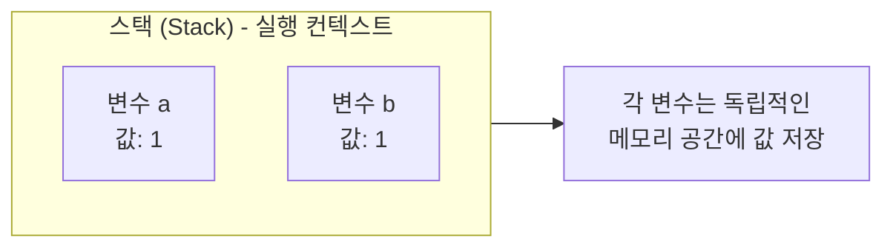
```mermaid
flowchart LR
    subgraph Stack["스택 (Stack) - 실행 컨텍스트"]
        direction TB
        A["변수 a<br/>값: 1"]
        B["변수 b<br/>값: 1"]
    end
    
    Note1["각 변수는 독립적인<br/>메모리 공간에 값 저장"]
    
    Stack --> Note1
```

`a`와 `b`는 각각 독립적인 스택 메모리 공간에 `1`이라는 값을 직접 저장합니다. 비교 연산자(`===`)는 저장된 값 자체를 비교하므로 `true`를 반환합니다.

**특징:**
- 값이 복사되어 전달됩니다 (값에 의한 전달, Pass by Value)
- 변수에 값을 할당하면 새로운 메모리 공간에 값이 복사됩니다
- 한 변수를 변경해도 다른 변수에 영향을 주지 않습니다

## 참조형 데이터

참조형은 힙(Heap) 메모리에 실제 데이터를 저장하고, 스택에는 그 메모리 주소(참조)만 저장합니다.

```javascript
const obj1 = { value: 1 };
const obj2 = { value: 1 };

console.log(obj1 === obj2); // false
```

**메모리 구조:**

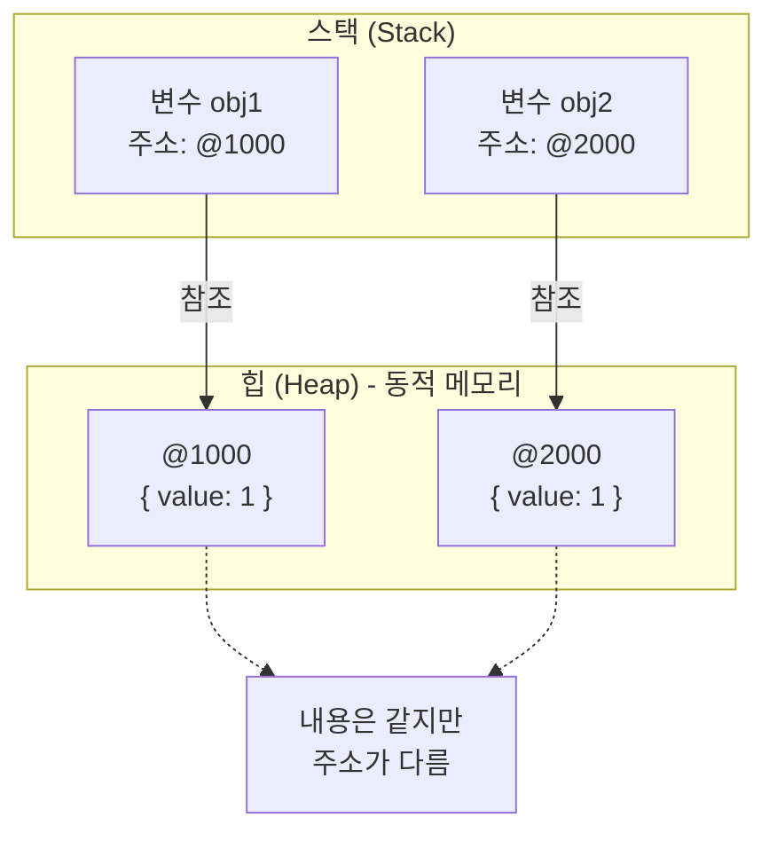
```mermaid
flowchart TB
    subgraph Stack["스택 (Stack)"]
        direction TB
        V1["변수 obj1<br/>주소: @1000"]
        V2["변수 obj2<br/>주소: @2000"]
    end
    
    subgraph Heap["힙 (Heap) - 동적 메모리"]
        direction TB
        O1["@1000<br/>{ value: 1 }"]
        O2["@2000<br/>{ value: 1 }"]
    end
    
    V1 -->|"참조"| O1
    V2 -->|"참조"| O2
    
    Note1["내용은 같지만<br/>주소가 다름"]
    
    O1 -.-> Note1
    O2 -.-> Note1
```

`obj1`과 `obj2`는 내용이 동일하지만 서로 다른 힙 메모리 주소(@1000, @2000)를 가리킵니다. 비교 연산자(`===`)는 스택에 저장된 주소를 비교하므로 `false`를 반환합니다.

**특징:**
- 주소가 복사되어 전달됩니다 (참조에 의한 전달, Pass by Reference)
- 변수에 객체를 할당하면 주소만 복사됩니다
- 같은 주소를 가리키는 변수들은 같은 객체를 공유합니다

### 메모리 구조 상세

참조형 데이터가 메모리에 어떻게 저장되는지 단계별로 살펴보겠습니다.

#### 스택과 힙의 역할

- **스택 (Stack)**: 실행 컨텍스트와 변수명, 원시형 값, 참조형의 주소를 저장하는 고정 크기 메모리 영역
- **힙 (Heap)**: 동적으로 크기가 변하는 객체와 배열을 저장하는 메모리 영역

**1단계: 객체 생성**

```javascript
const user = { name: 'Kim', age: 25 };
```

**2단계: 메모리 할당 과정**

1. JavaScript 엔진이 힙 메모리에 객체를 할당하고 주소(@1000)를 받습니다
2. 스택에 변수명 `user`와 힙 주소(@1000)를 저장합니다

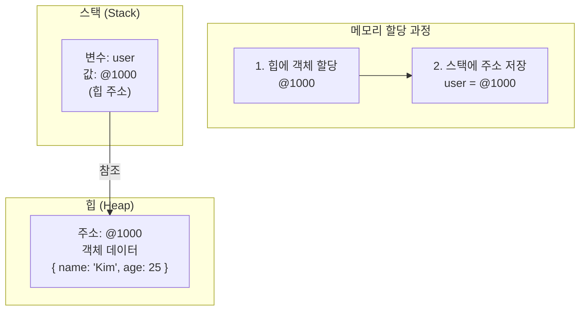
```mermaid
flowchart TB
    subgraph Process["메모리 할당 과정"]
        direction LR
        Step1["1. 힙에 객체 할당<br/>@1000"]
        Step2["2. 스택에 주소 저장<br/>user = @1000"]
    end
    
    Step1 --> Step2
    
    subgraph Stack["스택 (Stack)"]
        direction TB
        V1["변수: user<br/>값: @1000<br/>(힙 주소)"]
    end

    subgraph Heap["힙 (Heap)"]
        direction TB
        O1["주소: @1000<br/>객체 데이터<br/>{ name: 'Kim', age: 25 }"]
    end

    V1 -->|"참조"| O1
```

**3단계: 객체 내부 구조**

객체 내부의 원시형 값(`name`, `age`)은 힙 메모리의 객체 공간 안에 직접 저장됩니다. 객체는 프로퍼티 이름과 값의 쌍으로 구성됩니다.

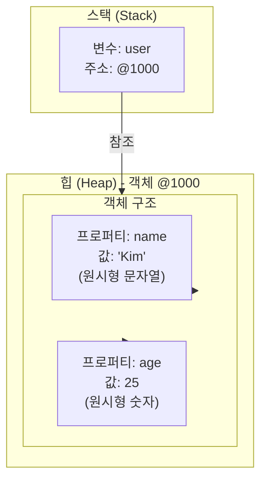
```mermaid
flowchart TB
    subgraph Stack["스택 (Stack)"]
        direction TB
        V1["변수: user<br/>주소: @1000"]
    end

    subgraph Heap["힙 (Heap) - 객체 @1000"]
        direction TB
        subgraph Object["객체 구조"]
            direction LR
            P1["프로퍼티: name<br/>값: 'Kim'<br/>(원시형 문자열)"]
            P2["프로퍼티: age<br/>값: 25<br/>(원시형 숫자)"]
        end
    end

    V1 -->|"참조"| Object
    Object --> P1
    Object --> P2
```

**4단계: 중첩 객체의 경우**

객체 안에 또 다른 객체가 있으면, 내부 객체도 별도의 힙 메모리 주소를 할당받습니다. 외부 객체는 내부 객체의 주소만 저장합니다.

```javascript
const user = {
  name: 'Kim',
  address: { city: 'Seoul', zip: '12345' }
};
```

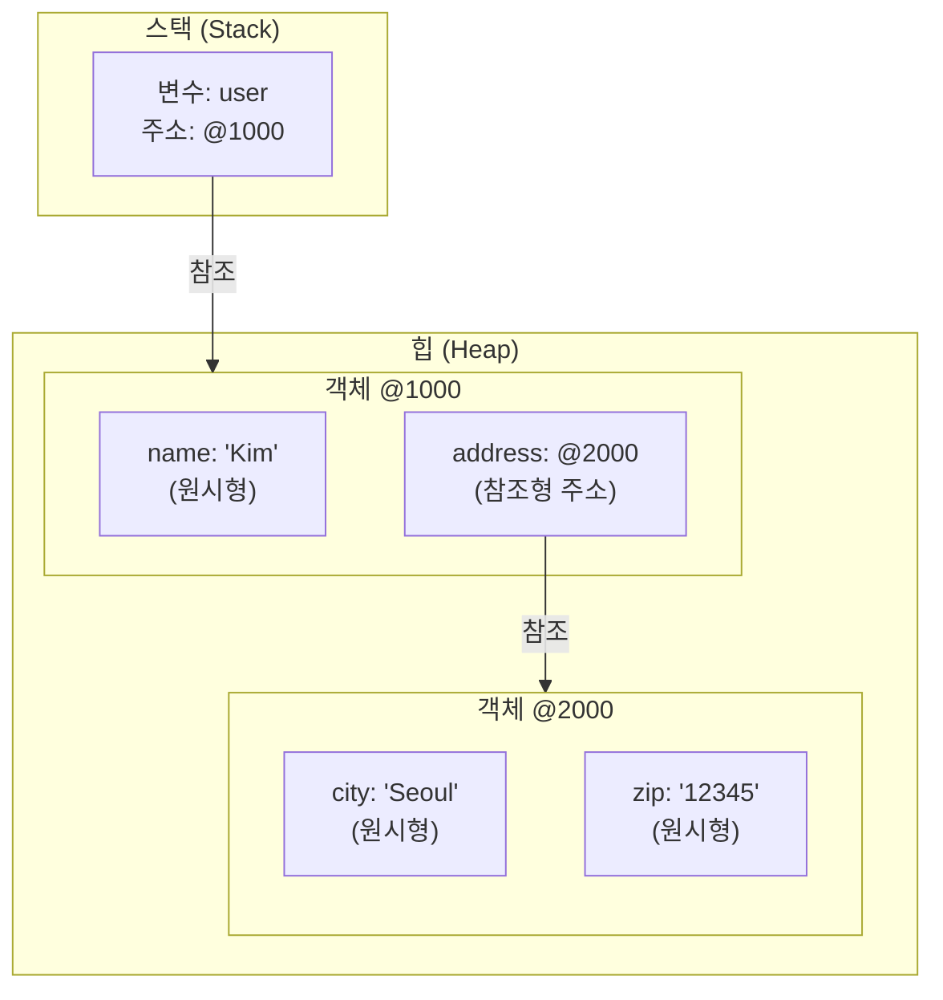
```mermaid
flowchart TB
    subgraph Stack["스택 (Stack)"]
        direction TB
        V1["변수: user<br/>주소: @1000"]
    end

    subgraph Heap["힙 (Heap)"]
        direction TB
        subgraph Object1["객체 @1000"]
            direction TB
            P1["name: 'Kim'<br/>(원시형)"]
            P2["address: @2000<br/>(참조형 주소)"]
        end

        subgraph Object2["객체 @2000"]
            direction TB
            P3["city: 'Seoul'<br/>(원시형)"]
            P4["zip: '12345'<br/>(원시형)"]
        end
    end

    V1 -->|"참조"| Object1
    P2 -->|"참조"| Object2
```

**5단계: 참조 복사**

객체를 다른 변수에 할당하면 주소만 복사됩니다. 두 변수는 같은 객체를 가리킵니다.

```javascript
const user1 = { name: 'Kim', age: 25 };
const user2 = user1; // 주소만 복사

user2.age = 30;
console.log(user1.age); // 30 (같은 객체를 가리키므로)
```

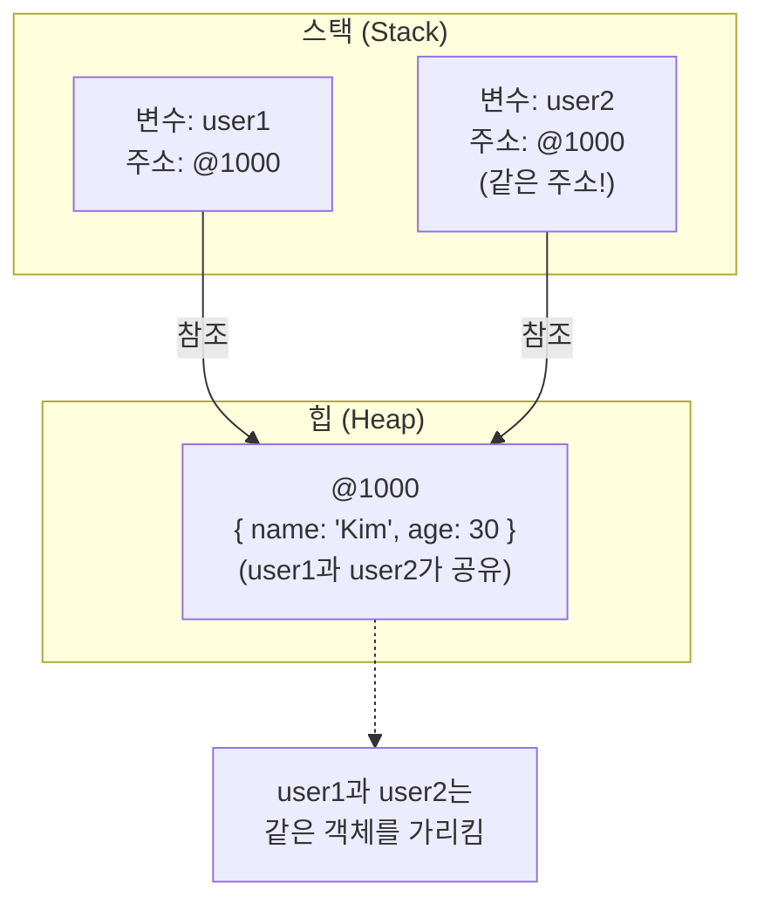
```mermaid
flowchart TB
    subgraph Stack["스택 (Stack)"]
        direction TB
        V1["변수: user1<br/>주소: @1000"]
        V2["변수: user2<br/>주소: @1000<br/>(같은 주소!)"]
    end

    subgraph Heap["힙 (Heap)"]
        direction TB
        O1["@1000<br/>{ name: 'Kim', age: 30 }<br/>(user1과 user2가 공유)"]
    end

    V1 -->|"참조"| O1
    V2 -->|"참조"| O1
    
    Note1["user1과 user2는<br/>같은 객체를 가리킴"]
    
    O1 -.-> Note1
```

### 원시형 vs 참조형 비교

이제 원시형과 참조형의 메모리 동작 차이를 한눈에 비교해보겠습니다.

```javascript
// 원시형 예시
let a = 1;
let b = 1;
console.log(a === b); // true

// 참조형 예시
const obj1 = { value: 1 };
const obj2 = { value: 1 };
console.log(obj1 === obj2); // false
```

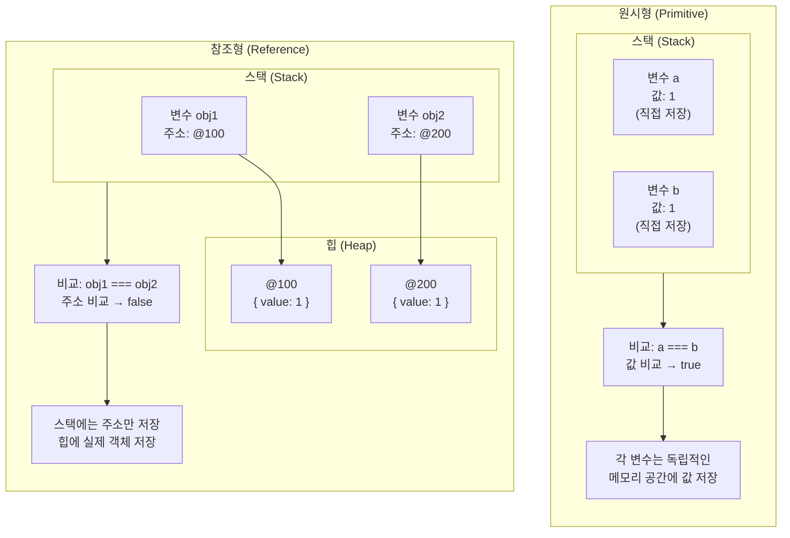
```mermaid
flowchart TB
    subgraph 원시형["원시형 (Primitive)"]
        direction TB
        subgraph Stack1["스택 (Stack)"]
            A["변수 a<br/>값: 1<br/>(직접 저장)"]
            B["변수 b<br/>값: 1<br/>(직접 저장)"]
        end
        Compare1["비교: a === b<br/>값 비교 → true"]
        Note1["각 변수는 독립적인<br/>메모리 공간에 값 저장"]
    end

    subgraph 참조형["참조형 (Reference)"]
        direction TB
        subgraph Stack2["스택 (Stack)"]
            C["변수 obj1<br/>주소: @100"]
            D["변수 obj2<br/>주소: @200"]
        end
        subgraph Heap2["힙 (Heap)"]
            O1["@100<br/>{ value: 1 }"]
            O2["@200<br/>{ value: 1 }"]
        end
        Compare2["비교: obj1 === obj2<br/>주소 비교 → false"]
        Note2["스택에는 주소만 저장<br/>힙에 실제 객체 저장"]
    end

    Stack1 --> Compare1
    Compare1 --> Note1
    
    Stack2 --> Compare2
    C --> O1
    D --> O2
    Compare2 --> Note2
```

**핵심 차이점 요약:**

| 구분 | 원시형 | 참조형 |
|------|--------|--------|
| **저장 위치** | 스택에 값 직접 저장 | 힙에 객체 저장, 스택에는 주소만 |
| **할당 방식** | 값 복사 (Pass by Value) | 주소 복사 (Pass by Reference) |
| **비교 연산** | 값 자체를 비교 | 주소를 비교 |
| **독립성** | 각 변수는 독립적인 값 | 같은 주소를 가리키면 공유 |
| **메모리** | 고정 크기, 빠른 접근 | 동적 크기, 느린 접근 |

**실제 동작 예시:**

```javascript
// 원시형: 값 복사
let x = 10;
let y = x;  // y는 10의 복사본
y = 20;     // y만 변경
console.log(x); // 10 (x는 영향 없음)

// 참조형: 주소 복사
let objA = { count: 10 };
let objB = objA;  // objB는 objA의 주소 복사
objB.count = 20;  // 같은 객체를 수정
console.log(objA.count); // 20 (objA도 영향받음)
```

## 함수도 참조형입니다

함수는 JavaScript에서 일급 객체이며, 참조형 데이터입니다.

```javascript
const fn1 = () => console.log('hello');
const fn2 = () => console.log('hello');

console.log(fn1 === fn2); // false
```

동일한 코드를 가진 함수라도 선언할 때마다 새로운 메모리 주소가 할당됩니다.

## JavaScript 타입별 분류

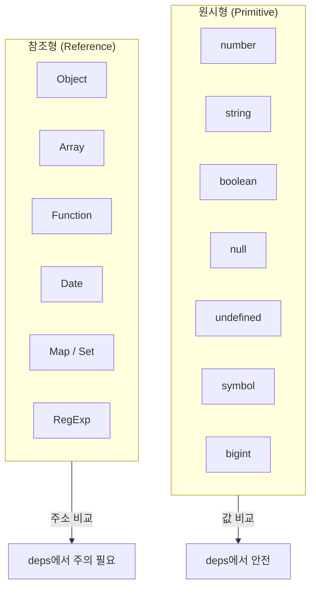
```mermaid
flowchart TB
    subgraph 원시형["원시형 (Primitive)"]
        P1[number]
        P2[string]
        P3[boolean]
        P4[null]
        P5[undefined]
        P6[symbol]
        P7[bigint]
    end

    subgraph 참조형["참조형 (Reference)"]
        R1[Object]
        R2[Array]
        R3[Function]
        R4[Date]
        R5[Map / Set]
        R6[RegExp]
    end

    원시형 -->|"값 비교"| SAFE["deps에서 안전"]
    참조형 -->|"주소 비교"| DANGER["deps에서 주의 필요"]
```

---

# useEffect 의존성 배열과 참조형의 함정

React의 useEffect는 의존성 배열의 값이 변경될 때 콜백을 실행합니다. 문제는 이 비교가 `Object.is`로 수행된다는 점입니다.

## 원시형은 안전합니다

```jsx
function Counter() {
  const [count, setCount] = useState(0);

  useEffect(() => {
    console.log('count 변경:', count);
  }, [count]);

  return <button onClick={() => setCount(count + 1)}>증가</button>;
}
```

`count`는 원시형(숫자)이므로 값이 실제로 변경될 때만 effect가 실행됩니다.

## 참조형은 위험합니다

```jsx
function UserProfile() {
  const [user, setUser] = useState({ name: 'Kim' });

  // 매 렌더링마다 새로운 객체 생성
  const config = { theme: 'dark' };

  useEffect(() => {
    console.log('config 변경됨');
  }, [config]); // 매 렌더링마다 실행됨

  return <div>{user.name}</div>;
}
```

`config`는 렌더링마다 새로운 메모리 주소를 가진 객체로 생성됩니다. 내용이 동일해도 React는 "변경됨"으로 판단합니다.

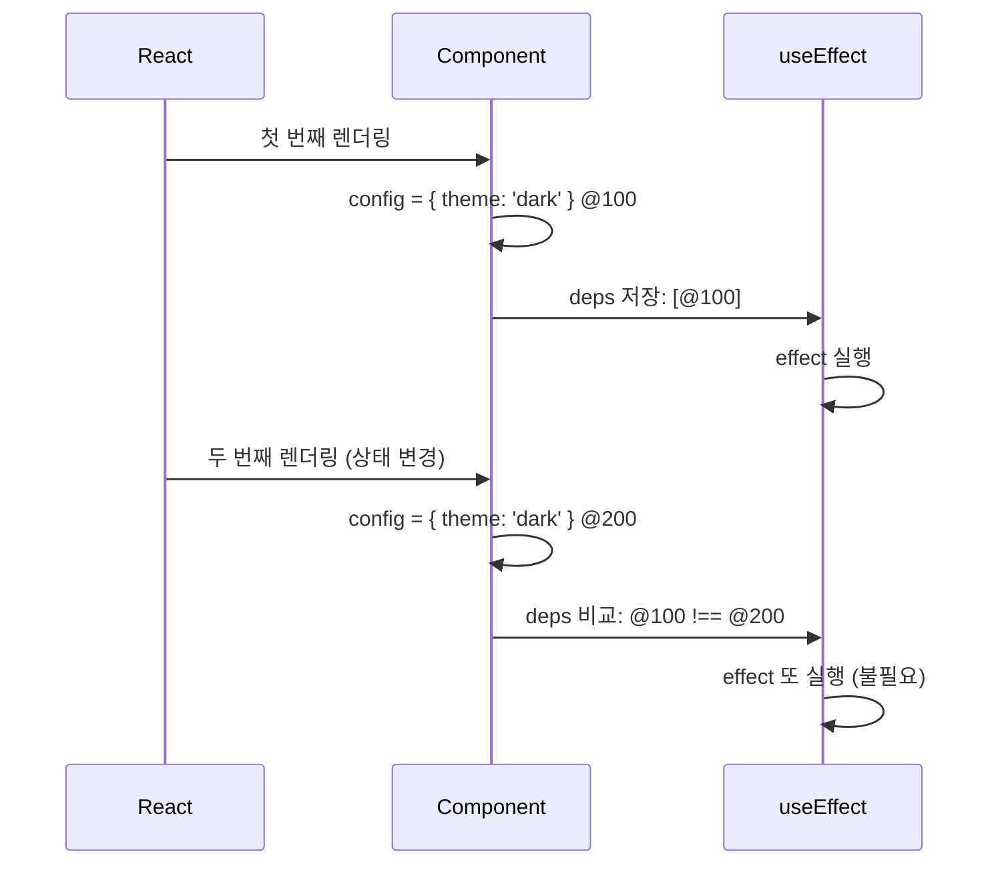
```mermaid
sequenceDiagram
    participant R as React
    participant C as Component
    participant E as useEffect

    R->>C: 첫 번째 렌더링
    C->>C: config = { theme: 'dark' } @100
    C->>E: deps 저장: [@100]
    E->>E: effect 실행

    R->>C: 두 번째 렌더링 (상태 변경)
    C->>C: config = { theme: 'dark' } @200
    C->>E: deps 비교: @100 !== @200
    E->>E: effect 또 실행 (불필요)
```

## 무한 리렌더링 발생 케이스

함수를 의존성 배열에 넣고, 그 함수 내부에서 상태를 변경하면 무한 루프가 발생합니다.

```jsx
function AutoSaveEditor() {
  const [content, setContent] = useState('');

  // 매 렌더링마다 새로운 함수 생성
  const saveDraft = () => {
    console.log('저장:', content);
    // 만약 여기서 상태를 변경한다면...
    setContent(content + ' (저장됨)');
  };

  useEffect(() => {
    saveDraft();
  }, [saveDraft]); // 무한 루프!

  return <textarea value={content} onChange={(e) => setContent(e.target.value)} />;
}
```

실행 흐름:
1. 컴포넌트 렌더링 → `saveDraft` 함수 생성 (@100)
2. useEffect 실행 → `saveDraft()` 호출 → `setContent` 실행
3. 상태 변경으로 리렌더링 → `saveDraft` 함수 재생성 (@200)
4. useEffect가 `@100 !== @200` 감지 → 다시 실행
5. 2~4 반복 (무한 루프)

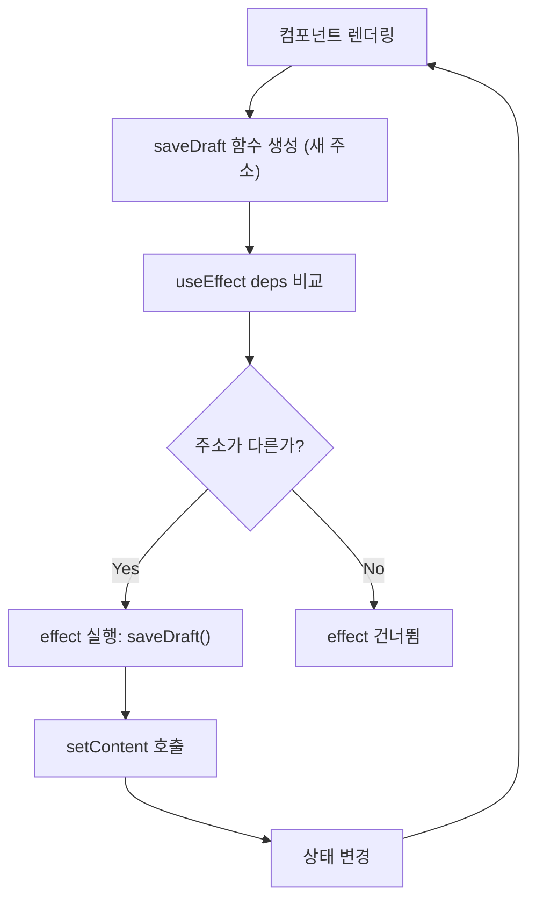
```mermaid
flowchart TD
    A[컴포넌트 렌더링] --> B["saveDraft 함수 생성 (새 주소)"]
    B --> C["useEffect deps 비교"]
    C --> D{"주소가 다른가?"}
    D -->|Yes| E["effect 실행: saveDraft()"]
    E --> F["setContent 호출"]
    F --> G["상태 변경"]
    G --> A
    D -->|No| H["effect 건너뜀"]
```

### Chrome DevTools로 확인한 메모리 주소 변화

실제로 함수가 매 렌더링마다 새로운 메모리 주소를 갖는지 Chrome DevTools의 Memory 탭에서 확인할 수 있습니다.

아래 스크린샷은 Heap Snapshot을 비교한 결과입니다. `inlineSaveDraft` 함수가 각 스냅샷에서 다른 메모리 주소를 가지고 있음을 볼 수 있습니다.

**Snapshot 1에서의 함수 주소:**


**Snapshot 2에서 새로 생성된 함수들:**


**Snapshot 3에서 또 다른 주소의 함수:**


각 스냅샷에서 `inlineSaveDraft` 함수는 `@200175`, `@473745`, `@483163` 등 서로 다른 메모리 주소를 가집니다. 이것이 React가 매 렌더링마다 함수가 "변경됨"으로 판단하는 이유입니다.

## useCallback으로 해결하기

useCallback을 사용하면 함수의 참조를 안정적으로 유지할 수 있습니다.

```jsx
function AutoSaveEditor() {
  const [content, setContent] = useState('');

  // useCallback으로 함수 참조 안정화
  const saveDraft = useCallback(() => {
    console.log('저장:', content);
    // 상태 변경이 필요하면 함수형 업데이트 사용
  }, [content]); // content가 변경될 때만 함수 재생성

  useEffect(() => {
    saveDraft();
  }, [saveDraft]); // content가 변경될 때만 effect 실행

  return <textarea value={content} onChange={(e) => setContent(e.target.value)} />;
}
```

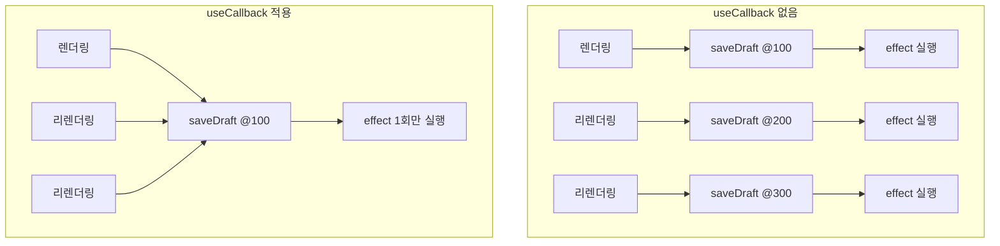
```mermaid
flowchart TD
    subgraph "useCallback 없음"
        A1[렌더링] --> B1["saveDraft @100"]
        A2[리렌더링] --> B2["saveDraft @200"]
        A3[리렌더링] --> B3["saveDraft @300"]
        B1 --> E1["effect 실행"]
        B2 --> E2["effect 실행"]
        B3 --> E3["effect 실행"]
    end

    subgraph "useCallback 적용"
        C1[렌더링] --> D1["saveDraft @100"]
        C2[리렌더링] --> D1
        C3[리렌더링] --> D1
        D1 --> F1["effect 1회만 실행"]
    end
```

## useMemo로 객체 안정화하기

객체나 배열이 deps에 들어가야 할 때는 useMemo를 사용합니다.

```jsx
function UserDashboard() {
  const [user, setUser] = useState({ name: 'Kim' });

  // useMemo로 객체 참조 안정화
  const config = useMemo(() => ({ theme: 'dark', locale: 'ko' }), []);

  useEffect(() => {
    applyConfig(config);
  }, [config]); // 최초 1회만 실행

  return <div>{user.name}</div>;
}
```

---

# React.memo와 메모이제이션

useCallback과 useMemo가 필요한 또 다른 중요한 케이스는 `React.memo`로 감싼 자식 컴포넌트에 props를 전달할 때입니다.

## React.memo의 동작 원리

`React.memo`는 props가 변경되지 않으면 리렌더링을 건너뜁니다. 하지만 props 비교도 `Object.is`로 수행됩니다.

```jsx
const ExpensiveChild = React.memo(({ onClick, data }) => {
  console.log('ExpensiveChild 렌더링');
  return <button onClick={onClick}>{data.label}</button>;
});

function Parent() {
  const [count, setCount] = useState(0);

  // 매 렌더링마다 새 함수/객체 생성
  const handleClick = () => console.log('clicked');
  const data = { label: 'Click me' };

  return (
    <>
      <button onClick={() => setCount(count + 1)}>Count: {count}</button>
      {/* count가 변경될 때마다 ExpensiveChild도 리렌더링됨 */}
      <ExpensiveChild onClick={handleClick} data={data} />
    </>
  );
}
```

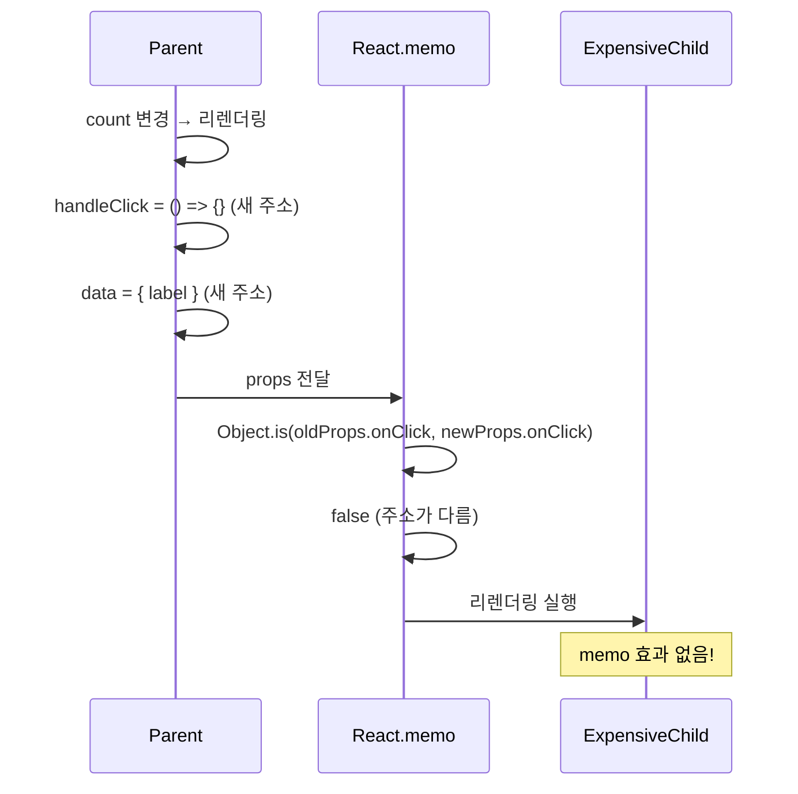
```mermaid
sequenceDiagram
    participant P as Parent
    participant M as React.memo
    participant C as ExpensiveChild

    P->>P: count 변경 → 리렌더링
    P->>P: handleClick = () => {} (새 주소)
    P->>P: data = { label } (새 주소)
    P->>M: props 전달
    M->>M: Object.is(oldProps.onClick, newProps.onClick)
    M->>M: false (주소가 다름)
    M->>C: 리렌더링 실행
    Note over C: memo 효과 없음!
```

## 메모이제이션으로 해결

```jsx
function Parent() {
  const [count, setCount] = useState(0);

  // 참조 안정화
  const handleClick = useCallback(() => console.log('clicked'), []);
  const data = useMemo(() => ({ label: 'Click me' }), []);

  return (
    <>
      <button onClick={() => setCount(count + 1)}>Count: {count}</button>
      {/* count가 변경되어도 ExpensiveChild는 리렌더링되지 않음 */}
      <ExpensiveChild onClick={handleClick} data={data} />
    </>
  );
}
```

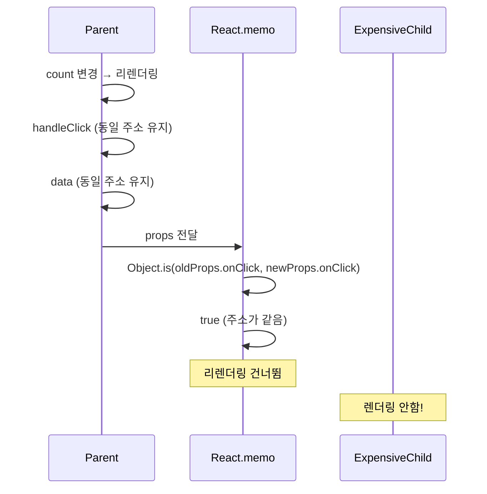
```mermaid
sequenceDiagram
    participant P as Parent
    participant M as React.memo
    participant C as ExpensiveChild

    P->>P: count 변경 → 리렌더링
    P->>P: handleClick (동일 주소 유지)
    P->>P: data (동일 주소 유지)
    P->>M: props 전달
    M->>M: Object.is(oldProps.onClick, newProps.onClick)
    M->>M: true (주소가 같음)
    Note over M: 리렌더링 건너뜀
    Note over C: 렌더링 안함!
```

---

# ESLint 경고의 한계와 커스텀 훅의 함정

## eslint-plugin-react-hooks의 역할

`eslint-plugin-react-hooks`는 메모이제이션되지 않은 함수를 의존성 배열에 넣으면 경고합니다.

```jsx
function Example() {
  const [count, setCount] = useState(0);

  // 메모이제이션되지 않은 함수
  const handleClick = () => {
    console.log(count);
  };

  useEffect(() => {
    handleClick();
  }, [handleClick]); // ESLint 경고: The 'handleClick' function makes the dependencies of useEffect Hook change on every render

  return <button onClick={handleClick}>{count}</button>;
}
```

이 경고는 "매 렌더링마다 함수가 재생성되어 effect가 불필요하게 실행될 수 있다"는 것을 알려줍니다. ESLint는 `useCallback`으로 감싸거나 effect 내부로 함수를 이동하라고 제안합니다.

## 커스텀 훅에서 반환된 함수는 경고하지 않습니다

문제는 커스텀 훅에서 반환된 메모이제이션되지 않은 함수를 deps에 넣으면 ESLint가 경고하지 않는다는 점입니다.

```jsx
// useAutoSave.ts - 메모이제이션 없이 함수 반환
function useAutoSave() {
  const [lastSaved, setLastSaved] = useState<Date | null>(null);

  // 메모이제이션되지 않은 함수 반환
  const save = (content: string) => {
    api.save(content);
    setLastSaved(new Date());
  };

  return { save, lastSaved };
}

// Component.tsx
function Editor() {
  const [content, setContent] = useState('');
  const { save } = useAutoSave(); // 매 렌더링마다 새로운 save 함수

  useEffect(() => {
    const timer = setInterval(() => save(content), 5000);
    return () => clearInterval(timer);
  }, [save, content]); // ESLint 경고 없음!

  return <textarea value={content} onChange={(e) => setContent(e.target.value)} />;
}
```

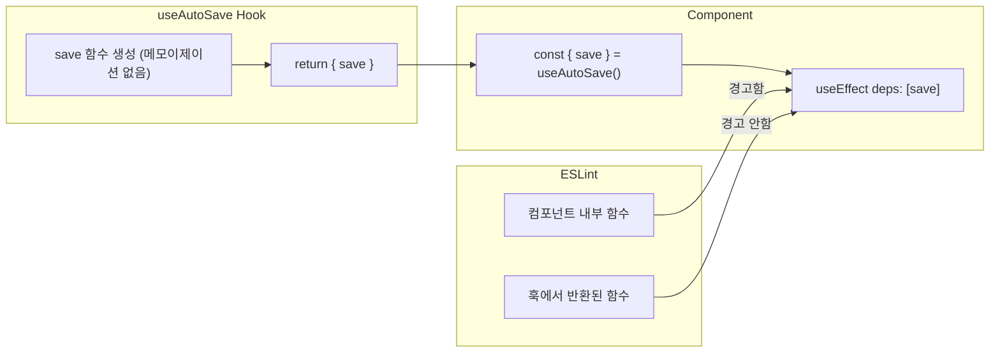
```mermaid
flowchart LR
    subgraph "useAutoSave Hook"
        A["save 함수 생성 (메모이제이션 없음)"]
        B["return { save }"]
    end

    subgraph Component
        C["const { save } = useAutoSave()"]
        D["useEffect deps: [save]"]
    end

    subgraph ESLint
        E["컴포넌트 내부 함수"]
        F["훅에서 반환된 함수"]
    end

    A --> B
    B --> C
    C --> D
    E -->|"경고함"| D
    F -->|"경고 안함"| D
```

ESLint는 컴포넌트 내부에서 선언한 함수가 deps에 들어가면 경고하지만, 훅에서 반환된 함수는 "이미 안정적인 참조일 것"이라고 가정합니다. 하지만 실제로는 훅 내부에서 메모이제이션하지 않으면 매 렌더링마다 새 함수가 생성됩니다.

## 결과: 숨겨진 성능 문제

```jsx
function Editor() {
  const [content, setContent] = useState('');
  const [cursor, setCursor] = useState(0);
  const { save } = useAutoSave(); // 메모이제이션 안된 함수

  useEffect(() => {
    const timer = setInterval(() => save(content), 5000);
    return () => clearInterval(timer);
  }, [save, content]); // ESLint 경고 없음, 하지만 문제 발생

  // cursor가 변경될 때마다 useAutoSave가 새 save 함수를 반환
  return (
    <textarea
      value={content}
      onChange={(e) => setContent(e.target.value)}
      onSelect={(e) => setCursor(e.target.selectionStart)}
    />
  );
}
```

커서 위치가 변경될 때마다:
1. 컴포넌트 리렌더링
2. `useAutoSave`가 새 `save` 함수 반환 (새 메모리 주소)
3. useEffect가 `save` 변경 감지 → effect 재실행
4. 기존 타이머 정리 후 새 타이머 생성

ESLint는 이 문제를 경고하지 않습니다. 훅에서 반환된 함수는 안정적인 참조라고 가정하기 때문입니다. 이것이 커스텀 훅 설계 시 반환값의 메모이제이션이 중요한 이유입니다.

---

# 메모이제이션 설계 원칙

커스텀 훅을 설계할 때는 반환값의 참조 안정성을 보장해야 합니다.

## 원칙 1: 참조형 반환값은 무조건 메모이제이션

훅에서 반환하는 함수나 객체는 의존성 배열에 들어갈 수 있습니다. 참조를 안정적으로 유지해야 합니다.

```jsx
// Bad: 매 렌더링마다 새 함수 생성
function useCounter() {
  const [count, setCount] = useState(0);

  const increment = () => setCount((c) => c + 1);
  const decrement = () => setCount((c) => c - 1);

  return { count, increment, decrement };
}

// Good: useCallback으로 함수 참조 안정화
function useCounter() {
  const [count, setCount] = useState(0);

  const increment = useCallback(() => setCount((c) => c + 1), []);
  const decrement = useCallback(() => setCount((c) => c - 1), []);

  return { count, increment, decrement };
}
```

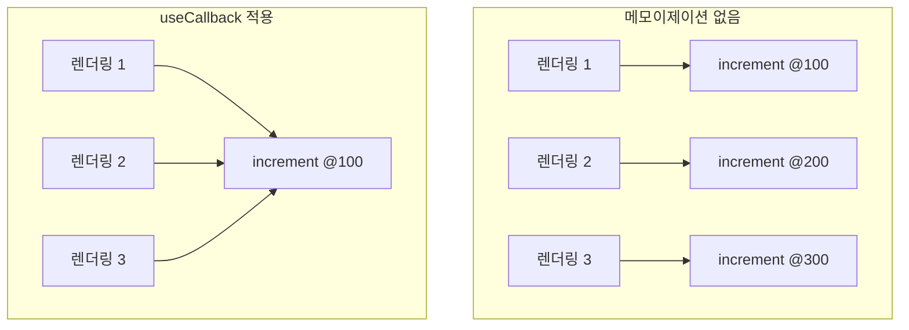
```mermaid
flowchart TB
    subgraph "메모이제이션 없음"
        A1[렌더링 1] --> B1["increment @100"]
        A2[렌더링 2] --> B2["increment @200"]
        A3[렌더링 3] --> B3["increment @300"]
    end

    subgraph "useCallback 적용"
        C1[렌더링 1] --> D1["increment @100"]
        C2[렌더링 2] --> D1
        C3[렌더링 3] --> D1
    end
```

## 원칙 2: 원시형 반환값은 계산 비용을 고려

원시형은 값 비교가 되므로 메모이제이션이 필수는 아닙니다. 계산 비용이 클 때만 useMemo를 사용합니다.

```jsx
// 메모이제이션 불필요: 단순 계산
function useItemCount(items) {
  const count = items.length; // O(1)
  return count;
}

// 메모이제이션 필요: 복잡한 계산
function useFilteredItems(items, filter) {
  const filtered = useMemo(
    () => items.filter((item) => item.category === filter), // O(n)
    [items, filter]
  );
  return filtered;
}
```

## 원칙 3: 객체 반환 시 useMemo로 감싸기

여러 값을 객체로 반환할 때는 useMemo로 객체 참조를 안정화합니다.

```jsx
// Bad: 매 렌더링마다 새 객체 생성
function useWindowSize() {
  const [size, setSize] = useState({ width: 0, height: 0 });

  useEffect(() => {
    const handler = () => setSize({ width: window.innerWidth, height: window.innerHeight });
    window.addEventListener('resize', handler);
    return () => window.removeEventListener('resize', handler);
  }, []);

  // 새 객체를 매번 생성
  return { width: size.width, height: size.height, isLarge: size.width > 1024 };
}

// Good: useMemo로 객체 안정화
function useWindowSize() {
  const [size, setSize] = useState({ width: 0, height: 0 });

  useEffect(() => {
    const handler = () => setSize({ width: window.innerWidth, height: window.innerHeight });
    window.addEventListener('resize', handler);
    return () => window.removeEventListener('resize', handler);
  }, []);

  return useMemo(
    () => ({ width: size.width, height: size.height, isLarge: size.width > 1024 }),
    [size.width, size.height]
  );
}
```

## 정리: 타입별 메모이제이션 가이드

| 반환값 타입        | 메모이제이션     | 이유                                     |
| ------------------ | ---------------- | ---------------------------------------- |
| 함수               | useCallback 필수 | 참조형, 의존성 배열에서 사용될 수 있음   |
| 객체/배열          | useMemo 필수     | 참조형, 의존성 배열에서 사용될 수 있음   |
| 숫자/문자열/불리언 | 계산 비용 고려   | 원시형은 값 비교, 비용이 클 때만 useMemo |

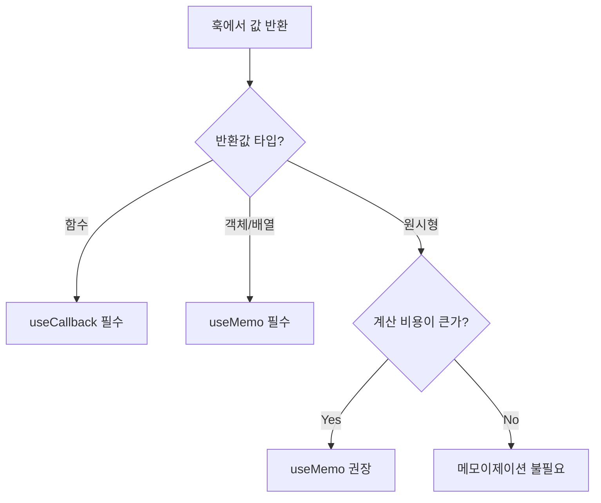
```mermaid
flowchart TD
    A["훅에서 값 반환"] --> B{"반환값 타입?"}
    B -->|"함수"| C["useCallback 필수"]
    B -->|"객체/배열"| D["useMemo 필수"]
    B -->|"원시형"| E{"계산 비용이 큰가?"}
    E -->|"Yes"| F["useMemo 권장"]
    E -->|"No"| G["메모이제이션 불필요"]
```

---

# 흔한 실수 패턴

## 실수 1: deps 배열 안에서 객체/배열 리터럴 사용

```jsx
// Bad: 매 렌더링마다 새 배열 생성
useEffect(() => {
  fetchUsers(userIds);
}, [[1, 2, 3]]); // 항상 새 배열!

// Good: useMemo 사용 또는 외부에서 상수로 정의
const userIds = useMemo(() => [1, 2, 3], []);
useEffect(() => {
  fetchUsers(userIds);
}, [userIds]);
```

## 실수 2: useCallback 내부에서 최신 state 참조

```jsx
// Bad: count가 변경되어도 오래된 값 참조
const handleClick = useCallback(() => {
  setCount(count + 1); // 클로저에 count가 고정됨
}, []); // deps가 비어있음

// Good: 함수형 업데이트 사용
const handleClick = useCallback(() => {
  setCount((prev) => prev + 1); // 항상 최신 값 사용
}, []);
```

## 실수 3: 불필요한 메모이제이션

```jsx
// Bad: 원시형은 메모이제이션 불필요
const doubled = useMemo(() => count * 2, [count]);

// Good: 그냥 계산
const doubled = count * 2;

// Good: 복잡한 계산만 메모이제이션
const sortedItems = useMemo(
  () => items.sort((a, b) => a.price - b.price),
  [items]
);
```

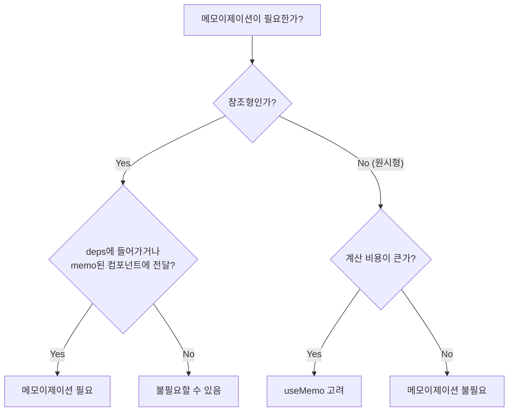
```mermaid
flowchart TD
    A["메모이제이션이 필요한가?"] --> B{"참조형인가?"}
    B -->|"Yes"| C{"deps에 들어가거나<br/>memo된 컴포넌트에 전달?"}
    C -->|"Yes"| D["메모이제이션 필요"]
    C -->|"No"| E["불필요할 수 있음"]
    B -->|"No (원시형)"| F{"계산 비용이 큰가?"}
    F -->|"Yes"| G["useMemo 고려"]
    F -->|"No"| H["메모이제이션 불필요"]
```

---

# 결론

useCallback과 useMemo는 단순한 성능 최적화 도구가 아닙니다.

1. **참조형 데이터의 특성** 때문에 필요합니다. 내용이 같아도 매 렌더링마다 새로운 메모리 주소가 할당됩니다.
2. **useEffect 의존성 배열**에서 참조형을 그대로 사용하면 의도치 않은 effect 재실행이나 무한 루프가 발생합니다.
3. **React.memo로 감싼 컴포넌트**에 참조형 props를 전달하면 메모이제이션 효과가 사라집니다.
4. **ESLint는 커스텀 훅 경계를 넘어가면 경고하지 못합니다.** 훅 설계 시 반환값의 참조 안정성을 직접 보장해야 합니다.
5. **커스텀 훅에서는 참조형 반환값을 항상 메모이제이션**합니다. 원시형은 계산 비용을 고려해 결정합니다.
