# useCallback, useMemo는 왜 쓸까

React에서 useCallback과 useMemo를 사용하는 이유는 단순히 성능 최적화가 아닙니다. JavaScript의 참조형 데이터 특성과 React의 의존성 배열 동작 방식을 이해하면, 이 훅들이 왜 필수적인 상황이 있는지 알 수 있습니다.

이 문서를 읽으면 다음을 이해할 수 있습니다:

- 원시형과 참조형의 메모리 동작 차이
- useEffect 의존성 배열에서 참조형이 위험한 이유
- React.memo와 props 참조 안정성의 관계
- ESLint가 경고하지 못하는 커스텀 훅 내부의 함정
- 참조형 데이터의 메모이제이션 설계 원칙
- 흔한 메모이제이션 실수 패턴
- 무분별한 메모이제이션의 비용
- 메모이제이션 적용 원칙과 구조적 최적화

---

# 원시형과 참조형의 메모리 구조

JavaScript의 데이터 타입은 원시형(Primitive)과 참조형(Reference)으로 나뉩니다.

## 원시형 데이터

원시형은 값 자체가 메모리 주소에 직접 저장됩니다. 변수는 그 메모리 주소를 가리키며, 그 주소에 값이 저장되어 있습니다.

```javascript
let a = 1;
let b = 1;

console.log(a === b); // true
```

**메모리 구조:**

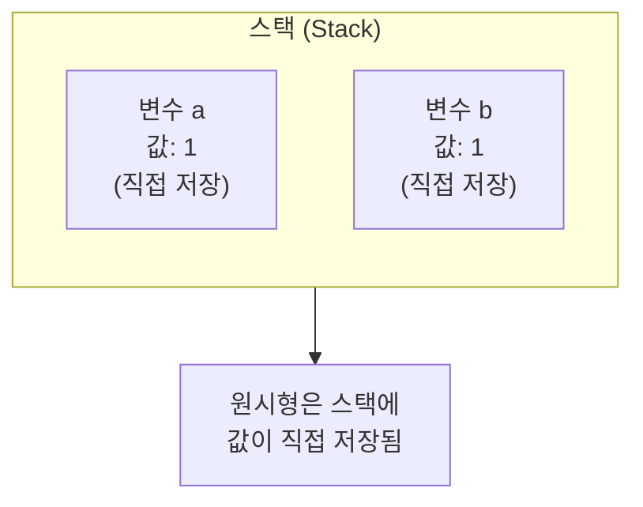
```mermaid
flowchart TB
    subgraph Stack["스택 (Stack)"]
        direction TB
        A["변수 a<br/>값: 1<br/>(직접 저장)"]
        B["변수 b<br/>값: 1<br/>(직접 저장)"]
    end

    Note1["원시형은 스택에<br/>값이 직접 저장됨"]

    Stack --> Note1
```

`a`는 스택에 값 `1`이 직접 저장됩니다. `b`도 스택에 값 `1`이 직접 저장됩니다. 비교 연산자(`===`)는 변수에 저장된 값 자체를 비교하므로 `true`를 반환합니다.

**핵심:**
- 원시형 데이터는 스택에 값이 직접 저장됩니다
- 변수 자체가 값을 보관하므로 비교 시 값 자체를 비교합니다

## 참조형 데이터

참조형은 객체를 위한 메모리 주소가 있고, 그 주소로 가면 객체 내부의 원시형 데이터들이 각각의 메모리 위치를 가지고 있습니다.

```javascript
const obj1 = { value: 1 };
const obj2 = { value: 1 };

console.log(obj1 === obj2); // false
```

**메모리 구조:**

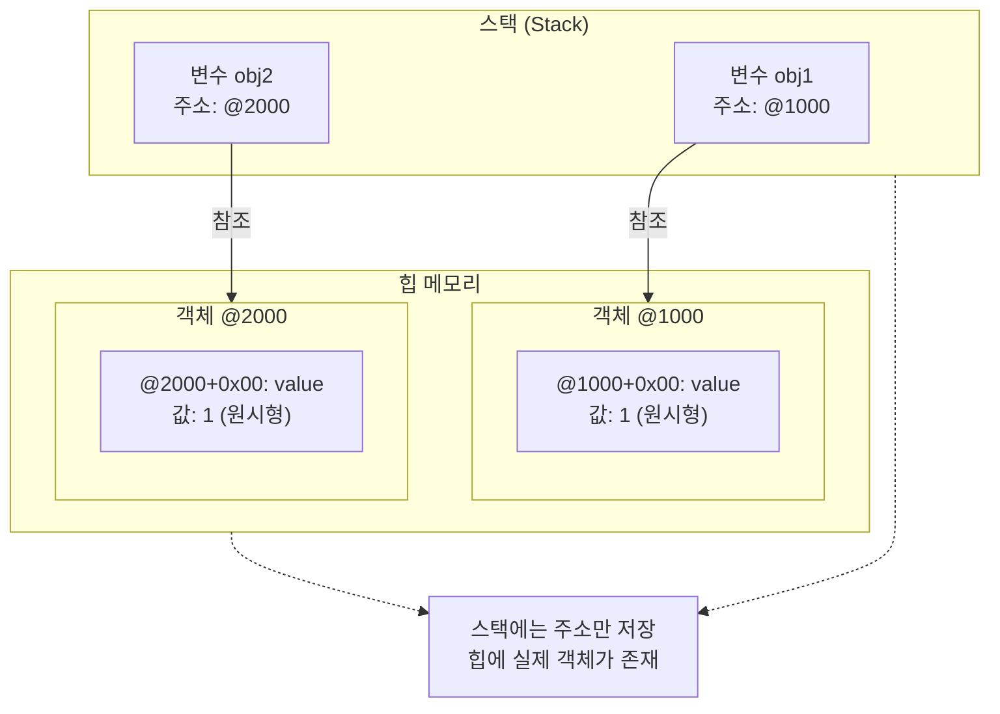
```mermaid
flowchart TB
    subgraph Stack["스택 (Stack)"]
        direction TB
        V1["변수 obj1<br/>주소: @1000"]
        V2["변수 obj2<br/>주소: @2000"]
    end


    subgraph Heap["힙 메모리"]
        direction TB
        subgraph O1["객체 @1000"]
            direction TB
            P1["@1000+0x00: value<br/>값: 1 (원시형)"]
        end


        subgraph O2["객체 @2000"]
            direction TB
            P2["@2000+0x00: value<br/>값: 1 (원시형)"]
        end
    end


    V1 -->|"참조"| O1
    V2 -->|"참조"| O2

    Note1["스택에는 주소만 저장<br/>힙에 실제 객체가 존재"]

    Stack -.-> Note1
    Heap -.-> Note1
```

`obj1`은 객체 주소 @1000을 가리키고, 그 주소로 가면 내부의 `value` 프로퍼티가 메모리 위치 @1000+0x00에 저장되어 있습니다. `obj2`는 객체 주소 @2000을 가리키고, 내부의 `value`는 @2000+0x00에 저장되어 있습니다. 비교 연산자(`===`)는 객체 주소를 비교하므로 `false`를 반환합니다.

**핵심:**

- 참조형 데이터는 객체를 위한 메모리 주소가 있습니다
- 그 주소로 가면 객체 내부의 원시형 데이터들이 각각의 메모리 위치를 가지고 있습니다

### 중첩 객체 예시

추가로, 중첩 객체의 메모리 구조를 살펴보겠습니다. 중첩 객체는 참조형 데이터 내부에 참조형 데이터가 있는 경우를 말합니다. 중첩 객체의 경우 참조형 데이터의 주소를 스택에 저장하고, 중첩되어 있는 참조형 데이터의 주소는 힙에 그대로 저장됩니다.

```javascript
const user = {
  name: "Kim",
  address: { city: "Seoul", zip: "12345" },
};
```

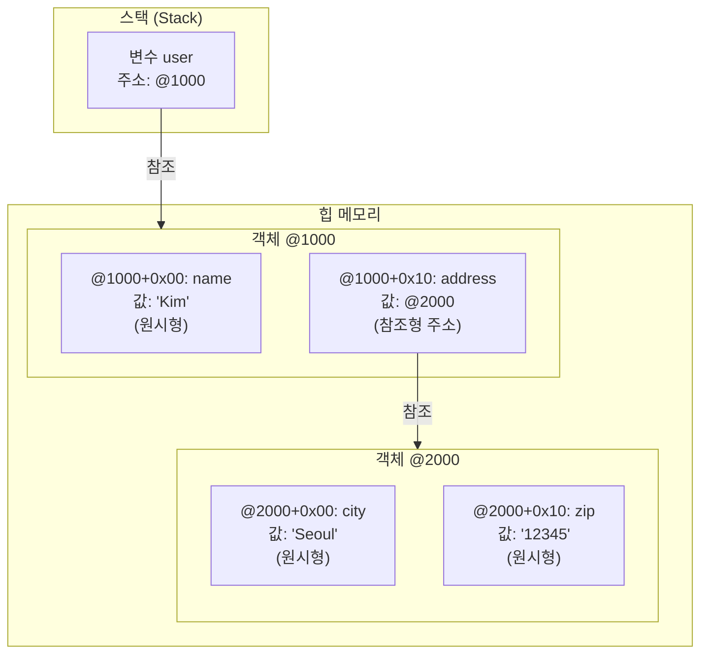
```mermaid
flowchart TB
    subgraph Variables["스택 (Stack)"]
        V1["변수 user<br/>주소: @1000"]
    end

    subgraph Heap["힙 메모리"]
        direction TB
        subgraph O1["객체 @1000"]
            direction TB
            P1["@1000+0x00: name<br/>값: 'Kim'<br/>(원시형)"]
            P2["@1000+0x10: address<br/>값: @2000<br/>(참조형 주소)"]
        end

        subgraph O2["객체 @2000"]
            direction TB
            P3["@2000+0x00: city<br/>값: 'Seoul'<br/>(원시형)"]
            P4["@2000+0x10: zip<br/>값: '12345'<br/>(원시형)"]
        end
    end

    V1 -->|"참조"| O1
    P2 -->|"참조"| O2
```

## 원시형 vs 참조형 비교

이제 원시형과 참조형의 메모리 동작 차이를 한눈에 비교해보겠습니다.

```javascript
// 원시형 예시
let a = 1;
let b = 1;
console.log(a === b); // true

// 참조형 예시
const obj1 = { value: 1 };
const obj2 = { value: 1 };
console.log(obj1 === obj2); // false
```

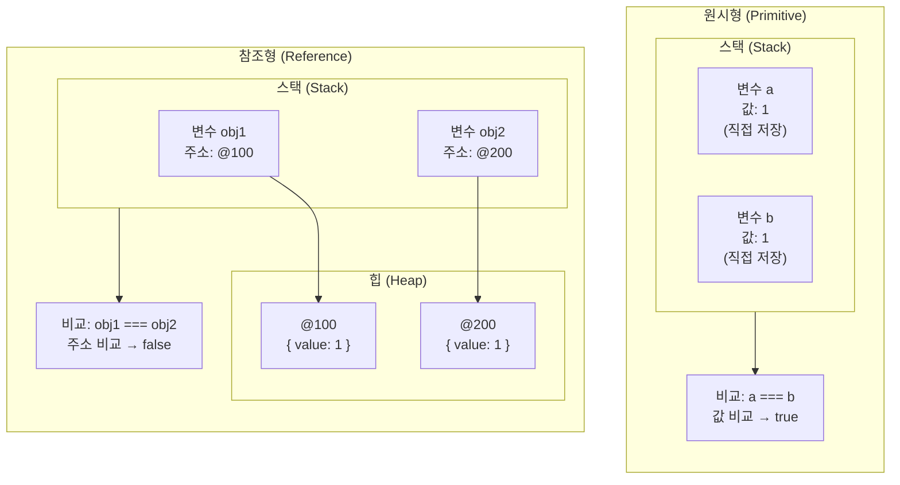
```mermaid
flowchart TB
    subgraph 원시형["원시형 (Primitive)"]
        direction TB
        subgraph Stack1["스택 (Stack)"]
            A["변수 a<br/>값: 1<br/>(직접 저장)"]
            B["변수 b<br/>값: 1<br/>(직접 저장)"]
        end
        Compare1["비교: a === b<br/>값 비교 → true"]
    end

    subgraph 참조형["참조형 (Reference)"]
        direction TB
        subgraph Stack2["스택 (Stack)"]
            C["변수 obj1<br/>주소: @100"]
            D["변수 obj2<br/>주소: @200"]
        end
        subgraph Heap2["힙 (Heap)"]
            O1["@100<br/>{ value: 1 }"]
            O2["@200<br/>{ value: 1 }"]
        end
        Compare2["비교: obj1 === obj2<br/>주소 비교 → false"]
    end

    Stack1 --> Compare1
    
    Stack2 --> Compare2
    C --> O1
    D --> O2
```

**핵심 차이점 요약:**

| 구분 | 원시형 | 참조형 |
|------|--------|--------|
| **저장 위치** | 스택에 값 직접 저장 | 힙에 객체 저장, 스택에는 주소만 |
| **할당 방식** | 값 복사 (Pass by Value) | 주소 복사 (Pass by Reference) |
| **비교 연산** | 값 자체를 비교 | 주소를 비교 |

**실제 동작 예시:**

```javascript
// 원시형: 값 복사
let x = 10;
let y = x; // y는 10의 복사본
y = 20; // y만 변경
console.log(x); // 10 (x는 영향 없음)

// 참조형: 주소 복사
let objA = { count: 10 };
let objB = objA; // objB는 objA의 주소 복사
objB.count = 20; // 같은 객체를 수정
console.log(objA.count); // 20 (objA도 영향받음)
```

## 함수도 참조형입니다

함수는 JavaScript에서 일급 객체이며, 참조형 데이터입니다.

```javascript
const fn1 = () => console.log("hello");
const fn2 = () => console.log("hello");

console.log(fn1 === fn2); // false
```

동일한 코드를 가진 함수라도 선언할 때마다 새로운 메모리 주소가 할당됩니다. 함수 이외에도 다양한 참조형 데이터가 있습니다.

**JavaScript 타입별 분류**
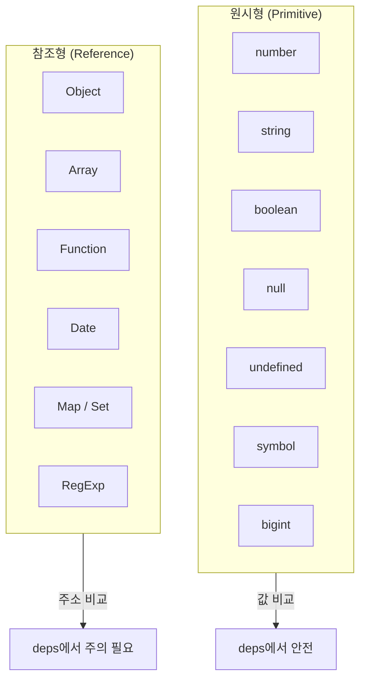
```mermaid
flowchart TB
    subgraph 원시형["원시형 (Primitive)"]
        P1[number]
        P2[string]
        P3[boolean]
        P4[null]
        P5[undefined]
        P6[symbol]
        P7[bigint]
    end

    subgraph 참조형["참조형 (Reference)"]
        R1[Object]
        R2[Array]
        R3[Function]
        R4[Date]
        R5[Map / Set]
        R6[RegExp]
    end

    원시형 -->|"값 비교"| SAFE["deps에서 안전"]
    참조형 -->|"주소 비교"| DANGER["deps에서 주의 필요"]
```

---

# useEffect 의존성 배열과 참조형의 함정

React의 useEffect는 의존성 배열의 값이 변경될 때 콜백을 실행합니다. 문제는 이 비교가 `Object.is`로 수행된다는 점입니다.

## 원시형은 안전합니다

```jsx
function Counter() {
  const [count, setCount] = useState(0);

  useEffect(() => {
    console.log("count 변경:", count);
  }, [count]);

  return <button onClick={() => setCount(count + 1)}>증가</button>;
}
```

`count`는 원시형(숫자)이므로 값이 실제로 변경될 때만 effect가 실행됩니다.

## 참조형은 위험합니다

```jsx
function UserProfile() {
  const [user, setUser] = useState({ name: "Kim" });

  // 매 렌더링마다 새로운 객체 생성
  const config = { theme: "dark" };

  useEffect(() => {
    console.log("config 변경됨");
  }, [config]); // 매 렌더링마다 실행됨

  return <div>{user.name}</div>;
}
```

`config`는 렌더링마다 새로운 메모리 주소를 가진 객체로 생성됩니다. 내용이 동일해도 React는 "변경됨"으로 판단합니다.

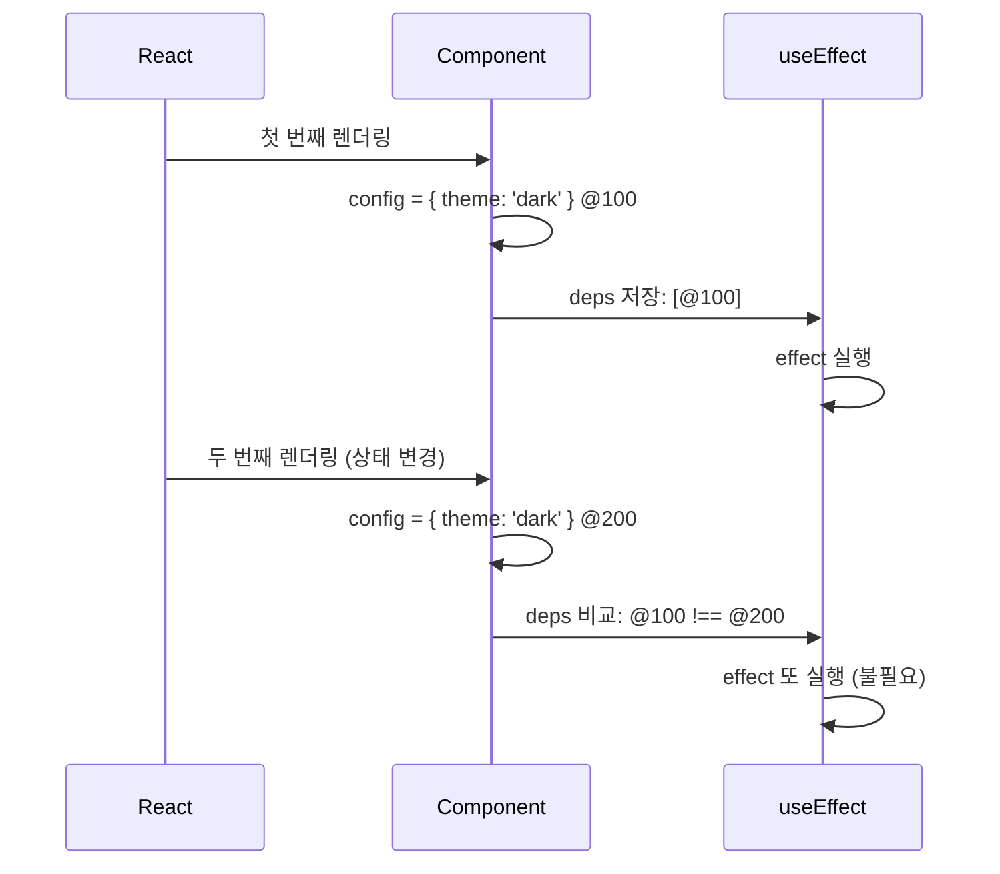
```mermaid
sequenceDiagram
    participant R as React
    participant C as Component
    participant E as useEffect

    R->>C: 첫 번째 렌더링
    C->>C: config = { theme: 'dark' } @100
    C->>E: deps 저장: [@100]
    E->>E: effect 실행

    R->>C: 두 번째 렌더링 (상태 변경)
    C->>C: config = { theme: 'dark' } @200
    C->>E: deps 비교: @100 !== @200
    E->>E: effect 또 실행 (불필요)
```

## 무한 리렌더링 발생 케이스

실제 프로젝트에서 흔히 발생하는 패턴입니다. 함수를 의존성 배열에 넣고 effect 내부에서 상태를 변경하면 무한 루프가 발생합니다.

```jsx
function SearchPage() {
  const [keyword, setKeyword] = useState("");
  const [searchCount, setSearchCount] = useState(0);

  // 매 렌더링마다 새로운 함수 생성
  const inlineSaveDraft = () => {
    console.log("검색 실행:", keyword);
  };

  useEffect(() => {
    if (keyword) {
      inlineSaveDraft();
      setSearchCount((prev) => prev + 1); // 검색 횟수 추적 → 리렌더링 유발
    }
  }, [inlineSaveDraft, keyword]); // 무한 루프!

  return (
    <>
      <input
        value={keyword}
        onChange={(e) => setKeyword(e.target.value)}
        placeholder="검색어 입력"
      />
      <div>검색 횟수: {searchCount}</div>
    </>
  );
}
```

실행 흐름:

1. 사용자가 input에 입력 → `keyword` 상태 변경
2. 컴포넌트 리렌더링 → `inlineSaveDraft` 함수 재생성 (@200, 새 주소)
3. useEffect deps 비교: `inlineSaveDraft @100 !== @200` → effect 실행
4. effect 실행 → `inlineSaveDraft()` 호출 → `setSearchCount` 실행
5. `searchCount` 변경으로 리렌더링 → `inlineSaveDraft` 함수 또 재생성 (@300)
6. useEffect deps 비교: `inlineSaveDraft @200 !== @300` → effect 또 실행
7. 4~6 반복 (무한 루프)

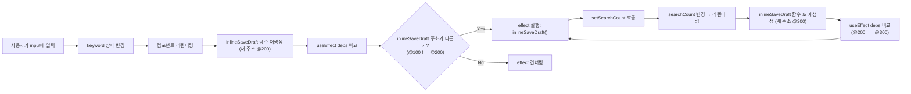
```mermaid
flowchart LR
    A["사용자가 input에 입력"] --> B["keyword 상태 변경"]
    B --> C["컴포넌트 리렌더링"]
    C --> D["inlineSaveDraft 함수 재생성 (새 주소 @200)"]
    D --> E["useEffect deps 비교"]
    E --> F{"inlineSaveDraft 주소가 다른가?<br/>(@100 !== @200)"}
    F -->|Yes| G["effect 실행: inlineSaveDraft()"]
    G --> H["setSearchCount 호출"]
    H --> I["searchCount 변경 → 리렌더링"]
    I --> J["inlineSaveDraft 함수 또 재생성 (새 주소 @300)"]
    J --> K["useEffect deps 비교<br/>(@200 !== @300)"]
    K --> G
    F -->|No| L["effect 건너뜀"]
```

### Chrome DevTools로 확인한 메모리 주소 변화

실제로 함수가 매 렌더링마다 새로운 메모리 주소를 갖는지 Chrome DevTools의 Memory 탭에서 확인할 수 있습니다.

아래 스크린샷은 Heap Snapshot을 비교한 결과입니다. `inlineSaveDraft` 함수가 각 스냅샷에서 다른 메모리 주소를 가지고 있음을 볼 수 있습니다.

**Snapshot 1에서의 함수 주소:**


**Snapshot 2에서 새로 생성된 함수들:**


**Snapshot 3에서 또 다른 주소의 함수:**


각 스냅샷에서 `inlineSaveDraft` 함수는 `@200175`, `@473745`, `@483163` 등 서로 다른 메모리 주소를 가집니다. 이것이 React가 매 렌더링마다 함수가 "변경됨"으로 판단하는 이유입니다.

## useCallback으로 해결하기

useCallback을 사용하면 함수의 참조를 안정적으로 유지할 수 있습니다.

```jsx
function SearchPage() {
  const [keyword, setKeyword] = useState("");
  const [searchCount, setSearchCount] = useState(0);

  // useCallback으로 함수 참조 안정화
  // keyword가 변경될 때만 함수 재생성 (searchCount 변경과 무관)
  const saveDraft = useCallback(() => {
    console.log("검색 실행:", keyword);
  }, [keyword]); // keyword가 변경될 때만 함수 재생성

  useEffect(() => {
    if (keyword) {
      saveDraft();
      // searchCount를 변경해도 saveDraft 주소는 유지되므로 effect가 재실행되지 않음
      setSearchCount((prev) => prev + 1);
    }
  }, [saveDraft, keyword]); // saveDraft는 keyword에 의존하므로 keyword 변경 시에만 effect 실행

  return (
    <>
      <input
        value={keyword}
        onChange={(e) => setKeyword(e.target.value)}
        placeholder="검색어 입력"
      />
      <div>검색 횟수: {searchCount}</div>
    </>
  );
}
```

#### ❌ 문제 상황: useCallback 없을 때

**문제가 있는 코드:**

```jsx
function SearchPage() {
  const [keyword, setKeyword] = useState("");
  const [searchCount, setSearchCount] = useState(0);

  // 매 렌더링마다 새로운 함수 생성
  const saveDraft = () => {
    console.log('검색 실행:', keyword);
  }

  useEffect(() => {
    if (keyword) {
      saveDraft();
      setSearchCount((prev) => prev + 1);
    }
  }, [saveDraft, keyword]);
  //...
```

**실행 흐름:**

```jsx
// 1단계: 사용자가 input에 "a" 입력
<input value={keyword} onChange={(e) => setKeyword(e.target.value)} />
// → setKeyword('a') 호출
// → keyword: '' → 'a'

// 2단계: 컴포넌트 리렌더링
function SearchPage() {
  // 3단계: 매 렌더링마다 새로운 함수 생성
  const saveDraft = () => {
    console.log('검색 실행:', keyword);
  }; // @100 (새 메모리 주소)

  // 4단계: useEffect deps 비교
  useEffect(() => {
    if (keyword) {
      saveDraft(); // 실행
      setSearchCount((prev) => prev + 1); // searchCount: 0 → 1
    }
  }, [saveDraft, keyword]);
  // 이전 deps: [undefined, ''] (첫 렌더링)
  // 현재 deps: [@100, 'a']
  // @100 !== undefined + 'a' !== '' → effect 실행 ✅
}

// 5단계: searchCount 변경으로 리렌더링 발생
// searchCount: 0 → 1

// 6단계: 리렌더링으로 saveDraft 함수 또 새로 생성
function SearchPage() {
  const saveDraft = () => {
    console.log('검색 실행:', keyword);
  }; // @200 (새 메모리 주소, @100과 다름!)

  // 7단계: useEffect deps 비교
  useEffect(() => {
    if (keyword) {
      saveDraft(); // 또 실행
      setSearchCount((prev) => prev + 1); // searchCount: 1 → 2
    }
  }, [saveDraft, keyword]);
  // 이전 deps: [@100, 'a']
  // 현재 deps: [@200, 'a']
  // @100 !== @200 → effect 또 실행! ⚠️
}

// 8단계: searchCount 변경으로 또 리렌더링
// searchCount: 1 → 2

// 9단계: 리렌더링으로 saveDraft 함수 또 새로 생성
// @300 생성 → effect 또 실행 → searchCount: 2 → 3
// @400 생성 → effect 또 실행 → searchCount: 3 → 4
// ... 무한 반복 🔄
```

**핵심 문제:**
- `keyword`는 변경되지 않았지만 (`'a'`로 동일)
- `saveDraft` 함수만 계속 새로 생성됨 (메모리 주소만 변경: @100 → @200 → @300)
- React는 deps 비교 시 메모리 주소를 비교하므로 (`@100 !== @200`)
- 매번 "변경됨"으로 판단하여 effect를 실행
- effect 실행 → `setSearchCount` → 리렌더링 → 함수 재생성 → effect 실행 (무한 반복)


```mermaid
flowchart LR
    A1["사용자가 input에 입력"] --> B1["keyword 변경"]
    B1 --> C1["리렌더링"]
    C1 --> D1["saveDraft @100 생성"]
    D1 --> E1["effect 실행 (주소 변경 감지)"]
    E1 --> F1["setSearchCount → searchCount=1"]
    F1 --> G1["리렌더링 (searchCount 변경)"]
    G1 --> H1["saveDraft @200 생성 (새 주소)"]
    H1 --> I1["effect 또 실행 (주소 변경 감지)"]
    I1 --> J1["setSearchCount → searchCount=2"]
    J1 --> K1["무한 루프!"]

    style K1 fill:#ff6b6b,stroke:#c92a2a,color:#fff
    style D1 fill:#ffe3e3,stroke:#ff6b6b
    style H1 fill:#ffe3e3,stroke:#ff6b6b
```

#### ✅ 해결 방법: useCallback 적용

**해결된 코드:**

```jsx
function SearchPage() {
  const [keyword, setKeyword] = useState("");
  const [searchCount, setSearchCount] = useState(0);

  // ✅ useCallback으로 함수 참조 안정화
  // keyword가 변경될 때만 함수 재생성 (searchCount 변경과 무관)
  const saveDraft = useCallback(() => {
    console.log("검색 실행:", keyword);
  }, [keyword]); // keyword가 변경될 때만 함수 재생성

  useEffect(() => {
    if (keyword) {
      saveDraft();
      // searchCount를 변경해도 saveDraft 주소는 유지되므로 effect가 재실행되지 않음
      setSearchCount((prev) => prev + 1);
    }
  }, [saveDraft, keyword]);
}
```

**실행 흐름:**

```jsx
// 1단계: 사용자가 input에 "a" 입력
<input value={keyword} onChange={(e) => setKeyword(e.target.value)} />
// → setKeyword('a') 호출
// → keyword: '' → 'a'

// 2단계: 컴포넌트 리렌더링
function SearchPage() {
  // 3단계: useCallback으로 함수 참조 안정화
  const saveDraft = useCallback(() => {
    console.log('검색 실행:', keyword);
  }, [keyword]); // keyword가 '' → 'a'로 변경되었으므로 새 함수 생성
  // @100 생성 (keyword='a'에 의존)

  // 4단계: useEffect deps 비교
  useEffect(() => {
    if (keyword) {
      saveDraft(); // 실행
      setSearchCount((prev) => prev + 1); // searchCount: 0 → 1
    }
  }, [saveDraft, keyword]);
  // 이전 deps: [undefined, '']
  // 현재 deps: [@100, 'a']
  // @100 !== undefined + 'a' !== '' → effect 실행 ✅
}

// 5단계: searchCount 변경으로 리렌더링 발생
// searchCount: 0 → 1

// 6단계: 리렌더링이지만 keyword는 동일하므로 saveDraft 주소 유지
function SearchPage() {
  const saveDraft = useCallback(() => {
    console.log('검색 실행:', keyword);
  }, [keyword]); // keyword='a' (변경 없음)
  // @100 유지! (keyword가 동일하므로 useCallback이 같은 참조 반환)

  // 7단계: useEffect deps 비교
  useEffect(() => {
    if (keyword) {
      saveDraft();
      setSearchCount((prev) => prev + 1);
    }
  }, [saveDraft, keyword]);
  // 이전 deps: [@100, 'a']
  // 현재 deps: [@100, 'a']
  // @100 === @100 && 'a' === 'a' → effect 건너뜀! ✅
}
```

**핵심 해결책:**

- `useCallback`이 `keyword`가 변경될 때만 함수를 재생성
- `searchCount`가 변경되어도 `keyword`는 동일하므로 `saveDraft` 주소 유지 (@100)
- React는 deps 비교 시 `@100 === @100`이므로 "변경 없음"으로 판단
- effect는 `keyword`가 실제로 변경될 때만 실행됨
- 무한 루프 해결! ✅

**비교 요약:**

| 상황             | inlineSaveDraft (메모이제이션 없음) | saveDraft (useCallback)    |
| ---------------- | ----------------------------------- | -------------------------- |
| keyword 변경     | @100 → @200 (새 함수)               | @100 → @200 (새 함수)      |
| searchCount 변경 | @200 → @300 (새 함수) ⚠️            | @100 → @100 (동일 참조) ✅ |
| effect 실행      | 매번 실행 (무한 루프)               | keyword 변경 시만 실행     |


```mermaid
flowchart LR
    A2["사용자가 input에 입력"] --> B2["keyword 변경"]
    B2 --> C2["리렌더링"]
    C2 --> D2["saveDraft @100 생성<br/>(keyword 의존)"]
    D2 --> E2["effect 실행 (주소 변경 감지)"]
    E2 --> F2["setSearchCount → searchCount=1"]
    F2 --> G2["리렌더링 (searchCount 변경)"]
    G2 --> H2["saveDraft @100 유지<br/>(keyword 동일)"]
    H2 --> I2["effect 건너뜀 (주소 동일)"]
    
    style H2 fill:#d3f9d8,stroke:#51cf66,color:#000
    style I2 fill:#d3f9d8,stroke:#51cf66,color:#000
    style D2 fill:#e7f5ff,stroke:#339af0
```

## React Query가 있으면 더 복잡해집니다

실제 프로젝트에서는 React Query(TanStack Query)와 함께 사용하는 경우가 많습니다. 이 경우 문제 추적이 훨씬 어려워집니다.

```jsx
function SearchPage() {
  const [keyword, setKeyword] = useState("");

  // React Query 사용
  const { data, refetch, isFetching } = useQuery({
    queryKey: ["search", keyword],
    queryFn: () => fetchSearchResults(keyword),
    enabled: !!keyword,
  });

  // 매 렌더링마다 새로운 함수 생성
  const saveDraft = () => {
    console.log('검색 실행:', keyword);
    refetch(); // 데이터 다시 가져오기
  };

  useEffect(() => {
    if (keyword) {
      saveDraft();
    }
  }, [saveDraft, keyword]); // 문제 발생!

  return (
    <>
      <input value={keyword} onChange={(e) => setKeyword(e.target.value)} />
      {isFetching && <div>로딩 중...</div>}
      <ul>
        {data?.map((r, i) => (
          <li key={i}>{r}</li>
        ))}
      </ul>
    </>
  );
}
```

**문제점:**

- 사용자가 input에 값을 입력하면 `keyword` 상태가 변경됩니다
- `keyword` 변경으로 리렌더링되면 `saveDraft` 함수가 새로 생성됩니다 (새 주소)
- useEffect의 deps에 `saveDraft`가 있으면 주소 변경을 감지해 effect가 실행됩니다
- effect 내부에서 `refetch()`를 호출하면 React Query 상태가 변경되어 리렌더링이 발생합니다
- 리렌더링으로 `saveDraft`가 또 새로 생성되어 무한 루프가 발생합니다

**실행 흐름:**

```jsx
// 1. 사용자가 'a' 입력 → keyword 변경 → 리렌더링
const saveDraft = () => { ... }; // @200 (새 메모리 주소)
useEffect(..., [saveDraft, keyword]); // [@100, ''] → [@200, 'a']
// @100 !== @200 + 'a' !== '' → effect 실행

// 2. effect 실행 → saveDraft() 호출 → refetch()
// refetch()가 React Query 상태(isFetching, data)를 변경 → 리렌더링

// 3. 리렌더링으로 saveDraft 또 새로 생성
const saveDraft = () => { ... }; // @300
useEffect(..., [saveDraft, keyword]); // [@200, 'a'] → [@300, 'a']
// keyword는 그대로지만 @200 !== @300 → effect 또 실행

// 4. effect 실행 → refetch() → 리렌더링 → saveDraft @400 → ... 무한 반복 🔄
```

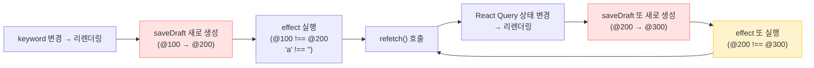
```mermaid
flowchart LR
    A["keyword 변경 → 리렌더링"] --> B["saveDraft 새로 생성<br/>(@100 → @200)"]
    B --> C["effect 실행<br/>(@100 !== @200
    'a' !== '')"]
    C --> D["refetch() 호출"]
    D --> E["React Query 상태 변경<br/>→ 리렌더링"]
    E --> F["saveDraft 또 새로 생성<br/>(@200 → @300)"]
    F --> G["effect 또 실행<br/>(@200 !== @300)"]
    G --> D

    style B fill:#ffe3e3,stroke:#ff6b6b
    style F fill:#ffe3e3,stroke:#ff6b6b
    style G fill:#fff3cd,stroke:#ffc107
```

## useMemo로 객체 안정화하기

만약 객체나 배열이 deps에 들어가야 한다면 useMemo를 사용하세요.

```jsx
function UserDashboard() {
  const [user, setUser] = useState({ name: "Kim" });

  // useMemo로 객체 참조 안정화
  const config = useMemo(() => ({ theme: "dark", locale: "ko" }), []);

  useEffect(() => {
    applyConfig(config);
  }, [config]); // 최초 1회만 실행

  return <div>{user.name}</div>;
}
```

---

# React.memo와 메모이제이션

useCallback과 useMemo가 필요한 또 다른 중요한 케이스는 `React.memo`로 감싼 자식 컴포넌트에 props를 전달할 때입니다.

## React.memo의 동작 원리

`React.memo`는 props가 변경되지 않으면 리렌더링을 건너뜁니다. 하지만 props 비교도 `Object.is`로 수행됩니다.

```jsx
const ExpensiveChild = React.memo(({ onClick, data }) => {
  console.log("ExpensiveChild 렌더링");
  return <button onClick={onClick}>{data.label}</button>;
});

function Parent() {
  const [count, setCount] = useState(0);

  // 매 렌더링마다 새 함수/객체 생성
  const handleClick = () => console.log("clicked");
  const data = { label: "Click me" };

  return (
    <>
      <button onClick={() => setCount(count + 1)}>Count: {count}</button>
      {/* count가 변경될 때마다 ExpensiveChild도 리렌더링됨 */}
      <ExpensiveChild onClick={handleClick} data={data} />
    </>
  );
}
```

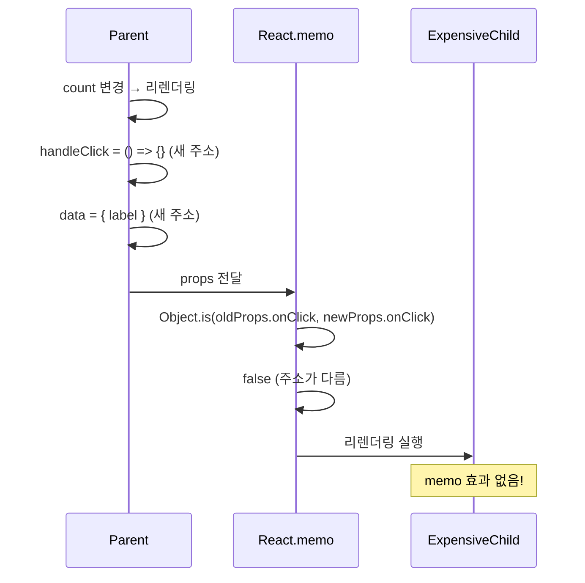
```mermaid
sequenceDiagram
    participant P as Parent
    participant M as React.memo
    participant C as ExpensiveChild

    P->>P: count 변경 → 리렌더링
    P->>P: handleClick = () => {} (새 주소)
    P->>P: data = { label } (새 주소)
    P->>M: props 전달
    M->>M: Object.is(oldProps.onClick, newProps.onClick)
    M->>M: false (주소가 다름)
    M->>C: 리렌더링 실행
    Note over C: memo 효과 없음!
```

## 메모이제이션으로 해결

```jsx
function Parent() {
  const [count, setCount] = useState(0);

  // 참조 안정화
  const handleClick = useCallback(() => console.log("clicked"), []);
  const data = useMemo(() => ({ label: "Click me" }), []);

  return (
    <>
      <button onClick={() => setCount(count + 1)}>Count: {count}</button>
      {/* count가 변경되어도 ExpensiveChild는 리렌더링되지 않음 */}
      <ExpensiveChild onClick={handleClick} data={data} />
    </>
  );
}
```

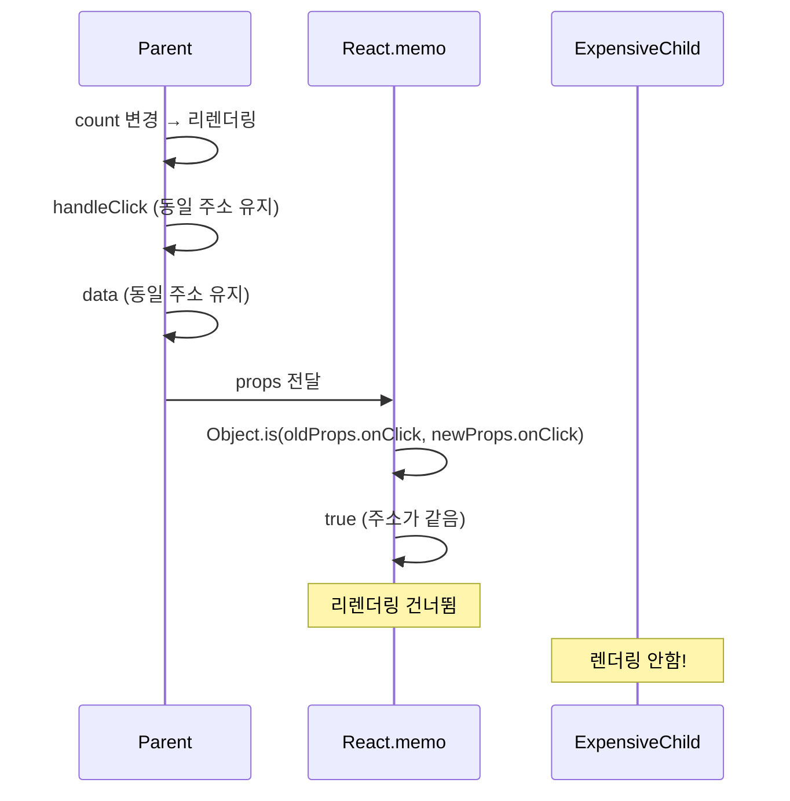
```mermaid
sequenceDiagram
    participant P as Parent
    participant M as React.memo
    participant C as ExpensiveChild

    P->>P: count 변경 → 리렌더링
    P->>P: handleClick (동일 주소 유지)
    P->>P: data (동일 주소 유지)
    P->>M: props 전달
    M->>M: Object.is(oldProps.onClick, newProps.onClick)
    M->>M: true (주소가 같음)
    Note over M: 리렌더링 건너뜀
    Note over C: 렌더링 안함!
```

---

# ESLint 경고의 한계와 커스텀 훅의 함정

## eslint-plugin-react-hooks의 역할

`eslint-plugin-react-hooks`는 메모이제이션되지 않은 함수를 의존성 배열에 넣으면 경고합니다.

```jsx
function Example() {
  const [count, setCount] = useState(0);

  // 메모이제이션되지 않은 함수
  const handleClick = () => {
    console.log(count);
  };

  useEffect(() => {
    handleClick();
  }, [handleClick]); // ESLint 경고: The 'handleClick' function makes the dependencies of useEffect Hook change on every render

  return <button onClick={handleClick}>{count}</button>;
}
```

이 경고는 "매 렌더링마다 함수가 재생성되어 effect가 불필요하게 실행될 수 있다"는 것을 알려줍니다. ESLint는 `useCallback`으로 감싸거나 effect 내부로 함수를 이동하라고 제안합니다.

## 커스텀 훅에서 반환된 함수는 경고하지 않습니다

문제는 커스텀 훅에서 반환된 메모이제이션되지 않은 함수를 deps에 넣으면 ESLint가 경고하지 않는다는 점입니다.

```jsx
// useAutoSave.ts - 메모이제이션 없이 함수 반환
function useAutoSave() {
  const [lastSaved, setLastSaved] = useState<Date | null>(null);

  // 메모이제이션되지 않은 함수 반환
  const save = (content: string) => {
    api.save(content);
    setLastSaved(new Date());
  };

  return { save, lastSaved };
}

// Component.tsx
function Editor() {
  const [content, setContent] = useState('');
  const { save } = useAutoSave(); // 매 렌더링마다 새로운 save 함수

  useEffect(() => {
    const timer = setInterval(() => save(content), 5000);
    return () => clearInterval(timer);
  }, [save, content]); // ESLint 경고 없음!

  return <textarea value={content} onChange={(e) => setContent(e.target.value)} />;
}
```

ESLint는 컴포넌트 내부에서 선언한 함수가 deps에 들어가면 경고하지만, 훅에서 반환된 함수는 "이미 안정적인 참조일 것"이라고 가정합니다. 하지만 실제로는 훅 내부에서 메모이제이션하지 않으면 매 렌더링마다 새 함수가 생성됩니다.

## 결과: 추적하기 어려운 문제 발생

```jsx
function Editor() {
  const [content, setContent] = useState("");
  const [cursor, setCursor] = useState(0);
  const { save } = useAutoSave(); // 메모이제이션 안된 함수

  useEffect(() => {
    const timer = setInterval(() => save(content), 5000);
    return () => clearInterval(timer);
  }, [save, content]); // ESLint 경고 없음, 하지만 문제 발생

  // cursor가 변경될 때마다 useAutoSave가 새 save 함수를 반환
  return (
    <textarea
      value={content}
      onChange={(e) => setContent(e.target.value)}
      onSelect={(e) => setCursor(e.target.selectionStart)}
    />
  );
}
```

커서 위치가 변경될 때마다:

1. 컴포넌트 리렌더링
2. `useAutoSave`가 새 `save` 함수 반환 (새 메모리 주소)
3. useEffect가 `save` 변경 감지 → effect 재실행
4. 기존 타이머 정리 후 새 타이머 생성

ESLint는 이 문제를 경고하지 않습니다. 훅에서 반환된 함수는 안정적인 참조라고 가정하기 때문입니다. 이것이 커스텀 훅 설계 시 반환값의 메모이제이션이 중요한 이유입니다.

---

# 모든 곳에 메모이제이션하면 안 되나요?

useCallback과 useMemo를 모든 곳에 적용하면 이 문제들을 방지할 수 있을까요? 이론적으로는 안전할 수 있습니다. 하지만 무분별한 메모이제이션은 다른 문제를 만듭니다.

## 1. 메모리 점유 & 가비지 컬렉션 부담

가비지 컬렉션은 브라우저에서 더 이상 사용되지 않는 데이터를 자동으로 제거하는데요. 메모이제이션이 유지되는 동안 가비지 컬렉션은 해당 데이터를 수거하지 못합니다.

```jsx
const filtered = useMemo(
  () => items.filter((item) => item.category === filter),
  [items, filter]
);
```

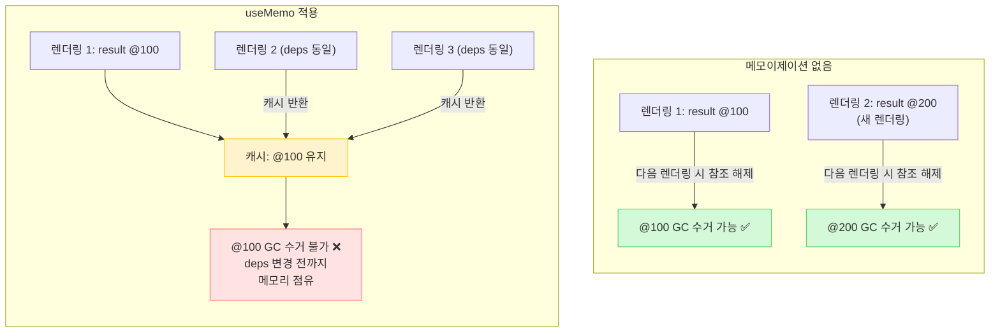
```mermaid
flowchart TB
    subgraph Without["메모이제이션 없음"]
        direction TB
        A1["렌더링 1: result @100"]
        A2["렌더링 2: result @200
        (새 렌더링)"]
        A1 -->|"다음 렌더링 시 참조 해제"| GC1["@100 GC 수거 가능 ✅"]
        A2 -->|"다음 렌더링 시 참조 해제"| GC2["@200 GC 수거 가능 ✅"]
    end

    subgraph With["useMemo 적용"]
        direction TB
        C1["렌더링 1: result @100"]
        C2["렌더링 2 (deps 동일)"]
        C3["렌더링 3 (deps 동일)"]
        CACHE["캐시: @100 유지"]
        C1 --> CACHE
        C2 -->|"캐시 반환"| CACHE
        C3 -->|"캐시 반환"| CACHE
        CACHE --> BLOCK["@100 GC 수거 불가 ❌
        deps 변경 전까지
        메모리 점유"]
    end

    style BLOCK fill:#ffe3e3,stroke:#ff6b6b
    style GC1 fill:#d3f9d8,stroke:#51cf66
    style GC2 fill:#d3f9d8,stroke:#51cf66
    style CACHE fill:#fff3cd,stroke:#ffc107
```

useMemo는 한 번에 하나의 캐시된 값만 보관합니다. deps가 바뀌지 않는 한 현재 캐시된 결과(@100)가 메모리에 유지되어 GC가 수거하지 못합니다. 컴포넌트가 마운트되어 있는 동안 계속 메모리를 차지하게 됩니다.

## 2. 의존성 배열 비교

리렌더링 시마다 의존성 배열의 값을 이전 값과 비교하는데요. 이 비용은 배열의 길이만큼 일어나서 O(n)의 시간 복잡도를 갖습니다. 성능을 위해서 메모이제이션을 작업했지만 오히려 성능이 안 좋아지는 것이죠.

```jsx
// 의존성 배열이 길어질수록 비교 비용이 증가
const result = useMemo(
  () => a + b + c + d + e, // 사실 단순 계산
  [a, b, c, d, e] // 렌더링마다 5번의 Object.is 비교
);

// 단순한 계산이라면 그냥 계산하는 것이 더 빠름
const result = a + b + c + d + e;
```

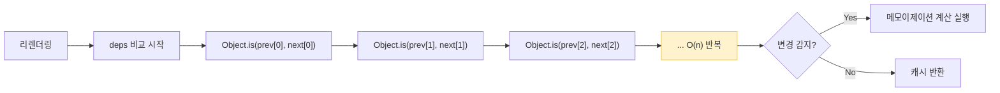
```mermaid
flowchart LR
    A["리렌더링"] --> B["deps 비교 시작"]
    B --> C["Object.is(prev[0], next[0])"]
    C --> D["Object.is(prev[1], next[1])"]
    D --> E["Object.is(prev[2], next[2])"]
    E --> F["... O(n) 반복"]
    F --> G{"변경 감지?"}
    G -->|Yes| H["메모이제이션 계산 실행"]
    G -->|No| I["캐시 반환"]

    style F fill:#fff3cd,stroke:#ffc107
```

단순한 계산의 경우 비교 비용 자체가 실제 계산 비용보다 커질 수 있습니다.

## 3. 원시 타입의 무의미한 최적화

원시 타입은 메모이제이션을 할 필요가 없어요. 오히려 가독성을 해치는 방향이 됩니다.

```jsx
// Bad: 원시형에 불필요한 메모이제이션
const doubled = useMemo(() => count * 2, [count]);
const isEven = useMemo(() => count % 2 === 0, [count]);
const label = useMemo(() => `카운트: ${count}`, [count]);

// Good: 그냥 계산
const doubled = count * 2;
const isEven = count % 2 === 0;
const label = `카운트: ${count}`;
```

원시형은 값 자체를 비교하기 때문에 렌더링마다 같은 값이면 `Object.is` 비교에서 `true`를 반환합니다. 단, useMemo 없이는 `count * 2` 같은 계산 자체는 매 렌더링마다 실행됩니다. React가 방지하는 것은 계산이 아니라, 이 값을 prop으로 전달받는 자식 컴포넌트의 불필요한 리렌더링입니다.

## 4. 실수 유발

모든 데이터가 메모이제이션되어 있으면 나중에 다른 개발자는 어떤 데이터가 비싼 비용을 가진 계산인지 판단하지 못합니다. 또한 의존성 배열의 데이터가 누락될 경우 stale closure 버그가 발생합니다.

```jsx
const [count, setCount] = useState(0);

// deps에 count를 빠뜨리면 stale closure 발생
const handleClick = useCallback(() => {
  console.log(count); // 항상 0을 출력 (초기값에 고정됨)
}, []); // ⚠️ count가 누락

// count가 아무리 변경되어도 handleClick은 count=0인 클로저를 참조
```

> [!NOTE] stale closure
>
> 메모이제이션으로 인해 이전의 데이터가 저장되고 그것으로만 유지되는 현상. 최신화되지 않는 상황을 말합니다.

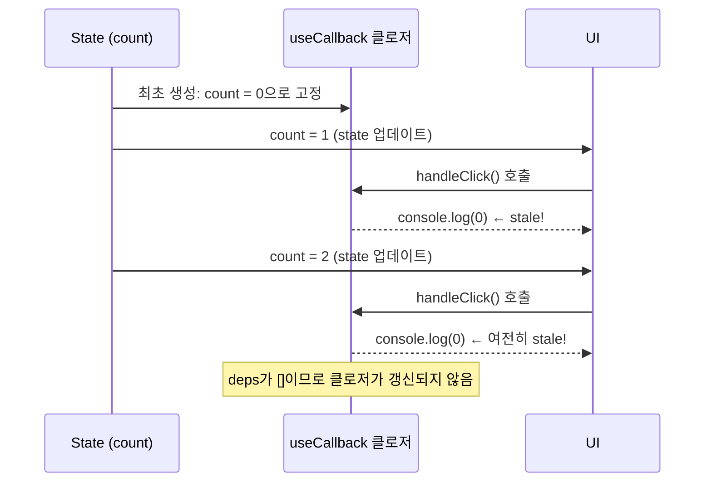
```mermaid
sequenceDiagram
    participant S as State (count)
    participant C as useCallback 클로저
    participant U as UI

    S->>C: 최초 생성: count = 0으로 고정
    S->>U: count = 1 (state 업데이트)
    U->>C: handleClick() 호출
    C-->>U: console.log(0) ← stale!
    S->>U: count = 2 (state 업데이트)
    U->>C: handleClick() 호출
    C-->>U: console.log(0) ← 여전히 stale!
    Note over C: deps가 []이므로 클로저가 갱신되지 않음
```

---

# 메모이제이션 적용 원칙

무분별한 메모이제이션의 비용을 이해했다면, 이제 올바르게 적용하기 위한 원칙을 알아봅니다.

## 조기 최적화는 함정이다

먼저 코드를 작성하고, Profiler로 실제 병목을 측정한 다음 최적화합니다.

```jsx
// ❌ 느린지 확인하기 전에 미리 최적화
function ItemList({ items, onSelect }) {
  const filtered = useMemo(() => items.filter(isActive), [items]);
  const handleClick = useCallback((id) => onSelect(id), [onSelect]);

  return filtered.map((item) => (
    <Item key={item.id} data={item} onClick={handleClick} />
  ));
}

// ✅ 먼저 작성하고, Profiler에서 병목을 확인한 뒤 최적화
function ItemList({ items, onSelect }) {
  const filtered = items.filter(isActive);

  return filtered.map((item) => (
    <Item key={item.id} data={item} onClick={(id) => onSelect(id)} />
  ));
}
```

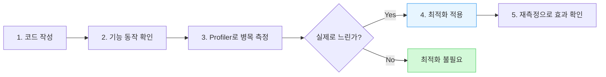
```mermaid
flowchart LR
    A["1. 코드 작성"] --> B["2. 기능 동작 확인"]
    B --> C["3. Profiler로 병목 측정"]
    C --> D{"실제로 느린가?"}
    D -->|Yes| E["4. 최적화 적용"]
    D -->|No| F["최적화 불필요"]
    E --> G["5. 재측정으로 효과 확인"]

    style F fill:#d3f9d8,stroke:#51cf66
    style E fill:#e7f5ff,stroke:#339af0
```

## 최적화의 비용을 계산하라

모든 최적화에는 트레이드오프가 있습니다. 맥락 없는 최적화는 비용만 추가합니다.

```jsx
// ✅ React.memo가 효과적인 경우: 반복 렌더링되는 리스트 아이템
// 아이템 수 × 렌더링 횟수만큼 비용이 절감된다
const ListItem = React.memo(({ item, onDelete }) => {
  return <div onClick={() => onDelete(item.id)}>{item.name}</div>;
});

// ❌ useCallback이 불필요한 경우: props나 deps에 사용되지 않는 함수
function Component() {
  // 비교 비용만 추가, 실질적 이득 없음
  const getLabel = useCallback(() => '안녕', []);
  return <div>{getLabel()}</div>;
}

// ✅ props나 deps에 전달되지 않으면 그냥 선언
function Component() {
  const getLabel = () => '안녕';
  return <div>{getLabel()}</div>;
}
```

| 케이스 | 최적화 여부 | 이유 |
|--------|------------|------|
| 리스트 아이템 컴포넌트 | React.memo 고려 | 아이템 수만큼 절감 효과가 쌓임 |
| deps/props에 전달되는 함수 | useCallback 필요 | 참조 안정성이 필요한 경우 |
| 내부에서만 쓰는 단순 함수 | 불필요 | 비교 비용만 추가됨 |
| 복잡한 계산 (정렬, 필터링) | useMemo 필요 | 렌더링마다 반복 계산 방지 |
| 단순 산술 (count * 2) | 불필요 | 계산 비용 < 메모이제이션 비용 |

메모이제이션은 꼭 필요한 곳에만 사용하세요. 항상 데이터로 증명하고 적용합니다.

---

# 메모이제이션 이전에: 구조적 최적화

메모이제이션 최적화 이전에 우리는 "구조적 최적화"가 필요합니다. 메모이제이션을 해야하는 상황이라고 판단이 들면 다음 사고 과정을 한번 거치고 판단해주세요.

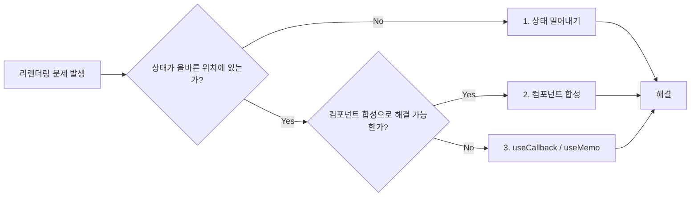
```mermaid
flowchart LR
    A["리렌더링 문제 발생"] --> B{"상태가 올바른 위치에 있는가?"}
    B -->|No| C["1. 상태 밀어내기"]
    B -->|Yes| D{"컴포넌트 합성으로 해결 가능한가?"}
    D -->|Yes| E["2. 컴포넌트 합성"]
    D -->|No| F["3. useCallback / useMemo"]
    C --> G["해결"]
    E --> G
    F --> G
```

## 1. 상태 밀어내기

어떤 상태가 잘못된 범위에 설정되어 있지 않은지 확인합니다. 상태는 사용되는 컴포넌트에만 분리되는 것이 좋습니다.

```jsx
// Bad: count 상태가 App에 있어서 HeavyComponent도 리렌더링됨
function App() {
  const [count, setCount] = useState(0);

  return (
    <div>
      <button onClick={() => setCount(count + 1)}>Count: {count}</button>
      <HeavyComponent /> {/* count 변경 시 불필요하게 리렌더링 */}
    </div>
  );
}

// Good: count를 사용하는 컴포넌트로 상태를 밀어냄
function Counter() {
  const [count, setCount] = useState(0);
  return <button onClick={() => setCount(count + 1)}>Count: {count}</button>;
}

function App() {
  return (
    <div>
      <Counter />
      <HeavyComponent /> {/* Counter의 리렌더링과 완전히 무관 */}
    </div>
  );
}
```

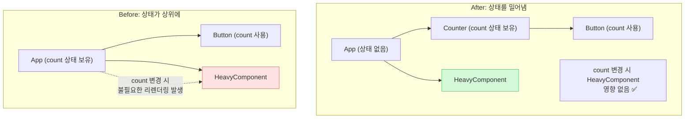
```mermaid
flowchart TB
    subgraph After["After: 상태를 밀어냄"]
        A2["App (상태 없음)"]
        A2 --> B2["Counter (count 상태 보유)"]
        B2 --> D2["Button (count 사용)"]
        A2 --> C2["HeavyComponent"]
        note["count 변경 시 HeavyComponent
        영향 없음 ✅"]
        style C2 fill:#d3f9d8,stroke:#51cf66
    end

    subgraph Before["Before: 상태가 상위에"]
        A1["App (count 상태 보유)"]
        A1 --> B1["Button (count 사용)"]
        A1 --> C1["HeavyComponent"]
        A1 -. "count 변경 시
        불필요한 리렌더링 발생" .-> C1
        style C1 fill:#ffe3e3,stroke:#ff6b6b
    end
```

상태의 범위를 좁히면 리렌더링 범위도 함께 좁아집니다. 메모이제이션 없이도 불필요한 리렌더링을 막을 수 있습니다.

## 2. 컴포넌트 합성

children을 prop으로 받는 wrapper 컴포넌트를 만들게 되면 wrapper 컴포넌트의 리렌더링이 일어나도 children의 참조 주소는 동일하기 때문에 해당 children 컴포넌트는 자동 bailout됩니다.

> [!NOTE] bailout
>
> React가 리렌더링을 건너뛰는 것. 부모가 리렌더링되어도 children prop으로 전달된 JSX 요소는 부모 컴포넌트가 리렌더링되더라도 참조 주소가 바뀌지 않아 bailout이 발생합니다.

```jsx
// Bad: ThemeProvider가 리렌더링될 때 HeavyContent도 리렌더링됨
function ThemeProvider() {
  const [theme, setTheme] = useState('light');

  return (
    <div className={theme}>
      <button onClick={() => setTheme(theme === 'light' ? 'dark' : 'light')}>
        테마 변경
      </button>
      <HeavyContent /> {/* theme 변경 시 불필요하게 리렌더링 */}
    </div>
  );
}

// Good: children을 prop으로 받아 합성
function ThemeProvider({ children }) {
  const [theme, setTheme] = useState('light');

  return (
    <div className={theme}>
      <button onClick={() => setTheme(theme === 'light' ? 'dark' : 'light')}>
        테마 변경
      </button>
      {children} {/* 부모 컴포넌트가 리렌더링되더라도 참조 주소 동일 → 자동 bailout */}
    </div>
  );
}

function App() {
  return (
    <ThemeProvider>
      <HeavyContent /> {/* ThemeProvider 리렌더링과 무관 */}
    </ThemeProvider>
  );
}
```

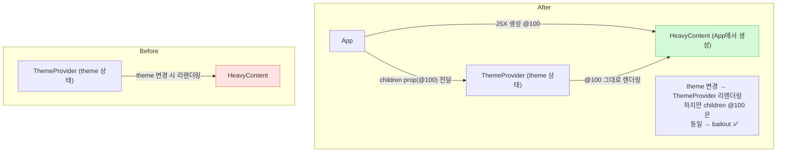
```mermaid
flowchart TB
    subgraph After["After"]
        A2["App"]
        A2 -->|"JSX 생성 @100"| H2["HeavyContent (App에서 생성)"]
        A2 -->|"children prop(@100) 전달"| W2["ThemeProvider (theme 상태)"]
        W2 -->|"@100 그대로 렌더링"| H2
        note["theme 변경 → ThemeProvider 리렌더링
        하지만 children @100은
        동일 → bailout ✅"]
        style H2 fill:#d3f9d8,stroke:#51cf66
    end

    subgraph Before["Before"]
        W1["ThemeProvider (theme 상태)"]
        W1 -->|"theme 변경 시 리렌더링"| H1["HeavyContent"]
        style H1 fill:#ffe3e3,stroke:#ff6b6b
    end
```

children이 App에서 생성되기 때문에 ThemeProvider가 리렌더링되어도 children JSX의 참조 주소는 변하지 않습니다. React는 이를 감지하고 HeavyContent의 리렌더링을 bailout합니다.

## 3. 최적화 훅 (useCallback, useMemo)

위의 방법들로도 해결할 수 없다면 이제 useCallback, useMemo를 사용해줍니다. 이 문서에서 다룬 케이스들처럼 의존성 배열 안정화, React.memo와 함께 사용, 커스텀 훅 반환값의 참조 안정성이 필요한 경우가 이에 해당합니다.

---

# 참고 자료

- [리액트 딥다이브](https://product.kyobobook.co.kr/detail/S000210725203)
- [React 마스터 클래스: Part 2 - 미션으로 완성하는 고성능 훅과 실전 아키텍처](https://www.inflearn.com/course/react-%EB%A7%88%EC%8A%A4%ED%84%B0-%ED%81%B4%EB%9E%98%EC%8A%A4-part-2)
