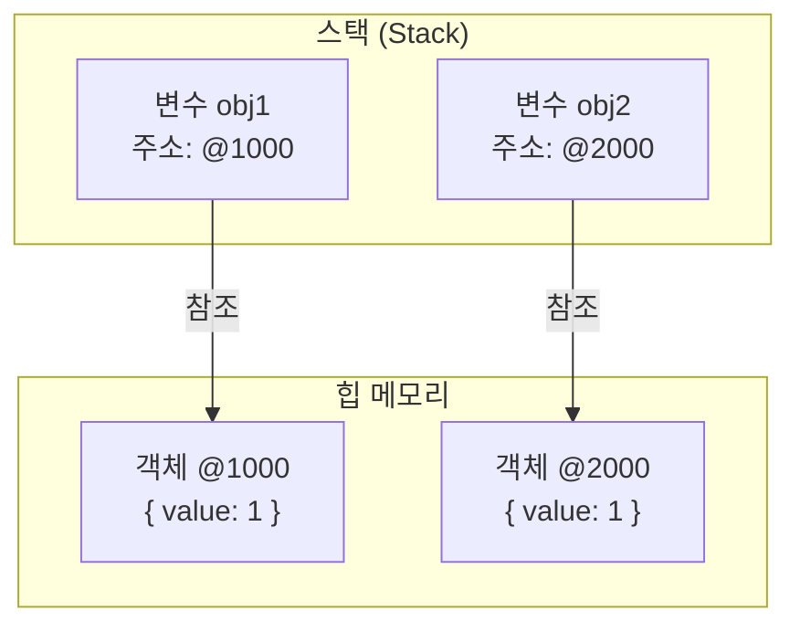
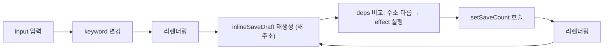
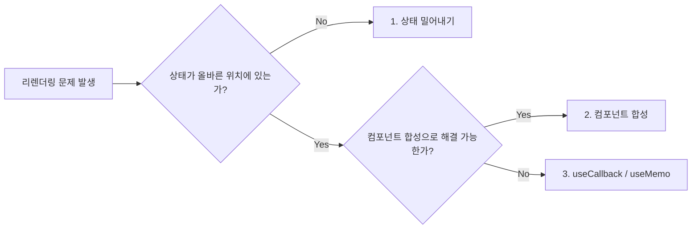

React에서 useCallback과 useMemo를 사용하는 이유는 단순히 성능 최적화가 아닙니다. JavaScript의 참조형 데이터 특성과 React의 의존성 배열 동작 방식을 이해하면, 이 훅들이 필수가 되는 상황이 왜 생기는지 알 수 있습니다.

## 원시형과 참조형의 메모리 구조

JavaScript의 데이터 타입은 원시형(Primitive)과 참조형(Reference)으로 나뉩니다. 원시형은 값 자체가 메모리에 직접 저장되어 값을 비교합니다.

```javascript
let a = 1;
let b = 1;
console.log(a === b); // true, 값 자체를 비교
```

참조형은 힙에 객체가 저장되고, 변수는 그 객체의 메모리 주소만 가지고 있습니다. 그래서 내용이 같아도 주소가 다르면 다른 값으로 취급됩니다.

```javascript
const obj1 = { value: 1 };
const obj2 = { value: 1 };
console.log(obj1 === obj2); // false, 주소를 비교
```


```mermaid
flowchart TB
    subgraph Stack["스택 (Stack)"]
        V1["변수 obj1<br/>주소: @1000"]
        V2["변수 obj2<br/>주소: @2000"]
    end
    subgraph Heap["힙 메모리"]
        O1["객체 @1000<br/>{ value: 1 }"]
        O2["객체 @2000<br/>{ value: 1 }"]
    end
    V1 -->|"참조"| O1
    V2 -->|"참조"| O2
```

| 구분 | 원시형 | 참조형 |
|------|--------|--------|
| **저장 위치** | 스택에 값 직접 저장 | 힙에 객체 저장, 스택에는 주소만 |
| **할당 방식** | 값 자체를 복사 | 주소(참조값)를 복사 |
| **비교 연산** | 값 자체를 비교 | 주소를 비교 |

함수도 JavaScript에서 일급 객체이며 참조형입니다. 동일한 코드를 가진 함수라도 선언할 때마다 새로운 메모리 주소가 할당됩니다.

```javascript
const fn1 = () => console.log("hello");
const fn2 = () => console.log("hello");
console.log(fn1 === fn2); // false
```

이 차이가 useEffect 의존성 배열과 React.memo에서 중요한 문제를 일으킵니다.

---

## useEffect 의존성 배열과 참조형의 함정

React의 useEffect는 의존성 배열의 값이 변경될 때 콜백을 실행합니다. 이 비교는 `Object.is`로 수행되므로, 숫자나 문자열 같은 원시형은 값이 실제로 변경될 때만 effect가 실행되어 안전합니다. 문제는 참조형입니다.

```jsx
function SearchPage() {
  const [keyword, setKeyword] = useState("");
  const [saveCount, setSaveCount] = useState(0);

  // 매 렌더링마다 새로운 함수 생성
  const inlineSaveDraft = () => {
    console.log("임시 저장:", keyword);
  };

  useEffect(() => {
    if (keyword) {
      inlineSaveDraft();
      setSaveCount((prev) => prev + 1); // 저장 횟수 추적 → 리렌더링 유발
    }
  }, [inlineSaveDraft, keyword]); // 무한 루프!

  return (
    <input value={keyword} onChange={(e) => setKeyword(e.target.value)} />
  );
}
```

실행 흐름은 다음과 같습니다.

1. 사용자가 input에 입력 → `keyword` 상태 변경
2. 컴포넌트 리렌더링 → `inlineSaveDraft` 함수 재생성 (새 주소)
3. deps 비교: 주소가 다르므로 effect 실행
4. effect가 `setSaveCount` 호출 → 리렌더링
5. 리렌더링으로 `inlineSaveDraft` 또 재생성 → 2~4 반복 (무한 루프)


```mermaid
flowchart LR
    A["input 입력"] --> B["keyword 변경"]
    B --> C["리렌더링"]
    C --> D["inlineSaveDraft 재생성 (새 주소)"]
    D --> E["deps 비교: 주소 다름 → effect 실행"]
    E --> F["setSaveCount 호출"]
    F --> G["리렌더링"]
    G --> D
```

실제로 Chrome DevTools의 Memory 탭에서 Heap Snapshot을 비교해보면, `inlineSaveDraft` 함수가 스냅샷마다 다른 메모리 주소(`@200175`, `@473745`, `@483163`)를 가지는 것을 확인할 수 있습니다.


### useCallback으로 해결하기

`useCallback`으로 함수를 감싸면 의존성이 바뀌지 않는 한 같은 참조를 반환합니다.

```jsx
const saveDraft = useCallback(() => {
  console.log("임시 저장:", keyword);
}, [keyword]); // keyword가 변경될 때만 함수 재생성

useEffect(() => {
  if (keyword) {
    saveDraft();
    setSaveCount((prev) => prev + 1);
  }
}, [saveDraft, keyword]);
```

`saveCount`가 변경되어 리렌더링이 일어나도 `keyword`가 그대로면 `saveDraft`는 이전과 동일한 주소를 유지합니다. deps 비교에서 "변경 없음"으로 판단되어 effect가 다시 실행되지 않고, 무한 루프가 해결됩니다.

| 상황 | 메모이제이션 없음 | useCallback 적용 |
|------|------|------|
| keyword 변경 | 새 함수 생성 | 새 함수 생성 |
| saveCount 변경 | 새 함수 생성 ⚠️ | 동일 참조 유지 ✅ |
| effect 실행 | 매번 실행 (무한 루프) | keyword 변경 시만 실행 |

실제 프로젝트에서는 React Query 같은 데이터 fetching 라이브러리와 함께 쓰이는 경우가 많습니다. 라이브러리 내부의 상태 변경이 리렌더링을 일으키고, 그 리렌더링이 함수를 재생성해 다시 effect를 실행하는 식이라 원인 추적이 훨씬 어렵습니다. 하지만 원리는 동일하고, `useCallback`으로 참조를 고정하면 같은 방식으로 해결됩니다.

### useMemo로 객체 안정화하기

객체나 배열이 deps에 들어가야 한다면 `useMemo`를 사용합니다.

```jsx
const config = useMemo(() => ({ theme: "dark", locale: "ko" }), []);

useEffect(() => {
  applyConfig(config);
}, [config]); // 최초 1회만 실행
```

---

## React.memo와 메모이제이션

useCallback과 useMemo가 필요한 또 다른 중요한 케이스는 `React.memo`로 감싼 자식 컴포넌트에 props를 전달할 때입니다. `React.memo`는 props가 변경되지 않으면 리렌더링을 건너뛰는데, 이 비교도 `Object.is`로 수행됩니다.

```jsx
const ExpensiveChild = React.memo(({ onClick, data }) => {
  return <button onClick={onClick}>{data.label}</button>;
});

function Parent() {
  const [count, setCount] = useState(0);

  // 매 렌더링마다 새 함수/객체 생성 → memo 효과 없음
  const handleClick = () => console.log("clicked");
  const data = { label: "Click me" };

  return (
    <>
      <button onClick={() => setCount(count + 1)}>Count: {count}</button>
      <ExpensiveChild onClick={handleClick} data={data} />
    </>
  );
}
```

`count`가 변경될 때마다 `handleClick`과 `data`가 새 주소로 생성되므로, `React.memo`의 props 비교는 항상 "다름"으로 판단하고 `ExpensiveChild`를 리렌더링합니다. `useCallback`과 `useMemo`로 참조를 안정화하면 이 문제가 해결됩니다.

```jsx
const handleClick = useCallback(() => console.log("clicked"), []);
const data = useMemo(() => ({ label: "Click me" }), []);
```

이제 `count`가 변경되어도 `handleClick`과 `data`는 동일한 주소를 유지하므로, `React.memo`는 리렌더링을 건너뜁니다.

---

## ESLint 경고의 한계

`eslint-plugin-react-hooks`는 컴포넌트 본문에서 직접 만든 함수를 의존성 배열에 넣으면 경고합니다. 하지만 **커스텀 훅에서 반환된 함수**를 deps에 넣을 때는 메모이제이션이 안 되어 있어도 경고하지 않습니다. 규칙이 추적하는 것은 컴포넌트 본문에서 정의한 함수이고, 호출의 반환값으로 들어온 함수는 안정적이라고 가정하기 때문입니다. **경고가 없다는 것이 문제가 없다는 뜻은 아닙니다.**

---

## 모든 곳에 메모이제이션하면 안 되나요?

useCallback과 useMemo를 모든 곳에 적용하면 이 문제들을 방지할 수 있을까요? 이론적으로는 안전할 수 있지만, 무분별한 메모이제이션은 다른 문제를 만듭니다.

**1. 메모리 점유와 GC 부담.** `useMemo`는 캐시된 값을 deps가 바뀔 때까지 계속 붙들고 있습니다. 그동안 가비지 컬렉션은 이 값을 수거하지 못하고, 컴포넌트가 마운트된 동안 계속 메모리를 점유합니다.

**2. 의존성 배열 비교 비용.** 리렌더링마다 이전 deps와 새 deps를 `Object.is`로 하나씩 비교하는데, 이 비용은 배열 길이만큼 O(n)으로 늘어납니다.

```jsx
// 단순 계산인데 deps 비교 비용이 계산 비용보다 커질 수 있음
const result = useMemo(() => a + b + c + d + e, [a, b, c, d, e]);
```

**3. 원시 타입의 무의미한 최적화.** 원시형은 값 비교만으로 충분하므로 메모이제이션이 오히려 가독성을 해칩니다.

```jsx
// Bad
const doubled = useMemo(() => count * 2, [count]);
// Good
const doubled = count * 2;
```

**4. 실수 유발.** 모든 데이터가 메모이제이션되어 있으면 어떤 계산이 실제로 비싼지 판단하기 어려워집니다. 또한 의존성 배열에서 값이 누락되면 stale closure 버그가 발생합니다.

```jsx
const handleClick = useCallback(() => {
  console.log(count); // 항상 초기값(0)을 출력 — deps에 count 누락
}, []);
```

---

## 메모이제이션 적용 원칙

**조기 최적화는 함정입니다.** 먼저 코드를 작성하고 Profiler로 실제 병목을 측정한 다음 최적화합니다.

**최적화의 비용을 계산합니다.** 모든 최적화에는 트레이드오프가 있습니다.

| 케이스 | 최적화 여부 | 이유 |
|--------|------------|------|
| 리스트 아이템 컴포넌트 | React.memo 고려 | 아이템 수만큼 절감 효과가 쌓임 |
| deps/props에 전달되는 함수 | useCallback 필요 | 참조 안정성이 필요한 경우 |
| 내부에서만 쓰는 단순 함수 | 불필요 | 비교 비용만 추가됨 |
| 복잡한 계산 (정렬, 필터링) | useMemo 필요 | 렌더링마다 반복 계산 방지 |
| 단순 산술 (count * 2) | 불필요 | 계산 비용 < 메모이제이션 비용 |

메모이제이션은 꼭 필요한 곳에만, 측정으로 병목이 증명되었을 때 적용하는 것이 좋습니다.

---

## 메모이제이션 이전에: 구조적 최적화

메모이제이션이 필요하다고 판단되면, 그 전에 다음 순서를 먼저 고려합니다.


```mermaid
flowchart LR
    A["리렌더링 문제 발생"] --> B{"상태가 올바른 위치에 있는가?"}
    B -->|No| C["1. 상태 밀어내기"]
    B -->|Yes| D{"컴포넌트 합성으로 해결 가능한가?"}
    D -->|Yes| E["2. 컴포넌트 합성"]
    D -->|No| F["3. useCallback / useMemo"]
```

**1. 상태 밀어내기.** 상태를 실제로 사용하는 컴포넌트로 옮기면 리렌더링 범위도 함께 좁아집니다.

```jsx
// Bad: count 상태가 App에 있어서 HeavyComponent도 리렌더링됨
function App() {
  const [count, setCount] = useState(0);
  return (
    <div>
      <button onClick={() => setCount(count + 1)}>Count: {count}</button>
      <HeavyComponent />
    </div>
  );
}

// Good: count를 사용하는 컴포넌트로 상태를 밀어냄
function Counter() {
  const [count, setCount] = useState(0);
  return <button onClick={() => setCount(count + 1)}>Count: {count}</button>;
}

function App() {
  return (
    <div>
      <Counter />
      <HeavyComponent /> {/* Counter의 리렌더링과 무관 */}
    </div>
  );
}
```

**2. 컴포넌트 합성.** children을 prop으로 받는 wrapper 컴포넌트를 만들면, wrapper가 리렌더링되어도 children의 참조 주소는 그대로이므로 자동으로 bailout(리렌더링 건너뜀)됩니다.

```jsx
// Good: children을 prop으로 받아 합성
function ThemeProvider({ children }) {
  const [theme, setTheme] = useState("light");
  return (
    <div className={theme}>
      <button onClick={() => setTheme(theme === "light" ? "dark" : "light")}>
        테마 변경
      </button>
      {children} {/* theme 변경과 무관하게 참조 주소 동일 → bailout */}
    </div>
  );
}

function App() {
  return (
    <ThemeProvider>
      <HeavyContent />
    </ThemeProvider>
  );
}
```

**3. 최적화 훅.** 위 두 방법으로도 해결할 수 없을 때, 즉 의존성 배열 안정화나 `React.memo`와의 조합처럼 참조 안정성 자체가 필요한 경우에 `useCallback`, `useMemo`를 사용합니다.

## 마치며

useCallback과 useMemo는 성능 최적화 도구이기 전에 **참조 동일성을 보장하는 도구**입니다. useEffect의 의존성 배열이나 React.memo처럼 참조를 비교하는 곳에서는 선택이 아니라 정확성의 문제가 됩니다. 반대로 그런 필요가 없는 곳에서의 무분별한 사용은 메모리 점유와 비교 비용만 늘리고 코드를 읽기 어렵게 만든다는 사실도 잊지 말아야 합니다.

## 참고 자료

- [리액트 딥다이브](https://product.kyobobook.co.kr/detail/S000210725203)
- [React 마스터 클래스: Part 2 - 미션으로 완성하는 고성능 훅과 실전 아키텍처](https://www.inflearn.com/course/react-%EB%A7%88%EC%8A%A4%ED%84%B0-%ED%81%B4%EB%9E%98%EC%8A%A4-part-2)
