# useCallback, useMemo는 왜 쓸까

React에서 useCallback과 useMemo를 사용하는 이유는 단순히 "성능 최적화"가 아닙니다. JavaScript의 참조형 데이터 특성과 React의 의존성 배열 동작 방식을 이해하면, 이 훅들이 왜 필수적인 상황이 있는지 알 수 있습니다.

이 문서를 읽으면 다음을 이해할 수 있습니다:
- 원시형과 참조형의 메모리 동작 차이
- useEffect 의존성 배열에서 참조형이 위험한 이유
- ESLint가 경고하지 못하는 커스텀 훅 내부의 함정
- 참조형 데이터의 메모이제이션 설계 원칙

---

# 원시형과 참조형의 메모리 구조

JavaScript의 데이터 타입은 원시형(Primitive)과 참조형(Reference)으로 나뉩니다.

## 원시형 데이터

원시형은 값 자체가 메모리 주소에 직접 저장됩니다. 변수는 그 메모리 주소를 가리키며, 그 주소에 값이 저장되어 있습니다.

```javascript
let a = 1;
let b = 1;

console.log(a === b); // true
```

**메모리 구조:**

```mermaid
flowchart TB
    subgraph Memory["메모리"]
        direction TB
        A1["메모리 주소 @100<br/>값: 1"]
        B1["메모리 주소 @200<br/>값: 1"]
    end
    
    subgraph Variables["변수"]
        direction TB
        A2["변수 a → @100"]
        B2["변수 b → @200"]
    end
    
    A2 --> A1
    B2 --> B1
    
    Note1["원시형 데이터는<br/>메모리 주소에 값이 직접 저장됨"]
    
    Memory --> Note1
```

`a`는 메모리 주소 @100을 가리키고, 그 주소에 값 `1`이 직접 저장됩니다. `b`는 메모리 주소 @200을 가리키고, 그 주소에 값 `1`이 직접 저장됩니다. 비교 연산자(`===`)는 저장된 값 자체를 비교하므로 `true`를 반환합니다.

**핵심:**
- 원시형 데이터는 해당 데이터를 담는 메모리 주소를 그대로 사용합니다
- 메모리 주소에 값이 직접 저장되어 있습니다

## 참조형 데이터

참조형은 객체를 위한 메모리 주소가 있고, 그 주소로 가면 객체 내부의 원시형 데이터들이 각각의 메모리 위치를 가지고 있습니다.

```javascript
const obj1 = { value: 1 };
const obj2 = { value: 1 };

console.log(obj1 === obj2); // false
```

**메모리 구조:**

```mermaid
flowchart TB
    subgraph Variables["변수"]
        direction TB
        V1["변수 obj1 → @1000"]
        V2["변수 obj2 → @2000"]
    end
    
    subgraph Heap["힙 메모리"]
        direction TB
        subgraph O1["객체 @1000"]
            direction TB
            P1["@1000+0x00: value<br/>값: 1<br/>(원시형 숫자)"]
        end
        
        subgraph O2["객체 @2000"]
            direction TB
            P2["@2000+0x00: value<br/>값: 1<br/>(원시형 숫자)"]
        end
    end
    
    V1 -->|"참조"| O1
    V2 -->|"참조"| O2
    
    Note1["객체 주소(@1000)로 가면<br/>내부 원시형 값들이<br/>각각의 메모리 위치를 가짐"]
    
    O1 -.-> Note1
    O2 -.-> Note1
```

`obj1`은 객체 주소 @1000을 가리키고, 그 주소로 가면 내부의 `value` 프로퍼티가 메모리 위치 @1000+0x00에 저장되어 있습니다. `obj2`는 객체 주소 @2000을 가리키고, 내부의 `value`는 @2000+0x00에 저장되어 있습니다. 비교 연산자(`===`)는 객체 주소를 비교하므로 `false`를 반환합니다.

**핵심:**
- 참조형 데이터는 객체를 위한 메모리 주소가 있습니다
- 그 주소로 가면 객체 내부의 원시형 데이터들이 각각의 메모리 위치를 가지고 있습니다

### 메모리 구조 상세 예시

더 복잡한 예시로 메모리 구조를 살펴보겠습니다.

```javascript
const user = { name: 'Kim', age: 25 };
```

**3단계: 객체 내부 구조**

객체 내부의 원시형 값들도 각각의 메모리 주소를 가집니다. 객체 주소(@1000)로 가면 내부의 원시형 값들이 각각의 메모리 위치를 가지고 있습니다.

```mermaid
flowchart TB
    subgraph Variables["변수"]
        V1["변수 user → @1000"]
    end
    
    subgraph Heap["힙 메모리"]
        direction TB
        subgraph Object["객체 @1000"]
            direction TB
            P1["@1000+0x00: name<br/>값: 'Kim'<br/>(원시형 문자열)"]
            P2["@1000+0x10: age<br/>값: 25<br/>(원시형 숫자)"]
        end
    end
    
    V1 -->|"참조"| Object
    Object --> P1
    Object --> P2
    
    Note1["객체 주소(@1000)로 가면<br/>내부 원시형 값들이<br/>각각의 메모리 주소를 가짐"]
    
    Object -.-> Note1
```

**중첩 객체 예시:**

```javascript
const user = {
  name: 'Kim',
  address: { city: 'Seoul', zip: '12345' }
};
```

```mermaid
flowchart TB
    subgraph Variables["변수"]
        V1["변수 user → @1000"]
    end
    
    subgraph Heap["힙 메모리"]
        direction TB
        subgraph O1["객체 @1000"]
            direction TB
            P1["@1000+0x00: name<br/>값: 'Kim'<br/>(원시형)"]
            P2["@1000+0x10: address<br/>값: @2000<br/>(참조형 주소)"]
        end
        
        subgraph O2["객체 @2000"]
            direction TB
            P3["@2000+0x00: city<br/>값: 'Seoul'<br/>(원시형)"]
            P4["@2000+0x10: zip<br/>값: '12345'<br/>(원시형)"]
        end
    end
    
    V1 -->|"참조"| O1
    P2 -->|"참조"| O2
    
    Note1["각 객체 내부의<br/>원시형 값들이<br/>각각의 메모리 주소를 가짐"]
    
    O1 -.-> Note1
    O2 -.-> Note1
```

### 원시형 vs 참조형 비교

이제 원시형과 참조형의 메모리 동작 차이를 한눈에 비교해보겠습니다.

```javascript
// 원시형 예시
let a = 1;
let b = 1;
console.log(a === b); // true

// 참조형 예시
const obj1 = { value: 1 };
const obj2 = { value: 1 };
console.log(obj1 === obj2); // false
```

```mermaid
flowchart TB
    subgraph 원시형["원시형 (Primitive)"]
        direction TB
        subgraph Stack1["스택 (Stack)"]
            A["변수 a<br/>값: 1<br/>(직접 저장)"]
            B["변수 b<br/>값: 1<br/>(직접 저장)"]
        end
        Compare1["비교: a === b<br/>값 비교 → true"]
        Note1["각 변수는 독립적인<br/>메모리 공간에 값 저장"]
    end

    subgraph 참조형["참조형 (Reference)"]
        direction TB
        subgraph Stack2["스택 (Stack)"]
            C["변수 obj1<br/>주소: @100"]
            D["변수 obj2<br/>주소: @200"]
        end
        subgraph Heap2["힙 (Heap)"]
            O1["@100<br/>{ value: 1 }"]
            O2["@200<br/>{ value: 1 }"]
        end
        Compare2["비교: obj1 === obj2<br/>주소 비교 → false"]
        Note2["스택에는 주소만 저장<br/>힙에 실제 객체 저장"]
    end

    Stack1 --> Compare1
    Compare1 --> Note1
    
    Stack2 --> Compare2
    C --> O1
    D --> O2
    Compare2 --> Note2
```

**핵심 차이점 요약:**

| 구분 | 원시형 | 참조형 |
|------|--------|--------|
| **저장 위치** | 스택에 값 직접 저장 | 힙에 객체 저장, 스택에는 주소만 |
| **할당 방식** | 값 복사 (Pass by Value) | 주소 복사 (Pass by Reference) |
| **비교 연산** | 값 자체를 비교 | 주소를 비교 |
| **독립성** | 각 변수는 독립적인 값 | 같은 주소를 가리키면 공유 |
| **메모리** | 고정 크기, 빠른 접근 | 동적 크기, 느린 접근 |

**실제 동작 예시:**

```javascript
// 원시형: 값 복사
let x = 10;
let y = x;  // y는 10의 복사본
y = 20;     // y만 변경
console.log(x); // 10 (x는 영향 없음)

// 참조형: 주소 복사
let objA = { count: 10 };
let objB = objA;  // objB는 objA의 주소 복사
objB.count = 20;  // 같은 객체를 수정
console.log(objA.count); // 20 (objA도 영향받음)
```

## 함수도 참조형입니다

함수는 JavaScript에서 일급 객체이며, 참조형 데이터입니다.

```javascript
const fn1 = () => console.log('hello');
const fn2 = () => console.log('hello');

console.log(fn1 === fn2); // false
```

동일한 코드를 가진 함수라도 선언할 때마다 새로운 메모리 주소가 할당됩니다.

## JavaScript 타입별 분류

```mermaid
flowchart TB
    subgraph 원시형["원시형 (Primitive)"]
        P1[number]
        P2[string]
        P3[boolean]
        P4[null]
        P5[undefined]
        P6[symbol]
        P7[bigint]
    end

    subgraph 참조형["참조형 (Reference)"]
        R1[Object]
        R2[Array]
        R3[Function]
        R4[Date]
        R5[Map / Set]
        R6[RegExp]
    end

    원시형 -->|"값 비교"| SAFE["deps에서 안전"]
    참조형 -->|"주소 비교"| DANGER["deps에서 주의 필요"]
```

---

# useEffect 의존성 배열과 참조형의 함정

React의 useEffect는 의존성 배열의 값이 변경될 때 콜백을 실행합니다. 문제는 이 비교가 `Object.is`로 수행된다는 점입니다.

## 원시형은 안전합니다

```jsx
function Counter() {
  const [count, setCount] = useState(0);

  useEffect(() => {
    console.log('count 변경:', count);
  }, [count]);

  return <button onClick={() => setCount(count + 1)}>증가</button>;
}
```

`count`는 원시형(숫자)이므로 값이 실제로 변경될 때만 effect가 실행됩니다.

## 참조형은 위험합니다

```jsx
function UserProfile() {
  const [user, setUser] = useState({ name: 'Kim' });

  // 매 렌더링마다 새로운 객체 생성
  const config = { theme: 'dark' };

  useEffect(() => {
    console.log('config 변경됨');
  }, [config]); // 매 렌더링마다 실행됨

  return <div>{user.name}</div>;
}
```

`config`는 렌더링마다 새로운 메모리 주소를 가진 객체로 생성됩니다. 내용이 동일해도 React는 "변경됨"으로 판단합니다.

```mermaid
sequenceDiagram
    participant R as React
    participant C as Component
    participant E as useEffect

    R->>C: 첫 번째 렌더링
    C->>C: config = { theme: 'dark' } @100
    C->>E: deps 저장: [@100]
    E->>E: effect 실행

    R->>C: 두 번째 렌더링 (상태 변경)
    C->>C: config = { theme: 'dark' } @200
    C->>E: deps 비교: @100 !== @200
    E->>E: effect 또 실행 (불필요)
```

## 무한 리렌더링 발생 케이스

실제 프로젝트에서 흔히 발생하는 패턴입니다. 함수를 의존성 배열에 넣고 effect 내부에서 상태를 변경하면 무한 루프가 발생합니다.

```jsx
function SearchPage() {
  const [keyword, setKeyword] = useState('');
  const [searchCount, setSearchCount] = useState(0);

  // 매 렌더링마다 새로운 함수 생성
  const inlineSaveDraft = () => {
    console.log('검색 실행:', keyword);
  };

  useEffect(() => {
    if (keyword) {
      inlineSaveDraft();
      setSearchCount((prev) => prev + 1); // 검색 횟수 추적 → 리렌더링 유발
    }
  }, [inlineSaveDraft, keyword]); // 무한 루프!

  return (
    <>
      <input value={keyword} onChange={(e) => setKeyword(e.target.value)} placeholder="검색어 입력" />
      <div>검색 횟수: {searchCount}</div>
    </>
  );
}
```

실행 흐름:
1. 사용자가 input에 입력 → `keyword` 상태 변경
2. 컴포넌트 리렌더링 → `inlineSaveDraft` 함수 재생성 (@200, 새 주소)
3. useEffect deps 비교: `inlineSaveDraft @100 !== @200` → effect 실행
4. effect 실행 → `inlineSaveDraft()` 호출 → `setSearchCount` 실행
5. `searchCount` 변경으로 리렌더링 → `inlineSaveDraft` 함수 또 재생성 (@300)
6. useEffect deps 비교: `inlineSaveDraft @200 !== @300` → effect 또 실행
7. 4~6 반복 (무한 루프)

```mermaid
flowchart LR
    A["사용자가 input에 입력"] --> B["keyword 상태 변경"]
    B --> C["컴포넌트 리렌더링"]
    C --> D["inlineSaveDraft 함수 재생성 (새 주소 @200)"]
    D --> E["useEffect deps 비교"]
    E --> F{"inlineSaveDraft 주소가 다른가?<br/>(@100 !== @200)"}
    F -->|Yes| G["effect 실행: inlineSaveDraft()"]
    G --> H["setSearchCount 호출"]
    H --> I["searchCount 변경 → 리렌더링"]
    I --> J["inlineSaveDraft 함수 또 재생성 (새 주소 @300)"]
    J --> K["useEffect deps 비교<br/>(@200 !== @300)"]
    K --> G
    F -->|No| L["effect 건너뜀"]
```

### Chrome DevTools로 확인한 메모리 주소 변화

실제로 함수가 매 렌더링마다 새로운 메모리 주소를 갖는지 Chrome DevTools의 Memory 탭에서 확인할 수 있습니다.

아래 스크린샷은 Heap Snapshot을 비교한 결과입니다. `inlineSaveDraft` 함수가 각 스냅샷에서 다른 메모리 주소를 가지고 있음을 볼 수 있습니다.

**Snapshot 1에서의 함수 주소:**


**Snapshot 2에서 새로 생성된 함수들:**


**Snapshot 3에서 또 다른 주소의 함수:**


각 스냅샷에서 `inlineSaveDraft` 함수는 `@200175`, `@473745`, `@483163` 등 서로 다른 메모리 주소를 가집니다. 이것이 React가 매 렌더링마다 함수가 "변경됨"으로 판단하는 이유입니다.

## useCallback으로 해결하기

useCallback을 사용하면 함수의 참조를 안정적으로 유지할 수 있습니다.

```jsx
function SearchPage() {
  const [keyword, setKeyword] = useState('');
  const [searchCount, setSearchCount] = useState(0);

  // useCallback으로 함수 참조 안정화
  // keyword가 변경될 때만 함수 재생성 (searchCount 변경과 무관)
  const saveDraft = useCallback(() => {
    console.log('검색 실행:', keyword);
  }, [keyword]); // keyword가 변경될 때만 함수 재생성

  useEffect(() => {
    if (keyword) {
      saveDraft();
      // searchCount를 변경해도 saveDraft 주소는 유지되므로 effect가 재실행되지 않음
      setSearchCount((prev) => prev + 1);
    }
  }, [saveDraft, keyword]); // saveDraft는 keyword에 의존하므로 keyword 변경 시에만 effect 실행

  return (
    <>
      <input value={keyword} onChange={(e) => setKeyword(e.target.value)} placeholder="검색어 입력" />
      <div>검색 횟수: {searchCount}</div>
    </>
  );
}
```

#### ❌ 문제 상황: useCallback 없을 때

**문제가 있는 코드:**

```jsx
function SearchPage() {
  const [keyword, setKeyword] = useState('');
  const [searchCount, setSearchCount] = useState(0);

  // ⚠️ 매 렌더링마다 새로운 함수 생성 (메모이제이션 없음)
  const inlineSaveDraft = () => {
    console.log('검색 실행:', keyword);
  };

  useEffect(() => {
    if (keyword) {
      inlineSaveDraft();
      setSearchCount((prev) => prev + 1); // 검색 횟수 추적
    }
  }, [inlineSaveDraft, keyword]); // 무한 루프 발생!
}
```

**실행 흐름:**

```jsx
// 1단계: 사용자가 input에 "react" 입력
<input value={keyword} onChange={(e) => setKeyword(e.target.value)} />
// → setKeyword('react') 호출
// → keyword: '' → 'react'

// 2단계: 컴포넌트 리렌더링
function SearchPage() {
  // 3단계: 매 렌더링마다 새로운 함수 생성
  const inlineSaveDraft = () => {
    console.log('검색 실행:', keyword);
  }; // @100 (새 메모리 주소)

  // 4단계: useEffect deps 비교
  useEffect(() => {
    if (keyword) {
      inlineSaveDraft(); // 실행
      setSearchCount((prev) => prev + 1); // searchCount: 0 → 1
    }
  }, [inlineSaveDraft, keyword]);
  // 이전 deps: [undefined, ''] (첫 렌더링)
  // 현재 deps: [@100, 'react']
  // @100 !== undefined → effect 실행 ✅
}

// 5단계: searchCount 변경으로 리렌더링 발생
// searchCount: 0 → 1

// 6단계: 리렌더링으로 inlineSaveDraft 함수 또 새로 생성
function SearchPage() {
  const inlineSaveDraft = () => {
    console.log('검색 실행:', keyword);
  }; // @200 (새 메모리 주소, @100과 다름!)

  // 7단계: useEffect deps 비교
  useEffect(() => {
    if (keyword) {
      inlineSaveDraft(); // 또 실행
      setSearchCount((prev) => prev + 1); // searchCount: 1 → 2
    }
  }, [inlineSaveDraft, keyword]);
  // 이전 deps: [@100, 'react']
  // 현재 deps: [@200, 'react']
  // @100 !== @200 → effect 또 실행! ⚠️
}

// 8단계: searchCount 변경으로 또 리렌더링
// searchCount: 1 → 2

// 9단계: 리렌더링으로 inlineSaveDraft 함수 또 새로 생성
// @300 생성 → effect 또 실행 → searchCount: 2 → 3
// @400 생성 → effect 또 실행 → searchCount: 3 → 4
// ... 무한 반복 🔄
```

**핵심 문제:**
- `keyword`는 변경되지 않았지만 (`'react'`로 동일)
- `inlineSaveDraft` 함수만 계속 새로 생성됨 (메모리 주소만 변경: @100 → @200 → @300)
- React는 deps 비교 시 메모리 주소를 비교하므로 (`@100 !== @200`)
- 매번 "변경됨"으로 판단하여 effect를 실행
- effect 실행 → `setSearchCount` → 리렌더링 → 함수 재생성 → effect 실행 (무한 반복)

```mermaid
flowchart LR
    A1["사용자가 input에 입력"] --> B1["keyword 변경"]
    B1 --> C1["리렌더링"]
    C1 --> D1["inlineSaveDraft @100 생성"]
    D1 --> E1["effect 실행 (주소 변경 감지)"]
    E1 --> F1["setSearchCount → searchCount=1"]
    F1 --> G1["리렌더링 (searchCount 변경)"]
    G1 --> H1["inlineSaveDraft @200 생성 (새 주소)"]
    H1 --> I1["effect 또 실행 (주소 변경 감지)"]
    I1 --> J1["setSearchCount → searchCount=2"]
    J1 --> K1["무한 루프!"]
    
    style K1 fill:#ff6b6b,stroke:#c92a2a,color:#fff
    style D1 fill:#ffe3e3,stroke:#ff6b6b
    style H1 fill:#ffe3e3,stroke:#ff6b6b
```

#### ✅ 해결 방법: useCallback 적용

**해결된 코드:**

```jsx
function SearchPage() {
  const [keyword, setKeyword] = useState('');
  const [searchCount, setSearchCount] = useState(0);

  // ✅ useCallback으로 함수 참조 안정화
  // keyword가 변경될 때만 함수 재생성 (searchCount 변경과 무관)
  const saveDraft = useCallback(() => {
    console.log('검색 실행:', keyword);
  }, [keyword]); // keyword가 변경될 때만 함수 재생성

  useEffect(() => {
    if (keyword) {
      saveDraft();
      // searchCount를 변경해도 saveDraft 주소는 유지되므로 effect가 재실행되지 않음
      setSearchCount((prev) => prev + 1);
    }
  }, [saveDraft, keyword]);
}
```

**실행 흐름:**

```jsx
// 1단계: 사용자가 input에 "react" 입력
<input value={keyword} onChange={(e) => setKeyword(e.target.value)} />
// → setKeyword('react') 호출
// → keyword: '' → 'react'

// 2단계: 컴포넌트 리렌더링
function SearchPage() {
  // 3단계: useCallback으로 함수 참조 안정화
  const saveDraft = useCallback(() => {
    console.log('검색 실행:', keyword);
  }, [keyword]); // keyword가 '' → 'react'로 변경되었으므로 새 함수 생성
  // @100 생성 (keyword='react'에 의존)

  // 4단계: useEffect deps 비교
  useEffect(() => {
    if (keyword) {
      saveDraft(); // 실행
      setSearchCount((prev) => prev + 1); // searchCount: 0 → 1
    }
  }, [saveDraft, keyword]);
  // 이전 deps: [undefined, '']
  // 현재 deps: [@100, 'react']
  // @100 !== undefined → effect 실행 ✅
}

// 5단계: searchCount 변경으로 리렌더링 발생
// searchCount: 0 → 1

// 6단계: 리렌더링이지만 keyword는 동일하므로 saveDraft 주소 유지
function SearchPage() {
  const saveDraft = useCallback(() => {
    console.log('검색 실행:', keyword);
  }, [keyword]); // keyword='react' (변경 없음)
  // @100 유지! (keyword가 동일하므로 useCallback이 같은 참조 반환)

  // 7단계: useEffect deps 비교
  useEffect(() => {
    if (keyword) {
      saveDraft();
      setSearchCount((prev) => prev + 1);
    }
  }, [saveDraft, keyword]);
  // 이전 deps: [@100, 'react']
  // 현재 deps: [@100, 'react']
  // @100 === @100 && 'react' === 'react' → effect 건너뜀! ✅
}

// 8단계: 사용자가 input에 "vue" 입력
// keyword: 'react' → 'vue'

// 9단계: keyword 변경으로 리렌더링
function SearchPage() {
  const saveDraft = useCallback(() => {
    console.log('검색 실행:', keyword);
  }, [keyword]); // keyword='vue'로 변경되었으므로 새 함수 생성
  // @200 생성 (keyword='vue'에 의존)

  // 10단계: useEffect deps 비교
  useEffect(() => {
    if (keyword) {
      saveDraft(); // 실행
      setSearchCount((prev) => prev + 1);
    }
  }, [saveDraft, keyword]);
  // 이전 deps: [@100, 'react']
  // 현재 deps: [@200, 'vue']
  // @100 !== @200 → effect 실행 ✅ (의도한 대로!)
}
```

**핵심 해결책:**
- `useCallback`이 `keyword`가 변경될 때만 함수를 재생성
- `searchCount`가 변경되어도 `keyword`는 동일하므로 `saveDraft` 주소 유지 (@100)
- React는 deps 비교 시 `@100 === @100`이므로 "변경 없음"으로 판단
- effect는 `keyword`가 실제로 변경될 때만 실행됨
- 무한 루프 해결! ✅

**비교 요약:**

| 상황 | inlineSaveDraft (메모이제이션 없음) | saveDraft (useCallback) |
|------|-----------------------------------|------------------------|
| keyword 변경 | @100 → @200 (새 함수) | @100 → @200 (새 함수) |
| searchCount 변경 | @200 → @300 (새 함수) ⚠️ | @100 → @100 (동일 참조) ✅ |
| effect 실행 | 매번 실행 (무한 루프) | keyword 변경 시만 실행 |

```mermaid
flowchart LR
    A2["사용자가 input에 입력"] --> B2["keyword 변경"]
    B2 --> C2["리렌더링"]
    C2 --> D2["saveDraft @100 생성<br/>(keyword 의존)"]
    D2 --> E2["effect 실행 (주소 변경 감지)"]
    E2 --> F2["setSearchCount → searchCount=1"]
    F2 --> G2["리렌더링 (searchCount 변경)"]
    G2 --> H2["saveDraft @100 유지<br/>(keyword 동일)"]
    H2 --> I2["effect 건너뜀 (주소 동일)"]
    I2 --> J2["keyword 변경 시에만"]
    J2 --> K2["saveDraft @200 생성<br/>(새 keyword 의존)"]
    K2 --> L2["effect 실행"]
    
    style H2 fill:#d3f9d8,stroke:#51cf66,color:#000
    style I2 fill:#d3f9d8,stroke:#51cf66,color:#000
    style D2 fill:#e7f5ff,stroke:#339af0
    style K2 fill:#e7f5ff,stroke:#339af0
```

### React Query가 있으면 더 복잡해집니다

실제 프로젝트에서는 React Query(TanStack Query)와 함께 사용하는 경우가 많습니다. 이 경우 문제 추적이 훨씬 어려워집니다.

```jsx
function SearchPage() {
  const [keyword, setKeyword] = useState('');

  // React Query 사용
  const { data, refetch, isFetching } = useQuery({
    queryKey: ['search', keyword],
    queryFn: () => fetchSearchResults(keyword),
    enabled: !!keyword,
  });

  // 매 렌더링마다 새로운 함수 생성
  const inlineSaveDraft = () => {
    console.log('검색 실행:', keyword);
    refetch(); // 데이터 다시 가져오기
  };

  useEffect(() => {
    if (keyword) {
      inlineSaveDraft();
    }
  }, [inlineSaveDraft, keyword]); // 문제 발생!

  return (
    <>
      <input value={keyword} onChange={(e) => setKeyword(e.target.value)} />
      {isFetching && <div>로딩 중...</div>}
      <ul>{data?.map((r, i) => <li key={i}>{r}</li>)}</ul>
    </>
  );
}
```

**문제점:**
- 사용자가 input에 값을 입력하면 `keyword` 상태가 변경됩니다
- `keyword` 변경으로 리렌더링되면 `inlineSaveDraft` 함수가 새로 생성됩니다 (새 주소)
- useEffect의 deps에 `inlineSaveDraft`가 있으면 주소 변경을 감지해 effect가 실행됩니다
- effect 내부에서 `refetch()`를 호출하면 React Query 상태가 변경되어 리렌더링이 발생합니다
- 리렌더링으로 `inlineSaveDraft`가 또 새로 생성되어 무한 루프가 발생합니다

#### 1단계: 초기 입력으로 인한 리렌더링

사용자가 input 필드에 "react"를 입력하는 순간부터 시작됩니다.

```jsx
// 사용자가 input에 "react" 입력
<input value={keyword} onChange={(e) => setKeyword(e.target.value)} />
// → setKeyword('react') 호출
```

**실행 흐름:**

```jsx
// 1. keyword 상태 변경
const [keyword, setKeyword] = useState(''); // '' → 'react'

// 2. 컴포넌트 리렌더링 발생
function SearchPage() {
  // 3. 매 렌더링마다 새로운 함수 생성 (새 메모리 주소)
  const inlineSaveDraft = () => {
    console.log('검색 실행:', keyword); // @200 (이전 렌더링에서는 @100)
    refetch();
  };

  // 4. useEffect deps 비교
  useEffect(() => {
    if (keyword) {
      inlineSaveDraft();
    }
  }, [inlineSaveDraft, keyword]); 
  // 이전 deps: [@100, ''] 
  // 현재 deps: [@200, 'react']
  // @100 !== @200 → effect 실행!
}
```

```mermaid
flowchart LR
    A["사용자가 input에 입력"] --> B["keyword 상태 변경"]
    B --> C["컴포넌트 리렌더링"]
    C --> D["inlineSaveDraft 새로 생성<br/>(@100 → @200)"]
    D --> E["useEffect deps 비교<br/>(@100 !== @200)"]
    E --> F["effect 실행"]
    
    style D fill:#ffe3e3,stroke:#ff6b6b
    style E fill:#fff3cd,stroke:#ffc107
    style F fill:#ffe3e3,stroke:#ff6b6b
```

**핵심 문제:** `inlineSaveDraft` 함수가 매 렌더링마다 새로운 메모리 주소를 받기 때문에, React는 이를 "변경된 값"으로 인식합니다.

#### 2단계: React Query 상태 변경으로 인한 연쇄 반응

1단계에서 effect가 실행되면, 내부에서 `refetch()`가 호출됩니다.

```jsx
useEffect(() => {
  if (keyword) {
    inlineSaveDraft(); // 이 함수 내부에서 refetch() 호출
  }
}, [inlineSaveDraft, keyword]);

// inlineSaveDraft 함수 내부
const inlineSaveDraft = () => {
  console.log('검색 실행:', keyword);
  refetch(); // ⚠️ 여기서 문제 시작!
};
```

**실행 흐름:**

```jsx
// 1. effect 실행 → inlineSaveDraft() 호출
useEffect(() => {
  inlineSaveDraft(); // refetch() 호출
}, [inlineSaveDraft, keyword]);

// 2. refetch() 호출로 React Query 상태 변경
const { data, refetch, isFetching } = useQuery({
  queryKey: ['search', keyword],
  queryFn: () => fetchSearchResults(keyword),
  enabled: !!keyword,
});
// isFetching: false → true → false (로딩 완료)
// data: undefined → [...results] (데이터 업데이트)

// 3. React Query 상태 변경으로 컴포넌트 리렌더링 발생
// → SearchPage() 함수 전체가 다시 실행됨

// 4. 리렌더링으로 inlineSaveDraft 함수가 또 새로 생성
function SearchPage() {
  const inlineSaveDraft = () => { // @300 (이전에는 @200)
    console.log('검색 실행:', keyword);
    refetch();
  };

  // 5. useEffect deps 비교
  useEffect(() => {
    if (keyword) {
      inlineSaveDraft();
    }
  }, [inlineSaveDraft, keyword]);
  // 이전 deps: [@200, 'react']
  // 현재 deps: [@300, 'react']
  // @200 !== @300 → effect 또 실행!
}
```

```mermaid
flowchart LR
    F["effect 실행"] --> G["refetch() 호출"]
    G --> H["React Query 상태 변경<br/>(isFetching: true → false)"]
    H --> I["리렌더링 발생"]
    I --> J["inlineSaveDraft 또 새로 생성<br/>(@200 → @300)"]
    J --> K["useEffect deps 비교<br/>(@200 !== @300)"]
    K --> F
    
    style H fill:#ffe3e3,stroke:#ff6b6b
    style J fill:#ffe3e3,stroke:#ff6b6b
    style K fill:#fff3cd,stroke:#ffc107
```

**핵심 문제:** `refetch()`가 React Query 상태를 변경하고, 이로 인해 컴포넌트가 리렌더링되면서 `inlineSaveDraft` 함수가 또 새로 생성됩니다. 개발자는 "keyword가 변경되어서 effect가 실행됐겠지"라고 생각하지만, 실제로는 React Query 상태 변경 → 함수 재생성 → effect 재실행의 연쇄 반응입니다.

#### 3단계: 무한 루프 발생

2단계에서 effect가 다시 실행되면, 같은 과정이 반복됩니다.

```jsx
// 2단계에서 effect 재실행
useEffect(() => {
  if (keyword) {
    inlineSaveDraft(); // @300 주소의 함수 호출
  }
}, [inlineSaveDraft, keyword]); // [@300, 'react']

// inlineSaveDraft 실행 → refetch() 호출
const inlineSaveDraft = () => {
  console.log('검색 실행:', keyword);
  refetch(); // React Query 상태 변경
};

// React Query 상태 변경 → 리렌더링
// → inlineSaveDraft @400 생성
// → useEffect deps 비교: @300 !== @400
// → effect 또 실행
// → refetch() 또 호출
// → 리렌더링
// → inlineSaveDraft @500 생성
// → ... 무한 반복 🔄
```

**실행 흐름 (무한 반복):**

```jsx
// 렌더링 1
const inlineSaveDraft = () => { ... }; // @200
useEffect(..., [@200, 'react']); // effect 실행

// 렌더링 2 (refetch로 인한 리렌더링)
const inlineSaveDraft = () => { ... }; // @300
useEffect(..., [@300, 'react']); // @200 !== @300 → effect 실행

// 렌더링 3 (refetch로 인한 리렌더링)
const inlineSaveDraft = () => { ... }; // @400
useEffect(..., [@400, 'react']); // @300 !== @400 → effect 실행

// 렌더링 4 (refetch로 인한 리렌더링)
const inlineSaveDraft = () => { ... }; // @500
useEffect(..., [@500, 'react']); // @400 !== @500 → effect 실행

// ... 무한 반복
```

**브라우저 콘솔에서 확인할 수 있는 증상:**

```jsx
// 콘솔 출력 (무한 반복)
검색 실행: react
검색 실행: react
검색 실행: react
검색 실행: react
// ... 계속 반복
```

**React DevTools에서 확인:**

- Components 탭에서 컴포넌트가 계속 깜빡임 (리렌더링)
- Profiler에서 렌더링이 무한 반복되는 것을 확인 가능

```mermaid
flowchart LR
    K["useEffect deps 비교<br/>(@200 !== @300)"] --> F["effect 실행"]
    F --> G["refetch() 호출"]
    G --> H["React Query 상태 변경"]
    H --> I["리렌더링 발생"]
    I --> J["inlineSaveDraft 또 새로 생성<br/>(@300 → @400)"]
    J --> K2["useEffect deps 비교<br/>(@300 !== @400)"]
    K2 --> F
    F --> L["무한 루프! 🔄"]
    
    style L fill:#ff6b6b,stroke:#c92a2a,color:#fff,stroke-width:3px
    style F fill:#ffe3e3,stroke:#ff6b6b
    style J fill:#ffe3e3,stroke:#ff6b6b
```

**왜 이렇게 되는가?**

1. `keyword`는 변경되지 않았지만 (`'react'`로 동일)
2. `inlineSaveDraft` 함수만 계속 새로 생성됨 (메모리 주소만 변경)
3. React는 deps 비교 시 메모리 주소를 비교하므로 (`@200 !== @300 !== @400`)
4. 매번 "변경됨"으로 판단하여 effect를 실행
5. effect 실행 → refetch → 리렌더링 → 함수 재생성 → effect 실행 (무한 반복)

**왜 추적이 어려운가?**

1. 사용자가 input에 값을 입력하면 `keyword` 상태가 변경됩니다
2. `keyword` 변경으로 리렌더링되면 `inlineSaveDraft` 함수가 새로 생성됩니다 (새 메모리 주소)
3. useEffect의 deps에 `inlineSaveDraft`가 있으면 주소 변경을 감지해 effect가 실행됩니다
4. effect 내부에서 `refetch()`를 호출하면 React Query의 쿼리 상태(`isFetching`, `data` 등)가 변경됩니다
5. 쿼리 상태 변경으로 컴포넌트가 또 리렌더링되고, `inlineSaveDraft`가 또 새로 생성됩니다
6. 개발자는 "keyword가 변경되어서 effect가 실행됐겠지"라고 생각하지만, 실제로는 React Query의 상태 변경 → 함수 재생성 → effect 재실행의 연쇄 반응이 발생합니다

ESLint는 이 상황에서 경고하지만, React Query가 개입되면 어떤 의존성이 문제인지 파악하기 매우 어렵습니다. 특히 `refetch`가 상태를 변경하고, 그 상태 변경이 다시 렌더링을 유발하는 순환 구조를 이해해야 합니다.

## useMemo로 객체 안정화하기

객체나 배열이 deps에 들어가야 할 때는 useMemo를 사용합니다.

```jsx
function UserDashboard() {
  const [user, setUser] = useState({ name: 'Kim' });

  // useMemo로 객체 참조 안정화
  const config = useMemo(() => ({ theme: 'dark', locale: 'ko' }), []);

  useEffect(() => {
    applyConfig(config);
  }, [config]); // 최초 1회만 실행

  return <div>{user.name}</div>;
}
```

---

# React.memo와 메모이제이션

useCallback과 useMemo가 필요한 또 다른 중요한 케이스는 `React.memo`로 감싼 자식 컴포넌트에 props를 전달할 때입니다.

## React.memo의 동작 원리

`React.memo`는 props가 변경되지 않으면 리렌더링을 건너뜁니다. 하지만 props 비교도 `Object.is`로 수행됩니다.

```jsx
const ExpensiveChild = React.memo(({ onClick, data }) => {
  console.log('ExpensiveChild 렌더링');
  return <button onClick={onClick}>{data.label}</button>;
});

function Parent() {
  const [count, setCount] = useState(0);

  // 매 렌더링마다 새 함수/객체 생성
  const handleClick = () => console.log('clicked');
  const data = { label: 'Click me' };

  return (
    <>
      <button onClick={() => setCount(count + 1)}>Count: {count}</button>
      {/* count가 변경될 때마다 ExpensiveChild도 리렌더링됨 */}
      <ExpensiveChild onClick={handleClick} data={data} />
    </>
  );
}
```

```mermaid
sequenceDiagram
    participant P as Parent
    participant M as React.memo
    participant C as ExpensiveChild

    P->>P: count 변경 → 리렌더링
    P->>P: handleClick = () => {} (새 주소)
    P->>P: data = { label } (새 주소)
    P->>M: props 전달
    M->>M: Object.is(oldProps.onClick, newProps.onClick)
    M->>M: false (주소가 다름)
    M->>C: 리렌더링 실행
    Note over C: memo 효과 없음!
```

## 메모이제이션으로 해결

```jsx
function Parent() {
  const [count, setCount] = useState(0);

  // 참조 안정화
  const handleClick = useCallback(() => console.log('clicked'), []);
  const data = useMemo(() => ({ label: 'Click me' }), []);

  return (
    <>
      <button onClick={() => setCount(count + 1)}>Count: {count}</button>
      {/* count가 변경되어도 ExpensiveChild는 리렌더링되지 않음 */}
      <ExpensiveChild onClick={handleClick} data={data} />
    </>
  );
}
```

```mermaid
sequenceDiagram
    participant P as Parent
    participant M as React.memo
    participant C as ExpensiveChild

    P->>P: count 변경 → 리렌더링
    P->>P: handleClick (동일 주소 유지)
    P->>P: data (동일 주소 유지)
    P->>M: props 전달
    M->>M: Object.is(oldProps.onClick, newProps.onClick)
    M->>M: true (주소가 같음)
    Note over M: 리렌더링 건너뜀
    Note over C: 렌더링 안함!
```

---

# ESLint 경고의 한계와 커스텀 훅의 함정

## eslint-plugin-react-hooks의 역할

`eslint-plugin-react-hooks`는 메모이제이션되지 않은 함수를 의존성 배열에 넣으면 경고합니다.

```jsx
function Example() {
  const [count, setCount] = useState(0);

  // 메모이제이션되지 않은 함수
  const handleClick = () => {
    console.log(count);
  };

  useEffect(() => {
    handleClick();
  }, [handleClick]); // ESLint 경고: The 'handleClick' function makes the dependencies of useEffect Hook change on every render

  return <button onClick={handleClick}>{count}</button>;
}
```

이 경고는 "매 렌더링마다 함수가 재생성되어 effect가 불필요하게 실행될 수 있다"는 것을 알려줍니다. ESLint는 `useCallback`으로 감싸거나 effect 내부로 함수를 이동하라고 제안합니다.

## 커스텀 훅에서 반환된 함수는 경고하지 않습니다

문제는 커스텀 훅에서 반환된 메모이제이션되지 않은 함수를 deps에 넣으면 ESLint가 경고하지 않는다는 점입니다.

```jsx
// useAutoSave.ts - 메모이제이션 없이 함수 반환
function useAutoSave() {
  const [lastSaved, setLastSaved] = useState<Date | null>(null);

  // 메모이제이션되지 않은 함수 반환
  const save = (content: string) => {
    api.save(content);
    setLastSaved(new Date());
  };

  return { save, lastSaved };
}

// Component.tsx
function Editor() {
  const [content, setContent] = useState('');
  const { save } = useAutoSave(); // 매 렌더링마다 새로운 save 함수

  useEffect(() => {
    const timer = setInterval(() => save(content), 5000);
    return () => clearInterval(timer);
  }, [save, content]); // ESLint 경고 없음!

  return <textarea value={content} onChange={(e) => setContent(e.target.value)} />;
}
```


ESLint는 컴포넌트 내부에서 선언한 함수가 deps에 들어가면 경고하지만, 훅에서 반환된 함수는 "이미 안정적인 참조일 것"이라고 가정합니다. 하지만 실제로는 훅 내부에서 메모이제이션하지 않으면 매 렌더링마다 새 함수가 생성됩니다.

## 결과: 숨겨진 성능 문제

```jsx
function Editor() {
  const [content, setContent] = useState('');
  const [cursor, setCursor] = useState(0);
  const { save } = useAutoSave(); // 메모이제이션 안된 함수

  useEffect(() => {
    const timer = setInterval(() => save(content), 5000);
    return () => clearInterval(timer);
  }, [save, content]); // ESLint 경고 없음, 하지만 문제 발생

  // cursor가 변경될 때마다 useAutoSave가 새 save 함수를 반환
  return (
    <textarea
      value={content}
      onChange={(e) => setContent(e.target.value)}
      onSelect={(e) => setCursor(e.target.selectionStart)}
    />
  );
}
```

커서 위치가 변경될 때마다:
1. 컴포넌트 리렌더링
2. `useAutoSave`가 새 `save` 함수 반환 (새 메모리 주소)
3. useEffect가 `save` 변경 감지 → effect 재실행
4. 기존 타이머 정리 후 새 타이머 생성

ESLint는 이 문제를 경고하지 않습니다. 훅에서 반환된 함수는 안정적인 참조라고 가정하기 때문입니다. 이것이 커스텀 훅 설계 시 반환값의 메모이제이션이 중요한 이유입니다.

---

# 메모이제이션 설계 원칙

커스텀 훅을 설계할 때는 반환값의 참조 안정성을 보장해야 합니다.

## 원칙 1: 참조형 반환값은 무조건 메모이제이션

훅에서 반환하는 함수나 객체는 의존성 배열에 들어갈 수 있습니다. 참조를 안정적으로 유지해야 합니다.

```jsx
// Bad: 매 렌더링마다 새 함수 생성
function useCounter() {
  const [count, setCount] = useState(0);

  const increment = () => setCount((c) => c + 1);
  const decrement = () => setCount((c) => c - 1);

  return { count, increment, decrement };
}

// Good: useCallback으로 함수 참조 안정화
function useCounter() {
  const [count, setCount] = useState(0);

  const increment = useCallback(() => setCount((c) => c + 1), []);
  const decrement = useCallback(() => setCount((c) => c - 1), []);

  return { count, increment, decrement };
}
```

```mermaid
flowchart TB
    subgraph "메모이제이션 없음"
        A1[렌더링 1] --> B1["increment @100"]
        A2[렌더링 2] --> B2["increment @200"]
        A3[렌더링 3] --> B3["increment @300"]
    end

    subgraph "useCallback 적용"
        C1[렌더링 1] --> D1["increment @100"]
        C2[렌더링 2] --> D1
        C3[렌더링 3] --> D1
    end
```

## 원칙 2: 원시형 반환값은 계산 비용을 고려

원시형은 값 비교가 되므로 메모이제이션이 필수는 아닙니다. 계산 비용이 클 때만 useMemo를 사용합니다.

```jsx
// 메모이제이션 불필요: 단순 계산
function useItemCount(items) {
  const count = items.length; // O(1)
  return count;
}

// 메모이제이션 필요: 복잡한 계산
function useFilteredItems(items, filter) {
  const filtered = useMemo(
    () => items.filter((item) => item.category === filter), // O(n)
    [items, filter]
  );
  return filtered;
}
```

## 원칙 3: 객체 반환 시 useMemo로 감싸기

여러 값을 객체로 반환할 때는 useMemo로 객체 참조를 안정화합니다.

```jsx
// Bad: 매 렌더링마다 새 객체 생성
function useWindowSize() {
  const [size, setSize] = useState({ width: 0, height: 0 });

  useEffect(() => {
    const handler = () => setSize({ width: window.innerWidth, height: window.innerHeight });
    window.addEventListener('resize', handler);
    return () => window.removeEventListener('resize', handler);
  }, []);

  // 새 객체를 매번 생성
  return { width: size.width, height: size.height, isLarge: size.width > 1024 };
}

// Good: useMemo로 객체 안정화
function useWindowSize() {
  const [size, setSize] = useState({ width: 0, height: 0 });

  useEffect(() => {
    const handler = () => setSize({ width: window.innerWidth, height: window.innerHeight });
    window.addEventListener('resize', handler);
    return () => window.removeEventListener('resize', handler);
  }, []);

  return useMemo(
    () => ({ width: size.width, height: size.height, isLarge: size.width > 1024 }),
    [size.width, size.height]
  );
}
```

## 정리: 타입별 메모이제이션 가이드

| 반환값 타입        | 메모이제이션     | 이유                                     |
| ------------------ | ---------------- | ---------------------------------------- |
| 함수               | useCallback 필수 | 참조형, 의존성 배열에서 사용될 수 있음   |
| 객체/배열          | useMemo 필수     | 참조형, 의존성 배열에서 사용될 수 있음   |
| 숫자/문자열/불리언 | 계산 비용 고려   | 원시형은 값 비교, 비용이 클 때만 useMemo |

```mermaid
flowchart LR
    A["훅에서 값 반환"] --> B{"반환값 타입?"}
    B -->|"함수"| C["useCallback 필수"]
    B -->|"객체/배열"| D["useMemo 필수"]
    B -->|"원시형"| E{"계산 비용이 큰가?"}
    E -->|"Yes"| F["useMemo 권장"]
    E -->|"No"| G["메모이제이션 불필요"]
```

---

# 흔한 실수 패턴

## 실수 1: deps 배열 안에서 객체/배열 리터럴 사용

```jsx
// Bad: 매 렌더링마다 새 배열 생성
useEffect(() => {
  fetchUsers(userIds);
}, [[1, 2, 3]]); // 항상 새 배열!

// Good: useMemo 사용 또는 외부에서 상수로 정의
const userIds = useMemo(() => [1, 2, 3], []);
useEffect(() => {
  fetchUsers(userIds);
}, [userIds]);
```

## 실수 2: useCallback 내부에서 최신 state 참조

```jsx
// Bad: count가 변경되어도 오래된 값 참조
const handleClick = useCallback(() => {
  setCount(count + 1); // 클로저에 count가 고정됨
}, []); // deps가 비어있음

// Good: 함수형 업데이트 사용
const handleClick = useCallback(() => {
  setCount((prev) => prev + 1); // 항상 최신 값 사용
}, []);
```

## 실수 3: 불필요한 메모이제이션

```jsx
// Bad: 원시형은 메모이제이션 불필요
const doubled = useMemo(() => count * 2, [count]);

// Good: 그냥 계산
const doubled = count * 2;

// Good: 복잡한 계산만 메모이제이션
const sortedItems = useMemo(
  () => items.sort((a, b) => a.price - b.price),
  [items]
);
```

```mermaid
flowchart LR
    A["메모이제이션이 필요한가?"] --> B{"참조형인가?"}
    B -->|"Yes"| C{"deps에 들어가거나<br/>memo된 컴포넌트에 전달?"}
    C -->|"Yes"| D["메모이제이션 필요"]
    C -->|"No"| E["불필요할 수 있음"]
    B -->|"No (원시형)"| F{"계산 비용이 큰가?"}
    F -->|"Yes"| G["useMemo 고려"]
    F -->|"No"| H["메모이제이션 불필요"]
```

---

# 결론

useCallback과 useMemo는 단순한 성능 최적화 도구가 아닙니다.

1. **참조형 데이터의 특성** 때문에 필요합니다. 내용이 같아도 매 렌더링마다 새로운 메모리 주소가 할당됩니다.
2. **useEffect 의존성 배열**에서 참조형을 그대로 사용하면 의도치 않은 effect 재실행이나 무한 루프가 발생합니다.
3. **React.memo로 감싼 컴포넌트**에 참조형 props를 전달하면 메모이제이션 효과가 사라집니다.
4. **ESLint는 커스텀 훅 경계를 넘어가면 경고하지 못합니다.** 훅 설계 시 반환값의 참조 안정성을 직접 보장해야 합니다.
5. **커스텀 훅에서는 참조형 반환값을 항상 메모이제이션**합니다. 원시형은 계산 비용을 고려해 결정합니다.
