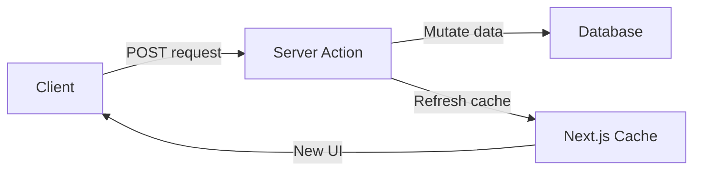
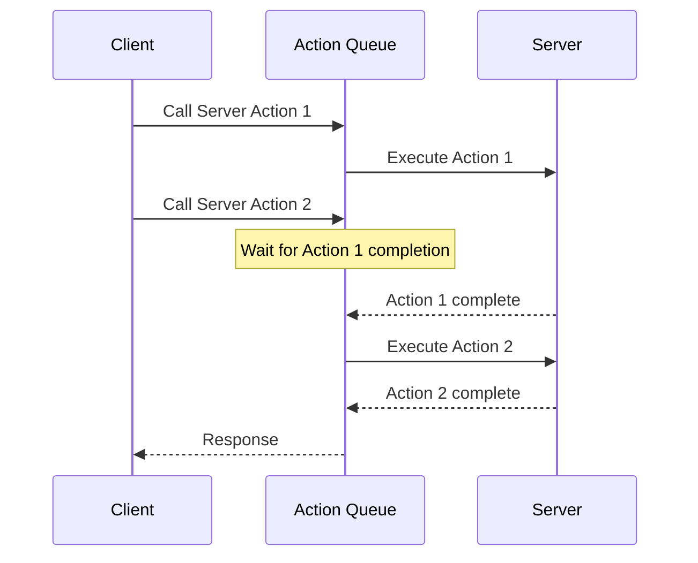

Server Actions provide an RPC-style interface for easily calling server functions. However, Next.js official documentation recommends Route Handlers when explaining the BFF pattern. Why?

It's because Server Actions and Route Handlers have different design intentions. Server Actions are designed for data mutations, while Route Handlers are designed to provide HTTP endpoints. This difference also affects performance.

---
# Differences Between Server Actions and Route Handlers

## Design Intent of Server Actions

Server Actions are designed for data mutations. Internally, they only use POST requests:

```tsx
'use server'

export async function createPost(formData: FormData) {
  const title = formData.get('title')
  const content = formData.get('content')

  await db.posts.create({ title, content })
  revalidatePath('/posts')
}
```

Server Actions are deeply integrated with Next.js's cache architecture:
- Automatically refresh UI after function calls
- Control cache with `revalidatePath` and `revalidateTag`
- Work without JavaScript when used with form's action attribute (progressive enhancement)



> [!NOTE] revalidatePath, revalidateTag
>
> You can tag Next.js fetch requests. `revalidateTag` invalidates caches with specific tags, and `revalidatePath` invalidates caches for specific paths.

> [!NOTE] progressive enhancement
>
> Even when JS hasn't loaded, you can call server functions contained in the form tag's action attribute.

## Role of Route Handlers

Route Handlers are HTTP Endpoints. They support all HTTP methods and are used to construct BFF (Backend for Frontend) patterns:

> [!NOTE] BFF (Backend for Frontend)
>
> A dedicated backend layer for the frontend. It proxies external APIs, combines multiple data sources, and hides sensitive information (API keys, etc.).

```ts
// app/api/weather/route.ts
export async function POST(request: Request) {
  const body = await request.json()
  const searchParams = new URLSearchParams({ lat: body.lat, lng: body.lng })

  const weatherResponse = await fetch(`${weatherEndpoint}?${searchParams}`)
  const weatherData = await weatherResponse.text()
  const payload = parseWeatherData.asJSON(weatherData)

  return new Response(payload, { status: 200 })
}
```

---

# Server Actions Operate as a Queue

The Next.js official documentation contains this statement:

> Server Actions are queued. Using them for data fetching introduces sequential execution.

Server Actions execute sequentially. To verify the scope of sequential execution, I tested the following:
1. Does Promise.all still execute sequentially?
2. Do multiple components each calling Server Actions still execute sequentially?

## Test Environment

- **Next.js app**: Calls Express API via Route Handler and Server Action
- **Express backend**: Provides `/api/data?id={id}` endpoint (10ms response delay)

```ts
// Server Action
"use server";
export async function serverActionFetchData(id: number) {
  const response = await fetch(`${EXPRESS_API_URL}/api/data?id=${id}`, {
    cache: "no-store",
  });
  return response.json();
}

// Route Handler
export async function GET(request: Request) {
  const { searchParams } = new URL(request.url);
  const id = searchParams.get("id");
  const response = await fetch(`${EXPRESS_API_URL}/api/data?id=${id}`, {
    cache: "no-store",
  });
  return NextResponse.json(await response.json());
}
```

Tests were conducted on the development server (HTTP/1.1).

## Test Scenarios

I tested 3 patterns to verify the scope of Server Action's sequential execution.

### 1. Direct Call with Promise.all

Does wrapping multiple requests with Promise.all enable parallel execution?

**Server Action Call**
```tsx
// Client Component
const promises = Array.from({ length: 30 }, (_, i) =>
  serverActionFetchData(i + 1)
);
const data = await Promise.all(promises);
```

**Route Handler Call**
```tsx
// Client Component
const promises = Array.from({ length: 30 }, (_, i) =>
  fetch(`/api/data?id=${i + 1}`).then(res => res.json())
);
const data = await Promise.all(promises);
```

**Execution Results**


Network panel:


- Front: Server Action calls (sequential execution)
- Back: Route Handler calls (parallel execution)

Route Handlers send requests in parallel. Server Actions must complete one request before starting the next.

### 2. Using React Query's useQueries

What happens when using data fetching libraries like React Query?

**Server Action + useQueries**
```tsx
const queries = useQueries({
  queries: Array.from({ length: 30 }, (_, i) => ({
    queryKey: ["server-action", i + 1],
    queryFn: () => serverActionFetchData(i + 1),
  })),
});
```

**Route Handler + useQueries**
```tsx
const queries = useQueries({
  queries: Array.from({ length: 30 }, (_, i) => ({
    queryKey: ["route-handler", i + 1],
    queryFn: () => fetch(`/api/data?id=${i + 1}`).then(res => res.json()),
  })),
});
```

**Execution Results**


Network panel:


Even with React Query, Server Actions execute sequentially.

### 3. Independent Components Each Calling useQuery

What happens when components each independently call Server Actions?

**Independent Component Calling Server Action**
```tsx
function DataItem({ id }: { id: number }) {
  const { data } = useQuery({
    queryKey: ["data", id],
    queryFn: () => serverActionFetchData(id),
  });
  return <div>{data?.data}</div>;
}

// Render 30 independent components
<>
  {Array.from({ length: 30 }, (_, i) => (
    <DataItem key={i} id={i + 1} />
  ))}
</>
```

**Independent Component Calling Route Handler**
```tsx
function DataItem({ id }: { id: number }) {
  const { data } = useQuery({
    queryKey: ["data", id],
    queryFn: () => fetch(`/api/data?id=${id}`).then(res => res.json()),
  });
  return <div>{data?.data}</div>;
}

// Render 30 independent components
<>
  {Array.from({ length: 30 }, (_, i) => (
    <DataItem key={i} id={i + 1} />
  ))}
</>
```

**Execution Results**


Network panel:


Even when components call independently, Server Actions execute sequentially.

## Test Results

All scenarios showed the same results:

- **Route Handler**: Parallel execution (multiple HTTP requests sent simultaneously)
- **Server Action**: Sequential execution (next request starts after previous completes)

### Server Action's Queue Behavior

- All Server Action calls within a single browser tab go into a Queue
- Still executes sequentially even when wrapped with Promise.all
- Managed in a global Queue even when each component calls independently
- Same behavior even when using libraries like React Query

> [!NOTE] Differences are greater in production environments
>
> 1. Network latency is greater in actual production
> 2. When HTTP/2 multiplexing is applied:
>    - Route Handler: Multiple requests processed simultaneously on one TCP connection (performance improvement)
>    - Server Action: Still sequential execution (no change)

## Why Design as Queue?

Server Actions were created for mutations. When multiple mutations execute simultaneously, race conditions can occur:

```tsx
// Case where simultaneous execution causes problems
async function updateUserProfile(formData: FormData) {
  'use server'
  const user = await db.users.findOne(userId)
  user.name = formData.get('name')
  await db.users.save(user) // Risk of race condition
}
```

The Queue approach ensures data consistency. However, it's not suitable when multiple independent requests need parallel processing.

> [!NOTE] Parallel processing possible inside Server Actions
>
> Using `Promise.all` inside a Server Action enables parallel processing. The problem is sequential execution when calling multiple Server Actions from outside.



---
# Conclusion

Server Actions and Route Handlers are designed for different purposes.

## When to Use Server Actions

1. **Data mutation via forms**: Supports progressive enhancement
2. **Single mutations**: When sequential execution is sufficient
3. **Internal parallel processing**: Using Promise.all inside Server Action
4. **Cache refresh**: Use with revalidatePath, revalidateTag

```tsx
'use server'

export async function createPost(formData: FormData) {
  await db.posts.create({
    title: formData.get('title'),
    content: formData.get('content')
  })

  revalidatePath('/posts')
}
```

## When to Use Route Handlers

1. **BFF pattern**: Proxy external APIs, combine multiple data
2. **Multiple independent endpoints**: Call each API independently
3. **Non-UI responses**: Provide webhooks, RSS, sitemaps
4. **Parallel fetching**: Call multiple endpoints simultaneously from Client Component

```ts
// app/api/dashboard/route.ts
export async function GET(request: Request) {
  const [users, posts, analytics] = await Promise.all([
    fetchUsers(),
    fetchPosts(),
    fetchAnalytics()
  ])

  return Response.json({ users, posts, analytics })
}
```

## Key Summary

| Item               | Server Action                 | Route Handler                   |
| ------------------ | ----------------------------- | ------------------------------- |
| **Design Intent**  | Mutation                      | HTTP Endpoint                   |
| **External Calls** | Queue (sequential)            | Parallel possible               |
| **Internal Parallel** | Promise.all possible       | Promise.all possible            |
| **HTTP Methods**   | POST only                     | All methods                     |
| **Cache Integration** | Deeply integrated          | Manual handling                 |
| **Use Cases**      | Form mutations, single/unified changes | BFF, independent endpoints, webhooks |

**Server Action**: When grouping as logical work unit and cache integration needed
- Can process in parallel internally with Promise.all
- Supports form's progressive enhancement

**Route Handler**: Multiple independent API endpoints or BFF pattern construction
- Client can call each endpoint in parallel
- Supports all HTTP methods

---

## References

- [Next.js - Backend For Your Frontend](https://nextjs.org/docs/app/guides/backend-for-frontend)
- [Next.js - Updating Data](https://nextjs.org/docs/app/getting-started/updating-data)
- [Next.js - Route Handlers](https://nextjs.org/docs/app/api-reference/file-conventions/route)
- [React - Server Functions](https://react.dev/reference/rsc/server-functions)
