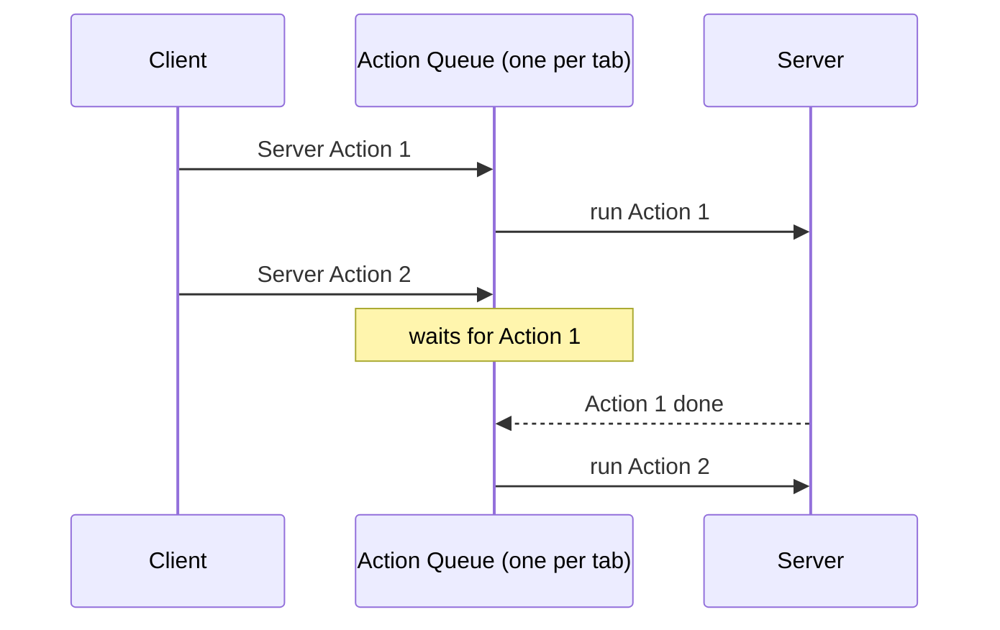

The Next.js docs contain this line:

> Server Actions are queued. Using them for data fetching introduces sequential execution.

Server Actions run sequentially. But that sentence alone doesn't tell you the **scope**.

- Does wrapping them in `Promise.all` make them parallel?
- What if separate components each call their own?
- Does a library like React Query change anything?

Whether "sequential" means per call site, per component, or per tab completely
changes where you can use them. So I measured it.

## Setup

- **Next.js app**: calls an Express API through both a Route Handler and a Server Action
- **Express backend**: `/api/data?id={id}`, 10ms response delay
- 30 requests each, dev server (HTTP/1.1)

```ts
// Server Action
"use server";
export async function serverActionFetchData(id: number) {
  const response = await fetch(`${EXPRESS_API_URL}/api/data?id=${id}`, {
    cache: "no-store",
  });
  return response.json();
}

// Route Handler
export async function GET(request: Request) {
  const { searchParams } = new URL(request.url);
  const id = searchParams.get("id");
  const response = await fetch(`${EXPRESS_API_URL}/api/data?id=${id}`, {
    cache: "no-store",
  });
  return NextResponse.json(await response.json());
}
```

The Route Handler is the **control**. I needed to separate "this is how Server Actions
behave" from "this is an artifact of my setup."

## 1. Wrapped in Promise.all

```tsx
// Server Action
const promises = Array.from({ length: 30 }, (_, i) =>
  serverActionFetchData(i + 1)
);
await Promise.all(promises);

// Route Handler
const promises = Array.from({ length: 30 }, (_, i) =>
  fetch(`/api/data?id=${i + 1}`).then(res => res.json())
);
await Promise.all(promises);
```


Server Action in front, Route Handler behind. The Route Handler fires everything at
once; the Server Action forms a staircase.

`Promise.all` is a tool for **awaiting work that already started**, not for making it
parallel. Server Action starts are held in a queue, so wrapping changes nothing.

## 2. With React Query

```tsx
const queries = useQueries({
  queries: Array.from({ length: 30 }, (_, i) => ({
    queryKey: ["server-action", i + 1],
    queryFn: () => serverActionFetchData(i + 1),
  })),
});
```


Identical. Whoever manages the calls, the queue stays.

## 3. Independent components each calling once

This was the case I most wanted to see. Thirty calls from one place is a different
situation from thirty components that know nothing about each other.

```tsx
function DataItem({ id }: { id: number }) {
  const { data } = useQuery({
    queryKey: ["data", id],
    queryFn: () => serverActionFetchData(id),
  });
  return <div>{data?.data}</div>;
}

// 30 independent components
{Array.from({ length: 30 }, (_, i) => <DataItem key={i} id={i + 1} />)}
```


**Still sequential.**

This was the most important result. The queue isn't per call site or per component —
there's **one per tab**.

Which means unrelated components wait on each other. If component A's Server Action
is slow, component B starts that much later. Splitting components doesn't break the
coupling.


```mermaid
sequenceDiagram
    participant C as Client
    participant Q as Action Queue (one per tab)
    participant S as Server

    C->>Q: Server Action 1
    Q->>S: run Action 1
    C->>Q: Server Action 2
    Note over Q: waits for Action 1
    S-->>Q: Action 1 done
    Q->>S: run Action 2
```

## Why design it this way

Server Actions exist for mutations. Concurrent mutations tangle ordering.

```tsx
async function updateUserProfile(formData: FormData) {
  'use server'
  const user = await db.users.findOne(userId)
  user.name = formData.get('name')
  await db.users.save(user)
}
```

Run these in parallel and a later request can finish first and overwrite the earlier
one. The queue guarantees order. It isn't **badly suited to reads** so much as
**deliberately fitted to writes**.

> `Promise.all` **inside** a Server Action does run in parallel.
> What's queued is the action's execution, not the fetches within it.
> If you need to gather from several sources, gather inside a single action.

## Limits of this measurement

I measured on a dev server (HTTP/1.1). These aren't numbers that transfer to production.

But **the direction should hold.** With HTTP/2 multiplexing the Route Handler has room
to get faster, while the Server Action queue sits above the network layer and is
unaffected. The gap would widen rather than close.

This was a measurement about the **shape** — sequential versus parallel — not the numbers.

## Takeaways

- The Server Action queue is **one per tab**. `Promise.all`, React Query, and splitting
  components all failed to get around it.
- So when you need **several independent fetches in parallel from the client**,
  the Route Handler is the right tool.
- Server Actions are for mutations. To combine sources, use **`Promise.all` inside a
  single action**.
- The scope behind the docs' one word "queued" wasn't something **I knew before
  measuring.** I'd assumed per call site; it was the whole tab.

### References

- [Next.js — Backend For Your Frontend](https://nextjs.org/docs/app/guides/backend-for-frontend)
- [Next.js — Updating Data](https://nextjs.org/docs/app/getting-started/updating-data)
- [React — Server Functions](https://react.dev/reference/rsc/server-functions)
