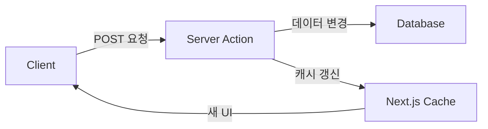
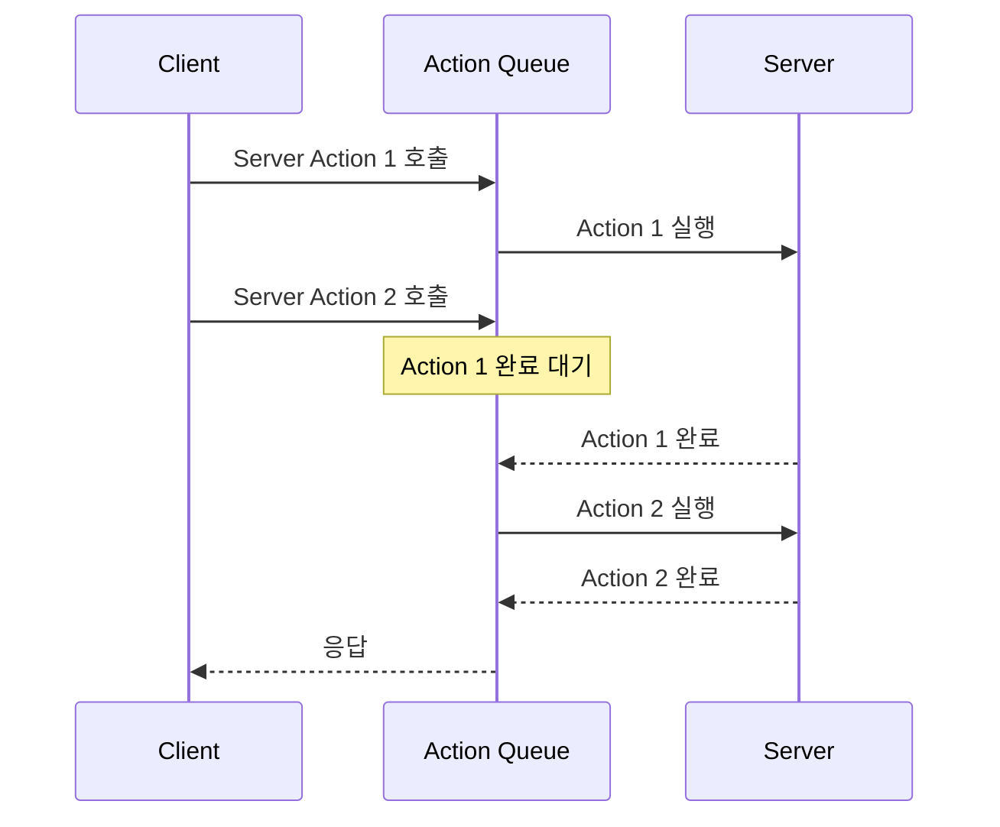

Server Action은 RPC 스타일의 인터페이스로 서버 함수를 쉽게 호출할 수 있습니다. 그런데 Next.js 공식 문서에서는 BFF 패턴을 설명할 때 Route Handler를 권장합니다. 왜일까요?

Server Action과 Route Handler의 설계 의도가 다르기 때문입니다. Server Action은 데이터 변경(mutation)을 위해 설계되었고, Route Handler는 HTTP Endpoint를 제공하기 위해 설계되었습니다. 이 차이는 성능에도 영향을 미칩니다.

---
# Server Action과 Route Handler의 차이

## Server Action의 설계 의도

Server Action은 데이터 변경(mutation)을 위해 설계되었습니다. 내부적으로 POST 요청만 사용합니다:

```tsx
'use server'

export async function createPost(formData: FormData) {
  const title = formData.get('title')
  const content = formData.get('content')

  await db.posts.create({ title, content })
  revalidatePath('/posts')
}
```

Server Action은 Next.js의 캐시 아키텍처와 깊게 연결되어 있습니다:
- 함수 호출 후 자동으로 UI를 갱신합니다
- `revalidatePath`, `revalidateTag`로 캐시를 제어합니다
- form의 action 속성과 함께 사용하면 JavaScript 없이도 동작합니다(progressive enhancement)



> [!NOTE] revalidatePath, revalidateTag
>
> Next.js의 fetch 요청에 태그를 지정할 수 있습니다. `revalidateTag`는 특정 태그가 붙은 캐시를 무효화하고, `revalidatePath`는 특정 경로의 캐시를 무효화합니다.

> [!NOTE] progressive enhancement
> 
> JS가 로드되지 않았을 때도 form 태그의 action 속성에 담긴 서버 함수를 호출할 수 있습니다.

## Route Handler의 역할

Route Handler는 HTTP Endpoint입니다. 모든 HTTP 메서드를 지원하고, BFF(Backend for Frontend) 패턴 구성에 사용합니다:

> [!NOTE] BFF (Backend for Frontend)
>
> 프론트엔드를 위한 전용 백엔드 레이어입니다. 외부 API를 프록시하고, 여러 데이터 소스를 조합하며, 민감한 정보(API 키 등)를 숨깁니다.

```ts
// app/api/weather/route.ts
export async function POST(request: Request) {
  const body = await request.json()
  const searchParams = new URLSearchParams({ lat: body.lat, lng: body.lng })

  const weatherResponse = await fetch(`${weatherEndpoint}?${searchParams}`)
  const weatherData = await weatherResponse.text()
  const payload = parseWeatherData.asJSON(weatherData)

  return new Response(payload, { status: 200 })
}
```

---

# Server Action은 Queue 방식으로 동작합니다

Next.js 공식 문서에는 다음 문장이 있습니다:

> Server Actions are queued. Using them for data fetching introduces sequential execution.

Server Action은 순차 실행됩니다. 순차 실행의 범위를 확인하기 위해 다음을 테스트했습니다:
1. Promise.all로 감싸도 순차 실행되는가
2. 여러 컴포넌트가 각각 Server Action을 호출해도 순차 실행되는가

## 테스트 환경

- **Next.js 앱**: Route Handler와 Server Action으로 Express API를 호출
- **Express 백엔드**: `/api/data?id={id}` 엔드포인트 제공 (10ms 응답 지연)

```ts
// Server Action
"use server";
export async function serverActionFetchData(id: number) {
  const response = await fetch(`${EXPRESS_API_URL}/api/data?id=${id}`, {
    cache: "no-store",
  });
  return response.json();
}

// Route Handler
export async function GET(request: Request) {
  const { searchParams } = new URL(request.url);
  const id = searchParams.get("id");
  const response = await fetch(`${EXPRESS_API_URL}/api/data?id=${id}`, {
    cache: "no-store",
  });
  return NextResponse.json(await response.json());
}
```

테스트는 개발 서버(HTTP/1.1)에서 진행했습니다.

## 테스트 시나리오

Server Action의 순차 실행 범위를 확인하기 위해 3가지 패턴을 테스트했습니다.

### 1. Promise.all로 직접 호출

Promise.all로 여러 요청을 감싸면 병렬 실행될까요?

**Server Action 호출**
```tsx
// Client Component
const promises = Array.from({ length: 30 }, (_, i) =>
  serverActionFetchData(i + 1)
);
const data = await Promise.all(promises);
```

**Route Handler 호출**
```tsx
// Client Component
const promises = Array.from({ length: 30 }, (_, i) =>
  fetch(`/api/data?id=${i + 1}`).then(res => res.json())
);
const data = await Promise.all(promises);
```

**실행 결과**


네트워크 패널:


- 앞쪽: Server Action 호출 (순차 실행)
- 뒤쪽: Route Handler 호출 (병렬 실행)

Route Handler는 요청이 병렬로 발생합니다. Server Action은 한 요청이 완료되어야 다음 요청이 시작됩니다.

### 2. React Query의 useQueries 사용

React Query 같은 데이터 fetching 라이브러리를 사용하면 어떻게 될까요?

**Server Action + useQueries**
```tsx
const queries = useQueries({
  queries: Array.from({ length: 30 }, (_, i) => ({
    queryKey: ["server-action", i + 1],
    queryFn: () => serverActionFetchData(i + 1),
  })),
});
```

**Route Handler + useQueries**
```tsx
const queries = useQueries({
  queries: Array.from({ length: 30 }, (_, i) => ({
    queryKey: ["route-handler", i + 1],
    queryFn: () => fetch(`/api/data?id=${i + 1}`).then(res => res.json()),
  })),
});
```

**실행 결과**


네트워크 패널:


React Query를 사용해도 Server Action은 순차 실행됩니다.

### 3. 독립 컴포넌트가 각각 useQuery 호출

컴포넌트가 각각 독립적으로 Server Action을 호출하면 어떻게 될까요?

**Server Action을 호출하는 독립 컴포넌트**
```tsx
function DataItem({ id }: { id: number }) {
  const { data } = useQuery({
    queryKey: ["data", id],
    queryFn: () => serverActionFetchData(id),
  });
  return <div>{data?.data}</div>;
}

// 30개의 독립 컴포넌트 렌더링
<>
  {Array.from({ length: 30 }, (_, i) => (
    <DataItem key={i} id={i + 1} />
  ))}
</>
```

**Route Handler를 호출하는 독립 컴포넌트**
```tsx
function DataItem({ id }: { id: number }) {
  const { data } = useQuery({
    queryKey: ["data", id],
    queryFn: () => fetch(`/api/data?id=${id}`).then(res => res.json()),
  });
  return <div>{data?.data}</div>;
}

// 30개의 독립 컴포넌트 렌더링
<>
  {Array.from({ length: 30 }, (_, i) => (
    <DataItem key={i} id={i + 1} />
  ))}
</>
```

**실행 결과**


네트워크 패널:


컴포넌트가 각각 독립적으로 호출해도 Server Action은 순차 실행됩니다.

## 테스트 결과

모든 시나리오에서 동일한 결과가 나타났습니다:

- **Route Handler**: 병렬 실행 (여러 HTTP 요청 동시 발생)
- **Server Action**: 순차 실행 (한 요청 완료 후 다음 요청 실행)

### Server Action의 Queue 동작

- 하나의 브라우저 탭 내 모든 Server Action 호출이 Queue에 담김
- Promise.all로 감싸도 순차 실행
- 각 컴포넌트가 독립적으로 호출해도 전역 Queue에서 관리
- React Query 같은 라이브러리를 사용해도 동일

> [!NOTE] 프로덕션 환경에서는 차이가 더 커집니다
>
> 1. 실제 프로덕션에서는 네트워크 지연이 더 큽니다
> 2. HTTP/2 멀티플렉싱이 적용되면:
>    - Route Handler: 하나의 TCP 연결에서 여러 요청 동시 처리 (성능 향상)
>    - Server Action: 여전히 순차 실행 (변화 없음)

## 왜 Queue 방식으로 설계했을까

Server Action은 mutation을 위해 만들어졌습니다. 여러 mutation이 동시에 실행되면 race condition이 발생할 수 있습니다:

```tsx
// 동시 실행 시 문제가 발생하는 케이스
async function updateUserProfile(formData: FormData) {
  'use server'
  const user = await db.users.findOne(userId)
  user.name = formData.get('name')
  await db.users.save(user) // race condition 위험
}
```

Queue 방식은 데이터 일관성을 보장합니다. 하지만 여러 독립적인 요청을 병렬로 처리해야 할 때는 적합하지 않습니다.

> [!NOTE] Server Action 내부에서는 병렬 처리 가능
>
> Server Action 내부에서 `Promise.all`을 사용하면 병렬 처리됩니다. 문제는 여러 Server Action을 외부에서 호출할 때 순차 실행되는 것입니다.



---
# 결론

Server Action과 Route Handler는 각각 다른 목적으로 설계되었습니다.

## Server Action을 사용해야 하는 경우

1. **Form을 통한 데이터 변경**: progressive enhancement 지원
2. **단일 mutation**: 순차 실행으로 충분한 경우
3. **내부 병렬 처리**: Server Action 내부에서 Promise.all 사용
4. **캐시 갱신**: revalidatePath, revalidateTag와 함께 사용

```tsx
'use server'

export async function createPost(formData: FormData) {
  await db.posts.create({
    title: formData.get('title'),
    content: formData.get('content')
  })

  revalidatePath('/posts')
}
```

## Route Handler를 사용해야 하는 경우

1. **BFF 패턴**: 외부 API 프록시, 여러 데이터 조합
2. **독립적인 여러 엔드포인트**: 각 API를 독립적으로 호출
3. **Non-UI 응답**: webhook, RSS, sitemap 제공
4. **병렬 fetching**: Client Component에서 여러 엔드포인트 동시 호출

```ts
// app/api/dashboard/route.ts
export async function GET(request: Request) {
  const [users, posts, analytics] = await Promise.all([
    fetchUsers(),
    fetchPosts(),
    fetchAnalytics()
  ])

  return Response.json({ users, posts, analytics })
}
```

## 핵심 정리

| 항목               | Server Action                 | Route Handler                   |
| ------------------ | ----------------------------- | ------------------------------- |
| **설계 의도**      | Mutation                      | HTTP Endpoint                   |
| **외부 호출 시**   | Queue (순차)                  | 병렬 가능                       |
| **내부 병렬 처리** | Promise.all 가능              | Promise.all 가능                |
| **HTTP 메서드**    | POST만                        | 모든 메서드                     |
| **캐시 통합**      | 깊게 통합됨                   | 수동 처리                       |
| **사용 상황**      | Form mutation, 단일/통합 변경 | BFF, 독립적 엔드포인트, webhook |

**Server Action**: 논리적 작업 단위로 묶고, 캐시 통합이 필요한 경우
- 내부에서 Promise.all로 병렬 처리 가능
- Form의 progressive enhancement 지원

**Route Handler**: 독립적인 여러 API 엔드포인트 또는 BFF 패턴 구성
- 클라이언트에서 각 엔드포인트를 병렬 호출 가능
- 모든 HTTP 메서드 지원

---

## 참고 자료

- [Next.js - Backend For Your Frontend](https://nextjs.org/docs/app/guides/backend-for-frontend)
- [Next.js - Updating Data](https://nextjs.org/docs/app/getting-started/updating-data)
- [Next.js - Route Handlers](https://nextjs.org/docs/app/api-reference/file-conventions/route)
- [React - Server Functions](https://react.dev/reference/rsc/server-functions)
