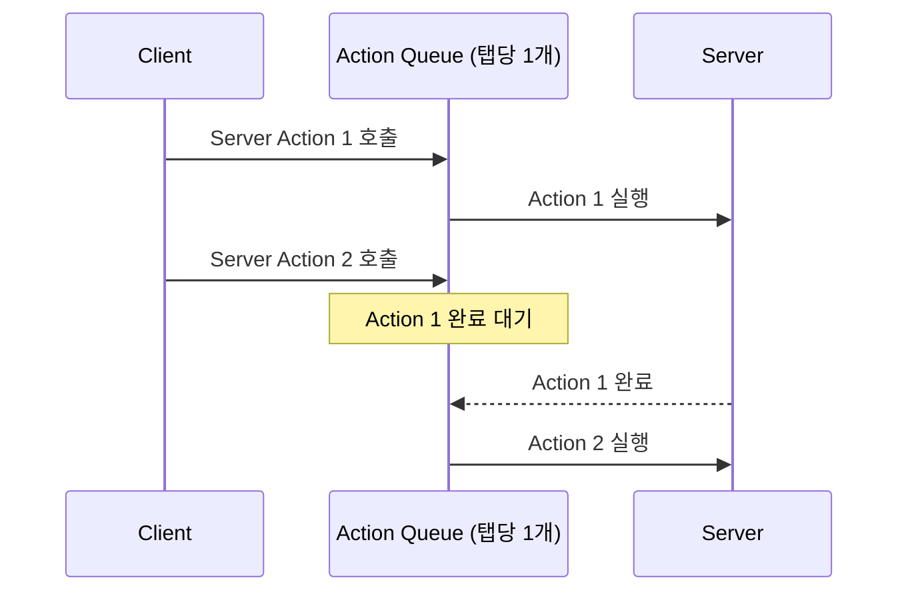

Next.js 공식 문서에는 이런 문장이 있습니다.

> Server Actions are queued. Using them for data fetching introduces sequential execution.

Server Action은 순차 실행된다는 말입니다. 그런데 이 문장만으로는 **범위**를 알 수 없었습니다.

- `Promise.all`로 감싸면 병렬이 될까
- 서로 다른 컴포넌트가 각자 호출해도 순차일까
- React Query 같은 라이브러리를 끼우면 달라질까

"순차"가 호출 단위인지, 컴포넌트 단위인지, 탭 전체인지에 따라
쓸 수 있는 곳이 완전히 달라집니다. 직접 측정해봤습니다.

## 측정 환경

- **Next.js 앱**: Route Handler와 Server Action으로 각각 Express API 호출
- **Express 백엔드**: `/api/data?id={id}`, 응답에 10ms 지연
- 요청 30개씩, 개발 서버(HTTP/1.1)

```ts
// Server Action
"use server";
export async function serverActionFetchData(id: number) {
  const response = await fetch(`${EXPRESS_API_URL}/api/data?id=${id}`, {
    cache: "no-store",
  });
  return response.json();
}

// Route Handler
export async function GET(request: Request) {
  const { searchParams } = new URL(request.url);
  const id = searchParams.get("id");
  const response = await fetch(`${EXPRESS_API_URL}/api/data?id=${id}`, {
    cache: "no-store",
  });
  return NextResponse.json(await response.json());
}
```

Route Handler를 같이 둔 건 **대조군**입니다.
순차 실행이 Server Action의 성질인지, 아니면 제 측정 환경 탓인지 구분해야 했습니다.

## 1. Promise.all로 감싸면

```tsx
// Server Action
const promises = Array.from({ length: 30 }, (_, i) =>
  serverActionFetchData(i + 1)
);
await Promise.all(promises);

// Route Handler
const promises = Array.from({ length: 30 }, (_, i) =>
  fetch(`/api/data?id=${i + 1}`).then(res => res.json())
);
await Promise.all(promises);
```


앞쪽이 Server Action, 뒤쪽이 Route Handler입니다.
Route Handler는 요청이 한꺼번에 나가고, Server Action은 계단 모양입니다.

`Promise.all`은 **이미 시작된 작업을 기다리는 도구**이지 병렬로 만드는 도구가 아닙니다.
Server Action은 시작 자체가 큐에 걸려 있어서 감싸도 달라지지 않습니다.

## 2. React Query를 끼우면

```tsx
const queries = useQueries({
  queries: Array.from({ length: 30 }, (_, i) => ({
    queryKey: ["server-action", i + 1],
    queryFn: () => serverActionFetchData(i + 1),
  })),
});
```


동일합니다. 라이브러리가 호출을 관리하든 말든 큐는 그대로입니다.

## 3. 독립된 컴포넌트가 각각 호출하면

여기가 제일 궁금했던 부분입니다.
한 곳에서 30번 부르는 것과, 서로 모르는 컴포넌트 30개가 한 번씩 부르는 건 다른 상황입니다.

```tsx
function DataItem({ id }: { id: number }) {
  const { data } = useQuery({
    queryKey: ["data", id],
    queryFn: () => serverActionFetchData(id),
  });
  return <div>{data?.data}</div>;
}

// 30개의 독립 컴포넌트
{Array.from({ length: 30 }, (_, i) => <DataItem key={i} id={i + 1} />)}
```


**여전히 순차입니다.**

이게 이번 측정에서 가장 중요한 결과였습니다.
큐는 호출부나 컴포넌트 단위가 아니라 **탭 전체에 하나**입니다.

즉 서로 아무 관계 없는 컴포넌트끼리도 서로를 기다립니다.
A 컴포넌트의 Server Action이 느리면 B 컴포넌트가 그만큼 늦게 시작합니다.
컴포넌트를 분리해도 이 결합은 사라지지 않습니다.


```mermaid
sequenceDiagram
    participant C as Client
    participant Q as Action Queue (탭당 1개)
    participant S as Server

    C->>Q: Server Action 1 호출
    Q->>S: Action 1 실행
    C->>Q: Server Action 2 호출
    Note over Q: Action 1 완료 대기
    S-->>Q: Action 1 완료
    Q->>S: Action 2 실행
```

## 왜 이렇게 설계했을까

Server Action은 mutation을 위해 만들어졌습니다.
여러 mutation이 동시에 나가면 순서가 뒤엉킵니다.

```tsx
async function updateUserProfile(formData: FormData) {
  'use server'
  const user = await db.users.findOne(userId)
  user.name = formData.get('name')
  await db.users.save(user)
}
```

이게 병렬로 실행되면 나중에 시작한 요청이 먼저 끝나 덮어쓸 수 있습니다.
큐는 그 순서를 보장합니다. **읽기에 안 맞는 게 아니라, 쓰기에 맞춘 결과**입니다.

> Server Action **내부**에서 `Promise.all`을 쓰는 건 병렬로 동작합니다.
> 큐에 걸리는 건 액션의 실행 단위이지 그 안의 fetch가 아닙니다.
> 여러 곳에서 데이터를 모아야 한다면 액션 하나 안에서 모으면 됩니다.

## 측정의 한계

개발 서버(HTTP/1.1)에서 쟀습니다. 프로덕션에서 그대로 재현되는 수치는 아닙니다.

다만 **방향은 유지될 것으로 봅니다.** HTTP/2 멀티플렉싱이 붙으면
Route Handler는 더 빨라질 여지가 있지만, Server Action의 큐는
네트워크 계층이 아니라 그 위에 있어서 영향을 받지 않습니다.
격차가 줄기보다는 벌어지는 쪽입니다.

수치 자체보다 **순차/병렬이라는 형태의 차이**를 보려던 측정이었습니다.

## 정리

- Server Action의 큐는 **탭당 하나**입니다. `Promise.all`, React Query,
  컴포넌트 분리 — 전부 이걸 우회하지 못했습니다.
- 그래서 **독립적인 여러 데이터를 클라이언트에서 병렬로 가져와야 한다면**
  Route Handler가 맞습니다.
- Server Action은 mutation용입니다. 여러 소스를 모아야 하면
  **액션 하나 안에서 `Promise.all`** 로 처리하면 됩니다.
- 문서에 "queued"라고만 적힌 말의 범위는, **직접 재보기 전에는 몰랐습니다.**
  호출 단위일 거라고 짐작했는데 실제로는 탭 전체였습니다.

### 참고

- [Next.js — Backend For Your Frontend](https://nextjs.org/docs/app/guides/backend-for-frontend)
- [Next.js — Updating Data](https://nextjs.org/docs/app/getting-started/updating-data)
- [React — Server Functions](https://react.dev/reference/rsc/server-functions)
