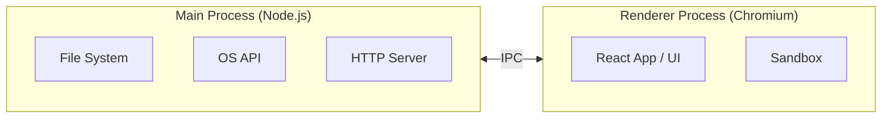
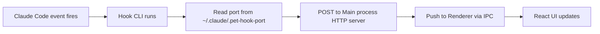

Not long ago, the Claude Code source code was leaked. The internal business logic was interesting, but what struck me more was that the terminal UI was built with React Ink. It was a reminder that a company like Anthropic trusts it enough to ship in production. And it made me realize just how wide the React ecosystem actually is — reaching well beyond the browser into environments like the terminal.

That got me curious to explore the React ecosystem more broadly. I don't usually start side projects unless they're directly tied to my work, but I happened to think of an app I actually needed, so I went ahead. I wanted to try React Ink too, but for something I'd use in a work environment, a desktop app felt more practical — so I went with Electron.

This post covers what I experienced firsthand while building an Electron desktop app — the Main/Renderer process architecture, IPC communication, and Claude Code hook integration.

# Why I Built It

When using Claude Code, I often run multiple sessions in parallel — letting one handle a code review while I get on with other work. The problem is that Claude Code sometimes stops and waits for a permission request, and I only notice much later. Time kept slipping by with tasks stuck in place.

There are similar tools out there, but building my own meant I could add the features I needed quickly.

What I built is a widget that floats at the top of the macOS screen at all times. It shows the real-time status of running Claude Code sessions and alerts me immediately when a permission request comes in.

---

# Electron's Two Processes — Main and Renderer

Electron is a framework that bundles Chromium and Node.js together. The React app runs on Chromium, while Node.js handles communication with the OS.

At first I thought of it simply as "building a desktop app with web technologies," but once I actually used it, the differences from the web became quite clear.

Here's the Preface from the Electron official documentation's Security page.

> [!NOTE]
> 
> As web developers, we usually enjoy the strong security net of the browser — the risks associated with the code we write are relatively small. Our websites are granted limited powers in a sandbox, and we trust that our users enjoy a browser built by a large team of engineers that is able to quickly respond to newly discovered security threats.
>
> When working with Electron, it is important to understand that Electron is not a web browser. It allows you to build feature-rich desktop applications with familiar web technologies, but your code wields much greater power. JavaScript can access the filesystem, user shell, and more. This allows you to build high quality native applications, but the inherent security risks scale with the additional powers granted to your code.
> - [Electron Official Docs — Security](https://www.electronjs.org/docs/latest/tutorial/security)

The browser handles a lot of security on the developer's behalf without them even thinking about it. In Electron, Chromium doesn't do that. Since it can directly access the filesystem, shell, and OS APIs, how you handle those permissions is entirely the developer's responsibility.

An XSS attack in a browser has a limited blast radius. The same attack succeeding in an Electron app could compromise the user's entire machine.

So Electron separates the two processes structurally to reduce that risk.



**The Main process** runs in a Node.js environment. It handles anything that requires elevated access — the filesystem, network, OS APIs.

**The Renderer process** runs in a Chromium environment. It lives inside a security sandbox and can't directly access the filesystem. This is where the React app runs.

The separation felt cumbersome at first, but it turns out it's intentional design — keeping the web security model alive on the desktop. What the browser handled transparently, Electron enforces structurally.

---

# Inter-Process Communication — IPC

To read files or access the OS from the Renderer, you have to delegate to Main. That communication happens via IPC (Inter-Process Communication).

In this project, I needed to read session file data under `~/.claude/projects/`, and file access is only possible in Main. So the flow becomes: Renderer asks Main "give me the session list," Main reads the files and sends them back.

Directly exposing `ipcRenderer` in the Renderer is not recommended for security reasons. A preload script acts as the intermediary. Using `contextBridge`, you selectively define only the APIs you want to safely expose to the Renderer.

```ts
// preload/index.ts
contextBridge.exposeInMainWorld('claudePet', {
  getSessions: () => ipcRenderer.invoke('GET_SESSIONS'),
  onSessionsUpdate: (cb) => {
    ipcRenderer.on('SESSIONS_UPDATE', (_, sessions) => cb(sessions))
    return () => ipcRenderer.off('SESSIONS_UPDATE', cb)
  },
})
```

In the Renderer, you use it like `window.claudePet.getSessions()`. It feels just like using a Web API in the browser.

IPC patterns split by direction:

- Renderer → Main: `ipcRenderer.invoke` + `ipcMain.handle` — request-response, returns a Promise
- Main → Renderer: `webContents.send` + `ipcRenderer.on` — Main pushes events first

Initially I used polling — periodically reading the jsonl files under `~/.claude/projects/` to track state. The `invoke` pattern was enough for that. But the polling interval meant there was always a delay between an event firing in Claude Code and the widget reflecting it. So I switched to a hook-based approach that receives notifications the moment an event occurs.

Switching to hooks reversed the flow. Instead of the Renderer making requests, Main now receives external events first and pushes them to the Renderer. It's the same pattern as SSE — the server pushing events to the client. That's when I needed the `webContents.send` + `ipcRenderer.on` combination.

---

# Receiving Hook Events in Electron

Claude Code provides a hook system. At specific points in the session lifecycle — session start, before/after tool execution, permission requests, response completion — it automatically runs commands registered in `~/.claude/settings.json`.

```json
{
  "hooks": {
    "PreToolUse": [
      {
        "matcher": "Bash",
        "hooks": [{ "type": "command", "command": "node /path/to/script.js" }]
      }
    ]
  }
}
```

When a hook fires, Claude Code passes event data as JSON to stdin. The command reads it, processes it, and signals the result via exit code. Exit 2 blocks the tool from running; exit 0 lets it continue.

In this project, I track session state by receiving `PreToolUse`, `PostToolUse`, `PermissionRequest`, `Notification`, and `Stop` events.

## Auto-registering settings.json

Instead of asking users to edit settings.json themselves, the app automatically registers hook commands on startup. Already-registered entries are filtered by a `'claude-pet'` tag to prevent duplicates, and the CLI command is written for all hook events.

```json
{
  "hooks": {
    "PreToolUse": [{ "matcher": "*", "hooks": [{ "type": "command", "command": "node \"/path/to/hook-cli/index.js\"", "async": true, "timeout": 5 }] }]
  }
}
```

The CLI path is resolved relative to `process.resourcesPath` when packaged, or the `out` directory during development.

## The Hook CLI and HTTP Server

The problem with hooks is that they run as commands. There's no standard way to send events directly to an Electron app, so I built a separate hook CLI as a standalone executable using esbuild.



Claude Code passes event data to the CLI via stdin. The CLI reads it and forwards it to an HTTP server running inside the Electron app. It always exits with `exit(0)` — an abnormal exit could affect the Claude Code session itself.

Port sharing is done via a file (`~/.claude/.pet-hook-port`). When the app starts, it opens a server on port 0 so the OS assigns a free port, then writes that number to the file. When the app exits, the file is deleted. The CLI reads the file to know where to send its requests.

When the server receives a POST request, it sends the response (`204`) first, then parses the payload, updates session state, and pushes to the Renderer via `webContents.send`. State is recorded differently depending on the event type:

- `PreToolUse` / `PostToolUse` → `working`
- `PermissionRequest` / `Notification(permission_prompt)` → `waiting_permission`
- `Stop` / `SessionEnd` etc. → `done`

---

# The React Ecosystem Is Bigger Than You Think

At first, I was impressed that React could run in a desktop environment. But building it made me realize: Electron's Renderer is Chromium-based, so it's really more like the web expanding into the desktop than React escaping the web.

Still, building with Electron gave me a chance to reconsider things I'd taken for granted on the web — the security sandbox, process separation, event flow. If I get the chance, I'd like to try React Ink next — the library that started this whole journey.

Thanks for reading.

> [!NOTE] Distribution
> 
> Proper distribution as a desktop app requires a very expensive Apple Developer account, so I shipped it via Homebrew only.
> 
> Installation is straightforward — use Homebrew or build it yourself.
> 
> https://github.com/codefug/claude-pet#homebrew-%EA%B6%8C%EC%9E%A5
> 
> ```bash
> brew tap codefug/cask
> brew install --cask claude-pet
> xattr -cr /Applications/Claude\ Pet.app  # Remove quarantine attribute for apps distributed without Apple signing
> ```
