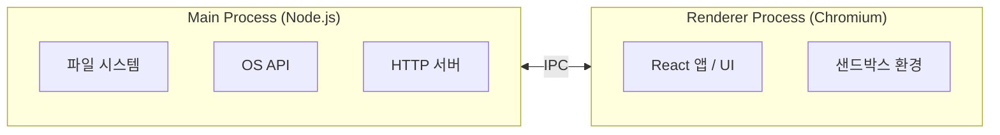
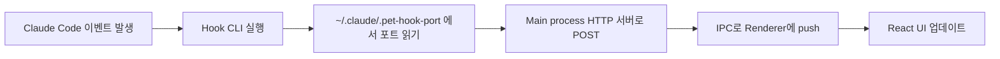

비교적 최근 Claude Code의 소스 코드가 유출된 적 있습니다. 내부 비즈니스 로직도 흥미로웠지만, 터미널 UI를 React Ink로 구현했다는 점이 더 인상적이었습니다. Anthropic 같은 기업에서도 쓸 만큼 안정적인 라이브러리라는 것도요. React가 웹을 넘어 터미널 같은 전혀 다른 환경에서도 쓰이는, 생각보다 훨씬 넓은 생태계라는 걸 실감했습니다.

이 계기로 React 생태계를 좀 더 넓게 탐구해보고 싶어졌습니다. 평소에는 업무와 직접 연관이 없으면 사이드 프로젝트를 잘 하지 않는 편인데, 마침 필요한 앱이 생각나서 시작하게 됐습니다. React Ink도 써보고 싶었지만, 일하는 환경에서 쓰려면 데스크탑 앱이 더 적합하다고 판단해 Electron을 선택했습니다.

이 글에서는 Electron 데스크탑 앱을 만들며 직접 체감한 것들 — Main/Renderer 프로세스 구조, IPC 통신, Claude Code hook 연동 — 을 다룹니다.

# 만들게 된 이유

Claude Code를 쓰다 보면 세션을 여러 개 띄워놓고 병렬로 작업하는 경우가 많습니다. 한쪽에서 코드 리뷰를 돌려놓고 다른 업무를 하는 식으로요. 문제는 Claude Code가 권한 요청이 필요한 상황에서 멈춰있는 걸 한참 뒤에야 발견하게 된다는 겁니다. 작업이 중단된 채 시간이 흘러버리는 상황이 반복됐습니다.

비슷한 도구가 없지는 않지만, 직접 만들면 필요한 기능을 빠르게 추가할 수 있겠다 싶었습니다.

만든 건 macOS 화면 맨 위에 항상 떠 있는 위젯입니다. 실행 중인 Claude Code 세션들의 상태를 실시간으로 보여주고, 권한 요청이 발생하면 즉시 알려줍니다.

---

# Electron의 두 프로세스 — Main과 Renderer

Electron은 Chromium과 Node.js를 함께 패키징하는 프레임워크입니다. React 앱이 Chromium 위에서 돌아가고, Node.js가 OS와 소통하는 구조입니다.

처음엔 단순히 "웹 기술로 데스크탑 앱 만드는 것"이라고만 생각했는데, 실제로 써보니 웹과 다른 점이 꽤 명확했습니다.

다음은 Electron 공식 문서 Security 페이지의 Preface입니다.

> [!NOTE]
> 
> As web developers, we usually enjoy the strong security net of the browser — the risks associated with the code we write are relatively small. Our websites are granted limited powers in a sandbox, and we trust that our users enjoy a browser built by a large team of engineers that is able to quickly respond to newly discovered security threats.
>
> When working with Electron, it is important to understand that Electron is not a web browser. It allows you to build feature-rich desktop applications with familiar web technologies, but your code wields much greater power. JavaScript can access the filesystem, user shell, and more. This allows you to build high quality native applications, but the inherent security risks scale with the additional powers granted to your code.
> - [Electron 공식 문서 Security 페이지](https://www.electronjs.org/docs/latest/tutorial/security)

브라우저는 개발자가 신경 쓰지 않아도 많은 보안을 대신 처리해줍니다. 하지만 Electron에서 Chromium은 그렇지 않습니다. 파일 시스템, 쉘, OS API에 직접 접근할 수 있기 때문에 그 권한을 어떻게 다루느냐가 전적으로 개발자 책임입니다.

브라우저에서 XSS가 발생해도 피해 범위는 어느 정도 제한됩니다. 하지만 Electron 앱에서 같은 공격이 성공하면 사용자의 컴퓨터 전체를 장악할 수 있습니다.

그래서 Electron은 이 위험을 구조적으로 줄이기 위해 두 프로세스를 분리합니다.



**Main process**는 Node.js 환경입니다. 파일 시스템, 네트워크, OS API 등 권한이 필요한 작업을 여기서 처리합니다.

**Renderer process**는 Chromium 환경입니다. 보안 샌드박스 안에 있어서 파일 시스템에 직접 접근할 수 없습니다. React 앱이 여기서 돌아갑니다.

이 분리가 처음엔 번거로워 보였는데, 알고 보면 웹 보안 모델을 데스크탑에서도 유지하기 위한 설계입니다. 브라우저가 투명하게 처리해주던 것을 Electron에서는 구조적으로 강제하는 방식이에요.

---

# 프로세스 간 통신 — IPC

Renderer에서 파일을 읽거나 OS에 접근하려면 Main에 위임해야 합니다. 이 통신을 IPC(Inter-Process Communication)로 합니다.

이 프로젝트에서는 `~/.claude/projects/` 아래의 세션 파일 정보들을 읽어야 했는데, 파일 접근은 Main에서만 가능합니다. 그래서 Renderer가 Main에 "세션 목록 줘"라고 요청하고, Main이 파일을 읽어서 돌려주는 구조가 됩니다.

그런데 Renderer에서 `ipcRenderer`를 직접 노출하는 건 보안상 권장되지 않습니다. 그 사이를 preload 스크립트가 중개합니다. `contextBridge`를 사용해 Renderer에 안전하게 노출할 API만 선택적으로 정의합니다.

```ts
// preload/index.ts
contextBridge.exposeInMainWorld('claudePet', {
  getSessions: () => ipcRenderer.invoke('GET_SESSIONS'),
  onSessionsUpdate: (cb) => {
    ipcRenderer.on('SESSIONS_UPDATE', (_, sessions) => cb(sessions))
    return () => ipcRenderer.off('SESSIONS_UPDATE', cb)
  },
})
```

Renderer에서는 `window.claudePet.getSessions()` 처럼 씁니다. 브라우저에서 Web API를 쓰는 것과 같은 느낌입니다.

IPC 패턴은 방향에 따라 나뉩니다:

- Renderer → Main: `ipcRenderer.invoke` + `ipcMain.handle` — 요청-응답, Promise를 반환합니다
- Main → Renderer: `webContents.send` + `ipcRenderer.on` — Main이 먼저 이벤트를 push합니다

처음에는 `~/.claude/projects/` 아래의 jsonl 파일을 주기적으로 읽어서 상태를 파악하는 폴링 방식을 썼습니다. 그때는 Renderer가 먼저 요청하는 `invoke` 패턴만 있으면 충분했습니다. 하지만 폴링 주기 때문에 Claude Code에서 이벤트가 발생해도 위젯에 반영되기까지 딜레이가 생겼습니다. 그래서 이벤트가 발생하는 순간 직접 알림을 받는 hook 방식으로 전환했습니다.

hook 방식으로 바꾸면서 흐름이 역전됐습니다. Renderer가 요청하는 게 아니라, Main이 외부 이벤트를 먼저 받아 Renderer에 밀어주는 구조가 된 겁니다. SSE처럼 서버가 클라이언트에게 이벤트를 push하는 것과 같은 패턴입니다. 이때부터 `webContents.send` + `ipcRenderer.on` 조합이 필요해졌습니다.

---

# Hook 이벤트를 Electron으로 받기

Claude Code는 hook 시스템을 제공합니다. 세션 시작, 도구 실행 전후, 권한 요청, 응답 완료 등 수명 주기의 특정 시점에 `~/.claude/settings.json`에 등록해둔 명령어를 자동으로 실행해줍니다.

```json
{
  "hooks": {
    "PreToolUse": [
      {
        "matcher": "Bash",
        "hooks": [{ "type": "command", "command": "node /path/to/script.js" }]
      }
    ]
  }
}
```

hook이 실행될 때 Claude Code는 이벤트 정보를 JSON 형태로 stdin에 넘겨줍니다. 명령어는 이를 읽어서 처리하고, exit code로 결과를 알립니다. exit 2면 해당 도구 실행을 차단하고, exit 0이면 계속 진행합니다.

이 프로젝트에서는 `PreToolUse`, `PostToolUse`, `PermissionRequest`, `Notification`, `Stop` 등의 이벤트를 받아 세션 상태를 추적합니다.

## settings.json 자동 등록

사용자가 직접 settings.json을 수정하게 하는 대신, 앱이 시작될 때 자동으로 hook 명령어를 등록합니다. 이미 등록된 항목은 `'claude-pet'` 태그로 필터링해 중복을 방지하고, 모든 hook 이벤트에 CLI 명령어를 등록합니다.

```json
{
  "hooks": {
    "PreToolUse": [{ "matcher": "*", "hooks": [{ "type": "command", "command": "node \"/path/to/hook-cli/index.js\"", "async": true, "timeout": 5 }] }]
  }
}
```

CLI 경로는 앱이 패키징되어 있으면 `process.resourcesPath`, 개발 중이면 `out` 디렉토리를 기준으로 해석합니다.

## Hook CLI와 HTTP 서버

hook은 "명령어 실행"이라는 점이 문제입니다. Electron 앱에 직접 이벤트를 보낼 수 있는 표준적인 방법이 없어서, 별도의 hook CLI를 esbuild로 단독 실행 파일로 만들었습니다.



Claude Code는 이벤트 데이터를 stdin으로 넘겨줍니다. CLI는 그걸 읽어서 Electron 앱 내부의 HTTP 서버로 전달합니다. 어떤 상황에서든 `exit(0)`으로 종료하는데, CLI가 비정상 종료하면 Claude Code 세션 자체가 영향을 받을 수 있기 때문입니다.

포트 공유는 파일(`~/.claude/.pet-hook-port`)로 합니다. 앱이 실행될 때 포트 0으로 서버를 열어 OS가 빈 포트를 할당하도록 하고, 그 번호를 파일에 기록합니다. 앱 종료 시엔 파일을 삭제합니다. CLI는 이 파일을 읽어서 어디로 요청을 보낼지 파악합니다.

서버는 POST 요청을 받으면 응답(`204`)을 먼저 보낸 뒤 payload를 파싱해 세션 상태를 업데이트하고, `webContents.send`로 Renderer에 push합니다. 이벤트 종류에 따라 상태를 다르게 기록합니다:

- `PreToolUse` / `PostToolUse` → `working`
- `PermissionRequest` / `Notification(permission_prompt)` → `waiting_permission`
- `Stop` / `SessionEnd` 등 → `done`

---

# React 생태계는 생각보다 넓다

처음엔 React가 데스크탑 환경에서도 동작한다는 게 인상적이었습니다. 그런데 막상 만들어보니, Electron의 Renderer는 Chromium 기반이라 결국 웹 환경이 넓어진 것에 가깝다는 걸 알게 됐습니다. React가 웹을 벗어났다기보다, 웹이 데스크탑 안으로 들어온 셈이었습니다.

그래도 이번에 Electron을 직접 써보면서, 평소 웹에서 당연하게 여기던 것들 — 보안 샌드박스, 프로세스 분리, 이벤트 흐름 — 을 다시 생각해볼 수 있었습니다. 기회가 된다면 이 여정의 계기가 됐던 React Ink도 직접 써보고 싶습니다.

읽어주셔서 감사합니다.

> [!NOTE] 배포
> 
> 데스크탑 앱으로써 정식 배포되려면 매우 비싼 Apple Developer 계정이 필요해서 brew로만 배포했습니다.
> 
> 사용은 간단합니다. homebrew나 직접 빌드하여 설치하면 됩니다.
> 
> https://github.com/codefug/claude-pet#homebrew-%EA%B6%8C%EC%9E%A5
> 
> ```bash
> brew tap codefug/cask
> brew install --cask claude-pet
> xattr -cr /Applications/Claude\ Pet.app  # Apple 서명 없이 배포된 앱의 quarantine 속성 제거
> ```
