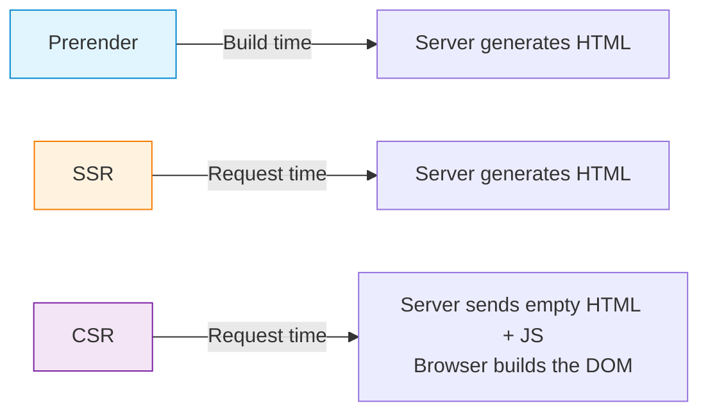
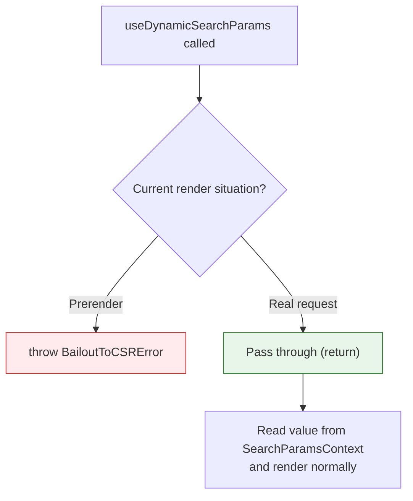
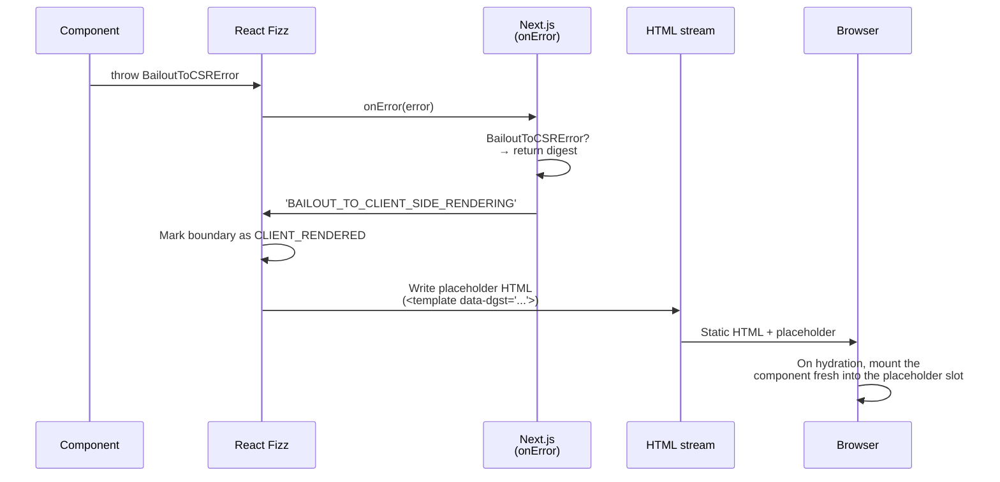

If you've used `useSearchParams` in Next.js for a while, you've probably run into this warning.

```zsh
⨯ useSearchParams() should be wrapped in a suspense boundary at page "/".
Read more: https://nextjs.org/docs/messages/missing-suspense-with-csr-bailout
```

The message says to wrap it in Suspense. Suspense is normally known for showing a loading UI while data is being fetched. But `useSearchParams` isn't an async API — so why does it need Suspense at all? And if there's already a global Suspense wrapping the entire app, shouldn't that be enough?

```tsx
// Structure attempting to handle everything with a global Suspense
<Suspense fallback={<Loading />}>
  <App />
</Suspense>
```

The build passes. But if you open the page source, even the static content is gone, and the entire page is effectively rendered on the client. Even when the page contains markup like `<h1>` and `<p>`, the response HTML comes back looking like this.

```html
<body>
  <div hidden=""><!--$--><!--/$--></div>
  <!--$!-->
  <template data-dgst="BAILOUT_TO_CLIENT_SIDE_RENDERING"></template>
  <div>Loading...</div>
  <!--/$-->
</body>
```

Not a single line of body markup — only the fallback and a placeholder remain. Let's trace the cause through the Next.js source code.

---

# searchParams can only be known at request time

Next.js pre-renders pages into HTML at build time (prerender). When a user request comes in, the pre-built HTML can be served immediately, giving a fast first paint and helping with SEO.

But the URL's query parameters (`page`, `sort` in `?page=3&sort=price`) are values that can only be known once a request actually comes in. They don't exist at build time.



Prerender and SSR both have the server produce HTML, but they do it at different times. Prerender produces HTML at build time and serves the same HTML to every user. SSR produces HTML on each incoming request. CSR has the server send just an empty HTML shell plus JS, and the browser runs that JS to paint the screen.

Since query parameters can only be known at request time, when `useSearchParams` is encountered during prerender, that part has to be deferred to a different point in time. Looking at Next.js's `useSearchParams` implementation, there's a branch at the very top.

```typescript
// packages/next/src/client/components/navigation.ts
export function useSearchParams(): ReadonlyURLSearchParams {
  useDynamicSearchParams?.('useSearchParams()')  // ← Branch here during prerender

  const searchParams = useContext(SearchParamsContext)  // The actual entry point during request / on the client

  return useMemo(() => {
    if (!searchParams) return null!
    return new ReadonlyURLSearchParams(searchParams)
  }, [searchParams])
}
```

`SearchParamsContext` is a React Context that the router injects with the current URL's parsed query parameters. In the browser, `useSearchParams` is just synchronous code that reads from that context — there's no async behavior involved.

The interesting bit is the `useDynamicSearchParams` call above it. Let's see what that function does at prerender time.

---

# The error thrown during prerender: BailoutToCSRError

`useDynamicSearchParams` branches based on the current render situation (prerender vs. real request).

```typescript
// packages/next/src/server/app-render/dynamic-rendering.ts
export function useDynamicSearchParams(expression: string) {
  const workUnitStore = workUnitAsyncStorage.getStore()

  switch (workUnitStore.type) {
    case 'prerender-legacy':
    case 'prerender-ppr': {
      if (workStore.forceStatic) return
      throw new BailoutToCSRError(expression)  // ← throws an Error
    }
    //...
    case 'request':
      return  // No-op during real request handling
  }
}
```



- Prerender (`prerender-legacy`, `prerender-ppr`): HTML is being generated at build time. The query is unknown, so an error is thrown to halt rendering.
- `request`: An actual request is in flight and SSR is running. The query is available, so it passes through.

> [!NOTE] How does it know which kind of render it's in?
>
> Before rendering a page, Next.js records "is this a prerender or a real request?" into Node.js's `AsyncLocalStorage`. Within the same async call chain, this storage returns the same value from anywhere, which lets hooks like `useSearchParams` figure out which situation they're being called in without receiving any props.

The `BailoutToCSRError` being thrown is an ordinary Error, but it carries a `digest` field for identification.

```typescript
// packages/next/src/shared/lib/lazy-dynamic/bailout-to-csr.ts
export class BailoutToCSRError extends Error {
  public readonly digest = 'BAILOUT_TO_CLIENT_SIDE_RENDERING'
  constructor(public readonly reason: string) {
    super(`Bail out to client-side rendering: ${reason}`)
  }
}
```

The `digest` is a tag marking "this isn't a normal error — it's a signal to defer to CSR."

What happens after this error is thrown depends entirely on whether a Suspense boundary is present.

---

# With Suspense vs. without Suspense

## With Suspense

Starting with React 18, server HTML generation is handled by the streaming renderer (codename Fizz). The older `renderToString` produced the entire tree as one string in a single shot, but Fizz emits ready parts incrementally and continues sending the rest as they become ready. When an error occurs during rendering, it's passed to the host (Next.js) through the `onError` callback.

In `onError`, Next.js checks the error, and if it's a `BailoutToCSRError`, it returns the `digest` as-is.

```typescript
// packages/next/src/server/app-render/create-error-handler.tsx
function getDigestForWellKnownError(error: unknown): string | undefined {
  if (isBailoutToCSRError(error)) return error.digest  // Return digest without logging
  // ...
}
```

Fizz takes this `digest` and flips the status of the nearest Suspense boundary to `CLIENT_RENDERED` — marking it as "this part will be handled on the client." A Suspense boundary refers to each `<Suspense>` in the tree, and signals thrown from children are caught by the nearest parent Suspense. The propagation rule is identical to `try-catch`.

> [!NOTE] Suspense and Error Boundary
>
> By the book, Suspense handles suspend signals and Error Boundary handles regular Errors.
>
> - suspend signal: If a component throws a Promise during render, React interprets that as "this component isn't ready yet" and switches to the `fallback` of the nearest `<Suspense>`. This is the mechanism behind `use(promise)`, `lazy`, and data-fetching libraries.
> - regular Error: If an Error is thrown during render, the nearest Error Boundary (a component implementing `componentDidCatch` / `getDerivedStateFromError`) catches it.
>
> The catch is that the server streaming renderer (React Fizz) has no Error Boundary. The Fizz source has no code path that calls `getDerivedStateFromError` or `componentDidCatch` at all — Error Boundaries only kick in after client hydration. So when an error is thrown during server render, Fizz flips the nearest `<Suspense>` boundary to `CLIENT_RENDERED` and emits only a placeholder (`<template data-dgst="...">`) in the server response HTML. If there's no Suspense nearby, it bubbles up to the tree root and the render itself ends as fatal.
>
> In other words, the same `<Suspense>` component plays different roles depending on the environment.
>
> | Environment | Promise throw (suspend) | Error throw |
> | --- | --- | --- |
> | Client render | Nearest Suspense shows fallback | Nearest Error Boundary catches |
> | Server streaming (Fizz) | Nearest Suspense shows fallback | Nearest Suspense marked as `CLIENT_RENDERED` → placeholder sent (Error Boundary doesn't run) |
>
> Semantically, Suspense is the more natural fit. An Error Boundary's fallback is a permanent replacement — "there was an error, so end with this." A Suspense fallback is a temporary placeholder — "can't paint this yet, but the real content is coming soon." `BailoutToCSRError` isn't a failure either; it's a "the server can't paint this, let the client finish the job" signal, which aligns with the flow of a placeholder being swapped out for the real component.

```js
// packages/react-server/src/ReactFizzServer.js
boundary.status = CLIENT_RENDERED;
encodeErrorForBoundary(boundary, errorDigest, ...); // boundary.errorDigest = digest
request.clientRenderedBoundaries.push(boundary);

// Insert placeholder into HTML on flush
writeClientRenderBoundaryInstruction(
  destination,
  ...,
  boundary.errorDigest,  // ← Passed to the client
);
```

Putting the whole flow into a sequence:



The HTML the server sends contains only a placeholder like `<template data-dgst="BAILOUT_TO_CLIENT_SIDE_RENDERING">` at the boundary's location. During hydration, the browser finds that placeholder and renders the component from scratch to fill it in.

> [!NOTE] hydration
>
> The React docs define `hydrateRoot` as "attaching React to an existing HTML payload produced by `react-dom/server`, making it interactive without recreating the DOM." In other words, hydration is the process of matching the server HTML to the client React tree and wiring up event handlers and state.
>
> One catch: a boundary marked `CLIENT_RENDERED` has only a placeholder in the server HTML — there's no DOM to match against. In that case, instead of normal hydration, the client renders the slot from scratch, builds the DOM, and slots it in.

Only the inside of the Suspense boundary is rendered on the client; everything else still becomes static HTML.

```tsx
<Suspense fallback={null}>
  <ComponentUsingSearchParams />   {/* ← Only this part is CSR */}
</Suspense>
<OtherContent />                   {/* ← Normal static HTML */}
```

Suspense isn't just a data-loading boundary — it also defines the scope of "this part can't be prerendered at build time, so defer it to the client."

## Without Suspense

When `BailoutToCSRError` isn't caught by any Suspense and bubbles up to the root of the component tree, Next.js's catch block picks it up.

```typescript
// packages/next/src/server/app-render/app-render.tsx
// "If a bailout made it to this point, it means it wasn't wrapped inside a suspense boundary."
const shouldBailoutToCSR = isBailoutToCSRError(err)
if (shouldBailoutToCSR) {
  const stack = getStackWithoutErrorMessage(err)
  error(
    `${err.reason} should be wrapped in a suspense boundary at page "${pagePath}". ` +
    `Read more: https://nextjs.org/docs/messages/missing-suspense-with-csr-bailout\n${stack}`
  )
  endSpanWithError(err)
  throw err
}
```

As the source comment plainly says, the error reaching this point means it wasn't caught by a Suspense boundary. The catch block logs one line of warning and re-throws the error. What happens next depends on who catches that re-throw.

`next build` spins up an export worker that runs prerender per page. This worker catches the re-thrown error and marks the build as failed.

```typescript
// packages/next/src/export/worker.ts
} catch (err) {
  console.error(
    `Error occurred prerendering page "${input.exportPath.path}". ` +
    `Read more: https://nextjs.org/docs/messages/prerender-error`
  )
  // ...
}
```

That's why two lines show up together in the terminal.

```zsh
⨯ useSearchParams() should be wrapped in a suspense boundary at page "/...".
  Read more: https://nextjs.org/docs/messages/missing-suspense-with-csr-bailout
Error occurred prerendering page "/...".
```

The first line is the warning logged by `app-render.tsx`; the second is the message logged by the export worker when it catches the re-thrown error. The same error, observed from two different points.

---

# Verifying it ourselves

To confirm the mechanism with an actual build, I'll build two pages that differ only in where the Suspense lives. Both pages contain static markup (`<h1>`, `<p>`) and a client component (`SearchParamsConsumer`) that calls `useSearchParams`.

```tsx
// Global Suspense
<Suspense fallback={<div>Loading...</div>}>
  <main>
    <h1>Global Suspense example</h1>
    <p>A flag to check if this was rendered</p>
    <SearchParamsConsumer />
  </main>
</Suspense>

// Minimal-scope Suspense
<main>
  <h1>Minimal-scope Suspense example</h1>
  <p>A flag to check if this was rendered</p>
  <Suspense fallback={<div>Loading useSearchParams area...</div>}>
    <SearchParamsConsumer />
  </Suspense>
</main>
```

## Global Suspense — the entire body HTML is empty

With global Suspense, the build passes and the route is even reported as static (`○ Static`).

```zsh
Route (app)
├ ○ /search-params-suspense/global-suspense
└ ○ /search-params-suspense/local-suspense

○  (Static)  prerendered as static content
```

But if you open `view-source:` on the page and inspect `<body>`, the body markup is entirely gone.

```html
<body>
  <div hidden=""><!--$--><!--/$--></div>
  <!--$!-->
  <template data-dgst="BAILOUT_TO_CLIENT_SIDE_RENDERING"></template>
  <div>Loading...</div>
  <!--/$-->
  ...
</body>
```

`<h1>Global Suspense example</h1>` is gone. `<p>A flag to check if this was rendered</p>` is gone. Even the `<main>` tag isn't in the body HTML. `<template data-dgst="BAILOUT_TO_CLIENT_SIDE_RENDERING">` is the exact `digest` value from the `BailoutToCSRError` we saw earlier. Where the body should be, there's only a single line of fallback — "Loading...".

The route is reported as static, but the HTML reaching the user is just "Loading...". The body content lives only inside the JS, and it gets painted only after the browser downloads the JS and finishes hydration. The benefits you were hoping to get from static generation — fast first paint, crawlers being able to read the HTML directly — are gone.

## Minimal-scope Suspense — the static parts stay in the body HTML

If you wrap only the component that uses `useSearchParams` tightly in Suspense, the same page's `<body>` response changes to this.

```html
<body>
  <div hidden=""><!--$--><!--/$--></div>
  <main style="max-width:720px;margin:0 auto;padding:24px">
    <h1>Minimal-scope Suspense example</h1>
    <p>A flag to check if this was rendered</p>
    <!--$!-->
    <template data-dgst="BAILOUT_TO_CLIENT_SIDE_RENDERING"></template>
    <div>Loading useSearchParams area...</div>
    <!--/$-->
  </main>
  ...
</body>
```

`<h1>` and `<p>` sit right there in the body. The `BAILOUT_TO_CLIENT_SIDE_RENDERING` placeholder is confined narrowly to the `SearchParamsConsumer` slot, and everything else is static HTML produced at build time.

---

# Conclusion

The reason `useSearchParams` demands a Suspense isn't because of async data — it's because the `BailoutToCSRError` thrown during prerender needs a boundary to be caught by. And that boundary is exactly the scope that gets deferred to CSR.

What's interesting here is that Suspense's original meaning is reused as-is. Suspense was originally a temporary boundary expressing "can't paint this yet, but the real content is coming soon." From prerender's point of view, `useSearchParams` is the same kind of situation: "can't paint this at build time, but the client will paint it soon." The "can't paint this yet" concept that data fetching used was simply repurposed to mark the scope of what gets deferred to CSR.

To wrap up: when using `useSearchParams`, the location of the Suspense isn't just a formality. There must be a Suspense above the component, and that Suspense should wrap as narrowly as possible. Treat it as the act of explicitly choosing the CSR scope — that's how you preserve as much of the static-generation benefit as possible.

Thanks for reading.

---

## References

- [Next.js source — dynamic-rendering.ts](https://github.com/vercel/next.js/blob/canary/packages/next/src/server/app-render/dynamic-rendering.ts)
- [Next.js source — bailout-to-csr.ts](https://github.com/vercel/next.js/blob/canary/packages/next/src/shared/lib/lazy-dynamic/bailout-to-csr.ts)
- [Next.js docs — missing-suspense-with-csr-bailout](https://nextjs.org/docs/messages/missing-suspense-with-csr-bailout)
- [React source — ReactFizzServer.js](https://github.com/facebook/react/blob/main/packages/react-server/src/ReactFizzServer.js)
