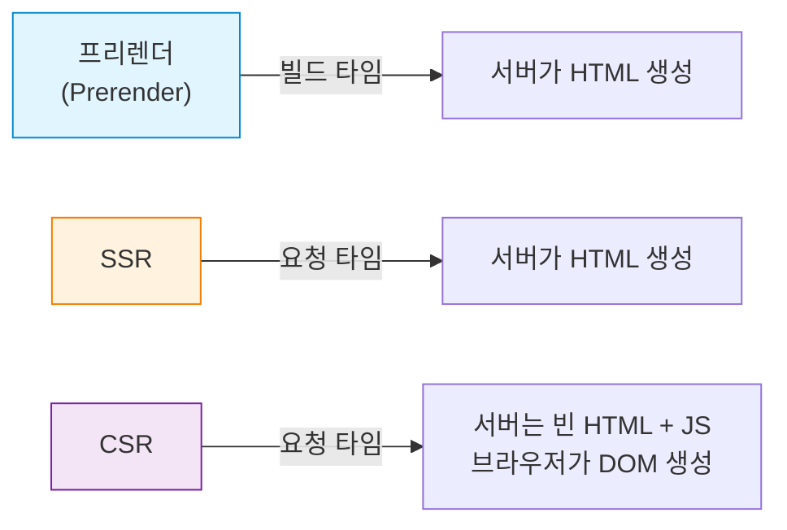
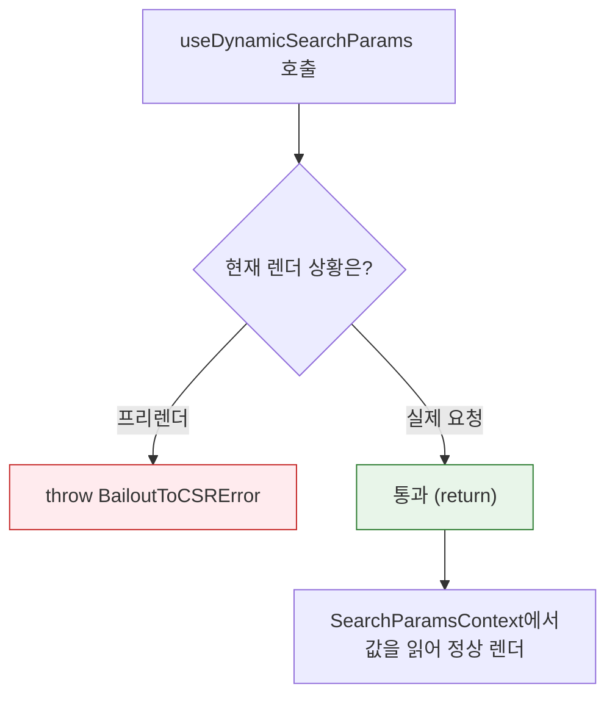
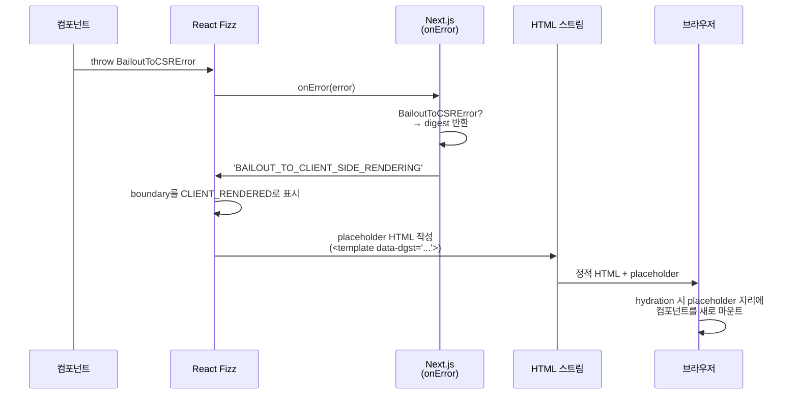

Next.js에서 `useSearchParams`를 쓰다 보면 이런 경고를 만나곤 합니다.

```zsh
⨯ useSearchParams() should be wrapped in a suspense boundary at page "/".
Read more: https://nextjs.org/docs/messages/missing-suspense-with-csr-bailout
```

"Suspense로 감싸라"는 메시지입니다. Suspense는 보통 데이터 로딩 중 로딩 UI를 보여주는 용도로 알려져 있습니다. 그런데 `useSearchParams`는 비동기 API가 아닌데 왜 Suspense가 필요할까요? 앱 전체를 감싸는 전역 Suspense가 이미 있다면 그것으로 충분하지 않을까요?

```tsx
// 전역 Suspense로 처리하려 한 구조
<Suspense fallback={<Loading />}>
  <App />
</Suspense>
```

빌드는 통과합니다. 하지만 페이지 소스를 열어보면 정적 콘텐츠까지 통째로 사라져 있고, 페이지 전체가 사실상 CSR로 처리됩니다. 페이지에 `<h1>`, `<p>` 같은 마크업이 있어도 응답 HTML은 이렇게 나옵니다.

```html
<body>
  <div hidden=""><!--$--><!--/$--></div>
  <!--$!-->
  <template data-dgst="BAILOUT_TO_CLIENT_SIDE_RENDERING"></template>
  <div>로딩 중...</div>
  <!--/$-->
</body>
```

본문 마크업은 한 줄도 없고 fallback과 placeholder만 남습니다. 원인을 Next.js 소스코드로 따라가 보겠습니다.

---

# searchParams는 요청 시점에만 알 수 있다

Next.js는 빌드할 때 페이지를 미리 HTML로 만들어 둡니다(prerender). 사용자 요청이 들어오면 만들어 둔 HTML을 바로 응답할 수 있어 첫 페인트가 빠르고, SEO에도 유리합니다.

하지만 URL의 쿼리 파라미터(`?page=3&sort=price`의 `page`, `sort`)는 요청이 들어와야 알 수 있는 값입니다. 빌드 시점에는 존재하지 않습니다.



프리렌더와 SSR은 모두 서버가 HTML을 만들지만 만드는 시점이 다릅니다. 프리렌더는 빌드 타임에 미리 만들어 모든 사용자에게 같은 HTML을 보냅니다. SSR은 요청이 올 때마다 만듭니다. CSR은 서버가 빈 HTML과 JS만 보내고 브라우저가 JS를 실행해 화면을 그립니다.

쿼리 파라미터는 요청 시점에야 알 수 있으므로, 프리렌더 중 `useSearchParams`를 만나면 그 부분은 다른 시점으로 떠넘겨야 합니다. Next.js의 `useSearchParams` 구현을 보면 맨 위에 분기가 있습니다.

```typescript
// packages/next/src/client/components/navigation.ts
export function useSearchParams(): ReadonlyURLSearchParams {
  useDynamicSearchParams?.('useSearchParams()')  // ← 프리렌더 중이면 여기서 분기

  const searchParams = useContext(SearchParamsContext)  // 실제 요청/클라이언트에서는 여기서부터 시작

  return useMemo(() => {
    if (!searchParams) return null!
    return new ReadonlyURLSearchParams(searchParams)
  }, [searchParams])
}
```

`SearchParamsContext`는 라우터가 현재 URL의 쿼리 파라미터를 파싱해 주입하는 React Context입니다. 브라우저에서 `useSearchParams`는 이 Context를 꺼내는 동기 코드입니다.

핵심은 위쪽의 `useDynamicSearchParams`입니다. 이 함수가 프리렌더 시점에 무엇을 하는지 보겠습니다.

---

# 프리렌더 중 throw하는 에러: BailoutToCSRError

`useDynamicSearchParams`는 현재 렌더 상황(프리렌더인지, 실제 요청인지)에 따라 분기합니다.

```typescript
// packages/next/src/server/app-render/dynamic-rendering.ts
export function useDynamicSearchParams(expression: string) {
  const workUnitStore = workUnitAsyncStorage.getStore()

  switch (workUnitStore.type) {
    case 'prerender-legacy':
    case 'prerender-ppr': {
      if (workStore.forceStatic) return
      throw new BailoutToCSRError(expression)  // ← Error를 throw
    }
    //...
    case 'request':
      return  // 실제 요청 처리 시에는 아무것도 하지 않음
  }
}
```



- 프리렌더(`prerender-legacy`, `prerender-ppr`): 빌드 타임에 HTML을 미리 만드는 상황. 쿼리를 모르므로 에러를 throw해서 렌더를 중단합니다.
- `request`: 실제 요청이 들어와 SSR이 진행 중인 상황. 쿼리를 알 수 있으므로 그대로 통과합니다.

> [!NOTE] 지금 렌더가 어떤 상황인지 어떻게 알까
>
> Next.js는 페이지를 렌더링하기 전에 "지금이 프리렌더인지, 실제 요청인지"를 Node.js의 `AsyncLocalStorage`라는 저장소에 기록해 둡니다. 이 저장소는 같은 비동기 호출 흐름 안에서는 어디서든 같은 값을 꺼낼 수 있어서, `useSearchParams` 같은 훅이 props를 받지 않고도 자신이 어떤 상황에서 호출됐는지 알 수 있습니다.

throw되는 `BailoutToCSRError`는 평범한 Error지만, 식별을 위한 `digest` 필드를 가지고 있습니다.

```typescript
// packages/next/src/shared/lib/lazy-dynamic/bailout-to-csr.ts
export class BailoutToCSRError extends Error {
  public readonly digest = 'BAILOUT_TO_CLIENT_SIDE_RENDERING'
  constructor(public readonly reason: string) {
    super(`Bail out to client-side rendering: ${reason}`)
  }
}
```

`digest`는 "이건 일반 에러가 아니라 CSR로 떠넘기라는 신호"임을 표시하는 태그입니다.

이 에러가 throw된 뒤의 동작은 Suspense의 유무에 따라 완전히 달라집니다.

---

# Suspense가 있을 때와 없을 때

## Suspense가 있을 때

React 18부터 서버 HTML 생성은 스트리밍 렌더러(코드명 Fizz)가 담당합니다. 기존 `renderToString`은 전체 트리를 한 번에 문자열로 만들어 반환했지만, Fizz는 준비된 부분부터 조금씩 내보내고 나머지는 준비되는 대로 이어 보냅니다. 렌더 중 에러가 나면 호스트(Next.js)에 `onError` 콜백으로 전달합니다.

Next.js는 이 `onError`에서 에러를 확인하고, 그게 `BailoutToCSRError`라면 `digest`를 그대로 반환합니다.

```typescript
// packages/next/src/server/app-render/create-error-handler.tsx
function getDigestForWellKnownError(error: unknown): string | undefined {
  if (isBailoutToCSRError(error)) return error.digest  // 로그 없이 digest만 반환
  // ...
}
```

Fizz는 이 `digest`를 받아 가장 가까운 Suspense 경계의 상태를 `CLIENT_RENDERED`로 바꿉니다. "이 부분은 클라이언트에서 처리한다"는 표시입니다. Suspense 경계는 트리 안의 `<Suspense>` 하나하나를 가리키며, 자식에서 throw된 신호는 가장 가까운 부모 Suspense에서 처리됩니다. `try-catch`의 전파 규칙과 같습니다.

> [!NOTE] Suspense와 Error Boundary
>
> 원칙적으로 Suspense가 처리하는 것은 suspend 신호이고, Error Boundary가 일반 Error를 처리합니다.
> 
> - suspend 신호: 컴포넌트가 렌더 도중 Promise를 throw하면 React는 "이 컴포넌트는 아직 준비 안 됐다"고 해석하고, 가장 가까운 `<Suspense>`의 `fallback`으로 전환합니다. `use(promise)`, `lazy`, 데이터 페칭 라이브러리가 내부적으로 쓰는 방식입니다.
> - 일반 Error: 렌더 도중 Error를 throw하면 가장 가까운 Error Boundary(`componentDidCatch` / `getDerivedStateFromError`를 구현한 컴포넌트)가 잡습니다.
>
> 그런데 서버 스트리밍 렌더러(React Fizz)에는 Error Boundary가 없습니다. Fizz 소스에는 `getDerivedStateFromError`나 `componentDidCatch`를 호출하는 경로 자체가 없고, Error Boundary는 클라이언트 hydration 이후에만 동작합니다. 그래서 서버 렌더 도중 에러가 throw되면 Fizz는 가장 가까운 `<Suspense>` 경계의 상태를 `CLIENT_RENDERED`로 바꾸고, 서버 응답 HTML에는 placeholder(`<template data-dgst="...">`)만 내보냅니다. 가까운 Suspense가 없으면 트리 루트까지 올라가 렌더 자체가 fatal로 끝납니다.
>
> 즉 같은 `<Suspense>`라는 컴포넌트가 환경에 따라 다른 역할을 겸합니다.
>
> | 환경 | Promise throw (suspend) | Error throw |
> | --- | --- | --- |
> | 클라이언트 렌더 | 가장 가까운 Suspense가 fallback 표시 | 가장 가까운 Error Boundary가 잡음 |
> | 서버 스트리밍 (Fizz) | 가장 가까운 Suspense가 fallback 표시 | 가장 가까운 Suspense가 `CLIENT_RENDERED`로 마킹 → placeholder 전송 (Error Boundary는 동작하지 않음) |
>
> 의미상으로도 Suspense가 자연스럽습니다. Error Boundary의 fallback은 "에러 났으니 이걸로 끝낸다"는 영구 대체물인 반면, Suspense의 fallback은 "지금은 못 그리지만 곧 진짜 콘텐츠가 들어온다"는 임시 자리입니다. `BailoutToCSRError`도 장애가 아니라 "서버에서는 못 그리니 클라이언트가 마저 그리자"는 신호이므로, placeholder가 진짜 컴포넌트로 교체되는 흐름과 맞물립니다.

```js
// packages/react-server/src/ReactFizzServer.js
boundary.status = CLIENT_RENDERED;
encodeErrorForBoundary(boundary, errorDigest, ...); // boundary.errorDigest = digest
request.clientRenderedBoundaries.push(boundary);

// flush 시 HTML에 placeholder 삽입
writeClientRenderBoundaryInstruction(
  destination,
  ...,
  boundary.errorDigest,  // ← 클라이언트로 전달
);
```

여기까지를 시퀀스로 정리하면 다음과 같습니다.



서버가 보내는 HTML에는 해당 경계 자리에 `<template data-dgst="BAILOUT_TO_CLIENT_SIDE_RENDERING">` 같은 placeholder만 들어갑니다. 브라우저는 hydration 단계에서 이 placeholder를 찾아 컴포넌트를 처음부터 렌더링해 채워 넣습니다.

> [!NOTE] hydration
>
> React 공식 문서는 `hydrateRoot`를 "`react-dom/server`가 만든 HTML payload에 React를 붙여, DOM을 재생성하지 않고 인터랙티브하게 만드는 것"으로 정의합니다. 즉 hydration은 서버 HTML과 클라이언트 React 트리를 일치시키며 이벤트 핸들러·state를 연결하는 과정입니다.
>
> 단, `CLIENT_RENDERED`로 표시된 경계는 서버 HTML이 placeholder뿐이므로 일치시킬 DOM이 없습니다. 이 경우 그 자리는 일반적인 hydration이 아니라 클라이언트에서 처음부터 렌더해 DOM을 만들어 끼워 넣습니다.

Suspense 경계 안쪽만 CSR로 처리되고, 나머지는 정적 HTML로 만들어집니다.

```tsx
<Suspense fallback={null}>
  <ComponentUsingSearchParams />   {/* ← 이 안만 CSR */}
</Suspense>
<OtherContent />                   {/* ← 정상 정적 HTML */}
```

Suspense는 데이터 로딩 경계일 뿐 아니라, "이 안쪽은 빌드 타임에 미리 렌더할 수 없으니 클라이언트로 떠넘긴다"는 범위도 지정합니다.

## Suspense가 없을 때

`BailoutToCSRError`가 Suspense에 잡히지 못하고 컴포넌트 트리 루트까지 올라가면, Next.js의 catch 블록이 받습니다.

```typescript
// packages/next/src/server/app-render/app-render.tsx
// "If a bailout made it to this point, it means it wasn't wrapped inside a suspense boundary."
const shouldBailoutToCSR = isBailoutToCSRError(err)
if (shouldBailoutToCSR) {
  const stack = getStackWithoutErrorMessage(err)
  error(
    `${err.reason} should be wrapped in a suspense boundary at page "${pagePath}". ` +
    `Read more: https://nextjs.org/docs/messages/missing-suspense-with-csr-bailout\n${stack}`
  )
  endSpanWithError(err)
  throw err
}
```

소스 주석 그대로, 에러가 여기까지 올라왔다는 건 Suspense에 잡히지 않았다는 뜻입니다. catch 블록은 경고를 한 줄 찍은 뒤 에러를 그대로 re-throw합니다. 이 re-throw를 다시 누가 잡느냐에 따라 이후 동작이 갈립니다.

`next build`는 페이지별로 프리렌더를 돌리는 export worker를 띄웁니다. 이 워커가 re-throw된 에러를 받아 빌드를 실패 처리합니다.

```typescript
// packages/next/src/export/worker.ts
} catch (err) {
  console.error(
    `Error occurred prerendering page "${input.exportPath.path}". ` +
    `Read more: https://nextjs.org/docs/messages/prerender-error`
  )
  // ...
}
```

그래서 터미널에는 두 줄이 함께 뜹니다.

```zsh
⨯ useSearchParams() should be wrapped in a suspense boundary at page "/...".
  Read more: https://nextjs.org/docs/messages/missing-suspense-with-csr-bailout
Error occurred prerendering page "/...".
```

첫 줄은 `app-render.tsx`가 찍는 경고, 둘째 줄은 export worker가 re-throw된 에러를 받아 찍는 메시지입니다. 같은 에러를 두 지점에서 본 것입니다.

---

# 직접 확인해보기

메커니즘을 실제 빌드 결과로 확인하기 위해, Suspense 위치만 다르게 둔 두 페이지를 빌드하겠습니다. 두 페이지 모두 정적 마크업(`<h1>`, `<p>`)과 `useSearchParams`를 호출하는 클라이언트 컴포넌트(`SearchParamsConsumer`)를 포함합니다.

```tsx
// 전역 Suspense
<Suspense fallback={<div>로딩 중...</div>}>
  <main>
    <h1>전역 Suspense 예제</h1>
    <p>렌더링되었는지 확인하는 플래그</p>
    <SearchParamsConsumer />
  </main>
</Suspense>

// 최소 범위 Suspense
<main>
  <h1>최소 범위 Suspense 예제</h1>
  <p>렌더링되었는지 확인하는 플래그</p>
  <Suspense fallback={<div>useSearchParams 영역 로딩 중...</div>}>
    <SearchParamsConsumer />
  </Suspense>
</main>
```

## 전역 Suspense — 본문 HTML이 통째로 비어 있다

전역 Suspense를 쓰면 빌드가 통과하고 라우트도 정적(`○ Static`)으로 표시됩니다.

```zsh
Route (app)
├ ○ /search-params-suspense/global-suspense
└ ○ /search-params-suspense/local-suspense

○  (Static)  prerendered as static content
```

하지만 `view-source:`로 페이지 소스를 열어 `<body>`를 보면 본문 마크업이 통째로 사라져 있습니다.

```html
<body>
  <div hidden=""><!--$--><!--/$--></div>
  <!--$!-->
  <template data-dgst="BAILOUT_TO_CLIENT_SIDE_RENDERING"></template>
  <div>로딩 중...</div>
  <!--/$-->
  ...
</body>
```

`<h1>전역 Suspense 예제</h1>`도, `<p>렌더링되었는지 확인하는 플래그</p>`도, `<main>` 태그조차 본문 HTML에 없습니다. `<template data-dgst="BAILOUT_TO_CLIENT_SIDE_RENDERING">`는 앞서 본 `BailoutToCSRError`의 `digest` 값 그대로입니다. 본문 자리에는 fallback "로딩 중..." 한 줄만 남았습니다.

라우트는 정적으로 표시되지만, 사용자에게 도달하는 HTML은 "로딩 중..."뿐입니다. 본문 콘텐츠는 JS 안에만 들어 있고, 브라우저가 JS를 받아 hydration을 끝낸 뒤에야 그려집니다. 정적 생성으로 얻고자 했던 이점(빠른 첫 페인트, 크롤러가 HTML을 그대로 읽을 수 있는 점)이 사라집니다.

## 최소 범위 Suspense — 정적인 부분이 본문 HTML에 그대로 남는다

`useSearchParams`를 쓰는 컴포넌트만 좁게 Suspense로 감싸면 같은 페이지의 `<body>` 응답이 이렇게 바뀝니다.

```html
<body>
  <div hidden=""><!--$--><!--/$--></div>
  <main style="max-width:720px;margin:0 auto;padding:24px">
    <h1>최소 범위 Suspense 예제</h1>
    <p>렌더링되었는지 확인하는 플래그</p>
    <!--$!-->
    <template data-dgst="BAILOUT_TO_CLIENT_SIDE_RENDERING"></template>
    <div>useSearchParams 영역 로딩 중...</div>
    <!--/$-->
  </main>
  ...
</body>
```

`<h1>`, `<p>`가 본문에 그대로 들어가 있습니다. `BAILOUT_TO_CLIENT_SIDE_RENDERING` placeholder는 `SearchParamsConsumer` 자리에만 좁게 자리 잡고, 나머지는 모두 빌드 타임에 만들어진 정적 HTML입니다.

---

# 결론

`useSearchParams`가 Suspense를 요구하는 이유는 브라우저 환경처럼 비동기 데이터 때문이 아니라, 프리렌더 시점에 throw되는 `BailoutToCSRError`를 받아낼 경계가 필요하기 때문입니다. 그리고 그 경계가 곧 CSR로 떠넘겨지는 범위가 됩니다.

여기서 흥미로운 점은 Suspense 본래의 의미가 그대로 재사용됐다는 것입니다. Suspense는 원래 "지금은 못 그리지만 곧 진짜 콘텐츠가 들어온다"는 임시 경계입니다. 프리렌더 입장에서 `useSearchParams`도 마찬가지로 "빌드 타임에는 못 그리지만 클라이언트에서 곧 그려진다"는 상황입니다. 데이터 로딩에 쓰던 "지금은 못 그렸음"이라는 개념을 CSR로 떠넘길 범위를 표시하는 데도 그대로 가져다 쓴 셈입니다.

정리해 보면 `useSearchParams`를 쓸 때 CSR로 넘길 범위를 직접 정하는 작업으로 다루면 정적 생성의 이점을 최대한 살릴 수 있습니다. `useSearchParams`를 사용하는 컴포넌트 위에는 항상 Suspense가 있어야 하고, 그 Suspense는 가능한 한 좁게 감싸야 합니다.

읽어주셔서 감사합니다.

---

## 참고 자료

- [Next.js 소스코드 — dynamic-rendering.ts](https://github.com/vercel/next.js/blob/canary/packages/next/src/server/app-render/dynamic-rendering.ts)
- [Next.js 소스코드 — bailout-to-csr.ts](https://github.com/vercel/next.js/blob/canary/packages/next/src/shared/lib/lazy-dynamic/bailout-to-csr.ts)
- [Next.js 공식 문서 — missing-suspense-with-csr-bailout](https://nextjs.org/docs/messages/missing-suspense-with-csr-bailout)
- [React 소스코드 — ReactFizzServer.js](https://github.com/facebook/react/blob/main/packages/react-server/src/ReactFizzServer.js)
